# Data Studio 2022 Responsiveness Test Page

Quick checks to make sure your pages are looking their best.

* [angelinejcq.github.io](#angelinejcqgithubio)
* [annerquaye.github.io](#annerquayegithubio)
* [areenaarora.com](#areenaaroracom)
* [ilenapeng.github.io](#ilenapenggithubio)
* [jessieblaeser.github.io](#jessieblaesergithubio)
* [juisarwate.github.io](#juisarwategithubio)
* [juliaingram.github.io](#juliaingramgithubio)
* [kfalayi.github.io](#kfalayigithubio)
* [luizftoledo.github.io](#luizftoledogithubio)
* [mishavaid7.github.io](#mishavaid7githubio)
* [msc-joel.github.io](#msc-joelgithubio)
* [naokatoh.github.io](#naokatohgithubio)
* [pmagtulis.github.io](#pmagtulisgithubio)
* [pmartisa.github.io](#pmartisagithubio)
* [sarahgrevy.github.io](#sarahgrevygithubio)
* [semerriam.github.io](#semerriamgithubio)
* [sriharshadevulapalli.github.io](#sriharshadevulapalligithubio)
* [srjouppi.github.io](#srjouppigithubio)
* [stephenanti.github.io](#stephenantigithubio)
* [tanazm.github.io](#tanazmgithubio)
* [vincentvb.github.io](#vincentvbgithubio)

## angelinejcq.github.io

|url|mobile|medium|wide|
|---|---|---|---|
|[Chuqin Jiang's Incredible Portfolio](https://angelinejcq.github.io/)||||
|[Welcome to my bubble tea shop project](https://angelinejcq.github.io/bubble-tea-project/)||||
|[Welcome to my NEO project](https://angelinejcq.github.io/near-earth-objects-project/)||||
|[Women trafficking in China](https://angelinejcq.github.io/woman-trafficking-project/)||||

### Automatic Checks

**https://angelinejcq.github.io/** [Visit ↗](https://angelinejcq.github.io/)

* Has sideways scrollbars in mobile version – check padding, margins, image widths

**https://angelinejcq.github.io/bubble-tea-project/** [Visit ↗](https://angelinejcq.github.io/bubble-tea-project/)

* Missing viewport meta tag in `<head>`, needed to tell browser it's responsive. Add `<meta name="viewport" content="width=device-width, initial-scale=1, shrink-to-fit=no">`

**https://angelinejcq.github.io/near-earth-objects-project/** [Visit ↗](https://angelinejcq.github.io/near-earth-objects-project/)

* Missing viewport meta tag in `<head>`, needed to tell browser it's responsive. Add `<meta name="viewport" content="width=device-width, initial-scale=1, shrink-to-fit=no">`

**https://angelinejcq.github.io/woman-trafficking-project/** [Visit ↗](https://angelinejcq.github.io/woman-trafficking-project/)

* Minimum font size should be 12px, enlarge text in Illustrator
   * Text `Guizhou:` is too small at 11px
   * Text `115` is too small at 11px
   * Text `Guangxi:` is too small at 11px
   * Text `107` is too small at 11px
   * Text `|` is too small at 8px
   * Text `|` is too small at 8px
* Overlapping elements in ai2html, check [the overflow video](https://www.youtube.com/watch?v=6vHsnjTp3_w) or make a smaller size
   * Text `Guizhou:` overlaps with `Yunnan:` at screen width 400
   * Text `115` overlaps with `Yunnan:` at screen width 400
   * Text `115` overlaps with `Guangxi:` at screen width 400
   * Text `Yunnan:` overlaps with `Guangxi:` at screen width 400
   * Text `176` overlaps with `Guangxi:` at screen width 400
   * Text `176` overlaps with `107` at screen width 400
   * Text `107` overlaps with `Fujian: 303` at screen width 400
   * Text `gender ratio` overlaps with `92.29` at screen width 400
   * Text `92.29` overlaps with `of marriageable age` at screen width 400
   * Text `97.59` overlaps with `Hebei` at screen width 400
   * Text `97.59` overlaps with `Hebei` at screen width 900
   * Text `97.59` overlaps with `Hebei` at screen width 1300

## annerquaye.github.io

|url|mobile|medium|wide|
|---|---|---|---|
|[Abbey Richard](https://annerquaye.github.io)||||
|[Abbey Richard](https://annerquaye.github.io/projects/oscars.html)||||
|[Abbey Richard](https://annerquaye.github.io/projects/responsive_pages/responsive.html)||||
|[Abbey Richard](https://annerquaye.github.io/projects/ricestory.html)||||

### Automatic Checks

**https://annerquaye.github.io** [Visit ↗](https://annerquaye.github.io)

No issues found! 🎉

**https://annerquaye.github.io/projects/oscars.html** [Visit ↗](https://annerquaye.github.io/projects/oscars.html)

* Has sideways scrollbars in mobile version – check padding, margins, image widths

**https://annerquaye.github.io/projects/responsive_pages/responsive.html** [Visit ↗](https://annerquaye.github.io/projects/responsive_pages/responsive.html)

* Minimum font size should be 12px, enlarge text in Illustrator
   * Text `The pandemic also shot inflation to a 3-year high` is too small at 9px
   * Text `Inflation` is too small at 8px
   * Text `Gdp Growth` is too small at 8px
   * Text `17.5 %` is too small at 7px
   * Text `The pandemic saw the economy hit rock bottom` is too small at 7px
   * Text `15.0` is too small at 7px
   * Text `12.5` is too small at 7px
   * Text `10.0` is too small at 7px
   * Text `7.5` is too small at 7px
   * Text `5.0` is too small at 7px
   * Text `2.5` is too small at 7px
   * Text `2016` is too small at 8px
   * Text `2017` is too small at 8px
   * Text `2018` is too small at 8px
   * Text `2019` is too small at 8px
   * Text `2020` is too small at 8px
   * Text `The pandemic also shot inflation to a 3-year high` is too small at 10px
   * Text `Inflation` is too small at 9px
   * Text `Gdp Growth` is too small at 9px
   * Text `17.5 %` is too small at 10px
   * Text `The pandemic saw the economy hit rock bottom` is too small at 8px
   * Text `15.0` is too small at 10px
   * Text `12.5` is too small at 10px
   * Text `10.0` is too small at 10px
   * Text `7.5` is too small at 10px
   * Text `5.0` is too small at 10px
   * Text `2.5` is too small at 10px
   * Text `2016` is too small at 10px
   * Text `2017` is too small at 10px
   * Text `2018` is too small at 10px
   * Text `2019` is too small at 10px
   * Text `2020` is too small at 10px
* Overlapping elements in ai2html, check [the overflow video](https://www.youtube.com/watch?v=6vHsnjTp3_w) or make a smaller size
   * Text `Inflation` overlaps with `Gdp Growth` at screen width 400

**https://annerquaye.github.io/projects/ricestory.html** [Visit ↗](https://annerquaye.github.io/projects/ricestory.html)

* Has sideways scrollbars in mobile version – check padding, margins, image widths

## areenaarora.com

|url|mobile|medium|wide|
|---|---|---|---|
|[Areena Arora](https://areenaarora.com/)||||
|[art-boards homework](https://areenaarora.com/artboards)|[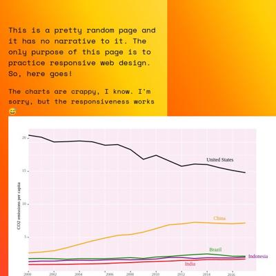](screenshots/areenaarora.com/artboards_index.html-mobile-full.jpg)|[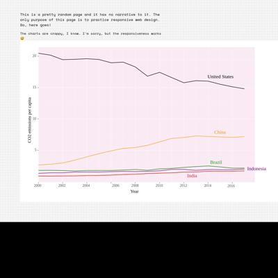](screenshots/areenaarora.com/artboards_index.html-medium-full.jpg)|[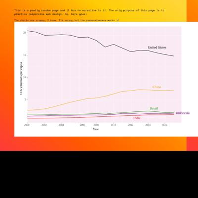](screenshots/areenaarora.com/artboards_index.html-wide-full.jpg)|
|[Responsive web design homework](https://areenaarora.com/responsive-dev-hw)|[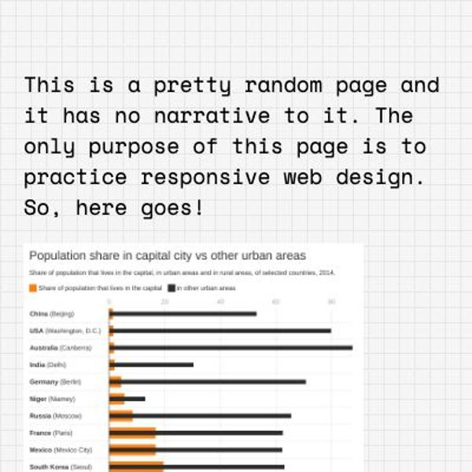](screenshots/areenaarora.com/responsive-dev-hw_index.html-mobile-full.jpg)|[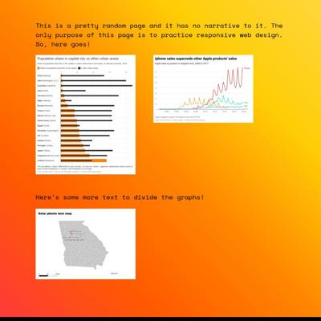](screenshots/areenaarora.com/responsive-dev-hw_index.html-medium-full.jpg)|[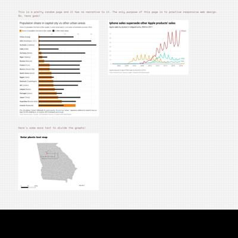](screenshots/areenaarora.com/responsive-dev-hw_index.html-wide-full.jpg)|
|[Best Biryani](https://areenaarora.com/stories/biryani/)||||
|[New York State spills](https://areenaarora.com/stories/ny-state-spills/)||||

### Automatic Checks

**https://areenaarora.com/** [Visit ↗](https://areenaarora.com/)

No issues found! 🎉

**https://areenaarora.com/artboards** [Visit ↗](https://areenaarora.com/artboards)

* Has sideways scrollbars in mobile version – check padding, margins, image widths
* Minimum font size should be 12px, enlarge text in Illustrator
   * Text `20` is too small at 9px
   * Text `15` is too small at 9px
   * Text `CO2 emissions per capita` is too small at 11px
   * Text `10` is too small at 9px
   * Text `5` is too small at 9px
   * Text `2000` is too small at 9px
   * Text `2002` is too small at 9px
   * Text `2004` is too small at 9px
   * Text `2006` is too small at 9px
   * Text `2008` is too small at 9px
   * Text `2010` is too small at 9px
   * Text `2012` is too small at 9px
   * Text `2014` is too small at 9px
   * Text `2016` is too small at 9px
   * Text `Year` is too small at 11px

**https://areenaarora.com/responsive-dev-hw** [Visit ↗](https://areenaarora.com/responsive-dev-hw)

No issues found! 🎉

**https://areenaarora.com/stories/biryani/** [Visit ↗](https://areenaarora.com/stories/biryani/)

* Has sideways scrollbars in mobile version – check padding, margins, image widths
* Minimum font size should be 12px, enlarge text in Illustrator
   * Text `A Flourish data visualization` is too small at 11px
   * Text `A Flourish data visualization` is too small at 11px
   * Text `` is too small at 11px
   * Text `A Flourish data visualization` is too small at 11px

**https://areenaarora.com/stories/ny-state-spills/** [Visit ↗](https://areenaarora.com/stories/ny-state-spills/)

* Has sideways scrollbars in mobile version – check padding, margins, image widths

## ilenapeng.github.io

|url|mobile|medium|wide|
|---|---|---|---|
|[Ilena Peng](https://ilenapeng.github.io/)||||
|[NYC's "Open" Streets](https://ilenapeng.github.io/nyc-open-streets/)||||
|[The Path to Principal](https://ilenapeng.github.io/path-to-principal/)||||
|[The Bay's Rainy December](https://ilenapeng.github.io/stevens-creek/)||||

### Automatic Checks

**https://ilenapeng.github.io/** [Visit ↗](https://ilenapeng.github.io/)

No issues found! 🎉

**https://ilenapeng.github.io/nyc-open-streets/** [Visit ↗](https://ilenapeng.github.io/nyc-open-streets/)

* Minimum font size should be 12px, enlarge text in Illustrator
   * Text `Source: October 2021 Transportation Alternatives report` is too small at 10px

**https://ilenapeng.github.io/path-to-principal/** [Visit ↗](https://ilenapeng.github.io/path-to-principal/)

No issues found! 🎉

**https://ilenapeng.github.io/stevens-creek/** [Visit ↗](https://ilenapeng.github.io/stevens-creek/)

No issues found! 🎉

## jessieblaeser.github.io

|url|mobile|medium|wide|
|---|---|---|---|
|[Jessie Blaeser's Portfolio](https://jessieblaeser.github.io/)||||
|[Most Expensive Pipeline Incidents](https://jessieblaeser.github.io/pj_pipelines.html)||||
|[Ticket to Ride Analysis](https://jessieblaeser.github.io/pj_ticket_to_ride.html)||||
|[Trae Young Hawks Analysis](https://jessieblaeser.github.io/pj_trae_young.html)||||

### Automatic Checks

**https://jessieblaeser.github.io/** [Visit ↗](https://jessieblaeser.github.io/)

No issues found! 🎉

**https://jessieblaeser.github.io/pj_pipelines.html** [Visit ↗](https://jessieblaeser.github.io/pj_pipelines.html)

* Minimum font size should be 12px, enlarge text in Illustrator
   * Text `Data Source: U.S. DOT Pipeline and Hazardous Materials Safety Administration` is too small at 8px
   * Text `Graphic by Jessie Blaeser` is too small at 8px
   * Text `Data Source: U.S. DOT Pipeline and Hazardous Materials Safety Administration` is too small at 8px
   * Text `Graphic by Jessie Blaeser` is too small at 8px
* Overlapping elements in ai2html, check [the overflow video](https://www.youtube.com/watch?v=6vHsnjTp3_w) or make a smaller size
   * Text `Incident caused by material failure` overlaps with `All other pipeline incidents` at screen width 400

**https://jessieblaeser.github.io/pj_ticket_to_ride.html** [Visit ↗](https://jessieblaeser.github.io/pj_ticket_to_ride.html)

No issues found! 🎉

**https://jessieblaeser.github.io/pj_trae_young.html** [Visit ↗](https://jessieblaeser.github.io/pj_trae_young.html)

No issues found! 🎉

## juisarwate.github.io

|url|mobile|medium|wide|
|---|---|---|---|
|[Jui Sarwate Personal Website](https://juisarwate.github.io/)||||
|[Recycling Distribution NYC](https://juisarwate.github.io/nyc-recycling-distribution/)||||
|[Homeless 311 Complaints 2020](https://juisarwate.github.io/project-3/)||||
|[Yosemite National Park Visitation](https://juisarwate.github.io/Sarwate_Project1/)||||

### Automatic Checks

**https://juisarwate.github.io/** [Visit ↗](https://juisarwate.github.io/)

No issues found! 🎉

**https://juisarwate.github.io/nyc-recycling-distribution/** [Visit ↗](https://juisarwate.github.io/nyc-recycling-distribution/)

* Missing viewport meta tag in `<head>`, needed to tell browser it's responsive. Add `<meta name="viewport" content="width=device-width, initial-scale=1, shrink-to-fit=no">`
* Has sideways scrollbars in mobile version – check padding, margins, image widths
* Minimum font size should be 12px, enlarge text in Illustrator
   * Text `Image Credit: Pexels` is too small at 10.72px
   * Text `Pexels` is too small at 10.72px

**https://juisarwate.github.io/project-3/** [Visit ↗](https://juisarwate.github.io/project-3/)

* Missing viewport meta tag in `<head>`, needed to tell browser it's responsive. Add `<meta name="viewport" content="width=device-width, initial-scale=1, shrink-to-fit=no">`
* Minimum font size should be 12px, enlarge text in Illustrator
   * Text `Image Credit: Pexels` is too small at 10.72px
   * Text `Pexels` is too small at 10.72px

**https://juisarwate.github.io/Sarwate_Project1/** [Visit ↗](https://juisarwate.github.io/Sarwate_Project1/)

* Missing viewport meta tag in `<head>`, needed to tell browser it's responsive. Add `<meta name="viewport" content="width=device-width, initial-scale=1, shrink-to-fit=no">`
* Has sideways scrollbars in mobile version – check padding, margins, image widths

## juliaingram.github.io

|url|mobile|medium|wide|
|---|---|---|---|
|[Julia Ingram's portfolio](https://juliaingram.github.io)||||
|[Citi Bike](https://juliaingram.github.io/citibike/)||||
|[Daylight Saving](https://juliaingram.github.io/daylight-saving/)||||
|[Therapy Apps](https://juliaingram.github.io/therapy-apps/)||||

### Automatic Checks

**https://juliaingram.github.io** [Visit ↗](https://juliaingram.github.io)

* Missing viewport meta tag in `<head>`, needed to tell browser it's responsive. Add `<meta name="viewport" content="width=device-width, initial-scale=1, shrink-to-fit=no">`
* Minimum font size should be 12px, enlarge text in Illustrator
   * Text `February 2022` is too small at 10.4px
   * Text `Scraping, Machine Learning, HTML, CSS` is too small at 10.4px
   * Text `August 2021` is too small at 10.4px
   * Text `Python, spreadsheets` is too small at 10.4px
   * Text `December 2021` is too small at 10.4px
   * Text `Web scraping, Mapbox GL JS` is too small at 10.4px
   * Text `October 2021` is too small at 10.4px
   * Text `Spreadsheets, SEC filings` is too small at 10.4px
   * Text `July 2020` is too small at 10.4px
   * Text `Public records requests, spreadsheets` is too small at 10.4px
   * Text `February 2022` is too small at 10.4px
   * Text `Python, Datawrapper` is too small at 10.4px
   * Text `February 2022` is too small at 10.4px
   * Text `Python, plotnine/ggplot, Tableau` is too small at 10.4px
   * Text `August 2020` is too small at 10.4px
   * Text `Public records` is too small at 10.4px
   * Text `August 2018` is too small at 10.4px
   * Text `Public records` is too small at 10.4px
   * Text `August 2019` is too small at 10.4px
   * Text `On the ground reporting, photo/video` is too small at 10.4px
   * Text `February 2019` is too small at 10.4px
   * Text `Public records` is too small at 10.4px
   * Text `August 2019` is too small at 10.4px
   * Text `Explanatory reporting` is too small at 10.4px
   * Text `October 2021` is too small at 10.4px
   * Text `On the ground reporting, photo/video` is too small at 10.4px
   * Text `December 2021` is too small at 10.4px
   * Text `Datawrapper` is too small at 10.4px
   * Text `May 2021` is too small at 10.4px
   * Text `Public records` is too small at 10.4px

**https://juliaingram.github.io/citibike/** [Visit ↗](https://juliaingram.github.io/citibike/)

* Missing viewport meta tag in `<head>`, needed to tell browser it's responsive. Add `<meta name="viewport" content="width=device-width, initial-scale=1, shrink-to-fit=no">`
* Has sideways scrollbars in mobile version – check padding, margins, image widths

**https://juliaingram.github.io/daylight-saving/** [Visit ↗](https://juliaingram.github.io/daylight-saving/)

* Missing viewport meta tag in `<head>`, needed to tell browser it's responsive. Add `<meta name="viewport" content="width=device-width, initial-scale=1, shrink-to-fit=no">`
* Minimum font size should be 12px, enlarge text in Illustrator
   * Text `later` is too small at 10px
   * Text `earlier` is too small at 10px
   * Text `Sunrise could have been as late as` is too small at 10px
   * Text `9:42 a.m. in Williston, North Dakota` is too small at 10px
   * Text `but as early as 7:37 in` is too small at 10px
   * Text `Panama City, Florida` is too small at 10px
   * Text `The earliest sunset would` is too small at 10px
   * Text `have been at 5:01 p.m., in` is too small at 10px
   * Text `later` is too small at 10px
   * Text `earlier` is too small at 10px
   * Text `Bonners Ferry, Idaho` is too small at 10px
   * Text `and the latest as 6:58 p.m.` is too small at 10px
   * Text `in Odessa, Texas` is too small at 10px
* Overlapping elements in ai2html, check [the overflow video](https://www.youtube.com/watch?v=6vHsnjTp3_w) or make a smaller size
   * Text `If the U.S. observed nationwide daylight saving time, on Jan. 1, 2022 this is when` overlaps with `cities would have seen the sun rise and set` at screen width 400
   * Text `have been at 5:01 p.m., in` overlaps with `earlier` at screen width 400
   * Text `If the U.S. observed nationwide daylight saving time, on Jan. 1, 2022 this is when` overlaps with `cities would have seen the sun rise and set` at screen width 900
   * Text `have been at 5:01 p.m., in` overlaps with `earlier` at screen width 900
   * Text `If the U.S. observed nationwide daylight saving time, on Jan. 1, 2022 this is when` overlaps with `cities would have seen the sun rise and set` at screen width 1300
   * Text `have been at 5:01 p.m., in` overlaps with `earlier` at screen width 1300

**https://juliaingram.github.io/therapy-apps/** [Visit ↗](https://juliaingram.github.io/therapy-apps/)

* Missing viewport meta tag in `<head>`, needed to tell browser it's responsive. Add `<meta name="viewport" content="width=device-width, initial-scale=1, shrink-to-fit=no">`

## kfalayi.github.io

|url|mobile|medium|wide|
|---|---|---|---|
|[Kunle Falayi's Portfolio](https://kfalayi.github.io/)||||
|[Kunle Falayi's Portfolio](https://kfalayi.github.io/bloomberg_map_recreation.html)|[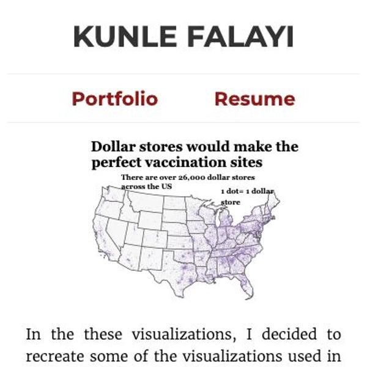](screenshots/kfalayi.github.io/bloomberg_map_recreation.html-mobile-full.jpg)|[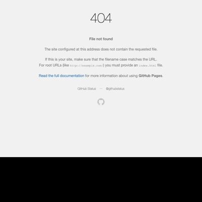](screenshots/kfalayi.github.io/bloomberg_map_recreation.html-medium-full.jpg)|[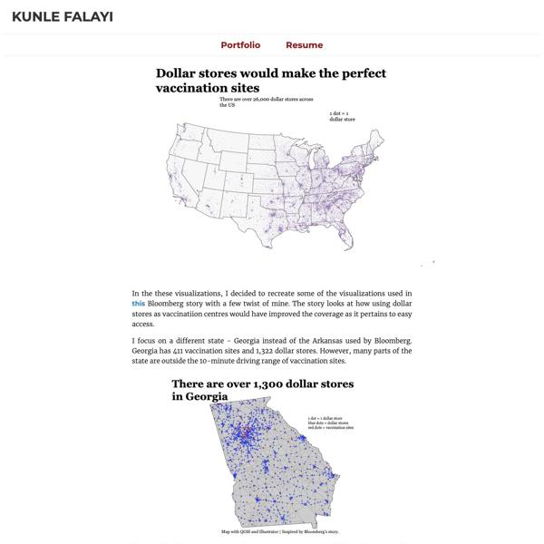](screenshots/kfalayi.github.io/bloomberg_map_recreation.html-wide-full.jpg)|
|[Kunle Falayi's Portfolio](https://kfalayi.github.io/food-price-Nigeria.html)||[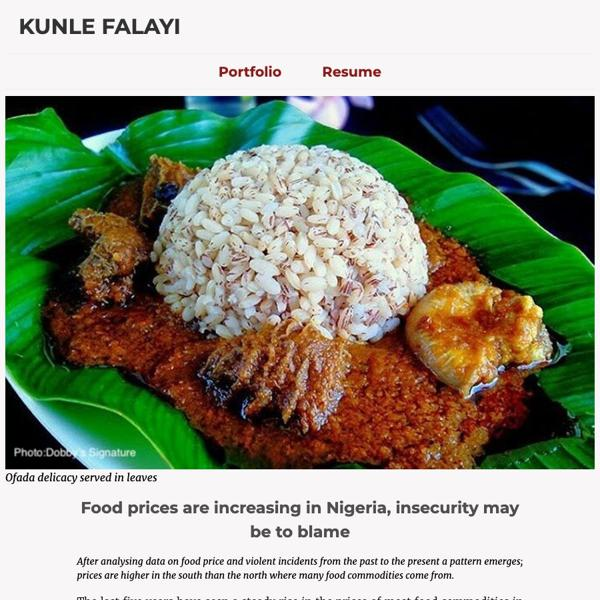](screenshots/kfalayi.github.io/food-price-Nigeria.html-medium-full.jpg)||
|[Kunle Falayi's Portfolio](https://kfalayi.github.io/hispanic_immigrants.html)||[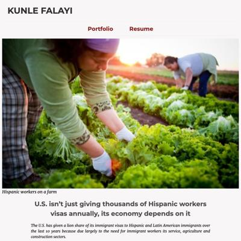](screenshots/kfalayi.github.io/hispanic_immigrants.html-medium-full.jpg)||

### Automatic Checks

**https://kfalayi.github.io/** [Visit ↗](https://kfalayi.github.io/)

No issues found! 🎉

**https://kfalayi.github.io/bloomberg_map_recreation.html** [Visit ↗](https://kfalayi.github.io/bloomberg_map_recreation.html)

* Minimum font size should be 12px, enlarge text in Illustrator
   * Text `There are over 26,000 dollar stores across the US` is too small at 8px
   * Text `1 dot= 1 dollar store` is too small at 8px
   * Text `1 dot = 1 dollar store` is too small at 10px
   * Text `blue dots = dollar stores` is too small at 10px
   * Text `red dots = vaccination sites` is too small at 10px
   * Text `1 dot = 1 dollar store` is too small at 9px
   * Text `blue dots = dollar stores` is too small at 9px
   * Text `red dots = vaccination sites` is too small at 9px
   * Text `Map with QGIS and Illustrator | Inspired by Bloomberg’s story.` is too small at 10px
   * Text `1 dot = 1 dollar store` is too small at 6px
   * Text `blue dots = dollar stores` is too small at 6px
   * Text `red dots = vaccination sites` is too small at 6px
   * Text `Map with QGIS and Illustrator | Inspired by Bloomberg’s story.` is too small at 3px
   * Text `Map with QGIS and Illustrator | Inspired by Bloomberg’s story.` is too small at 5px
   * Text `Areas within a 10-mins drive of dollar stores` is too small at 8px
   * Text `but outside 10-mins drive of vaccination sites` is too small at 8px
   * Text `Red dots are vaccination sites` is too small at 8px
   * Text `Areas within a 10-mins drive of dollar stores ` is too small at 4px
   * Text `but outside 10-mins drive of vaccination sites` is too small at 4px
   * Text `Red dots are vaccination sites` is too small at 4px
* Overlapping elements in ai2html, check [the overflow video](https://www.youtube.com/watch?v=6vHsnjTp3_w) or make a smaller size
   * Text `There are over 26,000 dollar stores across the US` overlaps with `1 dot= 1 dollar store` at screen width 400
   * Text `There are over 26,000 dollar stores across the US` overlaps with `1 dot= 1 dollar store` at screen width 900
   * Text `There are over 26,000 dollar stores across the US` overlaps with `1 dot= 1 dollar store` at screen width 1300

**https://kfalayi.github.io/food-price-Nigeria.html** [Visit ↗](https://kfalayi.github.io/food-price-Nigeria.html)

* Has sideways scrollbars in mobile version – check padding, margins, image widths
* Minimum font size should be 12px, enlarge text in Illustrator
   * Text `Caveat: CFR depends mostly on newspaper reports to collate its weekly data. Density of incidents in some states in southern Nigeria may be due to high reporting rates because most of Nigeria's major newspapers are concentrated in the south.` is too small at 11px
   * Text `Caveat:` is too small at 11px

**https://kfalayi.github.io/hispanic_immigrants.html** [Visit ↗](https://kfalayi.github.io/hispanic_immigrants.html)

No issues found! 🎉

## luizftoledo.github.io

|url|mobile|medium|wide|
|---|---|---|---|
|[luizftoledo's journalism portfolio](https://luizftoledo.github.io/)||||
|[Brazilian people are paying for dozens of meals in the same day](https://luizftoledo.github.io/congress-expenses-with-food/)||||
|[How happy can Iron Maiden songs be?](https://luizftoledo.github.io/iron-maiden-happiness/)||||
|[US exports more pistols than ever to Brazil: legally and ilegally](https://luizftoledo.github.io/weapons-seized/)||||

### Automatic Checks

**https://luizftoledo.github.io/** [Visit ↗](https://luizftoledo.github.io/)

No issues found! 🎉

**https://luizftoledo.github.io/congress-expenses-with-food/** [Visit ↗](https://luizftoledo.github.io/congress-expenses-with-food/)

* Minimum font size should be 12px, enlarge text in Illustrator
   * Text `A Flourish scatter chart` is too small at 11px
   * Text `A Flourish scatter chart` is too small at 11px
   * Text `` is too small at 11px
   * Text `A Flourish scatter chart` is too small at 11px
   * Text `A Flourish data visualization` is too small at 11px
   * Text `A Flourish data visualization` is too small at 11px
   * Text `` is too small at 11px
   * Text `A Flourish data visualization` is too small at 11px

**https://luizftoledo.github.io/iron-maiden-happiness/** [Visit ↗](https://luizftoledo.github.io/iron-maiden-happiness/)

* Has sideways scrollbars in mobile version – check padding, margins, image widths

**https://luizftoledo.github.io/weapons-seized/** [Visit ↗](https://luizftoledo.github.io/weapons-seized/)

* Minimum font size should be 12px, enlarge text in Illustrator
   * Text `20 K` is too small at 6px
   * Text `15 K` is too small at 6px
   * Text `10.7 K` is too small at 5px
   * Text `Gun ownership ` is too small at 5px
   * Text `rules change` is too small at 5px
   * Text `10 K` is too small at 6px
   * Text `4.5 K` is too small at 6px
   * Text `Bolsonaro is ` is too small at 6px
   * Text `elected` is too small at 6px
   * Text `5 K` is too small at 6px
   * Text `0` is too small at 6px
   * Text `2019` is too small at 6px
   * Text `1990` is too small at 6px
   * Text `2018` is too small at 6px
   * Text `USA and Austria are the countries of origin for most of the ` is too small at 10px
   * Text `foreign seized weapons in Brazil` is too small at 10px
   * Text `Data is from 2013 to 2021` is too small at 8px
   * Text `United States` is too small at 8px
   * Text `Austria` is too small at 8px
   * Text `Turkey` is too small at 8px
   * Text `Argentina` is too small at 8px
   * Text `Czech Republic` is too small at 8px
   * Text `Italy` is too small at 8px
   * Text `Germany` is too small at 8px
   * Text `Israel` is too small at 8px
   * Text `Croatia` is too small at 8px
   * Text `Belgium` is too small at 8px
   * Text `Russia` is too small at 8px
   * Text `Spain` is too small at 8px
   * Text `Mexico` is too small at 8px
   * Text `Serbia` is too small at 8px
   * Text `China` is too small at 8px
   * Text `Philippines` is too small at 8px
   * Text `Romania` is too small at 8px
   * Text `Montenegro` is too small at 8px
   * Text `Hungary` is too small at 8px
   * Text `Bolivia` is too small at 8px
   * Text `0` is too small at 8px
   * Text `400` is too small at 8px
   * Text `800` is too small at 8px
   * Text `1200` is too small at 8px
   * Text `Source: Brazilian Federal Police / FOIA request` is too small at 8px
   * Text `Revolver is the most common seized weapon` is too small at 8px
   * Text ` from other countries` is too small at 8px
   * Text `Revólver` is too small at 6px
   * Text `Fuzil` is too small at 6px
   * Text `Espingarda` is too small at 6px
   * Text `Rifle` is too small at 6px
   * Text `Carabina` is too small at 6px
   * Text `Metralhadora` is too small at 6px
   * Text `Não definido` is too small at 6px
   * Text `Escopeta` is too small at 6px
   * Text `Artesanal` is too small at 6px
   * Text `Mosquete` is too small at 6px
   * Text `Garrucha` is too small at 6px
   * Text `Source: Brazilian Federal Police / FOIA` is too small at 6px
   * Text `Glock` is too small at 7px
   * Text `One out of for foreign weapons` is too small at 11px
   * Text `seized by the Federal Police in` is too small at 11px
   * Text `Brazil is a Glock` is too small at 11px
   * Text `Smith & Wesson` is too small at 7px
   * Text `Canik` is too small at 7px
   * Text `Colt` is too small at 7px
   * Text `Beretta` is too small at 7px
   * Text `Cz` is too small at 7px
   * Text `Girsan` is too small at 7px
   * Text `Ruger` is too small at 7px
   * Text `Winchester` is too small at 7px
   * Text `0` is too small at 7px
   * Text `200` is too small at 7px
   * Text `400` is too small at 7px
   * Text `600` is too small at 7px
   * Text `800` is too small at 7px
   * Text `1,000` is too small at 7px
   * Text `1,200` is too small at 7px
   * Text `Source: Brazilian Federal Police / FOIA request` is too small at 7px
   * Text `Glock is the most common foreign weapon ` is too small at 8px
   * Text `seized by the Brazilian Federal Police` is too small at 8px
   * Text `Glock` is too small at 4px
   * Text `One out of for foreign weapons` is too small at 6px
   * Text `seized by the Federal Police in` is too small at 6px
   * Text `Brazil is a Glock` is too small at 6px
   * Text `Smith & Wesson` is too small at 4px
   * Text `Canik` is too small at 4px
   * Text `Colt` is too small at 4px
   * Text `Beretta` is too small at 4px
   * Text `Cz` is too small at 4px
   * Text `Girsan` is too small at 4px
   * Text `Ruger` is too small at 4px
   * Text `Winchester` is too small at 4px
   * Text `0` is too small at 4px
   * Text `200` is too small at 4px
   * Text `400` is too small at 4px
   * Text `600` is too small at 4px
   * Text `800` is too small at 4px
   * Text `1,000` is too small at 4px
   * Text `1,200` is too small at 4px
   * Text `Source: Brazilian Federal Police / FOIA request` is too small at 4px
   * Text `Foz de Iguaçu city (state of Paraná),` is too small at 11px
   * Text `on the border with Paraguay,` is too small at 11px
   * Text `makes the state have` is too small at 11px
   * Text `the highest number of guns seizures` is too small at 11px
   * Text `Paraná leads in weapon seized by the Federal Police` is too small at 10px
   * Text `Foz de Iguaçu city (state of Paraná),` is too small at 5px
   * Text ` on the border with Paraguay, ` is too small at 5px
   * Text `makes the state have ` is too small at 5px
   * Text `the highest number of guns seizures` is too small at 5px
   * Text `Source: Brazilian Federal Police / FOIA request` is too small at 8px
* Overlapping elements in ai2html, check [the overflow video](https://www.youtube.com/watch?v=6vHsnjTp3_w) or make a smaller size
   * Text `2019` overlaps with `2018` at screen width 400
   * Text `2019` overlaps with `2018` at screen width 900
   * Text `2019` overlaps with `2018` at screen width 1300

## mishavaid7.github.io

|url|mobile|medium|wide|
|---|---|---|---|
|[Misha Vaid](https://mishavaid7.github.io/)||||
|[Airbnb Story](https://mishavaid7.github.io/Airbnb-Story/)||||
|[NYC Restaurant Grade Story](https://mishavaid7.github.io/NYCRestaurants-Story/)||||
|[Airbnb Story](https://mishavaid7.github.io/Project-4/)||||

### Automatic Checks

**https://mishavaid7.github.io/** [Visit ↗](https://mishavaid7.github.io/)

No issues found! 🎉

**https://mishavaid7.github.io/Airbnb-Story/** [Visit ↗](https://mishavaid7.github.io/Airbnb-Story/)

* Missing viewport meta tag in `<head>`, needed to tell browser it's responsive. Add `<meta name="viewport" content="width=device-width, initial-scale=1, shrink-to-fit=no">`

**https://mishavaid7.github.io/NYCRestaurants-Story/** [Visit ↗](https://mishavaid7.github.io/NYCRestaurants-Story/)

* Missing viewport meta tag in `<head>`, needed to tell browser it's responsive. Add `<meta name="viewport" content="width=device-width, initial-scale=1, shrink-to-fit=no">`
* Has sideways scrollbars in mobile version – check padding, margins, image widths

**https://mishavaid7.github.io/Project-4/** [Visit ↗](https://mishavaid7.github.io/Project-4/)

* Missing viewport meta tag in `<head>`, needed to tell browser it's responsive. Add `<meta name="viewport" content="width=device-width, initial-scale=1, shrink-to-fit=no">`
* Minimum font size should be 12px, enlarge text in Illustrator
   * Text `Entire home/apt` is too small at 8px
   * Text `Private Room` is too small at 8px
   * Text `Shared room` is too small at 8px
   * Text `Hotel room` is too small at 8px
   * Text `14.2%` is too small at 10px
   * Text `Entire home/apt` is too small at 8px
   * Text `25.2` is too small at 10px
   * Text `Private Room` is too small at 8px
   * Text `39.6` is too small at 10px
   * Text `Shared room` is too small at 8px
   * Text `43.8` is too small at 10px
   * Text `Hotel room` is too small at 8px
   * Text `Entire home/apt` is too small at 8px
   * Text `34.3%` is too small at 10px
   * Text `53.7` is too small at 10px
   * Text `Private Room` is too small at 8px
   * Text `56.9` is too small at 10px
   * Text `Shared room` is too small at 8px
   * Text `80.4` is too small at 10px
   * Text `Hotel room` is too small at 8px
* Overlapping elements in ai2html, check [the overflow video](https://www.youtube.com/watch?v=6vHsnjTp3_w) or make a smaller size
   * Text `few in number but control a larger` overlaps with `Hosts who have more than 1 listing are few in number but control a` at screen width 400
   * Text `few in number but control a larger` overlaps with `larger proportion of listings` at screen width 400
   * Text `few in number but control a larger` overlaps with `A third of all the listings that are 'Entire Apartment' are controlled by hosts who have more than` at screen width 400
   * Text `few in number but control a larger` overlaps with `one listing.` at screen width 400
   * Text `14.2%` overlaps with `Entire home/apt` at screen width 400
   * Text `25.2` overlaps with `Private Room` at screen width 400
   * Text `39.6` overlaps with `Shared room` at screen width 400
   * Text `Entire home/apt` overlaps with `34.3%` at screen width 400
   * Text `53.7` overlaps with `Private Room` at screen width 400
   * Text `56.9` overlaps with `Shared room` at screen width 400
   * Text `80.4` overlaps with `Hotel room` at screen width 400
   * Text `few in number but control a larger` overlaps with `Hosts who have more than 1 listing are few in number but control a` at screen width 900
   * Text `few in number but control a larger` overlaps with `larger proportion of listings` at screen width 900
   * Text `few in number but control a larger` overlaps with `A third of all the listings that are 'Entire Apartment' are controlled by hosts who have more than` at screen width 900
   * Text `few in number but control a larger` overlaps with `one listing.` at screen width 900
   * Text `14.2%` overlaps with `Entire home/apt` at screen width 900
   * Text `25.2` overlaps with `Private Room` at screen width 900
   * Text `39.6` overlaps with `Shared room` at screen width 900
   * Text `Entire home/apt` overlaps with `34.3%` at screen width 900
   * Text `53.7` overlaps with `Private Room` at screen width 900
   * Text `56.9` overlaps with `Shared room` at screen width 900
   * Text `80.4` overlaps with `Hotel room` at screen width 900
   * Text `few in number but control a larger` overlaps with `Hosts who have more than 1 listing are few in number but control a` at screen width 1300
   * Text `few in number but control a larger` overlaps with `larger proportion of listings` at screen width 1300
   * Text `few in number but control a larger` overlaps with `A third of all the listings that are 'Entire Apartment' are controlled by hosts who have more than` at screen width 1300
   * Text `few in number but control a larger` overlaps with `one listing.` at screen width 1300
   * Text `14.2%` overlaps with `Entire home/apt` at screen width 1300
   * Text `25.2` overlaps with `Private Room` at screen width 1300
   * Text `39.6` overlaps with `Shared room` at screen width 1300
   * Text `Entire home/apt` overlaps with `34.3%` at screen width 1300
   * Text `53.7` overlaps with `Private Room` at screen width 1300
   * Text `56.9` overlaps with `Shared room` at screen width 1300
   * Text `80.4` overlaps with `Hotel room` at screen width 1300

## msc-joel.github.io

|url|mobile|medium|wide|
|---|---|---|---|
|[Profile of Joel Konopo](https://msc-joel.github.io/)||||
|[Covid inflation surge likely to persist](https://msc-joel.github.io/main-article1.html)||||
|[More than half of CEDA loan beneficiaries are in the services business](https://msc-joel.github.io/main-article3.html)||||

### Automatic Checks

**https://msc-joel.github.io/** [Visit ↗](https://msc-joel.github.io/)

* Has sideways scrollbars in mobile version – check padding, margins, image widths

**https://msc-joel.github.io/main-article1.html** [Visit ↗](https://msc-joel.github.io/main-article1.html)

* Has sideways scrollbars in mobile version – check padding, margins, image widths
* Minimum font size should be 12px, enlarge text in Illustrator
   * Text `A Flourish chart` is too small at 11px
   * Text `A Flourish chart` is too small at 11px
   * Text `` is too small at 11px
   * Text `A Flourish chart` is too small at 11px

**https://msc-joel.github.io/main-article3.html** [Visit ↗](https://msc-joel.github.io/main-article3.html)

No issues found! 🎉

## naokatoh.github.io

|url|mobile|medium|wide|
|---|---|---|---|
|[Nao Hidaka Kato](https://naokatoh.github.io/)||||
|[Music in Men's Figure Skating](https://naokatoh.github.io/figure_skate_music/)||||
|[Where to Find Uni in the US](https://naokatoh.github.io/sea_urchin/)||||
|[International students in Ukraine need more help as Russian intensifies attack](https://naokatoh.github.io/ukraine/)||||

### Automatic Checks

**https://naokatoh.github.io/** [Visit ↗](https://naokatoh.github.io/)

* Has sideways scrollbars in mobile version – check padding, margins, image widths

**https://naokatoh.github.io/figure_skate_music/** [Visit ↗](https://naokatoh.github.io/figure_skate_music/)

* Missing viewport meta tag in `<head>`, needed to tell browser it's responsive. Add `<meta name="viewport" content="width=device-width, initial-scale=1, shrink-to-fit=no">`
* Minimum font size should be 12px, enlarge text in Illustrator
   * Text `HanyuMuse` is too small at 6.4px
   * Text `Aude Mugnier` is too small at 6.4px

**https://naokatoh.github.io/sea_urchin/** [Visit ↗](https://naokatoh.github.io/sea_urchin/)

* Missing viewport meta tag in `<head>`, needed to tell browser it's responsive. Add `<meta name="viewport" content="width=device-width, initial-scale=1, shrink-to-fit=no">`

**https://naokatoh.github.io/ukraine/** [Visit ↗](https://naokatoh.github.io/ukraine/)

* Minimum font size should be 12px, enlarge text in Illustrator
   * Text `Morocco` is too small at 9px
   * Text `Iraq` is too small at 9px
   * Text `Nigeria` is too small at 9px
   * Text `Nigeria` is too small at 9px
   * Text `Russia` is too small at 9px
   * Text `Turkey` is too small at 9px
   * Text `Azerbaijan` is too small at 9px
   * Text `Turkmenistan` is too small at 9px
   * Text `9734` is too small at 8px
   * Text `9979` is too small at 9px
   * Text `India` is too small at 9px
   * Text `Uzbekistan` is too small at 9px
   * Text `Jordan` is too small at 9px
   * Text `Uzbekistan` is too small at 9px
   * Text `4773` is too small at 8px
   * Text ` ` is too small at 10px
   * Text `Nigeria` is too small at 10px
   * Text `Israel` is too small at 10px
   * Text `Turkmenistan` is too small at 10px
   * Text `China` is too small at 10px
   * Text `Morocco` is too small at 10px
   * Text `5721` is too small at 9px
   * Text `14383` is too small at 9px
   * Text `Turkey` is too small at 10px
   * Text `Azerbaijan` is too small at 10px
   * Text `Jordan` is too small at 10px
   * Text `4718` is too small at 9px
   * Text `Egypt` is too small at 10px
* Overlapping elements in ai2html, check [the overflow video](https://www.youtube.com/watch?v=6vHsnjTp3_w) or make a smaller size
   * Text `Nigeria` overlaps with `Nigeria` at screen width 400
   * Text `Uzbekistan` overlaps with `Uzbekistan` at screen width 400
   * Text `Nigeria` overlaps with `Nigeria` at screen width 900
   * Text `Uzbekistan` overlaps with `Uzbekistan` at screen width 900
   * Text `Nigeria` overlaps with `Nigeria` at screen width 1300
   * Text `Uzbekistan` overlaps with `Uzbekistan` at screen width 1300

## pmagtulis.github.io

|url|mobile|medium|wide|
|---|---|---|---|
|[Prinz Magtulis](https://pmagtulis.github.io/)||||
|[Prinz Magtulis - Projects](https://pmagtulis.github.io/projects.html)|[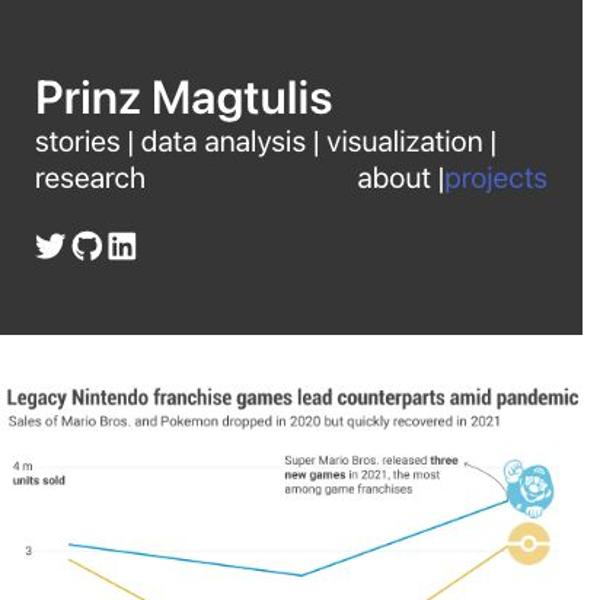](screenshots/pmagtulis.github.io/projects.html-mobile-full.jpg)|[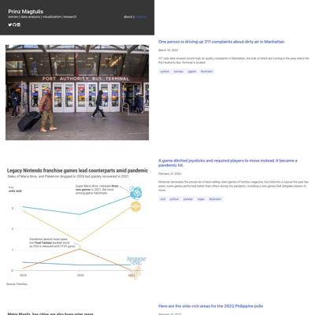](screenshots/pmagtulis.github.io/projects.html-medium-full.jpg)|[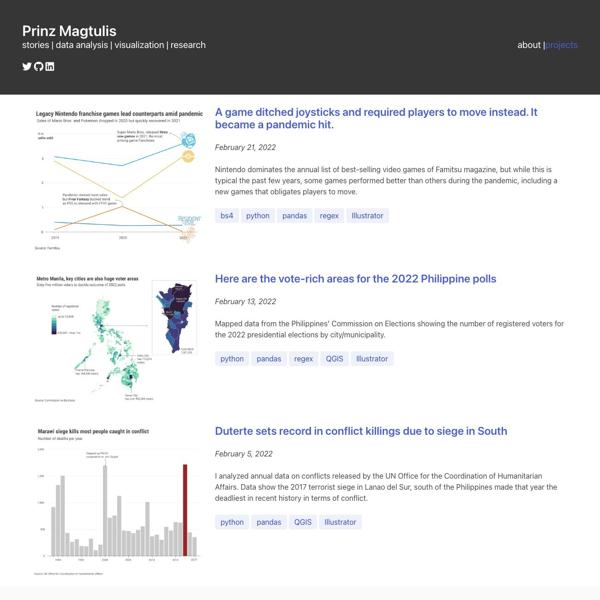](screenshots/pmagtulis.github.io/projects.html-wide-full.jpg)|
|[Prinz Magtulis - Projects](https://pmagtulis.github.io/projects/polls.html)|[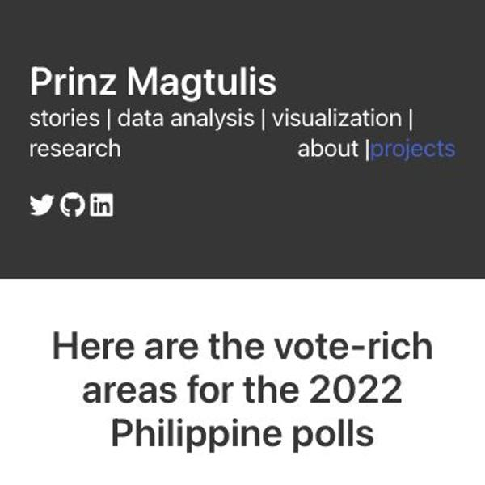](screenshots/pmagtulis.github.io/projects_polls.html-mobile-full.jpg)|[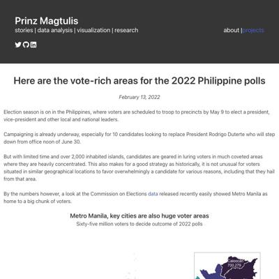](screenshots/pmagtulis.github.io/projects_polls.html-medium-full.jpg)|[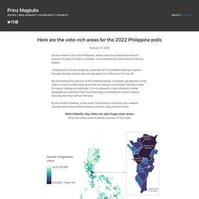](screenshots/pmagtulis.github.io/projects_polls.html-wide-full.jpg)|
|[Prinz Magtulis - Projects](https://pmagtulis.github.io/projects/video-games.html)|[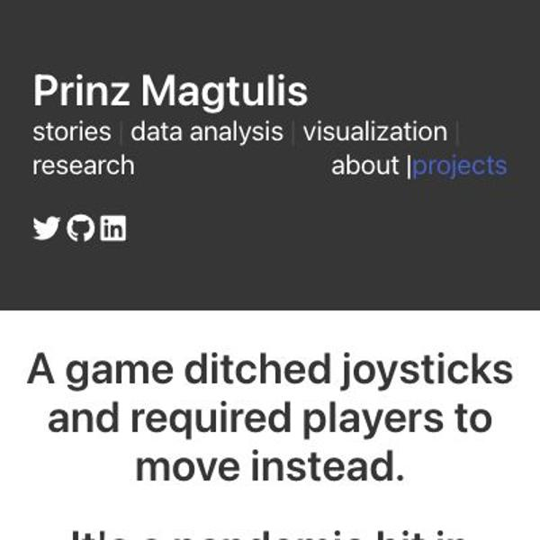](screenshots/pmagtulis.github.io/projects_video-games.html-mobile-full.jpg)|[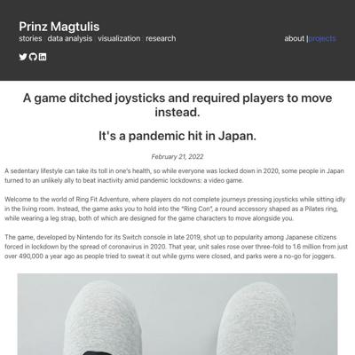](screenshots/pmagtulis.github.io/projects_video-games.html-medium-full.jpg)|[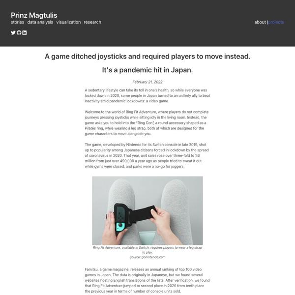](screenshots/pmagtulis.github.io/projects_video-games.html-wide-full.jpg)|

### Automatic Checks

**https://pmagtulis.github.io/** [Visit ↗](https://pmagtulis.github.io/)

No issues found! 🎉

**https://pmagtulis.github.io/projects.html** [Visit ↗](https://pmagtulis.github.io/projects.html)

* Has sideways scrollbars in mobile version – check padding, margins, image widths

**https://pmagtulis.github.io/projects/polls.html** [Visit ↗](https://pmagtulis.github.io/projects/polls.html)

* Minimum font size should be 12px, enlarge text in Illustrator
   * Text `Number of ` is too small at 11px
   * Text `registered` is too small at 11px
   * Text `voters` is too small at 11px
   * Text `up to 25,000` is too small at 11px
   * Text `470,001 - Over 1m` is too small at 11px
   * Text `Cebu City ` is too small at 11px
   * Text `has ` is too small at 11px
   * Text `713,074` is too small at 11px
   * Text `voters` is too small at 11px
   * Text `Puerto Princesa` is too small at 11px
   * Text `has 164,590 voters` is too small at 11px
   * Text `Davao City` is too small at 11px
   * Text `has over 992,000 voters` is too small at 11px
   * Text `Caloocan` is too small at 8px
   * Text `700,279` is too small at 8px
   * Text `Quezon City` is too small at 8px
   * Text `1,403,895` is too small at 8px
   * Text `Manila` is too small at 8px
   * Text `1,112,081` is too small at 8px
   * Text `Entire NCR:` is too small at 8px
   * Text `7,301,393` is too small at 8px

**https://pmagtulis.github.io/projects/video-games.html** [Visit ↗](https://pmagtulis.github.io/projects/video-games.html)

* Minimum font size should be 12px, enlarge text in Illustrator
   * Text `4m` is too small at 8px
   * Text `Super Mario Bros. released three` is too small at 8px
   * Text `three` is too small at 8px
   * Text `new games in 2021, ` is too small at 8px
   * Text `new games` is too small at 8px
   * Text `the most among franchises` is too small at 8px
   * Text `units` is too small at 8px
   * Text `sold` is too small at 8px
   * Text `3m` is too small at 8px
   * Text `2m` is too small at 8px
   * Text `Pandemic dented most sales` is too small at 8px
   * Text `but Final Fantasy bucked trend` is too small at 8px
   * Text `Final Fantasy` is too small at 8px
   * Text `as PS5 is released with FFVII game` is too small at 8px
   * Text `1m` is too small at 8px
   * Text `0` is too small at 8px
   * Text `2019` is too small at 8px
   * Text `2020` is too small at 8px
   * Text `2021` is too small at 8px
* Overlapping elements in ai2html, check [the overflow video](https://www.youtube.com/watch?v=6vHsnjTp3_w) or make a smaller size
   * Text `Monster Hunter Rise` overlaps with `Pokemon Brilliant Diamond / Shining Pearl` at screen width 400
   * Text `Pokemon Brilliant Diamond / Shining Pearl` overlaps with `Momotaro Dentetsu` at screen width 400
   * Text `Momotaro Dentetsu` overlaps with `Super Mario 3D World + Bowser's Fury` at screen width 400
   * Text `Super Mario 3D World + Bowser's Fury` overlaps with `Ring Fit Adventure` at screen width 400
   * Text `Ring Fit Adventure` overlaps with `Mario Kart 8 Deluxe` at screen width 400
   * Text `Mario Kart 8 Deluxe` overlaps with `Minecraft` at screen width 400
   * Text `Minecraft` overlaps with `Animal Crossing: New Horizons` at screen width 400
   * Text `Animal Crossing: New Horizons` overlaps with `Mario Party Superstars` at screen width 400
   * Text `Mario Party Superstars` overlaps with `Super Smash Bros. Ultimate` at screen width 400
   * Text `Super Smash Bros. Ultimate` overlaps with `Pokemon Sword & Shield` at screen width 400
   * Text `Pokemon Sword & Shield` overlaps with `Clubhouse Games: 51 Worldwide Classics` at screen width 400
   * Text `Clubhouse Games: 51 Worldwide Classics` overlaps with `Story of Seasons: Pioneers of Olive Town` at screen width 400
   * Text `Story of Seasons: Pioneers of Olive Town` overlaps with `New Pokemon Snap` at screen width 400
   * Text `New Pokemon Snap` overlaps with `Super Mario Party` at screen width 400

## pmartisa.github.io

|url|mobile|medium|wide|
|---|---|---|---|
|[index.html](https://pmartisa.github.io/)||||
|[project_one/index.html](https://pmartisa.github.io/project_one/)||||
|[project_three/index.html](https://pmartisa.github.io/project_three/index.html)||||
|[project_two/index.html](https://pmartisa.github.io/project_two/index.html)||||

### Automatic Checks

**https://pmartisa.github.io/** [Visit ↗](https://pmartisa.github.io/)

* Missing viewport meta tag in `<head>`, needed to tell browser it's responsive. Add `<meta name="viewport" content="width=device-width, initial-scale=1, shrink-to-fit=no">`
* Minimum font size should be 12px, enlarge text in Illustrator
   * Text `A Flourish scatter chart` is too small at 11px
   * Text `A Flourish scatter chart` is too small at 11px
   * Text `` is too small at 11px
   * Text `A Flourish scatter chart` is too small at 11px
   * Text ` ` is too small at 9px
   * Text `Average lead in early generic polls for the party in power or the party out of power .` is too small at 10px
   * Text `.` is too small at 11px
   * Text `2018` is too small at 9px
   * Text `+13.4 pts.` is too small at 9px
   * Text `2016` is too small at 9px
   * Text `1.2` is too small at 9px
   * Text `2014` is too small at 9px
   * Text `3.0` is too small at 9px
   * Text `2012` is too small at 9px
   * Text `1.5` is too small at 9px
   * Text `2010` is too small at 9px
   * Text `0.4` is too small at 9px
   * Text `2008` is too small at 9px
   * Text `11.0` is too small at 9px
   * Text `2006` is too small at 9px
   * Text `10.2` is too small at 9px
   * Text `2004` is too small at 9px
   * Text `2.6` is too small at 9px
   * Text `2002` is too small at 9px
   * Text `0.2` is too small at 9px
   * Text `2000` is too small at 9px
   * Text `4.8` is too small at 9px
   * Text `5.9` is too small at 9px
   * Text `1998` is too small at 9px
   * Text `3.5` is too small at 9px
   * Text `1996` is too small at 9px
   * Text `3.6` is too small at 9px
   * Text `1994` is too small at 9px
   * Text `8.7` is too small at 9px
   * Text `1992` is too small at 9px
   * Text `4.0` is too small at 9px
   * Text `1990` is too small at 9px
   * Text ` ` is too small at 9px
   * Text `Values represent the average of all polls between 220 and 420 days before an election.` is too small at 9px
   * Text ` ` is too small at 9px
   * Text `By The New York Times` is too small at 9px
   * Text `.` is too small at 6px
   * Text `.` is too small at 6px
   * Text `.` is too small at 6px
   * Text `.` is too small at 6px
   * Text `0` is too small at 10px
   * Text `1` is too small at 11px
   * Text `2` is too small at 11px
   * Text `3` is too small at 11px
   * Text `4` is too small at 11px
* Overlapping elements in ai2html, check [the overflow video](https://www.youtube.com/watch?v=6vHsnjTp3_w) or make a smaller size
   * Text `2018 Doesn’t Look Quite Like Other Election Cycles` overlaps with `2018` at screen width 400
   * Text `2018 Doesn’t Look Quite Like Other Election Cycles` overlaps with `+13.4 pts.` at screen width 400
   * Text `2018 Doesn’t Look Quite Like Other Election Cycles` overlaps with `2016` at screen width 400
   * Text `2018 Doesn’t Look Quite Like Other Election Cycles` overlaps with `1.2` at screen width 400
   * Text `2018 Doesn’t Look Quite Like Other Election Cycles` overlaps with `2014` at screen width 400
   * Text `2018 Doesn’t Look Quite Like Other Election Cycles` overlaps with `3.0` at screen width 400
   * Text ` ` overlaps with `2012` at screen width 400
   * Text ` ` overlaps with `1.5` at screen width 400
   * Text `Average lead in early generic polls for the party in power or the party out of power .` overlaps with `2012` at screen width 400
   * Text `Average lead in early generic polls for the party in power or the party out of power .` overlaps with `1.5` at screen width 400
   * Text `Average lead in early generic polls for the party in power or the party out of power .` overlaps with `2010` at screen width 400
   * Text `Average lead in early generic polls for the party in power or the party out of power .` overlaps with `0.4` at screen width 400
   * Text `2016` overlaps with `1.2` at screen width 400
   * Text `2010` overlaps with `0.4` at screen width 400
   * Text `2002` overlaps with `0.2` at screen width 400
   * Text ` ` overlaps with `Incumbents Are Tough to Beat, Even in a Wave` at screen width 400
   * Text `By The New York Times` overlaps with `Incumbents Are Tough to Beat, Even in a Wave` at screen width 400
   * Text `Incumbents Are Tough to Beat, Even in a Wave` overlaps with `Incumbent` at screen width 400
   * Text `Incumbents are typically favored to win, even in difficult districts in a wave election.` overlaps with `Incumbent` at screen width 400
   * Text `Incumbents are typically favored to win, even in difficult districts in a wave election.` overlaps with `Survives` at screen width 400
   * Text `Incumbents are typically favored to win, even in difficult districts in a wave election.` overlaps with `Incumbent Defeated` at screen width 400
   * Text `Incumbents are typically favored to win, even in difficult districts in a wave election.` overlaps with `.` at screen width 400
   * Text `Incumbents are typically favored to win, even in difficult districts in a wave election.` overlaps with `.` at screen width 400
   * Text `Incumbents are typically favored to win, even in difficult districts in a wave election.` overlaps with `.` at screen width 400
   * Text `Incumbents are typically favored to win, even in difficult districts in a wave election.` overlaps with `.` at screen width 400
   * Text `Incumbents are typically favored to win, even in difficult districts in a wave election.` overlaps with `C+7 or greater` at screen width 400
   * Text `Incumbents are typically favored to win, even in difficult districts in a wave election.` overlaps with `24` at screen width 400
   * Text `Incumbents are typically favored to win, even in difficult districts in a wave election.` overlaps with `76%` at screen width 400
   * Text ` ` overlaps with `C+3 to C+7` at screen width 400
   * Text ` ` overlaps with `63` at screen width 400
   * Text ` ` overlaps with `37` at screen width 400
   * Text `Winning percentage for incumbents representing the president’s party in 2006 and 2010, by their party’s advantage in Cook P.V.I.` overlaps with `C+1 to C+3` at screen width 400
   * Text `Winning percentage for incumbents representing the president’s party in 2006 and 2010, by their party’s advantage in Cook P.V.I.` overlaps with `61` at screen width 400
   * Text `Winning percentage for incumbents representing the president’s party in 2006 and 2010, by their party’s advantage in Cook P.V.I.` overlaps with `39` at screen width 400
   * Text `Winning percentage for incumbents representing the president’s party in 2006 and 2010, by their party’s advantage in Cook P.V.I.` overlaps with `I+1 to C+1` at screen width 400
   * Text `Winning percentage for incumbents representing the president’s party in 2006 and 2010, by their party’s advantage in Cook P.V.I.` overlaps with `65` at screen width 400
   * Text `Winning percentage for incumbents representing the president’s party in 2006 and 2010, by their party’s advantage in Cook P.V.I.` overlaps with `35` at screen width 400
   * Text `Winning percentage for incumbents representing the president’s party in 2006 and 2010, by their party’s advantage in Cook P.V.I.` overlaps with `25` at screen width 400
   * Text `Winning percentage for incumbents representing the president’s party in 2006 and 2010, by their party’s advantage in Cook P.V.I.` overlaps with `I+1 to I+3` at screen width 400
   * Text `Winning percentage for incumbents representing the president’s party in 2006 and 2010, by their party’s advantage in Cook P.V.I.` overlaps with `75` at screen width 400
   * Text `Survives` overlaps with `.` at screen width 400
   * Text `Survives` overlaps with `24` at screen width 400
   * Text `Incumbent Defeated` overlaps with `.` at screen width 400
   * Text `Incumbent Defeated` overlaps with `.` at screen width 400
   * Text `I+5 to I+10` overlaps with `7` at screen width 400
   * Text `France` overlaps with `31.5%` at screen width 400
   * Text `France` overlaps with `Finland` at screen width 400
   * Text `France` overlaps with `30.8` at screen width 400
   * Text `31.5%` overlaps with `Finland` at screen width 400
   * Text `31.5%` overlaps with `30.8` at screen width 400
   * Text `Finland` overlaps with `30.8` at screen width 400
   * Text `Finland` overlaps with `Belgium` at screen width 400
   * Text `Finland` overlaps with `29.0` at screen width 400
   * Text `30.8` overlaps with `Belgium` at screen width 400
   * Text `30.8` overlaps with `29.0` at screen width 400
   * Text `Belgium` overlaps with `29.0` at screen width 400
   * Text `Belgium` overlaps with `Italy` at screen width 400
   * Text `Belgium` overlaps with `28.9` at screen width 400
   * Text `29.0` overlaps with `Italy` at screen width 400
   * Text `29.0` overlaps with `28.9` at screen width 400
   * Text `Italy` overlaps with `28.9` at screen width 400
   * Text `Italy` overlaps with `Denmark` at screen width 400
   * Text `Italy` overlaps with `28.7` at screen width 400
   * Text `28.9` overlaps with `Denmark` at screen width 400
   * Text `28.9` overlaps with `28.7` at screen width 400
   * Text `Denmark` overlaps with `28.7` at screen width 400
   * Text `Denmark` overlaps with `Austria` at screen width 400
   * Text `Denmark` overlaps with `27.8` at screen width 400
   * Text `28.7` overlaps with `Austria` at screen width 400
   * Text `28.7` overlaps with `27.8` at screen width 400
   * Text `Austria` overlaps with `27.8` at screen width 400
   * Text `Austria` overlaps with `Sweden` at screen width 400
   * Text `Austria` overlaps with `27.1` at screen width 400
   * Text `27.8` overlaps with `Sweden` at screen width 400
   * Text `27.8` overlaps with `27.1` at screen width 400
   * Text `Sweden` overlaps with `27.1` at screen width 400
   * Text `Sweden` overlaps with `Greece` at screen width 400
   * Text `Sweden` overlaps with `27.0` at screen width 400
   * Text `27.1` overlaps with `Greece` at screen width 400
   * Text `27.1` overlaps with `27.0` at screen width 400
   * Text `Greece` overlaps with `27.0` at screen width 400
   * Text `Greece` overlaps with `Germany` at screen width 400
   * Text `Greece` overlaps with `25.3` at screen width 400
   * Text `27.0` overlaps with `Germany` at screen width 400
   * Text `27.0` overlaps with `25.3` at screen width 400
   * Text `Germany` overlaps with `25.3` at screen width 400
   * Text `Germany` overlaps with `Norway` at screen width 400
   * Text `Germany` overlaps with `25.1` at screen width 400
   * Text `25.3` overlaps with `Norway` at screen width 400
   * Text `25.3` overlaps with `25.1` at screen width 400
   * Text `Norway` overlaps with `25.1` at screen width 400
   * Text `Norway` overlaps with `Spain` at screen width 400
   * Text `Norway` overlaps with `24.6` at screen width 400
   * Text `25.1` overlaps with `Spain` at screen width 400
   * Text `25.1` overlaps with `24.6` at screen width 400
   * Text `Spain` overlaps with `24.6` at screen width 400
   * Text `Spain` overlaps with `Portugal` at screen width 400
   * Text `Spain` overlaps with `24.1` at screen width 400
   * Text `24.6` overlaps with `Portugal` at screen width 400
   * Text `24.6` overlaps with `24.1` at screen width 400
   * Text `Portugal` overlaps with `24.1` at screen width 400
   * Text `Portugal` overlaps with `Japan` at screen width 400
   * Text `Portugal` overlaps with `23.1` at screen width 400
   * Text `24.1` overlaps with `Japan` at screen width 400
   * Text `24.1` overlaps with `23.1` at screen width 400
   * Text `Japan` overlaps with `23.1` at screen width 400
   * Text `Japan` overlaps with `Slovenia` at screen width 400
   * Text `Japan` overlaps with `22.8` at screen width 400
   * Text `23.1` overlaps with `Slovenia` at screen width 400
   * Text `23.1` overlaps with `22.8` at screen width 400
   * Text `Slovenia` overlaps with `22.8` at screen width 400
   * Text `Slovenia` overlaps with `Netherlands` at screen width 400
   * Text `Slovenia` overlaps with `22.0` at screen width 400
   * Text `22.8` overlaps with `Netherlands` at screen width 400
   * Text `22.8` overlaps with `22.0` at screen width 400
   * Text `Netherlands` overlaps with `22.0` at screen width 400
   * Text `Netherlands` overlaps with `Luxembourg` at screen width 400
   * Text `Netherlands` overlaps with `21.8` at screen width 400
   * Text `22.0` overlaps with `Luxembourg` at screen width 400
   * Text `22.0` overlaps with `21.8` at screen width 400
   * Text `Luxembourg` overlaps with `21.8` at screen width 400
   * Text `Luxembourg` overlaps with `Britain` at screen width 400
   * Text `Luxembourg` overlaps with `21.5` at screen width 400
   * Text `21.8` overlaps with `Britain` at screen width 400
   * Text `21.8` overlaps with `21.5` at screen width 400
   * Text `Britain` overlaps with `21.5` at screen width 400
   * Text `Britain` overlaps with `O.E.C.D. avg.` at screen width 400
   * Text `Britain` overlaps with `21.0` at screen width 400
   * Text `21.5` overlaps with `O.E.C.D. avg.` at screen width 400
   * Text `21.5` overlaps with `21.0` at screen width 400
   * Text `O.E.C.D. avg.` overlaps with `21.0` at screen width 400
   * Text `O.E.C.D. avg.` overlaps with `Hungary` at screen width 400
   * Text `O.E.C.D. avg.` overlaps with `20.6` at screen width 400
   * Text `21.0` overlaps with `Hungary` at screen width 400
   * Text `21.0` overlaps with `20.6` at screen width 400
   * Text `Hungary` overlaps with `20.6` at screen width 400
   * Text `Hungary` overlaps with `Poland` at screen width 400
   * Text `Hungary` overlaps with `20.2` at screen width 400
   * Text `20.6` overlaps with `Poland` at screen width 400
   * Text `20.6` overlaps with `20.2` at screen width 400
   * Text `Poland` overlaps with `20.2` at screen width 400
   * Text `Poland` overlaps with `Switzerland` at screen width 400
   * Text `Poland` overlaps with `19.7` at screen width 400
   * Text `20.2` overlaps with `Switzerland` at screen width 400
   * Text `20.2` overlaps with `19.7` at screen width 400
   * Text `Switzerland` overlaps with `19.7` at screen width 400
   * Text `Switzerland` overlaps with `New Zealand` at screen width 400
   * Text `Switzerland` overlaps with `19.5` at screen width 400
   * Text `19.7` overlaps with `New Zealand` at screen width 400
   * Text `19.7` overlaps with `19.5` at screen width 400
   * Text `New Zealand` overlaps with `19.5` at screen width 400
   * Text `New Zealand` overlaps with `Czech Republic` at screen width 400
   * Text `New Zealand` overlaps with `19.4` at screen width 400
   * Text `19.5` overlaps with `Czech Republic` at screen width 400
   * Text `19.5` overlaps with `19.4` at screen width 400
   * Text `Czech Republic` overlaps with `19.4` at screen width 400
   * Text `Czech Republic` overlaps with `United States` at screen width 400
   * Text `Czech Republic` overlaps with `19.3` at screen width 400
   * Text `19.4` overlaps with `United States` at screen width 400
   * Text `19.4` overlaps with `19.3` at screen width 400
   * Text `United States` overlaps with `19.3` at screen width 400
   * Text `United States` overlaps with `Australia` at screen width 400
   * Text `United States` overlaps with `19.1` at screen width 400
   * Text `19.3` overlaps with `Australia` at screen width 400
   * Text `19.3` overlaps with `19.1` at screen width 400
   * Text `Australia` overlaps with `19.1` at screen width 400
   * Text `Australia` overlaps with `Slovakia` at screen width 400
   * Text `Australia` overlaps with `18.6` at screen width 400
   * Text `19.1` overlaps with `Slovakia` at screen width 400
   * Text `19.1` overlaps with `18.6` at screen width 400
   * Text `Slovakia` overlaps with `18.6` at screen width 400
   * Text `Slovakia` overlaps with `Estonia` at screen width 400
   * Text `Slovakia` overlaps with `17.4` at screen width 400
   * Text `18.6` overlaps with `Estonia` at screen width 400
   * Text `18.6` overlaps with `17.4` at screen width 400
   * Text `Estonia` overlaps with `17.4` at screen width 400
   * Text `Estonia` overlaps with `Canada` at screen width 400
   * Text `Estonia` overlaps with `17.2` at screen width 400
   * Text `17.4` overlaps with `Canada` at screen width 400
   * Text `17.4` overlaps with `17.2` at screen width 400
   * Text `Canada` overlaps with `17.2` at screen width 400
   * Text `Canada` overlaps with `Ireland` at screen width 400
   * Text `Canada` overlaps with `16.1` at screen width 400
   * Text `17.2` overlaps with `Ireland` at screen width 400
   * Text `17.2` overlaps with `16.1` at screen width 400
   * Text `Ireland` overlaps with `16.1` at screen width 400
   * Text `Ireland` overlaps with `Israel` at screen width 400
   * Text `Ireland` overlaps with `16.1` at screen width 400
   * Text `16.1` overlaps with `Israel` at screen width 400
   * Text `16.1` overlaps with `16.1` at screen width 400
   * Text `Israel` overlaps with `16.1` at screen width 400
   * Text `Israel` overlaps with `Iceland` at screen width 400
   * Text `Israel` overlaps with `15.2` at screen width 400
   * Text `16.1` overlaps with `Iceland` at screen width 400
   * Text `16.1` overlaps with `15.2` at screen width 400
   * Text `Iceland` overlaps with `15.2` at screen width 400
   * Text `Iceland` overlaps with `Latvia` at screen width 400
   * Text `Iceland` overlaps with `14.5` at screen width 400
   * Text `15.2` overlaps with `Latvia` at screen width 400
   * Text `15.2` overlaps with `14.5` at screen width 400
   * Text `Latvia` overlaps with `14.5` at screen width 400
   * Text `Latvia` overlaps with `Turkey` at screen width 400
   * Text `Latvia` overlaps with `13.5` at screen width 400
   * Text `14.5` overlaps with `Turkey` at screen width 400
   * Text `14.5` overlaps with `13.5` at screen width 400
   * Text `Turkey` overlaps with `13.5` at screen width 400
   * Text `Turkey` overlaps with `Chile` at screen width 400
   * Text `Turkey` overlaps with `11.2` at screen width 400
   * Text `13.5` overlaps with `Chile` at screen width 400
   * Text `13.5` overlaps with `11.2` at screen width 400
   * Text `Chile` overlaps with `11.2` at screen width 400
   * Text `Chile` overlaps with `South Korea` at screen width 400
   * Text `Chile` overlaps with `10.4` at screen width 400
   * Text `11.2` overlaps with `South Korea` at screen width 400
   * Text `11.2` overlaps with `10.4` at screen width 400
   * Text `South Korea` overlaps with `10.4` at screen width 400
   * Text `South Korea` overlaps with `Mexico` at screen width 400
   * Text `South Korea` overlaps with `7.5` at screen width 400
   * Text `10.4` overlaps with `Mexico` at screen width 400
   * Text `10.4` overlaps with `7.5` at screen width 400
   * Text `Mexico` overlaps with `7.5` at screen width 400
   * Text ` ` overlaps with `Delta wave` at screen width 400
   * Text ` ` overlaps with `Omicron wave` at screen width 400
   * Text ` ` overlaps with `Jan. 2021 peak` at screen width 400
   * Text ` ` overlaps with `600k` at screen width 400
   * Text `Jan. 2021 peak` overlaps with `Delta wave` at screen width 400
   * Text `Jan. 2021 peak` overlaps with `Omicron wave` at screen width 400
   * Text `Jan. 2021 peak` overlaps with `Jan. 2021 peak` at screen width 400
   * Text `Jan. 2021 peak` overlaps with `600k` at screen width 400
   * Text `Jan. 2021 peak` overlaps with `600k` at screen width 400
   * Text `0` overlaps with `Dec. 1, 2020` at screen width 400
   * Text `Aug. 1. 2021` overlaps with `Oct. 1, 2021` at screen width 400
   * Text `Oct. 1, 2021` overlaps with `Jan. 5, 2022` at screen width 400
   * Text `Nigel Richard's Performance At Nationals` overlaps with `Average scores for 2013 National Scrabble Championship` at screen width 400
   * Text `DIVISION` overlaps with `1` at screen width 400
   * Text `440` overlaps with `WORSE` at screen width 400
   * Text `320` overlaps with `340` at screen width 400
   * Text `340` overlaps with `360` at screen width 400
   * Text `360` overlaps with `380` at screen width 400
   * Text `360` overlaps with `Points for` at screen width 400
   * Text `380` overlaps with `400` at screen width 400
   * Text `380` overlaps with `Points for` at screen width 400
   * Text `400` overlaps with `420` at screen width 400
   * Text `400` overlaps with `Points for` at screen width 400
   * Text `420` overlaps with `440` at screen width 400
   * Text `420` overlaps with `Points for` at screen width 400
   * Text `Turkey` overlaps with `13.5` at screen width 900
   * Text `Chile` overlaps with `11.2` at screen width 900
   * Text `DIVISION` overlaps with `1` at screen width 900
   * Text `Turkey` overlaps with `13.5` at screen width 1300
   * Text `Chile` overlaps with `11.2` at screen width 1300
   * Text `DIVISION` overlaps with `1` at screen width 1300

**https://pmartisa.github.io/project_one/** [Visit ↗](https://pmartisa.github.io/project_one/)

* Missing viewport meta tag in `<head>`, needed to tell browser it's responsive. Add `<meta name="viewport" content="width=device-width, initial-scale=1, shrink-to-fit=no">`
* Minimum font size should be 12px, enlarge text in Illustrator
   * Text `A Flourish bar chart race` is too small at 11px
   * Text `A Flourish bar chart race` is too small at 11px
   * Text `` is too small at 11px
   * Text `A Flourish bar chart race` is too small at 11px
   * Text `A Flourish scatter chart` is too small at 11px
   * Text `A Flourish scatter chart` is too small at 11px
   * Text `` is too small at 11px
   * Text `A Flourish scatter chart` is too small at 11px

**https://pmartisa.github.io/project_three/index.html** [Visit ↗](https://pmartisa.github.io/project_three/index.html)

* Missing viewport meta tag in `<head>`, needed to tell browser it's responsive. Add `<meta name="viewport" content="width=device-width, initial-scale=1, shrink-to-fit=no">`
* Minimum font size should be 12px, enlarge text in Illustrator
   * Text `Stronger colors for countries that haven’t imposed` is too small at 8px
   * Text `Stronger colors` is too small at 8px
   * Text ` ` is too small at 8px
   * Text ` ` is too small at 8px
   * Text `imposed` is too small at 8px
   * Text `any sanction.` is too small at 8px
   * Text `China` is too small at 10px
   * Text `more than 1.5 million barrels per day` is too small at 9px
   * Text `Netherlands` is too small at 10px
   * Text `640,000` is too small at 9px
   * Text `barrels/day` is too small at 9px
   * Text `Belarus` is too small at 10px
   * Text `297,000` is too small at 9px
   * Text `barrels/day` is too small at 9px
   * Text `Germany` is too small at 10px
   * Text `Poland` is too small at 10px
   * Text `300,000` is too small at 9px
   * Text `barrels/day` is too small at 9px
   * Text `Rep. of Korea` is too small at 10px
   * Text `Italy` is too small at 10px
   * Text `186,000` is too small at 9px
   * Text `barrels/day` is too small at 9px
   * Text `Finland` is too small at 10px
   * Text `Japan` is too small at 10px
   * Text `Slovakia` is too small at 10px
   * Text `Turkey` is too small at 10px
   * Text `Stronger colors for countries that ` is too small at 5px
   * Text `Stronger colors` is too small at 5px
   * Text ` ` is too small at 5px
   * Text `haven’t imposed ` is too small at 5px
   * Text `haven’t` is too small at 5px
   * Text ` ` is too small at 5px
   * Text `any sanction.` is too small at 5px
   * Text `China` is too small at 7px
   * Text `2018` is too small at 10px
   * Text `more than 1.5 ` is too small at 6px
   * Text `million barrels ` is too small at 6px
   * Text `per day` is too small at 6px
   * Text `Netherlands` is too small at 7px
   * Text `640,000` is too small at 6px
   * Text `barrels/day` is too small at 6px
   * Text `2019` is too small at 10px
   * Text `Belarus` is too small at 7px
   * Text `297,000` is too small at 6px
   * Text `barrels/day` is too small at 6px
   * Text `Germany` is too small at 7px
   * Text `Poland` is too small at 7px
   * Text `300,000` is too small at 6px
   * Text `barrels/day` is too small at 6px
   * Text `Rep. of Korea` is too small at 7px
   * Text `2020` is too small at 10px
   * Text `Italy` is too small at 7px
   * Text `186,000` is too small at 6px
   * Text ` barrels/day` is too small at 6px
   * Text `Finland` is too small at 7px
   * Text `Japan` is too small at 7px
   * Text `Slovakia` is too small at 7px
   * Text `Turkey` is too small at 7px
   * Text `Stronger colors for countries that haven’t imposed ` is too small at 7px
   * Text `Stronger colors` is too small at 7px
   * Text ` ` is too small at 7px
   * Text ` ` is too small at 7px
   * Text `imposed ` is too small at 7px
   * Text `any sanction.` is too small at 7px
   * Text `China` is too small at 9px
   * Text `more than 1.5 million barrels per day` is too small at 7px
   * Text `Netherlands` is too small at 9px
   * Text `640,000` is too small at 7px
   * Text `barrels/day` is too small at 7px
   * Text `297,000` is too small at 7px
   * Text `barrels/day` is too small at 7px
   * Text `Belarus` is too small at 9px
   * Text `Germany` is too small at 9px
   * Text `Poland` is too small at 9px
   * Text `300,000` is too small at 7px
   * Text `barrels/day` is too small at 7px
   * Text `Rep. of Korea` is too small at 9px
   * Text `Italy` is too small at 9px
   * Text `186,000` is too small at 7px
   * Text ` barrels/day` is too small at 7px
   * Text `Finland` is too small at 9px
   * Text `Japan` is too small at 9px
   * Text `Slovakia` is too small at 9px
   * Text `Turkey` is too small at 9px
   * Text `674,558` is too small at 11px
   * Text `Prevalence of insufficient ` is too small at 11px
   * Text `food consumption ` is too small at 11px
   * Text `Bangladesh` is too small at 11px
   * Text `1,94` is too small at 10px
   * Text `8.25 million metric tonnes ` is too small at 10px
   * Text `Azerbaijan` is too small at 11px
   * Text `Sudan` is too small at 11px
   * Text `1,38` is too small at 10px
   * Text `1,33` is too small at 10px
   * Text `Yemen` is too small at 10px
   * Text `Pakistan` is too small at 11px
   * Text `796,10` is too small at 9px
   * Text `1,17` is too small at 10px
   * Text `Tanzania` is too small at 10px
   * Text `700,911` is too small at 9px
   * Text `Nigeria` is too small at 10px
   * Text `United Arab ` is too small at 9px
   * Text `Emirates` is too small at 9px
   * Text `998,13` is too small at 9px
   * Text `674,558` is too small at 8px
   * Text `Azerbaijan` is too small at 9px
   * Text `Bangladesh` is too small at 11px
   * Text `2,58` is too small at 10px
   * Text `1,28` is too small at 10px
   * Text `United Arab ` is too small at 10px
   * Text `Emirates` is too small at 10px
   * Text `Sudan` is too small at 11px
   * Text `986,95` is too small at 10px
   * Text `736,156` is too small at 10px
   * Text `Viet Nam` is too small at 10px
   * Text `604,543` is too small at 10px
   * Text `Nigeria` is too small at 11px
   * Text `Yemen` is too small at 11px
   * Text `894,72` is too small at 10px
   * Text `880,507` is too small at 9px
   * Text `Latvia` is too small at 10px
   * Text `578,806` is too small at 10px
   * Text `Prevalence of insufficient ` is too small at 11px
   * Text `food consumption ` is too small at 11px
   * Text ` Moderately Low (10% - 20%)` is too small at 11px
   * Text `Very High (above 40%)` is too small at 11px
   * Text `Low (5% - 10%)` is too small at 11px
   * Text `Moderately High (20% - 30%)` is too small at 11px
   * Text `Not reported` is too small at 11px
* Overlapping elements in ai2html, check [the overflow video](https://www.youtube.com/watch?v=6vHsnjTp3_w) or make a smaller size
   * Text `Azerbaijan` overlaps with `Bangladesh` at screen width 400
   * Text `Nigeria` overlaps with `Yemen` at screen width 400
   * Text `894,72` overlaps with `880,507` at screen width 400
   * Text `Azerbaijan` overlaps with `Bangladesh` at screen width 900
   * Text `Nigeria` overlaps with `Yemen` at screen width 900
   * Text `894,72` overlaps with `880,507` at screen width 900

**https://pmartisa.github.io/project_two/index.html** [Visit ↗](https://pmartisa.github.io/project_two/index.html)

* Missing viewport meta tag in `<head>`, needed to tell browser it's responsive. Add `<meta name="viewport" content="width=device-width, initial-scale=1, shrink-to-fit=no">`

## sarahgrevy.github.io

|url|mobile|medium|wide|
|---|---|---|---|
|[Sarah Grevy Gotfredsen Portfolio](https://sarahgrevy.github.io/)||||
|[Sarah Grevy Gotfredsen Portfolio](https://sarahgrevy.github.io/co2_emission)||||
|[Sarah Grevy Gotfredsen Portfolio](https://sarahgrevy.github.io/weather_project)||||
|[Sarah Grevy Gotfredsen Portfolio](https://sarahgrevy.github.io/wordle)||||

### Automatic Checks

**https://sarahgrevy.github.io/** [Visit ↗](https://sarahgrevy.github.io/)

No issues found! 🎉

**https://sarahgrevy.github.io/co2_emission** [Visit ↗](https://sarahgrevy.github.io/co2_emission)

* Minimum font size should be 12px, enlarge text in Illustrator
   * Text `A Flourish map` is too small at 11px
   * Text `A Flourish map` is too small at 11px
   * Text `` is too small at 11px
   * Text `A Flourish map` is too small at 11px
   * Text `A Flourish chart` is too small at 11px
   * Text `A Flourish chart` is too small at 11px
   * Text `` is too small at 11px
   * Text `A Flourish chart` is too small at 11px

**https://sarahgrevy.github.io/weather_project** [Visit ↗](https://sarahgrevy.github.io/weather_project)

No issues found! 🎉

**https://sarahgrevy.github.io/wordle** [Visit ↗](https://sarahgrevy.github.io/wordle)

No issues found! 🎉

## semerriam.github.io

|url|mobile|medium|wide|
|---|---|---|---|
|[Susan Merriam](https://semerriam.github.io/)||||
|[First Visual Story](https://semerriam.github.io/nicar_first_visual_story/)||||
|[Page not found · GitHub Pages](https://semerriam.github.io/pj_ec_schools.html)|[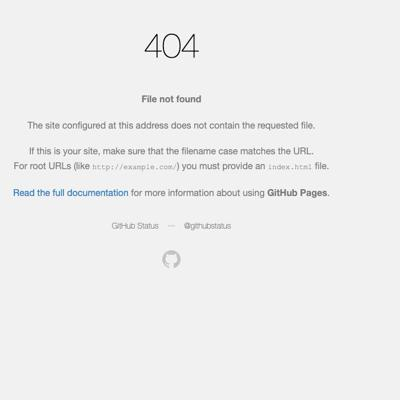](screenshots/semerriam.github.io/pj_ec_schools.html-mobile-full.jpg)|[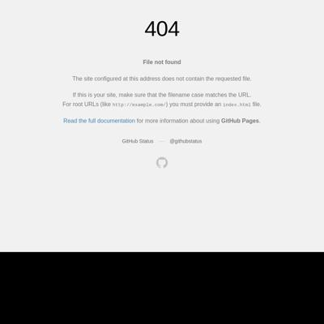](screenshots/semerriam.github.io/pj_ec_schools.html-medium-full.jpg)|[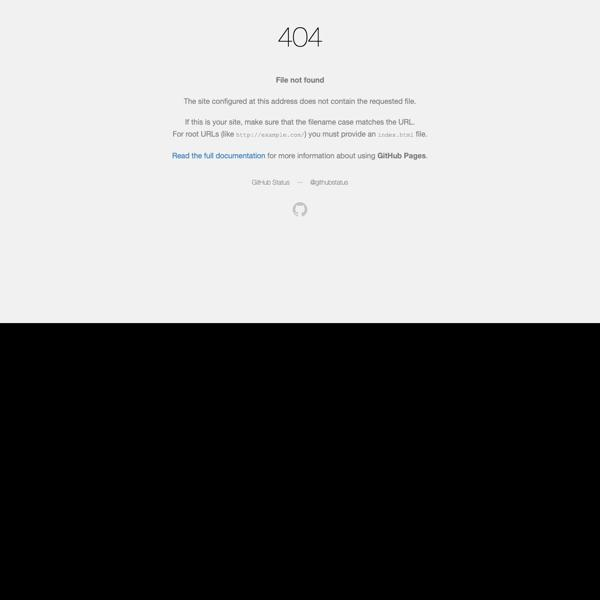](screenshots/semerriam.github.io/pj_ec_schools.html-wide-full.jpg)|
|[Susan Merriam](https://semerriam.github.io/projects/pj_census_quirks.html)|[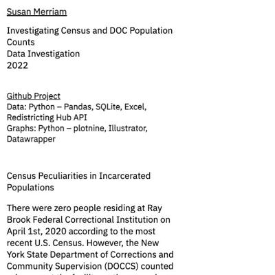](screenshots/semerriam.github.io/projects_pj_census_quirks.html-mobile-full.jpg)|[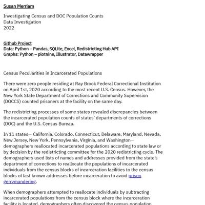](screenshots/semerriam.github.io/projects_pj_census_quirks.html-medium-full.jpg)|[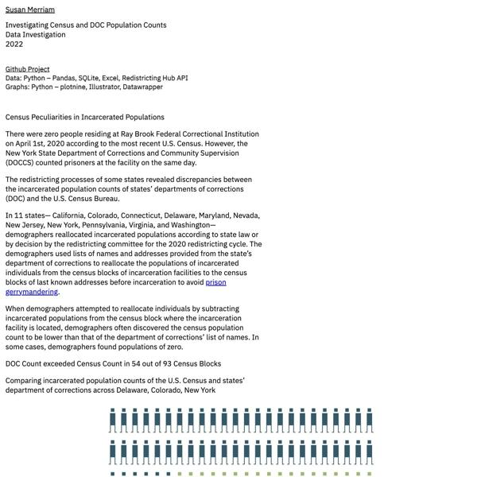](screenshots/semerriam.github.io/projects_pj_census_quirks.html-wide-full.jpg)|
|[Susan Merriam](https://semerriam.github.io/projects/pj_census_quirks.html)||||

### Automatic Checks

**https://semerriam.github.io/** [Visit ↗](https://semerriam.github.io/)

* Missing viewport meta tag in `<head>`, needed to tell browser it's responsive. Add `<meta name="viewport" content="width=device-width, initial-scale=1, shrink-to-fit=no">`

**https://semerriam.github.io/nicar_first_visual_story/** [Visit ↗](https://semerriam.github.io/nicar_first_visual_story/)

* Has sideways scrollbars in mobile version – check padding, margins, image widths
* Minimum font size should be 12px, enlarge text in Illustrator
   * Text `MAR. 5, 2022` is too small at 10px
   * Text `MAR. 5, 2022` is too small at 10px
   * Text `Leaflet` is too small at 11px
   * Text `Leaflet` is too small at 11px

**https://semerriam.github.io/pj_ec_schools.html** [Visit ↗](https://semerriam.github.io/pj_ec_schools.html)

* Missing viewport meta tag in `<head>`, needed to tell browser it's responsive. Add `<meta name="viewport" content="width=device-width, initial-scale=1, shrink-to-fit=no">`
* Has sideways scrollbars in mobile version – check padding, margins, image widths

**https://semerriam.github.io/projects/pj_census_quirks.html** [Visit ↗](https://semerriam.github.io/projects/pj_census_quirks.html)

* Missing viewport meta tag in `<head>`, needed to tell browser it's responsive. Add `<meta name="viewport" content="width=device-width, initial-scale=1, shrink-to-fit=no">`
* Has sideways scrollbars in mobile version – check padding, margins, image widths
* Minimum font size should be 12px, enlarge text in Illustrator
   * Text `Source: U.S. Census 2020 PL 94-171, Colorado Independent Redistricting Commissions, ` is too small at 8px
   * Text `Redistricting Data Hub, NYS LATFOR` is too small at 8px
   * Text `Source: U.S. Census 2020 PL 94-171, Redistricting Data Hub, Colorado Independent Redistricting Commissions, NYS LATFOR` is too small at 9px
   * Text `Source: U.S. Census 2020 PL 94-171, Redistricting Data Hub, Colorado Independent Redistricting Commissions, NYS LATFOR` is too small at 9px
   * Text `Wyoming Correctional Facility` is too small at 11px
   * Text `+938` is too small at 10px
   * Text `Bedford Hills Correctional Facility` is too small at 11px
   * Text `+375` is too small at 10px
   * Text `Colorado Territorial Correctional Facility` is too small at 11px
   * Text `+346` is too small at 10px
   * Text `Albion Correctional Facility` is too small at 11px
   * Text `+340` is too small at 10px
   * Text `Centennial Correctional Facility` is too small at 11px
   * Text `+218` is too small at 10px
   * Text `Ogdensburg Correctional Facility` is too small at 11px
   * Text `+192` is too small at 10px
   * Text `Midstate Correctional Facility` is too small at 11px
   * Text `+187` is too small at 10px
   * Text `Fremont Correctional Facility` is too small at 11px
   * Text `+186` is too small at 10px
   * Text `Bent County Correctional Facility` is too small at 11px
   * Text `+158` is too small at 10px
   * Text `Cayuga Correctional Facility` is too small at 11px
   * Text `+116` is too small at 10px
   * Text `Riverview Correctional Facility` is too small at 11px
   * Text `+113` is too small at 10px
   * Text `La Vista Correctional Facility` is too small at 11px
   * Text `+107` is too small at 10px
   * Text `Midstate Correctional Facility` is too small at 11px
   * Text `+101` is too small at 10px
   * Text `Hale Creek Correctional Facility` is too small at 11px
   * Text `+91` is too small at 10px
   * Text `Five Points Correctional Facility` is too small at 11px
   * Text `+76` is too small at 10px
   * Text `Hazel D. Plant Women's Treatment Facility` is too small at 11px
   * Text `+72` is too small at 10px
   * Text `San Carlos Correctional Facility` is too small at 11px
   * Text `+50` is too small at 10px
   * Text `Midstate Correctional Facility` is too small at 11px
   * Text `+33` is too small at 10px
   * Text `Marcy Correctional Facility` is too small at 11px
   * Text `+31` is too small at 10px
   * Text `0` is too small at 10px
   * Text `200` is too small at 10px
   * Text `400` is too small at 10px
   * Text `600` is too small at 10px
   * Text `800` is too small at 10px
   * Text `1000` is too small at 10px
   * Text `1200` is too small at 10px
   * Text `1400` is too small at 10px
   * Text `1600` is too small at 10px
   * Text `1800` is too small at 10px
   * Text `Source: U.S. Census 2020 PL 94-171, Redistricting Data Hub, Colorado Independent Redistricting Commissions, NYS LATFOR` is too small at 9px
   * Text `1` is too small at 11px
   * Text `+938` is too small at 10px
   * Text `+375` is too small at 10px
   * Text `2` is too small at 11px
   * Text `3` is too small at 11px
   * Text `+346` is too small at 10px
   * Text `+340` is too small at 10px
   * Text `4` is too small at 11px
   * Text `+218` is too small at 10px
   * Text `5` is too small at 11px
   * Text `+192` is too small at 10px
   * Text `6` is too small at 11px
   * Text `7` is too small at 11px
   * Text `+187` is too small at 10px
   * Text `8` is too small at 11px
   * Text `+186` is too small at 10px
   * Text `9` is too small at 11px
   * Text `+158` is too small at 10px
   * Text `10` is too small at 11px
   * Text `+116` is too small at 10px
   * Text `+113` is too small at 10px
   * Text `11` is too small at 11px
   * Text `+107` is too small at 10px
   * Text `12` is too small at 11px
   * Text `+101` is too small at 10px
   * Text `13` is too small at 11px
   * Text `+91` is too small at 10px
   * Text `14` is too small at 11px
   * Text `15` is too small at 11px
   * Text `+76` is too small at 10px
   * Text `+72` is too small at 10px
   * Text `16` is too small at 11px
   * Text `+50` is too small at 10px
   * Text `17` is too small at 11px
   * Text `+33` is too small at 10px
   * Text `18` is too small at 11px
   * Text `19` is too small at 11px
   * Text `+31` is too small at 10px
   * Text `0` is too small at 10px
   * Text `200` is too small at 10px
   * Text `400` is too small at 10px
   * Text `600` is too small at 10px
   * Text `800` is too small at 10px
   * Text `1000` is too small at 10px
   * Text `1200` is too small at 10px
   * Text `1400` is too small at 10px
   * Text `1600` is too small at 10px
   * Text `1800` is too small at 10px
   * Text `3 Colorado Territorial Correctional Facility` is too small at 10px
   * Text `2 Bedford Hills Correctional Facility` is too small at 10px
   * Text `1 Wyoming Correctional Facility` is too small at 10px
   * Text `4 Albion Correctional Facility` is too small at 10px
   * Text `6 Ogdensburg Correctional Facility` is too small at 10px
   * Text `5 Centennial Correctional Facility` is too small at 10px
   * Text `7 Midstate Correctional Facility` is too small at 10px
   * Text `8 Fremont Correctional Facility` is too small at 10px
   * Text `9 Bent County Correctional Facility` is too small at 10px
   * Text `11 Riverview Correctional Facility` is too small at 10px
   * Text `12 La Vista Correctional Facility` is too small at 10px
   * Text `10 Cayuga Correctional Facility` is too small at 10px
   * Text `16 Hazel D. Plant Women's Treatment Facility` is too small at 10px
   * Text `15 Five Points Correctional Facility` is too small at 10px
   * Text `14 Hale Creek Correctional Facility` is too small at 10px
   * Text `13 Midstate Correctional Facility` is too small at 10px
   * Text `17 San Carlos Correctional Facility` is too small at 10px
   * Text `18 Midstate Correctional Facility` is too small at 10px
   * Text `19 Marcy Correctional Facility` is too small at 10px
   * Text `Source: U.S. Census 2020 PL 94-171, Redistricting Data Hub, Colorado Independent Redistricting Commissions, NYS LATFOR` is too small at 9px
   * Text `1` is too small at 8px
   * Text `+938` is too small at 9px
   * Text `2` is too small at 8px
   * Text `+375` is too small at 9px
   * Text `3` is too small at 8px
   * Text `+346` is too small at 9px
   * Text `4` is too small at 8px
   * Text `+340` is too small at 9px
   * Text `+218` is too small at 10px
   * Text `5` is too small at 8px
   * Text `6` is too small at 8px
   * Text `+192` is too small at 9px
   * Text `7` is too small at 8px
   * Text `+187` is too small at 9px
   * Text `8` is too small at 8px
   * Text `+186` is too small at 9px
   * Text `9` is too small at 8px
   * Text `+158` is too small at 9px
   * Text `10` is too small at 8px
   * Text `+116` is too small at 9px
   * Text `11` is too small at 8px
   * Text `+113` is too small at 9px
   * Text `12` is too small at 8px
   * Text `+107` is too small at 9px
   * Text `13` is too small at 8px
   * Text `+101` is too small at 9px
   * Text `14` is too small at 8px
   * Text `+91` is too small at 9px
   * Text `15` is too small at 8px
   * Text `+76` is too small at 9px
   * Text `+72` is too small at 9px
   * Text `16` is too small at 8px
   * Text `17` is too small at 8px
   * Text `+50` is too small at 9px
   * Text `18` is too small at 8px
   * Text `+33` is too small at 9px
   * Text `19` is too small at 8px
   * Text `+31` is too small at 9px
   * Text `1000` is too small at 8px
   * Text `1200` is too small at 8px
   * Text `1400` is too small at 8px
   * Text `1600` is too small at 8px
   * Text `1800` is too small at 8px
   * Text `200` is too small at 8px
   * Text `400` is too small at 8px
   * Text `600` is too small at 8px
   * Text `800` is too small at 8px
   * Text `0` is too small at 8px
   * Text `1 Wyoming Correctional Facility` is too small at 8px
   * Text `11 Riverview Correctional Facility` is too small at 8px
   * Text `2 Bedford Hills Correctional Facility` is too small at 8px
   * Text `12 La Vista Correctional Facility` is too small at 8px
   * Text `3 Colorado Territorial Correctional Facility` is too small at 8px
   * Text `13 Midstate Correctional Facility` is too small at 8px
   * Text `4 Albion Correctional Facility` is too small at 8px
   * Text `14 Hale Creek Correctional Facility` is too small at 8px
   * Text `5 Centennial Correctional Facility` is too small at 8px
   * Text `15 Five Points Correctional Facility` is too small at 8px
   * Text `6 Ogdensburg Correctional Facility` is too small at 8px
   * Text `16 Hazel D. Plant Women's Treatment Facility` is too small at 8px
   * Text `7 Midstate Correctional Facility` is too small at 8px
   * Text `17 San Carlos Correctional Facility` is too small at 8px
   * Text `8 Fremont Correctional Facility` is too small at 8px
   * Text `18 Midstate Correctional Facility` is too small at 8px
   * Text `9 Bent County Correctional Facility` is too small at 8px
   * Text `19 Marcy Correctional Facility` is too small at 8px
   * Text `10 Cayuga Correctional Facility` is too small at 8px
   * Text `Source: U.S. Census 2020 PL 94-171, Colorado Independent Redistricting Commissions, ` is too small at 8px
   * Text `Redistricting Data Hub, NYS LATFOR` is too small at 8px
* Overlapping elements in ai2html, check [the overflow video](https://www.youtube.com/watch?v=6vHsnjTp3_w) or make a smaller size
   * Text `3 Colorado Territorial Correctional Facility` overlaps with `13 Midstate Correctional Facility` at screen width 400
   * Text `3 Colorado Territorial Correctional Facility` overlaps with `4 Albion Correctional Facility` at screen width 400
   * Text `3 Colorado Territorial Correctional Facility` overlaps with `14 Hale Creek Correctional Facility` at screen width 400
   * Text `3 Colorado Territorial Correctional Facility` overlaps with `13 Midstate Correctional Facility` at screen width 900
   * Text `3 Colorado Territorial Correctional Facility` overlaps with `4 Albion Correctional Facility` at screen width 900
   * Text `3 Colorado Territorial Correctional Facility` overlaps with `14 Hale Creek Correctional Facility` at screen width 900
   * Text `3 Colorado Territorial Correctional Facility` overlaps with `13 Midstate Correctional Facility` at screen width 1300
   * Text `3 Colorado Territorial Correctional Facility` overlaps with `4 Albion Correctional Facility` at screen width 1300
   * Text `3 Colorado Territorial Correctional Facility` overlaps with `14 Hale Creek Correctional Facility` at screen width 1300

**https://semerriam.github.io/projects/pj_census_quirks.html** [Visit ↗](https://semerriam.github.io/projects/pj_census_quirks.html)

* Missing viewport meta tag in `<head>`, needed to tell browser it's responsive. Add `<meta name="viewport" content="width=device-width, initial-scale=1, shrink-to-fit=no">`
* Has sideways scrollbars in mobile version – check padding, margins, image widths
* Minimum font size should be 12px, enlarge text in Illustrator
   * Text `Source: U.S. Census 2020 PL 94-171, Colorado Independent Redistricting Commissions, ` is too small at 8px
   * Text `Redistricting Data Hub, NYS LATFOR` is too small at 8px
   * Text `Source: U.S. Census 2020 PL 94-171, Redistricting Data Hub, Colorado Independent Redistricting Commissions, NYS LATFOR` is too small at 9px
   * Text `Source: U.S. Census 2020 PL 94-171, Redistricting Data Hub, Colorado Independent Redistricting Commissions, NYS LATFOR` is too small at 9px
   * Text `Wyoming Correctional Facility` is too small at 11px
   * Text `+938` is too small at 10px
   * Text `Bedford Hills Correctional Facility` is too small at 11px
   * Text `+375` is too small at 10px
   * Text `Colorado Territorial Correctional Facility` is too small at 11px
   * Text `+346` is too small at 10px
   * Text `Albion Correctional Facility` is too small at 11px
   * Text `+340` is too small at 10px
   * Text `Centennial Correctional Facility` is too small at 11px
   * Text `+218` is too small at 10px
   * Text `Ogdensburg Correctional Facility` is too small at 11px
   * Text `+192` is too small at 10px
   * Text `Midstate Correctional Facility` is too small at 11px
   * Text `+187` is too small at 10px
   * Text `Fremont Correctional Facility` is too small at 11px
   * Text `+186` is too small at 10px
   * Text `Bent County Correctional Facility` is too small at 11px
   * Text `+158` is too small at 10px
   * Text `Cayuga Correctional Facility` is too small at 11px
   * Text `+116` is too small at 10px
   * Text `Riverview Correctional Facility` is too small at 11px
   * Text `+113` is too small at 10px
   * Text `La Vista Correctional Facility` is too small at 11px
   * Text `+107` is too small at 10px
   * Text `Midstate Correctional Facility` is too small at 11px
   * Text `+101` is too small at 10px
   * Text `Hale Creek Correctional Facility` is too small at 11px
   * Text `+91` is too small at 10px
   * Text `Five Points Correctional Facility` is too small at 11px
   * Text `+76` is too small at 10px
   * Text `Hazel D. Plant Women's Treatment Facility` is too small at 11px
   * Text `+72` is too small at 10px
   * Text `San Carlos Correctional Facility` is too small at 11px
   * Text `+50` is too small at 10px
   * Text `Midstate Correctional Facility` is too small at 11px
   * Text `+33` is too small at 10px
   * Text `Marcy Correctional Facility` is too small at 11px
   * Text `+31` is too small at 10px
   * Text `0` is too small at 10px
   * Text `200` is too small at 10px
   * Text `400` is too small at 10px
   * Text `600` is too small at 10px
   * Text `800` is too small at 10px
   * Text `1000` is too small at 10px
   * Text `1200` is too small at 10px
   * Text `1400` is too small at 10px
   * Text `1600` is too small at 10px
   * Text `1800` is too small at 10px
   * Text `Source: U.S. Census 2020 PL 94-171, Redistricting Data Hub, Colorado Independent Redistricting Commissions, NYS LATFOR` is too small at 9px
   * Text `1` is too small at 11px
   * Text `+938` is too small at 10px
   * Text `+375` is too small at 10px
   * Text `2` is too small at 11px
   * Text `3` is too small at 11px
   * Text `+346` is too small at 10px
   * Text `+340` is too small at 10px
   * Text `4` is too small at 11px
   * Text `+218` is too small at 10px
   * Text `5` is too small at 11px
   * Text `+192` is too small at 10px
   * Text `6` is too small at 11px
   * Text `7` is too small at 11px
   * Text `+187` is too small at 10px
   * Text `8` is too small at 11px
   * Text `+186` is too small at 10px
   * Text `9` is too small at 11px
   * Text `+158` is too small at 10px
   * Text `10` is too small at 11px
   * Text `+116` is too small at 10px
   * Text `+113` is too small at 10px
   * Text `11` is too small at 11px
   * Text `+107` is too small at 10px
   * Text `12` is too small at 11px
   * Text `+101` is too small at 10px
   * Text `13` is too small at 11px
   * Text `+91` is too small at 10px
   * Text `14` is too small at 11px
   * Text `15` is too small at 11px
   * Text `+76` is too small at 10px
   * Text `+72` is too small at 10px
   * Text `16` is too small at 11px
   * Text `+50` is too small at 10px
   * Text `17` is too small at 11px
   * Text `+33` is too small at 10px
   * Text `18` is too small at 11px
   * Text `19` is too small at 11px
   * Text `+31` is too small at 10px
   * Text `0` is too small at 10px
   * Text `200` is too small at 10px
   * Text `400` is too small at 10px
   * Text `600` is too small at 10px
   * Text `800` is too small at 10px
   * Text `1000` is too small at 10px
   * Text `1200` is too small at 10px
   * Text `1400` is too small at 10px
   * Text `1600` is too small at 10px
   * Text `1800` is too small at 10px
   * Text `3 Colorado Territorial Correctional Facility` is too small at 10px
   * Text `2 Bedford Hills Correctional Facility` is too small at 10px
   * Text `1 Wyoming Correctional Facility` is too small at 10px
   * Text `4 Albion Correctional Facility` is too small at 10px
   * Text `6 Ogdensburg Correctional Facility` is too small at 10px
   * Text `5 Centennial Correctional Facility` is too small at 10px
   * Text `7 Midstate Correctional Facility` is too small at 10px
   * Text `8 Fremont Correctional Facility` is too small at 10px
   * Text `9 Bent County Correctional Facility` is too small at 10px
   * Text `11 Riverview Correctional Facility` is too small at 10px
   * Text `12 La Vista Correctional Facility` is too small at 10px
   * Text `10 Cayuga Correctional Facility` is too small at 10px
   * Text `16 Hazel D. Plant Women's Treatment Facility` is too small at 10px
   * Text `15 Five Points Correctional Facility` is too small at 10px
   * Text `14 Hale Creek Correctional Facility` is too small at 10px
   * Text `13 Midstate Correctional Facility` is too small at 10px
   * Text `17 San Carlos Correctional Facility` is too small at 10px
   * Text `18 Midstate Correctional Facility` is too small at 10px
   * Text `19 Marcy Correctional Facility` is too small at 10px
   * Text `Source: U.S. Census 2020 PL 94-171, Redistricting Data Hub, Colorado Independent Redistricting Commissions, NYS LATFOR` is too small at 9px
   * Text `1` is too small at 8px
   * Text `+938` is too small at 9px
   * Text `2` is too small at 8px
   * Text `+375` is too small at 9px
   * Text `3` is too small at 8px
   * Text `+346` is too small at 9px
   * Text `4` is too small at 8px
   * Text `+340` is too small at 9px
   * Text `+218` is too small at 10px
   * Text `5` is too small at 8px
   * Text `6` is too small at 8px
   * Text `+192` is too small at 9px
   * Text `7` is too small at 8px
   * Text `+187` is too small at 9px
   * Text `8` is too small at 8px
   * Text `+186` is too small at 9px
   * Text `9` is too small at 8px
   * Text `+158` is too small at 9px
   * Text `10` is too small at 8px
   * Text `+116` is too small at 9px
   * Text `11` is too small at 8px
   * Text `+113` is too small at 9px
   * Text `12` is too small at 8px
   * Text `+107` is too small at 9px
   * Text `13` is too small at 8px
   * Text `+101` is too small at 9px
   * Text `14` is too small at 8px
   * Text `+91` is too small at 9px
   * Text `15` is too small at 8px
   * Text `+76` is too small at 9px
   * Text `+72` is too small at 9px
   * Text `16` is too small at 8px
   * Text `17` is too small at 8px
   * Text `+50` is too small at 9px
   * Text `18` is too small at 8px
   * Text `+33` is too small at 9px
   * Text `19` is too small at 8px
   * Text `+31` is too small at 9px
   * Text `1000` is too small at 8px
   * Text `1200` is too small at 8px
   * Text `1400` is too small at 8px
   * Text `1600` is too small at 8px
   * Text `1800` is too small at 8px
   * Text `200` is too small at 8px
   * Text `400` is too small at 8px
   * Text `600` is too small at 8px
   * Text `800` is too small at 8px
   * Text `0` is too small at 8px
   * Text `1 Wyoming Correctional Facility` is too small at 8px
   * Text `11 Riverview Correctional Facility` is too small at 8px
   * Text `2 Bedford Hills Correctional Facility` is too small at 8px
   * Text `12 La Vista Correctional Facility` is too small at 8px
   * Text `3 Colorado Territorial Correctional Facility` is too small at 8px
   * Text `13 Midstate Correctional Facility` is too small at 8px
   * Text `4 Albion Correctional Facility` is too small at 8px
   * Text `14 Hale Creek Correctional Facility` is too small at 8px
   * Text `5 Centennial Correctional Facility` is too small at 8px
   * Text `15 Five Points Correctional Facility` is too small at 8px
   * Text `6 Ogdensburg Correctional Facility` is too small at 8px
   * Text `16 Hazel D. Plant Women's Treatment Facility` is too small at 8px
   * Text `7 Midstate Correctional Facility` is too small at 8px
   * Text `17 San Carlos Correctional Facility` is too small at 8px
   * Text `8 Fremont Correctional Facility` is too small at 8px
   * Text `18 Midstate Correctional Facility` is too small at 8px
   * Text `9 Bent County Correctional Facility` is too small at 8px
   * Text `19 Marcy Correctional Facility` is too small at 8px
   * Text `10 Cayuga Correctional Facility` is too small at 8px
   * Text `Source: U.S. Census 2020 PL 94-171, Colorado Independent Redistricting Commissions, ` is too small at 8px
   * Text `Redistricting Data Hub, NYS LATFOR` is too small at 8px
* Overlapping elements in ai2html, check [the overflow video](https://www.youtube.com/watch?v=6vHsnjTp3_w) or make a smaller size
   * Text `3 Colorado Territorial Correctional Facility` overlaps with `13 Midstate Correctional Facility` at screen width 400
   * Text `3 Colorado Territorial Correctional Facility` overlaps with `4 Albion Correctional Facility` at screen width 400
   * Text `3 Colorado Territorial Correctional Facility` overlaps with `14 Hale Creek Correctional Facility` at screen width 400
   * Text `3 Colorado Territorial Correctional Facility` overlaps with `13 Midstate Correctional Facility` at screen width 900
   * Text `3 Colorado Territorial Correctional Facility` overlaps with `4 Albion Correctional Facility` at screen width 900
   * Text `3 Colorado Territorial Correctional Facility` overlaps with `14 Hale Creek Correctional Facility` at screen width 900
   * Text `3 Colorado Territorial Correctional Facility` overlaps with `13 Midstate Correctional Facility` at screen width 1300
   * Text `3 Colorado Territorial Correctional Facility` overlaps with `4 Albion Correctional Facility` at screen width 1300
   * Text `3 Colorado Territorial Correctional Facility` overlaps with `14 Hale Creek Correctional Facility` at screen width 1300

## sriharshadevulapalli.github.io

|url|mobile|medium|wide|
|---|---|---|---|
|[Sriharsha Devulapalli](https://sriharshadevulapalli.github.io/)||||
|[This is your title](https://sriharshadevulapalli.github.io/indian-airline-routes/index.html)||||
|[Sriharsha Devulapalli](https://sriharshadevulapalli.github.io/new-york-city-indian-food-menus/)||||
|[Harsha - Indian Rainfall](https://sriharshadevulapalli.github.io/rainfall-patterns-in-india/index.html)||||

### Automatic Checks

**https://sriharshadevulapalli.github.io/** [Visit ↗](https://sriharshadevulapalli.github.io/)

No issues found! 🎉

**https://sriharshadevulapalli.github.io/indian-airline-routes/index.html** [Visit ↗](https://sriharshadevulapalli.github.io/indian-airline-routes/index.html)

* Minimum font size should be 12px, enlarge text in Illustrator
   * Text `Delhi` is too small at 10px
   * Text `Guwahati` is too small at 10px
   * Text `Ahmedabad` is too small at 10px
   * Text `Kolkata` is too small at 10px
   * Text `Mumbai` is too small at 10px
   * Text `Pune` is too small at 10px
   * Text `Hyderabad` is too small at 10px
   * Text `Bengaluru` is too small at 10px
   * Text `Chennai` is too small at 10px
   * Text `Kochi` is too small at 10px
   * Text `The national` is too small at 10px
   * Text `carrier ` is too small at 10px
   * Text `has  the` is too small at 10px
   * Text `most ` is too small at 10px
   * Text `extensive` is too small at 10px
   * Text `network` is too small at 10px
   * Text `Delhi` is too small at 9px
   * Text `Guwahati` is too small at 9px
   * Text `Ahmedabad` is too small at 9px
   * Text `Kolkata` is too small at 9px
   * Text `Mumbai` is too small at 9px
   * Text `Pune` is too small at 9px
   * Text `Hyderabad` is too small at 9px
   * Text `Bengaluru` is too small at 9px
   * Text `Chennai` is too small at 9px
   * Text `Kochi` is too small at 9px
   * Text `Delhi` is too small at 10px
   * Text `Jaipur` is too small at 10px
   * Text `Ahmedabad` is too small at 10px
   * Text `Mumbai` is too small at 10px
   * Text `Pune` is too small at 10px
   * Text `Hyderabad` is too small at 10px
   * Text `Bengaluru` is too small at 10px
   * Text `Chennai` is too small at 10px
   * Text `Delhi` is too small at 10px
   * Text `Jaipur` is too small at 10px
   * Text `Ahmedabad` is too small at 10px
   * Text `Mumbai` is too small at 10px
   * Text `Pune` is too small at 10px
   * Text `Hyderabad` is too small at 10px
   * Text `Bengaluru` is too small at 10px
   * Text `Chennai` is too small at 10px
   * Text `Spicejet has` is too small at 10px
   * Text `largely` is too small at 10px
   * Text `focused ` is too small at 10px
   * Text `on the Southern` is too small at 10px
   * Text `region of India` is too small at 10px
   * Text `Delhi` is too small at 9px
   * Text `Jaipur` is too small at 9px
   * Text `Ahmedabad` is too small at 9px
   * Text `Mumbai` is too small at 9px
   * Text `Pune` is too small at 9px
   * Text `Hyderabad` is too small at 9px
   * Text `Bengaluru` is too small at 9px
   * Text `Chennai` is too small at 9px

**https://sriharshadevulapalli.github.io/new-york-city-indian-food-menus/** [Visit ↗](https://sriharshadevulapalli.github.io/new-york-city-indian-food-menus/)

No issues found! 🎉

**https://sriharshadevulapalli.github.io/rainfall-patterns-in-india/index.html** [Visit ↗](https://sriharshadevulapalli.github.io/rainfall-patterns-in-india/index.html)

* Overlapping elements in ai2html, check [the overflow video](https://www.youtube.com/watch?v=6vHsnjTp3_w) or make a smaller size
   * Text `compared to historical average (1950-2000)` overlaps with `Extreme Deficient` at screen width 400
   * Text `The Gangetic Plain ranging from Haryana to West Bengal has seen a decline in annual rainfall in the 2010s compared to their historical average` overlaps with `Lucknow` at screen width 400
   * Text `The Gangetic Plain ranging from Haryana to West Bengal has seen a decline in annual rainfall in the 2010s compared to their historical average` overlaps with `Guwahati` at screen width 400
   * Text `The Gangetic Plain ranging from Haryana to West Bengal has seen a decline in annual rainfall in the 2010s compared to their historical average` overlaps with `Patna` at screen width 400
   * Text `The Gangetic Plain ranging from Haryana to West Bengal has seen a decline in annual rainfall in the 2010s compared to their historical average` overlaps with `Kolkata` at screen width 400
   * Text `The Gangetic Plain ranging from Haryana to West Bengal has seen a decline in annual rainfall in the 2010s compared to their historical average` overlaps with `Source : Pai D.S., Latha Sridhar, Rajeevan M., Sreejith O.P., Satbhai N.S. and Mukhopadhyay B., 2014: Development of a new high spatial resolution (0.25° X 0.25°)Long period (1901-2010) daily gridded rainfall data set over India and its comparison with existing data sets over the region; MAUSAM, 65, 1(January 2014), pp1-18.` at screen width 400
   * Text `Bengaluru` overlaps with `Chennai` at screen width 400

## srjouppi.github.io

|url|mobile|medium|wide|
|---|---|---|---|
|[Shelby Jouppi: Data Journalist & Multimedia Specialist](https://srjouppi.github.io/)||||
|[Colorado Parks Mobility Analysis](https://srjouppi.github.io/colorado-parks-mobility/)||||
|["The Cost of COVID"](https://srjouppi.github.io/covid-gofundme-analysis/)||||

### Automatic Checks

**https://srjouppi.github.io/** [Visit ↗](https://srjouppi.github.io/)

* Has sideways scrollbars in mobile version – check padding, margins, image widths

**https://srjouppi.github.io/colorado-parks-mobility/** [Visit ↗](https://srjouppi.github.io/colorado-parks-mobility/)

No issues found! 🎉

**https://srjouppi.github.io/covid-gofundme-analysis/** [Visit ↗](https://srjouppi.github.io/covid-gofundme-analysis/)

* Minimum font size should be 12px, enlarge text in Illustrator
   * Text `Distribution of number of days in the hospital reported in COVID-19 related GoFundMe campaigns` is too small at 11px
   * Text `30 campaigns` is too small at 11px
   * Text `20` is too small at 11px
   * Text `Six people reported` is too small at 11px
   * Text `hospital stays of` is too small at 11px
   * Text `around four months` is too small at 11px
   * Text `10` is too small at 11px
   * Text `The longest stay` is too small at 11px
   * Text `reported was` is too small at 11px
   * Text `nine months` is too small at 11px
   * Text `0` is too small at 11px
   * Text `0` is too small at 11px
   * Text `40` is too small at 11px
   * Text `80` is too small at 11px
   * Text `120` is too small at 11px
   * Text `160` is too small at 11px
   * Text `200` is too small at 11px
   * Text `240` is too small at 11px
   * Text `280 days` is too small at 11px
   * Text `Source: 3,500+ campaigns scraped from GoFundMe in February 2022. Using regex found 157 posts that mentioned` is too small at 11px
   * Text `“days/weeks/months” in the hospital. Credit: Shelby Jouppi` is too small at 11px
   * Text `Credit: Shelby Jouppi` is too small at 11px
   * Text `Source: 3,500+ campaigns scraped from GoFundMe in February 2022. ` is too small at 11px
   * Text `Using regex found 157 posts that mentioned  “days/weeks/months” in` is too small at 11px
   * Text ` the hospital.  Credit: Shelby Jouppi` is too small at 11px
   * Text ` the hospital.  ` is too small at 11px

## stephenanti.github.io

|url|mobile|medium|wide|
|---|---|---|---|
|[Stephen Anti's portfolio](https://stephenanti.github.io/)||||
|[brooklyn crashes](https://stephenanti.github.io/brooklyn_crashes.html)||||
|[stories](https://stephenanti.github.io/project_3.html)||||
|[Yam prices in Ghana](https://stephenanti.github.io/yam.html)||||

### Automatic Checks

**https://stephenanti.github.io/** [Visit ↗](https://stephenanti.github.io/)

* Has sideways scrollbars in mobile version – check padding, margins, image widths

**https://stephenanti.github.io/brooklyn_crashes.html** [Visit ↗](https://stephenanti.github.io/brooklyn_crashes.html)

* Has sideways scrollbars in mobile version – check padding, margins, image widths

**https://stephenanti.github.io/project_3.html** [Visit ↗](https://stephenanti.github.io/project_3.html)

* Has sideways scrollbars in mobile version – check padding, margins, image widths
* Minimum font size should be 12px, enlarge text in Illustrator
   * Text `9` is too small at 9px
   * Text `8` is too small at 9px
   * Text `7` is too small at 9px
   * Text `6` is too small at 9px
   * Text `54` is too small at 9px
   * Text `52` is too small at 9px
   * Text `51` is too small at 9px
   * Text `30` is too small at 9px
   * Text `20` is too small at 9px
   * Text `10` is too small at 9px
   * Text `0` is too small at 9px
   * Text `2000` is too small at 9px
   * Text `4000` is too small at 9px
   * Text `6000` is too small at 9px
   * Text `8000` is too small at 9px

**https://stephenanti.github.io/yam.html** [Visit ↗](https://stephenanti.github.io/yam.html)

* Missing viewport meta tag in `<head>`, needed to tell browser it's responsive. Add `<meta name="viewport" content="width=device-width, initial-scale=1, shrink-to-fit=no">`

## tanazm.github.io

|url|mobile|medium|wide|
|---|---|---|---|
|[Tanaz Meghjani's Portfolio](https://tanazm.github.io/)||||
|[ATLparks/index.html](https://tanazm.github.io/ATLparks/)||||
|[Libraries/index.html](https://tanazm.github.io/Libraries/)||[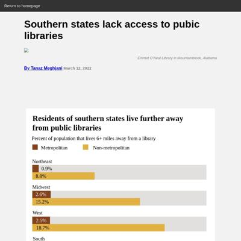](screenshots/tanazm.github.io/Libraries_index.html-medium-full.jpg)|[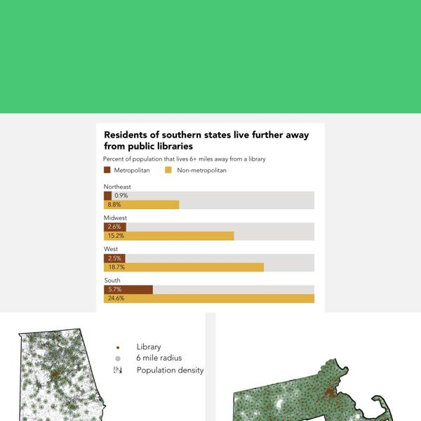](screenshots/tanazm.github.io/Libraries_index.html-wide-full.jpg)|
|[TXwind/index.html](https://tanazm.github.io/TXwind/)|[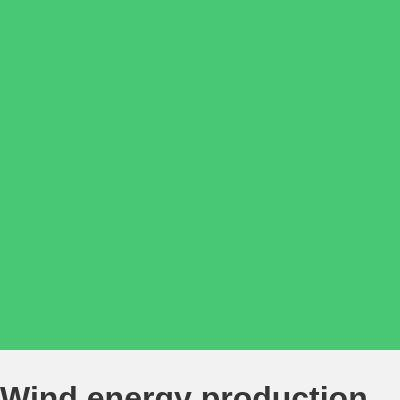](screenshots/tanazm.github.io/TXwind_index.html-mobile-full.jpg)|[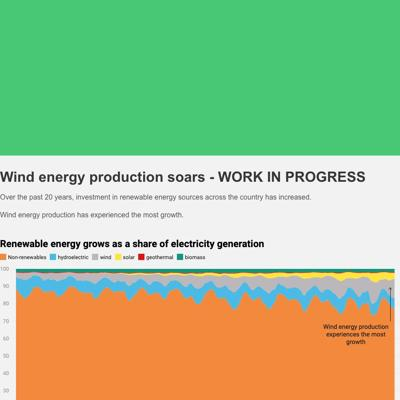](screenshots/tanazm.github.io/TXwind_index.html-medium-full.jpg)|[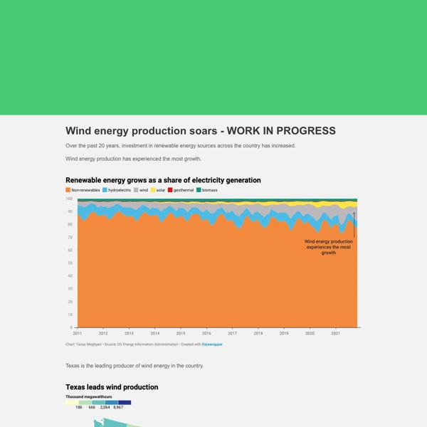](screenshots/tanazm.github.io/TXwind_index.html-wide-full.jpg)|

### Automatic Checks

**https://tanazm.github.io/** [Visit ↗](https://tanazm.github.io/)

* Minimum font size should be 12px, enlarge text in Illustrator
   * Text `TANAZ MEGHJANI
   

Data journalist at Columbia Journalism School.

Data collection: APIs, FOIA/FOIL, Beautiful Soup, Selenium.
Data analysis: Python, Pandas, SQL, HTML, Q Research Software, Excel.
Maps and visualizations: Matplotlib, Adobe Illustrator, Adobe InDesign, DataWrapper, MapBox, Tableau.

Stories.

South Asian Food Pantry Expands Amid Spike in Need

A longtime community staple in Flushing, Queens, the South Asian Council for Social Services food pantry balances a rise in need and the looming fear of COVID-19.

 February 17, 2022.

Blue-state judicial emergencies soar during Trump term

During Trump’s term, the number of judicial emergencies soared in blue states and decreased in red states. And the average number of days that an emergency sat vacant increased from 648 in 2016 to 923 in 2020.

 December 16, 2021.

Professional development for D.C. teachers in summer 2021

After a tumultuous year, student needs in the fall of 2021 will vary greatly, and to better serve all students, schools will need to increase their investment in professional development for teachers.

 June 24, 2021.

Challenges outside of school for D.C.’s students and families during the pandemic

The pandemic’s impact has been greater for students of color and students from low-income families compared to their peers–and these effects will likely reverberate in the years to come.

 March 9, 2021

Transition to college or career for the District’s high school students

Access to good jobs depends heavily on educational attainment - so what do we know about graduation rates, postsecondary enrollment, and postsecondary completion in D.C.? What do we need to find out?

 June 30, 2020

Student achievement is on the rise in D.C., but critical gaps persist

At-risk students make up 45 percent of the public school student population in the District, but only 21 percent are meeting or exceeding expectations in ELA and only 17 percent are doing the same in Math.

 March 5, 2020

Visualizations.

Disparities in accessing Atlanta's green spaces

Atlanta’s 190 regional parks, neighborhood parks, community parks, playlots, nature preserves, plazas, and trails are unevenly distributed across its twelve City Council Districts.

 February 6, 2022

Wind energy production soars

Over the past 20 years, investment in renewable energy sources across the country has increased. Wind energy production has experienced the most growth and Texas is leading the charge.

 February 21, 2022

Southern states lack access to libraries

Lorem ipsum dolor sit amet, consectetur adipiscing elit, sed do eiusmod tempor incididunt ut labore et dolore magna aliqua.

 March 12, 2022` is too small at 10px
   * Text `
    
    
    
    
    
    

    Tanaz Meghjani's Portfolio

    

    
    

    
    
        
    
    
    
    
    
    

    
    
    
        // When the window has finished loading create our google map below
        google.maps.event.addDomListener(window, 'load', init);
    
        function init() {
            // Basic options for a simple Google Map
            // For more options see: https://developers.google.com/maps/documentation/javascript/reference#MapOptions
            var mapOptions = {
                // How zoomed in you want the map to start at (always required)
                zoom: 11,
                
                scrollwheel: false,

                // The latitude and longitude to center the map (always required)
                center: new google.maps.LatLng(40.6700, -73.9400), // New York

                // How you would like to style the map. 
                // This is where you would paste any style found on Snazzy Maps.
                styles: [	{		featureType:'water',		stylers:[{color:'#74c9be'},{visibility:'on'}]	},{		featureType:'landscape',		stylers:[{color:'#f2f2f2'}]	},{		featureType:'road',		stylers:[{saturation:-100},{lightness:45}]	},{		featureType:'road.highway',		stylers:[{visibility:'simplified'}]	},{		featureType:'road.arterial',		elementType:'labels.icon',		stylers:[{visibility:'off'}]	},{		featureType:'administrative',		elementType:'labels.text.fill',		stylers:[{color:'#444444'}]	},{		featureType:'transit',		stylers:[{visibility:'off'}]	},{		featureType:'poi',		stylers:[{visibility:'off'}]	}]
            };

            // Get the HTML DOM element that will contain your map 
            // We are using a div with id="map" seen below in the <body>
            var mapElement = document.getElementById('map');

            // Create the Google Map using out element and options defined above
            var map = new google.maps.Map(mapElement, mapOptions);
        }
    
    
    
    
    
    
    

    
    
  ` is too small at 10px
   * Text `` is too small at 10px
   * Text `` is too small at 10px
   * Text `` is too small at 10px
   * Text `` is too small at 10px
   * Text `` is too small at 10px
   * Text `` is too small at 10px
   * Text `Tanaz Meghjani's Portfolio` is too small at 10px
   * Text `` is too small at 10px
   * Text `` is too small at 10px
   * Text `` is too small at 10px
   * Text `` is too small at 10px
   * Text `` is too small at 10px
   * Text `` is too small at 10px
   * Text `` is too small at 10px
   * Text `` is too small at 10px
   * Text `
        // When the window has finished loading create our google map below
        google.maps.event.addDomListener(window, 'load', init);
    
        function init() {
            // Basic options for a simple Google Map
            // For more options see: https://developers.google.com/maps/documentation/javascript/reference#MapOptions
            var mapOptions = {
                // How zoomed in you want the map to start at (always required)
                zoom: 11,
                
                scrollwheel: false,

                // The latitude and longitude to center the map (always required)
                center: new google.maps.LatLng(40.6700, -73.9400), // New York

                // How you would like to style the map. 
                // This is where you would paste any style found on Snazzy Maps.
                styles: [	{		featureType:'water',		stylers:[{color:'#74c9be'},{visibility:'on'}]	},{		featureType:'landscape',		stylers:[{color:'#f2f2f2'}]	},{		featureType:'road',		stylers:[{saturation:-100},{lightness:45}]	},{		featureType:'road.highway',		stylers:[{visibility:'simplified'}]	},{		featureType:'road.arterial',		elementType:'labels.icon',		stylers:[{visibility:'off'}]	},{		featureType:'administrative',		elementType:'labels.text.fill',		stylers:[{color:'#444444'}]	},{		featureType:'transit',		stylers:[{visibility:'off'}]	},{		featureType:'poi',		stylers:[{visibility:'off'}]	}]
            };

            // Get the HTML DOM element that will contain your map 
            // We are using a div with id="map" seen below in the <body>
            var mapElement = document.getElementById('map');

            // Create the Google Map using out element and options defined above
            var map = new google.maps.Map(mapElement, mapOptions);
        }
    ` is too small at 10px
   * Text `` is too small at 10px
   * Text `` is too small at 10px

**https://tanazm.github.io/ATLparks/** [Visit ↗](https://tanazm.github.io/ATLparks/)

* Missing viewport meta tag in `<head>`, needed to tell browser it's responsive. Add `<meta name="viewport" content="width=device-width, initial-scale=1, shrink-to-fit=no">`
* Has sideways scrollbars in mobile version – check padding, margins, image widths

**https://tanazm.github.io/Libraries/** [Visit ↗](https://tanazm.github.io/Libraries/)

* Missing viewport meta tag in `<head>`, needed to tell browser it's responsive. Add `<meta name="viewport" content="width=device-width, initial-scale=1, shrink-to-fit=no">`
* Overlapping elements in ai2html, check [the overflow video](https://www.youtube.com/watch?v=6vHsnjTp3_w) or make a smaller size
   * Text `Library` overlaps with `6 mile radius` at screen width 400
   * Text `6 mile radius` overlaps with `Population density` at screen width 400
   * Text `Library` overlaps with `6 mile radius` at screen width 900

**https://tanazm.github.io/TXwind/** [Visit ↗](https://tanazm.github.io/TXwind/)

* Missing viewport meta tag in `<head>`, needed to tell browser it's responsive. Add `<meta name="viewport" content="width=device-width, initial-scale=1, shrink-to-fit=no">`

## vincentvb.github.io

|url|mobile|medium|wide|
|---|---|---|---|
|[Vincent Van Buskirk](https://vincentvb.github.io/)||||
|[football_penalties/index.html](https://vincentvb.github.io/football_penalties/)||||
|[game_reviews/index.html](https://vincentvb.github.io/game_reviews)||||
|[santa_barbara_wine/index.html](https://vincentvb.github.io/santa_barbara_wine/)||||

### Automatic Checks

**https://vincentvb.github.io/** [Visit ↗](https://vincentvb.github.io/)

No issues found! 🎉

**https://vincentvb.github.io/football_penalties/** [Visit ↗](https://vincentvb.github.io/football_penalties/)

* Missing viewport meta tag in `<head>`, needed to tell browser it's responsive. Add `<meta name="viewport" content="width=device-width, initial-scale=1, shrink-to-fit=no">`

**https://vincentvb.github.io/game_reviews** [Visit ↗](https://vincentvb.github.io/game_reviews)

* Missing viewport meta tag in `<head>`, needed to tell browser it's responsive. Add `<meta name="viewport" content="width=device-width, initial-scale=1, shrink-to-fit=no">`

**https://vincentvb.github.io/santa_barbara_wine/** [Visit ↗](https://vincentvb.github.io/santa_barbara_wine/)

* Missing viewport meta tag in `<head>`, needed to tell browser it's responsive. Add `<meta name="viewport" content="width=device-width, initial-scale=1, shrink-to-fit=no">`

