# Data Studio 2022 Personal Projects Test Page

Quick checks to make sure your pages are looking their best.

* [angelinejcq.github.io](#angelinejcqgithubio)
* [annerquaye.github.io](#annerquayegithubio)
* [areenaarora.com](#areenaaroracom)
* [ilenapeng.github.io](#ilenapenggithubio)
* [jessieblaeser.github.io](#jessieblaesergithubio)
* [juisarwate.github.io](#juisarwategithubio)
* [juliaingram.github.io](#juliaingramgithubio)
* [kfalayi.github.io](#kfalayigithubio)
* [luizftoledo.github.io](#luizftoledogithubio)
* [mishavaid7.github.io](#mishavaid7githubio)
* [msc-joel.github.io](#msc-joelgithubio)
* [naokatoh.github.io](#naokatohgithubio)
* [pmagtulis.github.io](#pmagtulisgithubio)
* [pmartisa.github.io](#pmartisagithubio)
* [sarahgrevy.github.io](#sarahgrevygithubio)
* [semerriam.github.io](#semerriamgithubio)
* [sriharshadevulapalli.github.io](#sriharshadevulapalligithubio)
* [srjouppi.github.io](#srjouppigithubio)
* [stephenanti.github.io](#stephenantigithubio)
* [tanazm.github.io](#tanazmgithubio)
* [vincentvb.github.io](#vincentvbgithubio)

## angelinejcq.github.io

|url|mobile|medium|wide|
|---|---|---|---|
|[Chuqin Jiang's Incredible Portfolio](https://angelinejcq.github.io/) :x: og:title :x: og:description :x: og:image [how to fix](tips/SOCIAL.md)||||
|[Welcome to my bubble tea shop project](https://angelinejcq.github.io/bubble-tea-project/) :x: og:title :x: og:description :x: og:image [how to fix](tips/SOCIAL.md)||||
|[Welcome to my NEO project](https://angelinejcq.github.io/near-earth-objects-project/) :x: og:title :x: og:description :x: og:image [how to fix](tips/SOCIAL.md)||||
|[project-plane-crash/index.html](https://angelinejcq.github.io/project-plane-crash/) :x: og:title :x: og:description :x: og:image [how to fix](tips/SOCIAL.md)||||
|[Women trafficking in China](https://angelinejcq.github.io/woman-trafficking-project/) :x: og:title :x: og:description :x: og:image [how to fix](tips/SOCIAL.md)||||

### Automatic Checks

**https://angelinejcq.github.io/**

No issues found! 🎉

**https://angelinejcq.github.io/bubble-tea-project/**

No issues found! 🎉

**https://angelinejcq.github.io/near-earth-objects-project/**

* Missing viewport meta tag in `<head>`, needed to tell browser it's responsive. Add `<meta name="viewport" content="width=device-width, initial-scale=1, shrink-to-fit=no">`

**https://angelinejcq.github.io/project-plane-crash/**

* Needs a title, add a `<title>` tag to the `<head>`
* Has sideways scrollbars in mobile version – check padding, margins, image widths
* Minimum font size should be 12px, enlarge text in Illustrator
    * Text `Fatality` is too small at 8px
    * Text `1` is too small at 8px
    * Text `160` is too small at 8px
    * Text `On Nov. 21, 2004, a plane stalled and crashed into a lake less than one minute after taking off from Baotou Airport.` is too small at 10px
    * Text ` ` is too small at 10px
    * *and 7 more*

**https://angelinejcq.github.io/woman-trafficking-project/**

* Minimum font size should be 12px, enlarge text in Illustrator
    * Text `|` is too small at 8px
    * Text `|` is too small at 8px
* Overlapping elements in ai2html, check [the overflow video](https://www.youtube.com/watch?v=6vHsnjTp3_w) or make a smaller size
   * Text `Guizhou:` overlaps with `Yunnan:` at screen width 400
   * Text `115` overlaps with `Yunnan:` at screen width 400
   * Text `115` overlaps with `Guangxi:` at screen width 400
   * Text `Yunnan:` overlaps with `Guangxi:` at screen width 400
   * Text `176` overlaps with `Guangxi:` at screen width 400
   * Text `176` overlaps with `107` at screen width 400
   * Text `107` overlaps with `Fujian: 303` at screen width 400
   * *and 5 more*
* Missing font(s), you might need web fonts – [text explanation](https://gist.github.com/jsoma/631621e0807b26d49f5aef5260f79162), [video explanation](https://www.youtube.com/watch?v=HNhIeb_jEYM&list=PLewNEVDy7gq3MSrrO3eMEW8PhGMEVh2X2&index=3)
    * `"Open Sans"` font not found, used in 143 text objects. Example: _Hebei: 116, Shandong: 137, Henan: 298_

## annerquaye.github.io

|url|mobile|medium|wide|
|---|---|---|---|
|[Abbey Richard's Portfolio](https://annerquaye.github.io) :x: og:title :x: og:description [how to fix](tips/SOCIAL.md)||||
|[Abbey Richard's Portfolio](https://annerquaye.github.io/projects/oscars.html) :x: og:title :x: og:description [how to fix](tips/SOCIAL.md)||||
|[Abbey Richard's Portfolio](https://annerquaye.github.io/projects/responsive_pages/responsive.html) :x: og:title :x: og:description [how to fix](tips/SOCIAL.md)||[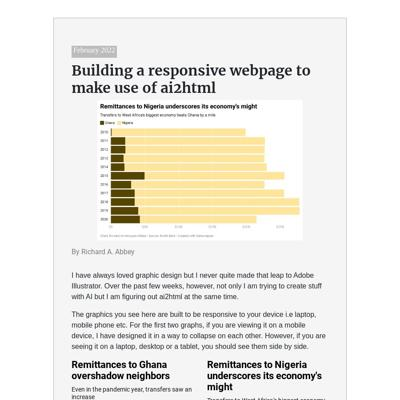](screenshots/annerquaye.github.io/projects_responsive_pages_responsive.html-medium-full.jpg)||
|[Abbey Richard's Portfolio](https://annerquaye.github.io/projects/ricestory.html) :x: og:title :x: og:description [how to fix](tips/SOCIAL.md)||||
|[Abbey Richard's Portfolio](https://annerquaye.github.io/projects/scrolly.html) :x: og:title :x: og:description [how to fix](tips/SOCIAL.md)||||

### Automatic Checks

**https://annerquaye.github.io**

No issues found! 🎉

**https://annerquaye.github.io/projects/oscars.html**

* Image(s) need `alt` tags, [info here](https://abilitynet.org.uk/news-blogs/five-golden-rules-compliant-alt-text) and [tips here](https://twitter.com/FrankElavsky/status/1469023374529765385)
    * Image `oscars/oscars.jpeg` missing `alt` tag
* Move `projects/oscars.html` into a folder called `oscars`, then rename the file `index.html`. That way the project can be found at **/oscars** instead of **/oscars.html**. [Read more about index.html here](https://www.thoughtco.com/index-html-page-3466505)
* Has sideways scrollbars in mobile version – check padding, margins, image widths

**https://annerquaye.github.io/projects/responsive_pages/responsive.html**

* Image(s) need `alt` tags, [info here](https://abilitynet.org.uk/news-blogs/five-golden-rules-compliant-alt-text) and [tips here](https://twitter.com/FrankElavsky/status/1469023374529765385)
    * Image `../../img/remittance.png` missing `alt` tag
* Move `projects/responsive_pages/responsive.html` into a folder called `responsive`, then rename the file `index.html`. That way the project can be found at **/responsive** instead of **/responsive.html**. [Read more about index.html here](https://www.thoughtco.com/index-html-page-3466505)
* Change URL to use `-` instead of spaces or underscores
* Minimum font size should be 12px, enlarge text in Illustrator
    * Text `The pandemic also shot inflation to a 3-year high` is too small at 9px
    * Text `Inflation` is too small at 8px
    * Text `Gdp Growth` is too small at 8px
    * Text `17.5 %` is too small at 7px
    * Text `The pandemic saw the economy hit rock bottom` is too small at 7px
    * Text `15.0` is too small at 7px
    * Text `12.5` is too small at 7px
    * *and 25 more*
* Overlapping elements in ai2html, check [the overflow video](https://www.youtube.com/watch?v=6vHsnjTp3_w) or make a smaller size
   * Text `Inflation` overlaps with `Gdp Growth` at screen width 400

**https://annerquaye.github.io/projects/ricestory.html**

* Image(s) need `alt` tags, [info here](https://abilitynet.org.uk/news-blogs/five-golden-rules-compliant-alt-text) and [tips here](https://twitter.com/FrankElavsky/status/1469023374529765385)
    * Image `rice_project/volta.png` missing `alt` tag
* Move `projects/ricestory.html` into a folder called `ricestory`, then rename the file `index.html`. That way the project can be found at **/ricestory** instead of **/ricestory.html**. [Read more about index.html here](https://www.thoughtco.com/index-html-page-3466505)
* Has sideways scrollbars in mobile version – check padding, margins, image widths

**https://annerquaye.github.io/projects/scrolly.html**

* Image(s) need `alt` tags, [info here](https://abilitynet.org.uk/news-blogs/five-golden-rules-compliant-alt-text) and [tips here](https://twitter.com/FrankElavsky/status/1469023374529765385)
    * Image `../img/cover-01.jpg` missing `alt` tag
* Move `projects/scrolly.html` into a folder called `scrolly`, then rename the file `index.html`. That way the project can be found at **/scrolly** instead of **/scrolly.html**. [Read more about index.html here](https://www.thoughtco.com/index-html-page-3466505)

## areenaarora.com

|url|mobile|medium|wide|
|---|---|---|---|
|[Areena Arora](https://areenaarora.com/) :x: og:image [how to fix](tips/SOCIAL.md)||||
|[Uttarakhand-floods](https://areenaarora.com/stories/uttarakhand-floods/) :x: og:title [how to fix](tips/SOCIAL.md)||||
|[Inside r/place](https://areenaarora.com/stories/r-place/) :x: og:title [how to fix](tips/SOCIAL.md)||||
|[Style-Guides](https://areenaarora.com/stories/style-guides/) :x: og:title :x: og:description :x: og:image [how to fix](tips/SOCIAL.md)||||
|[Best Biryani](https://areenaarora.com/stories/biryani/) :x: og:title :x: og:description :x: og:image [how to fix](tips/SOCIAL.md)||[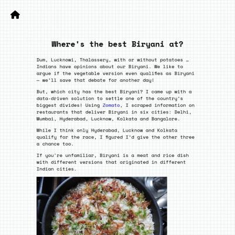](screenshots/areenaarora.com/stories_biryani_index.html-medium-full.jpg)|[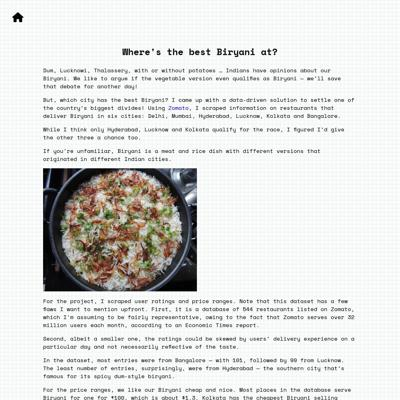](screenshots/areenaarora.com/stories_biryani_index.html-wide-full.jpg)|
|[New York State spills](https://areenaarora.com/stories/ny-state-spills/) :x: og:title :x: og:description :x: og:image [how to fix](tips/SOCIAL.md)|||[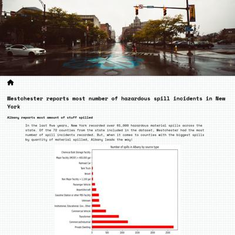](screenshots/areenaarora.com/stories_ny-state-spills_index.html-wide-full.jpg)|
|[COVID-vaccines](https://areenaarora.com/stories/vaccines/) :x: og:title :x: og:description :x: og:image [how to fix](tips/SOCIAL.md)|[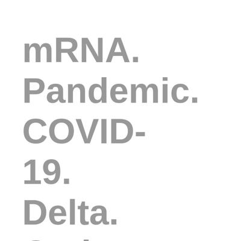](screenshots/areenaarora.com/stories_vaccines_index.html-mobile-full.jpg)||[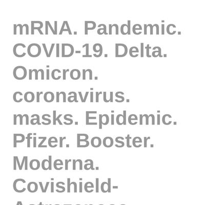](screenshots/areenaarora.com/stories_vaccines_index.html-wide-full.jpg)|

### Automatic Checks

**https://areenaarora.com/**

No issues found! 🎉

**https://areenaarora.com/stories/uttarakhand-floods/**

* Image(s) need `alt` tags, [info here](https://abilitynet.org.uk/news-blogs/five-golden-rules-compliant-alt-text) and [tips here](https://twitter.com/FrankElavsky/status/1469023374529765385)
    * Image `kedarnath-temple.jpg` missing `alt` tag
    * Image `uttarakhand.jpg` missing `alt` tag
* Has sideways scrollbars in mobile version – check padding, margins, image widths

**https://areenaarora.com/stories/r-place/**

* Image(s) need `alt` tags, [info here](https://abilitynet.org.uk/news-blogs/five-golden-rules-compliant-alt-text) and [tips here](https://twitter.com/FrankElavsky/status/1469023374529765385)
    * Image `final-rplace.png` missing `alt` tag
    * Image `final.png` missing `alt` tag
* Has sideways scrollbars in mobile version – check padding, margins, image widths

**https://areenaarora.com/stories/style-guides/**

No issues found! 🎉

**https://areenaarora.com/stories/biryani/**

* Image(s) need `alt` tags, [info here](https://abilitynet.org.uk/news-blogs/five-golden-rules-compliant-alt-text) and [tips here](https://twitter.com/FrankElavsky/status/1469023374529765385)
    * Image `biryani-new.jpg` missing `alt` tag
* Has sideways scrollbars in mobile version – check padding, margins, image widths

**https://areenaarora.com/stories/ny-state-spills/**

* Image(s) need `alt` tags, [info here](https://abilitynet.org.uk/news-blogs/five-golden-rules-compliant-alt-text) and [tips here](https://twitter.com/FrankElavsky/status/1469023374529765385)
    * Image `food-spill.png` missing `alt` tag
    * Image `queens-spills.png` missing `alt` tag
* Has sideways scrollbars in mobile version – check padding, margins, image widths

**https://areenaarora.com/stories/vaccines/**

* Has sideways scrollbars in mobile version – check padding, margins, image widths
* Minimum font size should be 12px, enlarge text in Illustrator
    * Text `Pfizer` is too small at 10px
    * Text `0` is too small at 10px
    * Text `Source: CDC` is too small at 10px

## ilenapeng.github.io

|url|mobile|medium|wide|
|---|---|---|---|
|[Ilena Peng](https://ilenapeng.github.io/) :x: og:title :x: og:description :x: og:image [how to fix](tips/SOCIAL.md)|[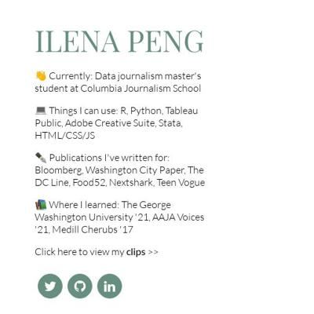](screenshots/ilenapeng.github.io/index.html-mobile-full.jpg)||[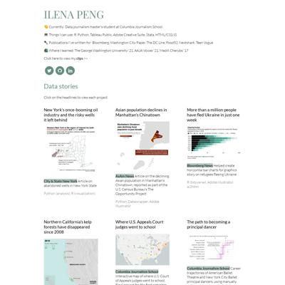](screenshots/ilenapeng.github.io/index.html-wide-full.jpg)|
|[New Yorkers in Languages](https://ilenapeng.github.io/nyc-languages) :x: og:title :x: og:description :x: og:image [how to fix](tips/SOCIAL.md)||||
|[NYC's "Open" Streets](https://ilenapeng.github.io/nyc-open-streets/) :x: og:title :x: og:description :x: og:image [how to fix](tips/SOCIAL.md)||||
|[The Path to Principal](https://ilenapeng.github.io/path-to-principal/) :x: og:title :x: og:description :x: og:image [how to fix](tips/SOCIAL.md)||||
|[The Bay's Rainy December](https://ilenapeng.github.io/stevens-creek/) :x: og:title :x: og:description :x: og:image [how to fix](tips/SOCIAL.md)||||

### Automatic Checks

**https://ilenapeng.github.io/**

* Image(s) need `alt` tags, [info here](https://abilitynet.org.uk/news-blogs/five-golden-rules-compliant-alt-text) and [tips here](https://twitter.com/FrankElavsky/status/1469023374529765385)
    * Image `https://github.com/ilenapeng/chinatown/blob/main/graphics/pctchange-map.png?raw=true` missing `alt` tag
    * Image `images/bbg-ukraine-aslyum.png` missing `alt` tag
    * Image `images/wells-map.png` missing `alt` tag
    * Image `images/judges-education-map.png` missing `alt` tag
    * Image `https://raw.githubusercontent.com/ilenapeng/path-to-principal/main/nycb-plot.png` missing `alt` tag
    * Image `https://ilenapeng.github.io/nyc-open-streets/map-medium.jpg` missing `alt` tag
    * Image `images/FallClasses.png` missing `alt` tag
    * Image `images/yagp.png` missing `alt` tag
    * Image `images/chopin.png` missing `alt` tag
    * Image `https://github.com/ilenapeng/dvs-2021/blob/main/dvs-2021-static.png?raw=true` missing `alt` tag
    * Image `https://www.gwhatchet.com/wp-content/uploads/2020/09/BLM-rallies.png` missing `alt` tag
    * Image `https://github.com/ilenapeng/tidytuesday/raw/main/2022/week02_bees/w02_bees.png` missing `alt` tag
    * Image `https://github.com/ilenapeng/tidytuesday/raw/main/2021/week20_broadband/w20_broadband_2.png` missing `alt` tag
    * Image `https://github.com/ilenapeng/tidytuesday/blob/main/2021/week30_droughts/w30_droughts.png?raw=true` missing `alt` tag
    * Image `https://github.com/ilenapeng/tidytuesday/raw/main/2021/week02_transitcosts/w02_transitcosts.png` missing `alt` tag

**https://ilenapeng.github.io/nyc-languages**

* Overlapping elements in ai2html, check [the overflow video](https://www.youtube.com/watch?v=6vHsnjTp3_w) or make a smaller size
   * Text `Spanish -35.2K` overlaps with `Italian` at screen width 400
   * Text `Italian` overlaps with `Russian` at screen width 400
   * Text `Polish` overlaps with `Other Indic` at screen width 400
   * Text `Chinese 47.9K` overlaps with `Urdu` at screen width 400
   * Text `Urdu` overlaps with `Other Asian` at screen width 400
   * Text `Other Asian` overlaps with `Other African` at screen width 400
   * Text `Other African` overlaps with `Arabic` at screen width 400

**https://ilenapeng.github.io/nyc-open-streets/**

* Minimum font size should be 12px, enlarge text in Illustrator
    * Text `Source: October 2021 Transportation Alternatives report` is too small at 10px

**https://ilenapeng.github.io/path-to-principal/**

No issues found! 🎉

**https://ilenapeng.github.io/stevens-creek/**

No issues found! 🎉

## jessieblaeser.github.io

|url|mobile|medium|wide|
|---|---|---|---|
|[Jessie Blaeser's Portfolio](https://jessieblaeser.github.io/) :x: og:title :x: og:description :x: og:image [how to fix](tips/SOCIAL.md)||||
|[Dams in Georgia](https://jessieblaeser.github.io/pj_georgia_dams.html) :x: og:title :x: og:description :x: og:image [how to fix](tips/SOCIAL.md)||||
|[Most Expensive Pipeline Incidents](https://jessieblaeser.github.io/pj_pipelines.html) :x: og:title :x: og:description :x: og:image [how to fix](tips/SOCIAL.md)||[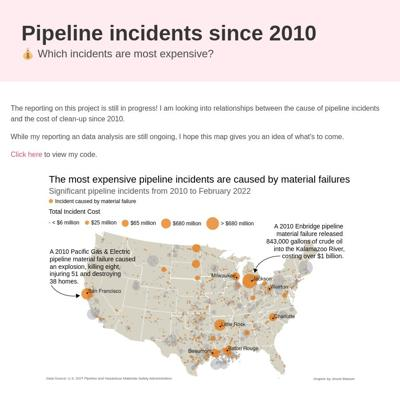](screenshots/jessieblaeser.github.io/pj_pipelines.html-medium-full.jpg)||
|[Ticket to Ride Analysis](https://jessieblaeser.github.io/pj_ticket_to_ride.html) :x: og:title :x: og:description :x: og:image [how to fix](tips/SOCIAL.md)||||
|[Trae Young Hawks Analysis](https://jessieblaeser.github.io/pj_trae_young.html) :x: og:title :x: og:description :x: og:image [how to fix](tips/SOCIAL.md)||||

### Automatic Checks

**https://jessieblaeser.github.io/**

No issues found! 🎉

**https://jessieblaeser.github.io/pj_georgia_dams.html**

* Move `pj_georgia_dams.html` into a folder called `pj_georgia_dams`, then rename the file `index.html`. That way the project can be found at **/pj_georgia_dams** instead of **/pj_georgia_dams.html**. [Read more about index.html here](https://www.thoughtco.com/index-html-page-3466505)
* Change URL to use `-` instead of spaces or underscores

**https://jessieblaeser.github.io/pj_pipelines.html**

* Move `pj_pipelines.html` into a folder called `pj_pipelines`, then rename the file `index.html`. That way the project can be found at **/pj_pipelines** instead of **/pj_pipelines.html**. [Read more about index.html here](https://www.thoughtco.com/index-html-page-3466505)
* Change URL to use `-` instead of spaces or underscores
* Has sideways scrollbars in mobile version – check padding, margins, image widths
* Minimum font size should be 12px, enlarge text in Illustrator
    * Text `Data Source: U.S. DOT Pipeline and Hazardous Materials Safety Administration` is too small at 8px
    * Text `Graphic by Jessie Blaeser` is too small at 8px
    * Text `Data Source: U.S. DOT Pipeline and Hazardous Materials Safety
                                    Administration` is too small at 8px
    * Text `Graphic by Jessie Blaeser` is too small at 8px

**https://jessieblaeser.github.io/pj_ticket_to_ride.html**

* Move `pj_ticket_to_ride.html` into a folder called `pj_ticket_to_ride`, then rename the file `index.html`. That way the project can be found at **/pj_ticket_to_ride** instead of **/pj_ticket_to_ride.html**. [Read more about index.html here](https://www.thoughtco.com/index-html-page-3466505)
* Change URL to use `-` instead of spaces or underscores

**https://jessieblaeser.github.io/pj_trae_young.html**

* Move `pj_trae_young.html` into a folder called `pj_trae_young`, then rename the file `index.html`. That way the project can be found at **/pj_trae_young** instead of **/pj_trae_young.html**. [Read more about index.html here](https://www.thoughtco.com/index-html-page-3466505)
* Change URL to use `-` instead of spaces or underscores

## juisarwate.github.io

|url|mobile|medium|wide|
|---|---|---|---|
|[Jui Sarwate Personal Website](https://juisarwate.github.io/) :x: og:title :x: og:description :x: og:image [how to fix](tips/SOCIAL.md)||||
|[Recycling Distribution NYC](https://juisarwate.github.io/nyc-recycling-distribution/) :x: og:title :x: og:description :x: og:image [how to fix](tips/SOCIAL.md)||||
|[UCLA Campus Study Spots](https://juisarwate.github.io/project_5_scrollytelling/) :x: og:title :x: og:description :x: og:image [how to fix](tips/SOCIAL.md)||||
|[Homeless 311 Complaints 2020](https://juisarwate.github.io/project-3/) :x: og:title :x: og:description :x: og:image [how to fix](tips/SOCIAL.md)||||
|[Yosemite National Park Visitation](https://juisarwate.github.io/Sarwate_Project1/) :x: og:title :x: og:description :x: og:image [how to fix](tips/SOCIAL.md)||||

### Automatic Checks

**https://juisarwate.github.io/**

No issues found! 🎉

**https://juisarwate.github.io/nyc-recycling-distribution/**

* Image(s) need `alt` tags, [info here](https://abilitynet.org.uk/news-blogs/five-golden-rules-compliant-alt-text) and [tips here](https://twitter.com/FrankElavsky/status/1469023374529765385)
    * Image `pexels-photo-802221.jpeg` missing `alt` tag
* Missing viewport meta tag in `<head>`, needed to tell browser it's responsive. Add `<meta name="viewport" content="width=device-width, initial-scale=1, shrink-to-fit=no">`
* Has sideways scrollbars in mobile version – check padding, margins, image widths

**https://juisarwate.github.io/project_5_scrollytelling/**

* Change URL to use `-` instead of spaces or underscores
* Missing viewport meta tag in `<head>`, needed to tell browser it's responsive. Add `<meta name="viewport" content="width=device-width, initial-scale=1, shrink-to-fit=no">`

**https://juisarwate.github.io/project-3/**

* Missing viewport meta tag in `<head>`, needed to tell browser it's responsive. Add `<meta name="viewport" content="width=device-width, initial-scale=1, shrink-to-fit=no">`

**https://juisarwate.github.io/Sarwate_Project1/**

* Image(s) need `alt` tags, [info here](https://abilitynet.org.uk/news-blogs/five-golden-rules-compliant-alt-text) and [tips here](https://twitter.com/FrankElavsky/status/1469023374529765385)
    * Image `yosemite-national-park-landscape-california-144251.jpeg` missing `alt` tag
* Change URL to use `-` instead of spaces or underscores
* Change URL to be all in lowercase
* Missing viewport meta tag in `<head>`, needed to tell browser it's responsive. Add `<meta name="viewport" content="width=device-width, initial-scale=1, shrink-to-fit=no">`
* Has sideways scrollbars in mobile version – check padding, margins, image widths

## juliaingram.github.io

|url|mobile|medium|wide|
|---|---|---|---|
|[Julia Ingram's portfolio](https://juliaingram.github.io) :x: og:title :x: og:description :x: og:image [how to fix](tips/SOCIAL.md)|[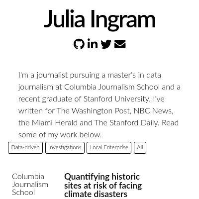](screenshots/juliaingram.github.io/index.html-mobile-full.jpg)|[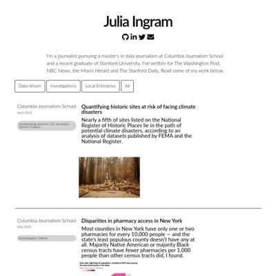](screenshots/juliaingram.github.io/index.html-medium-full.jpg)||
|[ca-utility-fires/index.html](https://juliaingram.github.io/ca-utility-fires/) :x: og:title :x: og:description :x: og:image [how to fix](tips/SOCIAL.md)|||[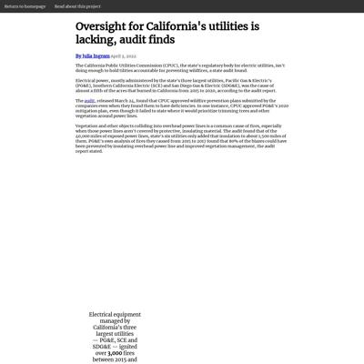](screenshots/juliaingram.github.io/ca-utility-fires_index.html-wide-full.jpg)|
|[Citi Bike](https://juliaingram.github.io/citibike/) :x: og:title :x: og:description :x: og:image [how to fix](tips/SOCIAL.md)|[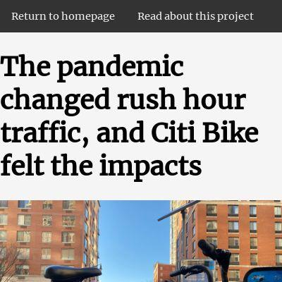](screenshots/juliaingram.github.io/citibike_index.html-mobile-full.jpg)|||
|[Daylight Saving](https://juliaingram.github.io/daylight-saving/) :x: og:title :x: og:description :x: og:image [how to fix](tips/SOCIAL.md)|[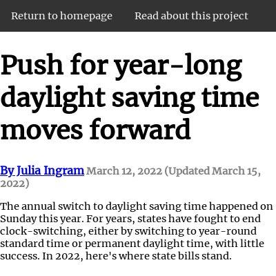](screenshots/juliaingram.github.io/daylight-saving_index.html-mobile-full.jpg)||[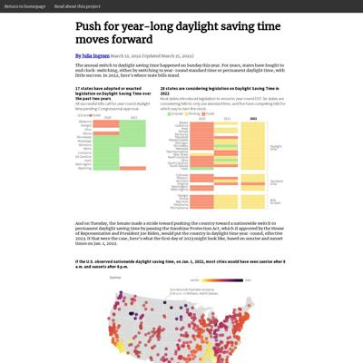](screenshots/juliaingram.github.io/daylight-saving_index.html-wide-full.jpg)|
|[Therapy Apps](https://juliaingram.github.io/therapy-apps/) :x: og:title :x: og:description :x: og:image [how to fix](tips/SOCIAL.md)||||

### Automatic Checks

**https://juliaingram.github.io**

No issues found! 🎉

**https://juliaingram.github.io/ca-utility-fires/**

* Needs a title, add a `<title>` tag to the `<head>`

**https://juliaingram.github.io/citibike/**

* Image(s) need `alt` tags, [info here](https://abilitynet.org.uk/news-blogs/five-golden-rules-compliant-alt-text) and [tips here](https://twitter.com/FrankElavsky/status/1469023374529765385)
    * Image `citibike-thames.png` missing `alt` tag
* Missing viewport meta tag in `<head>`, needed to tell browser it's responsive. Add `<meta name="viewport" content="width=device-width, initial-scale=1, shrink-to-fit=no">`
* Has sideways scrollbars in mobile version – check padding, margins, image widths

**https://juliaingram.github.io/daylight-saving/**

* Minimum font size should be 12px, enlarge text in Illustrator
    * Text `All successful bills call for a year-round daylight time pending Congressional approval.` is too small at 10px
    * Text `Enacted` is too small at 9px
    * Text `Failed` is too small at 9px
    * Text `2021` is too small at 9px
    * Text `2020` is too small at 9px
    * Text `Alabama` is too small at 9px
    * Text `Georgia` is too small at 9px
    * *and 68 more*
* Overlapping elements in ai2html, check [the overflow video](https://www.youtube.com/watch?v=6vHsnjTp3_w) or make a smaller size
   * Text `Enacted` overlaps with `Failed` at screen width 400
   * Text `Enacted` overlaps with `Pending` at screen width 400
   * Text `Pending` overlaps with `Failed` at screen width 400
   * Text `If the U.S. observed nationwide daylight saving time, on Jan. 1, 2022 this is when` overlaps with `cities would have seen the sun rise and set` at screen width 400
   * Text `17 states have adopted or enacted legislation on Daylight Saving` overlaps with `28 states are considering legislation on Daylight Saving Time in 2022` at screen width 900
   * Text `17 states have adopted or enacted legislation on Daylight Saving` overlaps with `Most states have introduced legislation to move to year-round DST. Six states introduced bills to only use` at screen width 900
   * Text `Time over the past two years` overlaps with `standard time, and five states have competing bills for which way to end clock-switching.` at screen width 900
   * *and 9 more*

**https://juliaingram.github.io/therapy-apps/**

* Image(s) need `alt` tags, [info here](https://abilitynet.org.uk/news-blogs/five-golden-rules-compliant-alt-text) and [tips here](https://twitter.com/FrankElavsky/status/1469023374529765385)
    * Image `talkspace-phone.png` missing `alt` tag
* Missing viewport meta tag in `<head>`, needed to tell browser it's responsive. Add `<meta name="viewport" content="width=device-width, initial-scale=1, shrink-to-fit=no">`

## kfalayi.github.io

|url|mobile|medium|wide|
|---|---|---|---|
|[Kunle Falayi's Portfolio](https://kfalayi.github.io/) :x: og:title :x: og:description :x: og:image [how to fix](tips/SOCIAL.md)|||[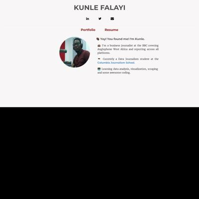](screenshots/kfalayi.github.io/index.html-wide-full.jpg)|
|[Kunle Falayi's Portfolio](https://kfalayi.github.io/agritech-investment/) :x: og:title :x: og:description :x: og:image [how to fix](tips/SOCIAL.md)||[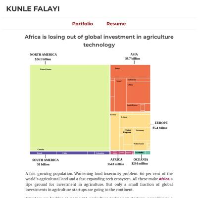](screenshots/kfalayi.github.io/agritech-investment_index.html-medium-full.jpg)||
|[Kunle Falayi's Portfolio](https://kfalayi.github.io/bloomberg/) :x: og:title :x: og:description :x: og:image [how to fix](tips/SOCIAL.md)|[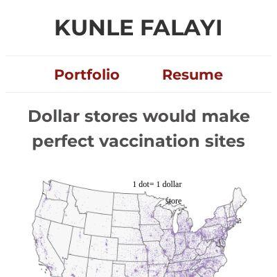](screenshots/kfalayi.github.io/bloomberg_index.html-mobile-full.jpg)|||
|[Kunle Falayi's Portfolio](https://kfalayi.github.io/Food_price_Nigeria/) :x: og:title :x: og:description :x: og:image [how to fix](tips/SOCIAL.md)||[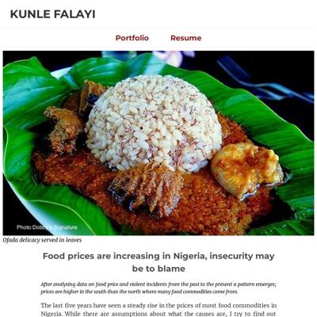](screenshots/kfalayi.github.io/Food_price_Nigeria_index.html-medium-full.jpg)|[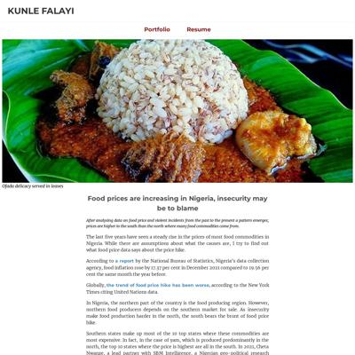](screenshots/kfalayi.github.io/Food_price_Nigeria_index.html-wide-full.jpg)|
|[Kunle Falayi's Portfolio](https://kfalayi.github.io/hispanics in america/) :x: og:title :x: og:description :x: og:image [how to fix](tips/SOCIAL.md)||||
|[Kunle Falayi's Portfolio](https://kfalayi.github.io/irpin/) :x: og:title :x: og:description :x: og:image [how to fix](tips/SOCIAL.md)||||

### Automatic Checks

**https://kfalayi.github.io/**

* Image(s) need `alt` tags, [info here](https://abilitynet.org.uk/news-blogs/five-golden-rules-compliant-alt-text) and [tips here](https://twitter.com/FrankElavsky/status/1469023374529765385)
    * Image `/images/kay.jpeg` missing `alt` tag

**https://kfalayi.github.io/agritech-investment/**

* Minimum font size should be 12px, enlarge text in Illustrator
    * Text `South ` is too small at 10px
    * Text `Africa` is too small at 10px
    * Text `Kenya` is too small at 10px
    * Text `Nigeria` is too small at 10px
    * Text `India` is too small at 9px
    * Text `United States` is too small at 9px
    * Text `Indonesia` is too small at 9px
    * *and 21 more*
* Overlapping elements in ai2html, check [the overflow video](https://www.youtube.com/watch?v=6vHsnjTp3_w) or make a smaller size
   * Text `ASIA` overlaps with `$6.7 billion` at screen width 400
   * Text `Indonesia` overlaps with `Israel` at screen width 400
   * Text `$5.4 billion` overlaps with `Germany` at screen width 400
   * Text `United` overlaps with `United` at screen width 400
   * Text `United` overlaps with `Germany` at screen width 400
   * Text `United` overlaps with `Germany` at screen width 400
   * Text `Kingdom` overlaps with `Kingdom` at screen width 400
   * *and 33 more*
* Missing font(s), you might need web fonts – [text explanation](https://gist.github.com/jsoma/631621e0807b26d49f5aef5260f79162), [video explanation](https://www.youtube.com/watch?v=HNhIeb_jEYM&list=PLewNEVDy7gq3MSrrO3eMEW8PhGMEVh2X2&index=3)
    * `Georgia` font not found, used in 192 text objects. Example: _ASIA, NORTH AMERICA, $6.7 billion_

**https://kfalayi.github.io/bloomberg/**

* Has sideways scrollbars in mobile version – check padding, margins, image widths
* Minimum font size should be 12px, enlarge text in Illustrator
    * Text `1 dot = 1 dollar store` is too small at 10px
    * Text `blue dots = dollar stores` is too small at 10px
    * Text `red dots = vaccination sites` is too small at 10px
    * Text `1 dot = 1 dollar store` is too small at 9px
    * Text `blue dots = dollar stores` is too small at 9px
    * Text `red dots = vaccination sites` is too small at 9px
    * Text `Map with QGIS and Illustrator | Inspired by Bloomberg’s story.` is too small at 10px
    * *and 11 more*

**https://kfalayi.github.io/Food_price_Nigeria/**

* Change URL to use `-` instead of spaces or underscores
* Change URL to be all in lowercase
* Has sideways scrollbars in mobile version – check padding, margins, image widths

**https://kfalayi.github.io/hispanics in america/**

* Change URL to use `-` instead of spaces or underscores

**https://kfalayi.github.io/irpin/**

* Minimum font size should be 12px, enlarge text in Illustrator
    * Text `Irpin` is too small at 10px
    * Text `Kyiv` is too small at 9px
    * Text `100 ft` is too small at 10px
    * Text `Irpin River` is too small at 9px
    * Text `Evacuees huddled under ` is too small at 9px
    * Text `destroyed bridge, one of ` is too small at 9px
    * Text `the main escape routes out of Irpin` is too small at 9px
    * *and 24 more*
* Overlapping elements in ai2html, check [the overflow video](https://www.youtube.com/watch?v=6vHsnjTp3_w) or make a smaller size
   * Text `Irpin River` overlaps with `Evacuees huddled under` at screen width 400
   * Text `IRPIN` overlaps with `Irpin River` at screen width 400
   * Text `Irpin River` overlaps with `Evacuees huddled under` at screen width 900
   * Text `Irpin River` overlaps with `Evacuees huddled under` at screen width 1300

## luizftoledo.github.io

|url|mobile|medium|wide|
|---|---|---|---|
|[luizftoledo's journalism portfolio](https://luizftoledo.github.io/) :x: og:title :x: og:description :x: og:image [how to fix](tips/SOCIAL.md)||||
|[Brazilian people are paying for dozens of meals in the same day](https://luizftoledo.github.io/congress-expenses-with-food/) :x: og:title :x: og:description :x: og:image [how to fix](tips/SOCIAL.md)||||
|[Under Bolsonaro, Brazil has sanctioned less companies for environmental crimes](https://luizftoledo.github.io/ibama_sanctions/) :x: og:title :x: og:description :x: og:image [how to fix](tips/SOCIAL.md)||||
|[How happy can Iron Maiden songs be?](https://luizftoledo.github.io/iron-maiden-happiness/) :x: og:title :x: og:description :x: og:image [how to fix](tips/SOCIAL.md)||||
|[US exports more pistols than ever to Brazil: legally and ilegally](https://luizftoledo.github.io/weapons-seized/) :x: og:title :x: og:description :x: og:image [how to fix](tips/SOCIAL.md)||||

### Automatic Checks

**https://luizftoledo.github.io/**

* Image(s) need `alt` tags, [info here](https://abilitynet.org.uk/news-blogs/five-golden-rules-compliant-alt-text) and [tips here](https://twitter.com/FrankElavsky/status/1469023374529765385)
    * Image `clo.jpeg` missing `alt` tag
    * Image `lux.jpg` missing `alt` tag
    * Image `tob.jpeg` missing `alt` tag
    * Image `voo.jpeg` missing `alt` tag
    * Image `dis.jpg` missing `alt` tag
    * Image `enem.png` missing `alt` tag
    * Image `haddad.jpeg` missing `alt` tag
    * Image `unesp.jpeg` missing `alt` tag
    * Image `enemrac.jpeg` missing `alt` tag
    * Image `cloro.jpeg` missing `alt` tag
    * Image `bolsodad.jpeg` missing `alt` tag
    * Image `scrap.jpeg` missing `alt` tag
    * Image `eddie.jpeg` missing `alt` tag

**https://luizftoledo.github.io/congress-expenses-with-food/**

No issues found! 🎉

**https://luizftoledo.github.io/ibama_sanctions/**

* Change URL to use `-` instead of spaces or underscores
* Has sideways scrollbars in mobile version – check padding, margins, image widths
* Minimum font size should be 12px, enlarge text in Illustrator
    * Text `18k` is too small at 7px
    * Text `17k` is too small at 7px
    * Text `16k` is too small at 7px
    * Text `15k` is too small at 7px
    * Text `14k` is too small at 7px
    * Text `13k` is too small at 7px
    * Text `12k` is too small at 7px
    * *and 37 more*

**https://luizftoledo.github.io/iron-maiden-happiness/**

* Has sideways scrollbars in mobile version – check padding, margins, image widths

**https://luizftoledo.github.io/weapons-seized/**

* Has sideways scrollbars in mobile version – check padding, margins, image widths
* Minimum font size should be 12px, enlarge text in Illustrator
    * Text `20 K` is too small at 6px
    * Text `15 K` is too small at 6px
    * Text `10.7 K` is too small at 5px
    * Text `Gun ownership ` is too small at 5px
    * Text `rules change` is too small at 5px
    * Text `10 K` is too small at 6px
    * Text `4.5 K` is too small at 6px
    * *and 94 more*
* Overlapping elements in ai2html, check [the overflow video](https://www.youtube.com/watch?v=6vHsnjTp3_w) or make a smaller size
   * Text `2019` overlaps with `2018` at screen width 400
   * Text `2019` overlaps with `2018` at screen width 900
   * Text `2019` overlaps with `2018` at screen width 1300

## mishavaid7.github.io

|url|mobile|medium|wide|
|---|---|---|---|
|[Misha Vaid](https://mishavaid7.github.io/) :x: og:title :x: og:description :x: og:image [how to fix](tips/SOCIAL.md)||||
|[Airbnb Story](https://mishavaid7.github.io/Airbnb-Story/) :x: og:title :x: og:description :x: og:image [how to fix](tips/SOCIAL.md)||||
|[NYC Restaurant Grade Story](https://mishavaid7.github.io/NYCRestaurants-Story/) :x: og:title :x: og:description :x: og:image [how to fix](tips/SOCIAL.md)||||
|[Airbnb Story](https://mishavaid7.github.io/Project-4/) :x: og:title :x: og:description :x: og:image [how to fix](tips/SOCIAL.md)||||
|[Wordle Cheaters](https://mishavaid7.github.io/Wordle-Webpage/) :x: og:title :x: og:description :x: og:image [how to fix](tips/SOCIAL.md)||||

### Automatic Checks

**https://mishavaid7.github.io/**

No issues found! 🎉

**https://mishavaid7.github.io/Airbnb-Story/**

* Change URL to be all in lowercase
* Missing viewport meta tag in `<head>`, needed to tell browser it's responsive. Add `<meta name="viewport" content="width=device-width, initial-scale=1, shrink-to-fit=no">`

**https://mishavaid7.github.io/NYCRestaurants-Story/**

* Image(s) need `alt` tags, [info here](https://abilitynet.org.uk/news-blogs/five-golden-rules-compliant-alt-text) and [tips here](https://twitter.com/FrankElavsky/status/1469023374529765385)
    * Image `shot.png` missing `alt` tag
* Change URL to be all in lowercase
* Missing viewport meta tag in `<head>`, needed to tell browser it's responsive. Add `<meta name="viewport" content="width=device-width, initial-scale=1, shrink-to-fit=no">`
* Has sideways scrollbars in mobile version – check padding, margins, image widths

**https://mishavaid7.github.io/Project-4/**

* Change URL to be all in lowercase
* Missing viewport meta tag in `<head>`, needed to tell browser it's responsive. Add `<meta name="viewport" content="width=device-width, initial-scale=1, shrink-to-fit=no">`
* Has sideways scrollbars in mobile version – check padding, margins, image widths
* Minimum font size should be 12px, enlarge text in Illustrator
    * Text `Entire home/apt` is too small at 8px
    * Text `Private Room` is too small at 8px
    * Text `Shared room` is too small at 8px
    * Text `Hotel room` is too small at 8px
    * Text `14.2%` is too small at 10px
    * Text `Entire home/apt` is too small at 8px
    * Text `25.2` is too small at 10px
    * *and 13 more*
* Overlapping elements in ai2html, check [the overflow video](https://www.youtube.com/watch?v=6vHsnjTp3_w) or make a smaller size
   * Text `14.2%` overlaps with `34.3%` at screen width 400
   * Text `14.2%` overlaps with `34.3%` at screen width 400
   * Text `34.3%` overlaps with `34.3%` at screen width 400
   * Text `25.2` overlaps with `53.7` at screen width 400
   * Text `39.6` overlaps with `56.9` at screen width 400
   * Text `43.8` overlaps with `80.4` at screen width 400
   * Text `14.2%` overlaps with `34.3%` at screen width 900
   * *and 11 more*

**https://mishavaid7.github.io/Wordle-Webpage/**

* Image(s) need `alt` tags, [info here](https://abilitynet.org.uk/news-blogs/five-golden-rules-compliant-alt-text) and [tips here](https://twitter.com/FrankElavsky/status/1469023374529765385)
    * Image `pink.png` missing `alt` tag
* Change URL to be all in lowercase
* Missing viewport meta tag in `<head>`, needed to tell browser it's responsive. Add `<meta name="viewport" content="width=device-width, initial-scale=1, shrink-to-fit=no">`

## msc-joel.github.io

|url|mobile|medium|wide|
|---|---|---|---|
|[Profile of Joel Konopo](https://msc-joel.github.io/) :x: og:title :x: og:description :x: og:image [how to fix](tips/SOCIAL.md)||||
|[Covid inflation surge likely to persist](https://msc-joel.github.io/main-article1.html) :x: og:title :x: og:description :x: og:image [how to fix](tips/SOCIAL.md)||||
|[More than half of CEDA loan beneficiaries are in the services business](https://msc-joel.github.io/main-article3.html) :x: og:title :x: og:description :x: og:image [how to fix](tips/SOCIAL.md)||||
|[Responsive page](https://msc-joel.github.io/main-article4.html) :x: og:title :x: og:description :x: og:image [how to fix](tips/SOCIAL.md)|||[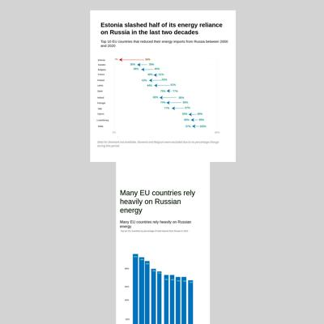](screenshots/msc-joel.github.io/main-article4.html-wide-full.jpg)|
|[main-article5.html](https://msc-joel.github.io/main-article5.html) :x: og:title :x: og:description :x: og:image [how to fix](tips/SOCIAL.md)|||[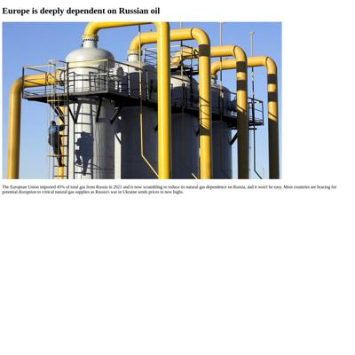](screenshots/msc-joel.github.io/main-article5.html-wide-full.jpg)|

### Automatic Checks

**https://msc-joel.github.io/**

* Image(s) need `alt` tags, [info here](https://abilitynet.org.uk/news-blogs/five-golden-rules-compliant-alt-text) and [tips here](https://twitter.com/FrankElavsky/status/1469023374529765385)
    * Image `profile-image.png` missing `alt` tag
    * Image `fb.png` missing `alt` tag
    * Image `twitter.png` missing `alt` tag
    * Image `linkedin.png` missing `alt` tag
* Has sideways scrollbars in mobile version – check padding, margins, image widths

**https://msc-joel.github.io/main-article1.html**

* Image(s) need `alt` tags, [info here](https://abilitynet.org.uk/news-blogs/five-golden-rules-compliant-alt-text) and [tips here](https://twitter.com/FrankElavsky/status/1469023374529765385)
    * Image `inflation-pic.jpg` missing `alt` tag
    * Image `inflation-graph.png` missing `alt` tag
* Move `main-article1.html` into a folder called `main-article1`, then rename the file `index.html`. That way the project can be found at **/main-article1** instead of **/main-article1.html**. [Read more about index.html here](https://www.thoughtco.com/index-html-page-3466505)

**https://msc-joel.github.io/main-article3.html**

* Move `main-article3.html` into a folder called `main-article3`, then rename the file `index.html`. That way the project can be found at **/main-article3** instead of **/main-article3.html**. [Read more about index.html here](https://www.thoughtco.com/index-html-page-3466505)

**https://msc-joel.github.io/main-article4.html**

* Move `main-article4.html` into a folder called `main-article4`, then rename the file `index.html`. That way the project can be found at **/main-article4** instead of **/main-article4.html**. [Read more about index.html here](https://www.thoughtco.com/index-html-page-3466505)
* Has sideways scrollbars in mobile version – check padding, margins, image widths
* Minimum font size should be 12px, enlarge text in Illustrator
    * Text `5%` is too small at 8px
    * Text `5%` is too small at 8px
    * Text `Estonia` is too small at 9px
    * Text `Sweden` is too small at 9px
    * Text `Bulgaria` is too small at 9px
    * Text `France` is too small at 9px
    * Text `Finland` is too small at 9px
    * *and 35 more*
* Overlapping elements in ai2html, check [the overflow video](https://www.youtube.com/watch?v=6vHsnjTp3_w) or make a smaller size
   * Text `34%` overlaps with `34%` at screen width 400
   * Text `5%` overlaps with `5%` at screen width 400
   * Text `30%` overlaps with `30%` at screen width 400
   * Text `39%` overlaps with `39%` at screen width 400
   * Text `38%` overlaps with `38%` at screen width 400
   * Text `46%` overlaps with `46%` at screen width 400
   * Text `51%` overlaps with `51%` at screen width 400
   * *and 142 more*

**https://msc-joel.github.io/main-article5.html**

* Image(s) need `alt` tags, [info here](https://abilitynet.org.uk/news-blogs/five-golden-rules-compliant-alt-text) and [tips here](https://twitter.com/FrankElavsky/status/1469023374529765385)
    * Image `Russian_energy.jpg` missing `alt` tag
* Needs a title, add a `<title>` tag to the `<head>`
* Move `main-article5.html` into a folder called `main-article5`, then rename the file `index.html`. That way the project can be found at **/main-article5** instead of **/main-article5.html**. [Read more about index.html here](https://www.thoughtco.com/index-html-page-3466505)
* Has sideways scrollbars in mobile version – check padding, margins, image widths
* Minimum font size should be 12px, enlarge text in Illustrator
    * Text `97%` is too small at 9px
    * Text `95%` is too small at 9px
    * Text `93%` is too small at 9px
    * Text `78%` is too small at 9px
    * Text `77%` is too small at 9px
    * Text `75%` is too small at 9px
    * Text `75%` is too small at 9px
    * *and 13 more*
* Overlapping elements in ai2html, check [the overflow video](https://www.youtube.com/watch?v=6vHsnjTp3_w) or make a smaller size
   * Text `97%` overlaps with `95%` at screen width 400
   * Text `95%` overlaps with `93%` at screen width 400
   * Text `78%` overlaps with `77%` at screen width 400
   * Text `77%` overlaps with `75%` at screen width 400
   * Text `75%` overlaps with `75%` at screen width 400
   * Text `75%` overlaps with `74%` at screen width 400
   * Text `74%` overlaps with `74%` at screen width 400
   * *and 3 more*

## naokatoh.github.io

|url|mobile|medium|wide|
|---|---|---|---|
|[Nao Hidaka Kato](https://naokatoh.github.io/) :x: og:title :x: og:description :x: og:image [how to fix](tips/SOCIAL.md)||||
|[Music in Men's Figure Skating](https://naokatoh.github.io/figure_skate_music/) :x: og:title :x: og:description :x: og:image [how to fix](tips/SOCIAL.md)||||
|[Rodents complaints](https://naokatoh.github.io/nycrats/) :x: og:title :x: og:description :x: og:image [how to fix](tips/SOCIAL.md)||||
|[Disney/Pixar won the most Oscars](https://naokatoh.github.io/oscar-anime/) :x: og:title :x: og:description :x: og:image [how to fix](tips/SOCIAL.md)|[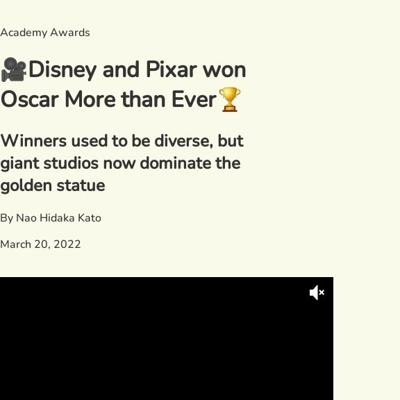](screenshots/naokatoh.github.io/oscar-anime_index.html-mobile-full.jpg)|[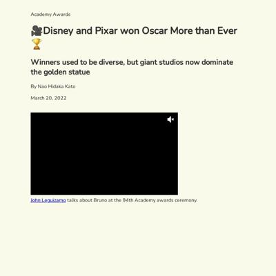](screenshots/naokatoh.github.io/oscar-anime_index.html-medium-full.jpg)||
|[Where to Find Uni in the US](https://naokatoh.github.io/sea_urchin/) :x: og:title :x: og:description :x: og:image [how to fix](tips/SOCIAL.md)||||
|[International students in Ukraine need more help as Russian intensifies attack](https://naokatoh.github.io/ukraine/) :x: og:title :x: og:description :x: og:image [how to fix](tips/SOCIAL.md)||||

### Automatic Checks

**https://naokatoh.github.io/**

* Has sideways scrollbars in mobile version – check padding, margins, image widths

**https://naokatoh.github.io/figure_skate_music/**

* Image(s) need `alt` tags, [info here](https://abilitynet.org.uk/news-blogs/five-golden-rules-compliant-alt-text) and [tips here](https://twitter.com/FrankElavsky/status/1469023374529765385)
    * Image `https://gh-card.dev/repos/naokatoh/figure_skate_music.svg` missing `alt` tag
* Change URL to use `-` instead of spaces or underscores

**https://naokatoh.github.io/nycrats/**

* Has sideways scrollbars in mobile version – check padding, margins, image widths

**https://naokatoh.github.io/oscar-anime/**

* Has sideways scrollbars in mobile version – check padding, margins, image widths
* Minimum font size should be 12px, enlarge text in Illustrator
    * Text ` Not Disney/ Pixar` is too small at 10px

**https://naokatoh.github.io/sea_urchin/**

* Image(s) need `alt` tags, [info here](https://abilitynet.org.uk/news-blogs/five-golden-rules-compliant-alt-text) and [tips here](https://twitter.com/FrankElavsky/status/1469023374529765385)
    * Image `https://gh-card.dev/repos/naokatoh/sea_urchin.svg` missing `alt` tag
* Change URL to use `-` instead of spaces or underscores
* Missing viewport meta tag in `<head>`, needed to tell browser it's responsive. Add `<meta name="viewport" content="width=device-width, initial-scale=1, shrink-to-fit=no">`

**https://naokatoh.github.io/ukraine/**

* Minimum font size should be 12px, enlarge text in Illustrator
    * Text `Morocco` is too small at 9px
    * Text `Iraq` is too small at 9px
    * Text `Nigeria` is too small at 9px
    * Text `Nigeria` is too small at 9px
    * Text `Russia` is too small at 9px
    * Text `Turkey` is too small at 9px
    * Text `Azerbaijan` is too small at 9px
    * *and 21 more*
* Overlapping elements in ai2html, check [the overflow video](https://www.youtube.com/watch?v=6vHsnjTp3_w) or make a smaller size
   * Text `Nigeria` overlaps with `Nigeria` at screen width 400
   * Text `Uzbekistan` overlaps with `Uzbekistan` at screen width 400
   * Text `Nigeria` overlaps with `Nigeria` at screen width 900
   * Text `Uzbekistan` overlaps with `Uzbekistan` at screen width 900
   * Text `Nigeria` overlaps with `Nigeria` at screen width 1300
   * Text `Uzbekistan` overlaps with `Uzbekistan` at screen width 1300

## pmagtulis.github.io

|url|mobile|medium|wide|
|---|---|---|---|
|[Prinz Magtulis](https://pmagtulis.github.io/)||||
|[Prinz Magtulis - Projects](https://pmagtulis.github.io/projects/)||||
|[One person is driving up 311 calls about air quality in Manhattan  Prinz Magtulis](https://pmagtulis.github.io/projects/air-quality/)||||
|[Duterte sets record in conflict killings due to siege in South  Prinz Magtulis](https://pmagtulis.github.io/projects/ph-conflict/)||||
|[Here are the vote-rich areas for the 2022 Philippine polls  Prinz Magtulis](https://pmagtulis.github.io/projects/polls-ph/)||||
|[New York City trains are likely to be so slow again  Prinz Magtulis](https://pmagtulis.github.io/projects/trains/)||||
|[A game ditched joysticks and was a pandemic hit in Japan  Prinz Magtulis](https://pmagtulis.github.io/projects/video-games/)||||

### Automatic Checks

**https://pmagtulis.github.io/**

No issues found! 🎉

**https://pmagtulis.github.io/projects/**

* Has sideways scrollbars in mobile version – check padding, margins, image widths

**https://pmagtulis.github.io/projects/air-quality/**

* Has sideways scrollbars in mobile version – check padding, margins, image widths
* Overlapping elements in ai2html, check [the overflow video](https://www.youtube.com/watch?v=6vHsnjTp3_w) or make a smaller size
   * Text `in Jan 2022` overlaps with `Manhattan` at screen width 900
   * Text `in Jan 2022` overlaps with `Manhattan` at screen width 1300

**https://pmagtulis.github.io/projects/ph-conflict/**

* Has sideways scrollbars in mobile version – check padding, margins, image widths

**https://pmagtulis.github.io/projects/polls-ph/**

* Has sideways scrollbars in mobile version – check padding, margins, image widths
* Minimum font size should be 12px, enlarge text in Illustrator
    * Text `Caloocan` is too small at 8px
    * Text `700,279` is too small at 8px
    * Text `Quezon City` is too small at 8px
    * Text `1,403,895` is too small at 8px
    * Text `Manila` is too small at 8px
    * Text `1,112,081` is too small at 8px
    * Text `Entire NCR:` is too small at 8px
    * *and 1 more*

**https://pmagtulis.github.io/projects/trains/**

* Overlapping elements in ai2html, check [the overflow video](https://www.youtube.com/watch?v=6vHsnjTp3_w) or make a smaller size
   * Text `Jun 2021` overlaps with `Feb 2022` at screen width 400
   * Text `Jun` overlaps with `Feb` at screen width 400
   * Text `2021` overlaps with `2022` at screen width 400
   * Text `Jun 2021` overlaps with `Feb 2022` at screen width 900
   * Text `Jun` overlaps with `Feb` at screen width 900
   * Text `2021` overlaps with `2022` at screen width 900
   * Text `Jun 2021` overlaps with `Feb 2022` at screen width 1300
   * *and 2 more*

**https://pmagtulis.github.io/projects/video-games/**

* Has sideways scrollbars in mobile version – check padding, margins, image widths
* Minimum font size should be 12px, enlarge text in Illustrator
    * Text ` ` is too small at 10px

## pmartisa.github.io

|url|mobile|medium|wide|
|---|---|---|---|
|[index.html](https://pmartisa.github.io/) :x: og:title :x: og:description :x: og:image [how to fix](tips/SOCIAL.md)||||
|[project_one/index.html](https://pmartisa.github.io/project_one/) :x: og:title :x: og:description :x: og:image [how to fix](tips/SOCIAL.md)||||
|[project_three/index.html](https://pmartisa.github.io/project_three/index.html) :x: og:title :x: og:description :x: og:image [how to fix](tips/SOCIAL.md)||||
|[project_two/index.html](https://pmartisa.github.io/project_two/index.html) :x: og:title :x: og:description :x: og:image [how to fix](tips/SOCIAL.md)|[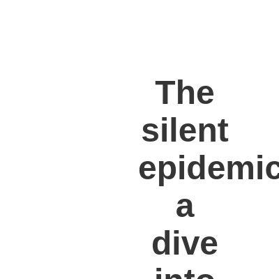](screenshots/pmartisa.github.io/project_two_index.html-mobile-full.jpg)|[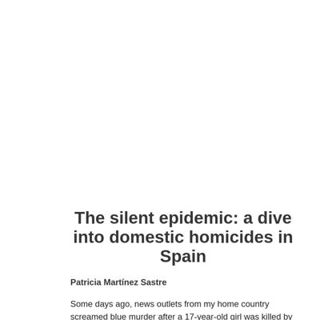](screenshots/pmartisa.github.io/project_two_index.html-medium-full.jpg)|[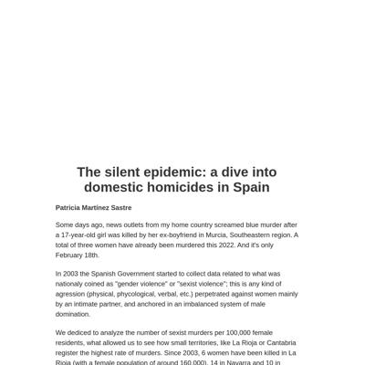](screenshots/pmartisa.github.io/project_two_index.html-wide-full.jpg)|
|[scrollytelling_project/index.html](https://pmartisa.github.io/scrollytelling_project/) :x: og:title :x: og:description :x: og:image [how to fix](tips/SOCIAL.md)||||

### Automatic Checks

**https://pmartisa.github.io/**

* Image(s) need `alt` tags, [info here](https://abilitynet.org.uk/news-blogs/five-golden-rules-compliant-alt-text) and [tips here](https://twitter.com/FrankElavsky/status/1469023374529765385)
    * Image `./project_three/oil_russian.png` missing `alt` tag
    * Image `./website/CGW63ZFEXC5BOMMJ7GSPLKVNFY.jpeg` missing `alt` tag
    * Image `./website/271681803_470688881345369_9114073044683232908_n.jpeg` missing `alt` tag
    * Image `./project_two/complaints_pct.png` missing `alt` tag
* Needs a title, add a `<title>` tag to the `<head>`
* Minimum font size should be 12px, enlarge text in Illustrator
    * Text ` ` is too small at 9px
    * Text `Average lead in early generic polls for the party in power or the party out of power .` is too small at 10px
    * Text `2018` is too small at 9px
    * Text `+13.4 pts.` is too small at 9px
    * Text `2016` is too small at 9px
    * Text `1.2` is too small at 9px
    * Text `2014` is too small at 9px
    * *and 34 more*
* Overlapping elements in ai2html, check [the overflow video](https://www.youtube.com/watch?v=6vHsnjTp3_w) or make a smaller size
   * Text `2018 Doesn’t Look Quite Like Other Election Cycles` overlaps with `2018` at screen width 400
   * Text `2018 Doesn’t Look Quite Like Other Election Cycles` overlaps with `+13.4 pts.` at screen width 400
   * Text `2018 Doesn’t Look Quite Like Other Election Cycles` overlaps with `2016` at screen width 400
   * Text `2018 Doesn’t Look Quite Like Other Election Cycles` overlaps with `1.2` at screen width 400
   * Text `2018 Doesn’t Look Quite Like Other Election Cycles` overlaps with `2014` at screen width 400
   * Text `2018 Doesn’t Look Quite Like Other Election Cycles` overlaps with `3.0` at screen width 400
   * Text `Average lead in early generic polls for the party in power or the party out of power .` overlaps with `2012` at screen width 400
   * *and 235 more*

**https://pmartisa.github.io/project_one/**

* Needs a title, add a `<title>` tag to the `<head>`
* Change URL to use `-` instead of spaces or underscores

**https://pmartisa.github.io/project_three/index.html**

* Needs a title, add a `<title>` tag to the `<head>`
* Change URL to use `-` instead of spaces or underscores
* Has sideways scrollbars in mobile version – check padding, margins, image widths
* Minimum font size should be 12px, enlarge text in Illustrator
    * Text `Stronger colors for countries that haven’t imposed` is too small at 8px
    * Text `any sanction.` is too small at 8px
    * Text `China` is too small at 10px
    * Text `more than 1.5 million barrels per day` is too small at 9px
    * Text `Netherlands` is too small at 10px
    * Text `640,000` is too small at 9px
    * Text `barrels/day` is too small at 9px
    * *and 92 more*
* Overlapping elements in ai2html, check [the overflow video](https://www.youtube.com/watch?v=6vHsnjTp3_w) or make a smaller size
   * Text `Nigeria` overlaps with `Yemen` at screen width 900
   * Text `894,72` overlaps with `880,507` at screen width 900
   * Text `Nigeria` overlaps with `Yemen` at screen width 1300
   * Text `894,72` overlaps with `880,507` at screen width 1300
* Missing font(s), you might need web fonts – [text explanation](https://gist.github.com/jsoma/631621e0807b26d49f5aef5260f79162), [video explanation](https://www.youtube.com/watch?v=HNhIeb_jEYM&list=PLewNEVDy7gq3MSrrO3eMEW8PhGMEVh2X2&index=3)
    * `"Myriad Concept Roman"` font not found, used in 7 text objects. Example: _Stronger colors for countries that haven’t imposed, any sanction., Stronger colors for countries that _
    * `"Myriad Pro"` font not found, used in 29 text objects. Example: _more than 1.5 million barrels per day, 640,000, barrels/day_
    * `"Times Roman"` font not found, used in 153 text objects. Example: _ Moderately Low (10% - 20%), Very High (above 40%), Prevalence of insufficient _

**https://pmartisa.github.io/project_two/index.html**

* Image(s) need `alt` tags, [info here](https://abilitynet.org.uk/news-blogs/five-golden-rules-compliant-alt-text) and [tips here](https://twitter.com/FrankElavsky/status/1469023374529765385)
    * Image `pct_killing.png` missing `alt` tag
    * Image `complaints_pct.png` missing `alt` tag
* Needs a title, add a `<title>` tag to the `<head>`
* Change URL to use `-` instead of spaces or underscores

**https://pmartisa.github.io/scrollytelling_project/**

* Needs a title, add a `<title>` tag to the `<head>`
* Change URL to use `-` instead of spaces or underscores
* Overlapping elements in ai2html, check [the overflow video](https://www.youtube.com/watch?v=6vHsnjTp3_w) or make a smaller size
   * Text `Carabanchel` overlaps with `Puente de vallecas` at screen width 400
   * Text `47` overlaps with `43` at screen width 400
   * Text `Puente de vallecas` overlaps with `Tetuan` at screen width 400
   * Text `43` overlaps with `39` at screen width 400
   * Text `Tetuan` overlaps with `Usera` at screen width 400
   * Text `Usera` overlaps with `Centro` at screen width 400
   * Text `32` overlaps with `31` at screen width 400
   * *and 54 more*

## sarahgrevy.github.io

|url|mobile|medium|wide|
|---|---|---|---|
|[Sarah Grevy Gotfredsen Portfolio](https://sarahgrevy.github.io/) :x: og:image [how to fix](tips/SOCIAL.md)||||
|[Sarah Grevy Gotfredsen Portfolio](https://sarahgrevy.github.io/air) :x: og:image [how to fix](tips/SOCIAL.md)||||
|[Sarah Grevy Gotfredsen Portfolio](https://sarahgrevy.github.io/co2_emission) :x: og:image [how to fix](tips/SOCIAL.md)||||
|[Sarah Grevy Gotfredsen Portfolio](https://sarahgrevy.github.io/weather_project) :x: og:image [how to fix](tips/SOCIAL.md)||||
|[Sarah Grevy Gotfredsen Portfolio](https://sarahgrevy.github.io/wordle) :x: og:image [how to fix](tips/SOCIAL.md)||||

### Automatic Checks

**https://sarahgrevy.github.io/**

No issues found! 🎉

**https://sarahgrevy.github.io/air**

* Overlapping elements in ai2html, check [the overflow video](https://www.youtube.com/watch?v=6vHsnjTp3_w) or make a smaller size
   * Text `240` overlaps with `220` at screen width 400
   * Text `220` overlaps with `200` at screen width 400
   * Text `200` overlaps with `180` at screen width 400
   * Text `180` overlaps with `160` at screen width 400
   * Text `160` overlaps with `140` at screen width 400
   * Text `Air Quality` overlaps with `Jan` at screen width 400
   * Text `140` overlaps with `120` at screen width 400
   * *and 58 more*

**https://sarahgrevy.github.io/co2_emission**

* Change URL to use `-` instead of spaces or underscores

**https://sarahgrevy.github.io/weather_project**

* Change URL to use `-` instead of spaces or underscores

**https://sarahgrevy.github.io/wordle**

* Image(s) need `alt` tags, [info here](https://abilitynet.org.uk/news-blogs/five-golden-rules-compliant-alt-text) and [tips here](https://twitter.com/FrankElavsky/status/1469023374529765385)
    * Image `./img/wordle-bar2.svg` missing `alt` tag

## semerriam.github.io

|url|mobile|medium|wide|
|---|---|---|---|
|[Susan Merriam](https://semerriam.github.io/) :x: og:title :x: og:description :x: og:image [how to fix](tips/SOCIAL.md)||||
|[First Visual Story](https://semerriam.github.io/nicar_first_visual_story) :x: og:title :x: og:description :x: og:image [how to fix](tips/SOCIAL.md)|[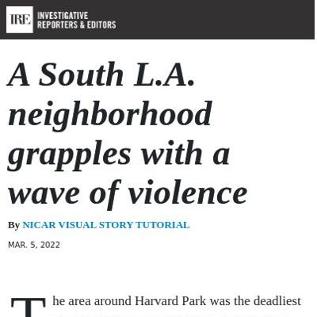](screenshots/semerriam.github.io/nicar_first_visual_story_index.html-mobile-full.jpg)|||
|[Susan Merriam](https://semerriam.github.io/projects/pj-census-quirks) :x: og:title :x: og:description :x: og:image [how to fix](tips/SOCIAL.md)||||
|[Susan Merriam](https://semerriam.github.io/projects/pj-ec-schools) :x: og:title :x: og:description :x: og:image [how to fix](tips/SOCIAL.md)||||
|[Susan Merriam](https://semerriam.github.io/projects/pj-infrasound/) :x: og:title :x: og:description :x: og:image [how to fix](tips/SOCIAL.md)||||

### Automatic Checks

**https://semerriam.github.io/**

* Image(s) need `alt` tags, [info here](https://abilitynet.org.uk/news-blogs/five-golden-rules-compliant-alt-text) and [tips here](https://twitter.com/FrankElavsky/status/1469023374529765385)
    * Image `imgs/capd.jpg` missing `alt` tag
    * Image `imgs/pj-infrasound-thumbnail.png` missing `alt` tag
    * Image `imgs/census-quirks-thumbnail.png` missing `alt` tag
    * Image `imgs/ec-thumbnail.png` missing `alt` tag
    * Image `imgs/Critics'_Choice_map_screenshot.png` missing `alt` tag
    * Image `imgs/crt1_sm.png` missing `alt` tag
    * Image `projects/pj-women-entrepreneurs/imgs/pj-women-entrepreneurs-thumbnail.png` missing `alt` tag
    * Image `projects/pj-mylla/imgs/pj-mylla4-thumbnail.png` missing `alt` tag
    * Image `imgs/election_2020polls_sm.jpg` missing `alt` tag
    * Image `imgs/fastco_10-18-20.png` missing `alt` tag
    * Image `imgs/vox_05-15-19.png` missing `alt` tag
    * Image `imgs/fastco_09-12-19.png` missing `alt` tag
    * Image `imgs/nbc_04-13-19.png` missing `alt` tag
    * Image `imgs/washpo_11-19-18.png` missing `alt` tag
    * Image `imgs/hyperallergic_11-20-18.png` missing `alt` tag
    * Image `imgs/wmarch1.jpg` missing `alt` tag
    * Image `imgs/sem_paris2sm.jpg` missing `alt` tag
    * Image `imgs/graph2.jpg` missing `alt` tag

**https://semerriam.github.io/nicar_first_visual_story**

* Image(s) need `alt` tags, [info here](https://abilitynet.org.uk/news-blogs/five-golden-rules-compliant-alt-text) and [tips here](https://twitter.com/FrankElavsky/status/1469023374529765385)
    * Image `https://bl.ocks.org/palewire/raw/1035cd306a2f85b362b1a20ce315b8eb/ire-logo.png` missing `alt` tag
* Change URL to use `-` instead of spaces or underscores
* Has sideways scrollbars in mobile version – check padding, margins, image widths

**https://semerriam.github.io/projects/pj-census-quirks**

* Image(s) need `alt` tags, [info here](https://abilitynet.org.uk/news-blogs/five-golden-rules-compliant-alt-text) and [tips here](https://twitter.com/FrankElavsky/status/1469023374529765385)
    * Image `imgs/census-quirks-img2.png` missing `alt` tag
    * Image `imgs/census-quirks-img3.png` missing `alt` tag
    * Image `imgs/census-quirks-img4.png` missing `alt` tag
    * Image `imgs/census-quirks-img5.png` missing `alt` tag
* Minimum font size should be 12px, enlarge text in Illustrator
    * Text `0` is too small at 10px
    * Text `200` is too small at 10px
    * Text `400` is too small at 10px
    * Text `600` is too small at 10px
    * Text `800` is too small at 10px
    * Text `1000` is too small at 10px
    * Text `1200` is too small at 10px
    * *and 23 more*

**https://semerriam.github.io/projects/pj-ec-schools**

* Image(s) need `alt` tags, [info here](https://abilitynet.org.uk/news-blogs/five-golden-rules-compliant-alt-text) and [tips here](https://twitter.com/FrankElavsky/status/1469023374529765385)
    * Image `imgs/ec-16.png` missing `alt` tag
    * Image `imgs/ec-17.png` missing `alt` tag
    * Image `imgs/ec-8.png` missing `alt` tag
    * Image `imgs/ec-10.png` missing `alt` tag
    * Image `imgs/ec-9.png` missing `alt` tag
    * Image `imgs/ec-3.png` missing `alt` tag
    * Image `imgs/ec-13.png` missing `alt` tag
    * Image `imgs/ec-15.png` missing `alt` tag
    * Image `imgs/ec-14.png` missing `alt` tag
    * Image `imgs/ec-12.png` missing `alt` tag
* Has sideways scrollbars in mobile version – check padding, margins, image widths
* Minimum font size should be 12px, enlarge text in Illustrator
    * Text `150k` is too small at 9px
    * Text `150k` is too small at 9px
    * Text `100 ` is too small at 9px
    * Text `100 ` is too small at 9px
    * Text `50` is too small at 9px
    * Text `50` is too small at 9px
    * Text `0` is too small at 9px
    * *and 63 more*
* Overlapping elements in ai2html, check [the overflow video](https://www.youtube.com/watch?v=6vHsnjTp3_w) or make a smaller size
   * Text `North Andover` overlaps with `1,048` at screen width 400
   * Text `North Andover` overlaps with `511` at screen width 400
   * Text `North Andover` overlaps with `774` at screen width 400
   * Text `North Andover` overlaps with `1,048` at screen width 900
   * Text `North Andover` overlaps with `511` at screen width 900
   * Text `North Andover` overlaps with `774` at screen width 900

**https://semerriam.github.io/projects/pj-infrasound/**

* Image(s) need `alt` tags, [info here](https://abilitynet.org.uk/news-blogs/five-golden-rules-compliant-alt-text) and [tips here](https://twitter.com/FrankElavsky/status/1469023374529765385)
    * Image `imgs/infrasound-10-1.png` missing `alt` tag
    * Image `imgs/infrasound-10-2.png` missing `alt` tag
    * Image `imgs/infrasound-10-3.png` missing `alt` tag
    * Image `imgs/infrasound-10-4.png` missing `alt` tag
    * Image `imgs/infrasound-10-5.png` missing `alt` tag
    * Image `imgs/infrasound-10-6.png` missing `alt` tag
    * Image `imgs/infrasound-10-7.png` missing `alt` tag
    * Image `imgs/infrasound-10-8.png` missing `alt` tag
    * Image `imgs/infrasound-10-9.png` missing `alt` tag
    * Image `imgs/infrasound-10-10.png` missing `alt` tag
* Minimum font size should be 12px, enlarge text in Illustrator
    * Text `44,083 Hz` is too small at 10px
    * Text `44,083 Hz` is too small at 10px
    * Text `7.5` is too small at 6px
    * Text `7.5` is too small at 6px
    * Text `5.0` is too small at 6px
    * Text `5.0` is too small at 6px
    * Text `2.5` is too small at 6px
    * *and 104 more*
* Overlapping elements in ai2html, check [the overflow video](https://www.youtube.com/watch?v=6vHsnjTp3_w) or make a smaller size
   * Text `0` overlaps with `0` at screen width 400
   * Text `20` overlaps with `20` at screen width 400
   * Text `0` overlaps with `0` at screen width 900
   * Text `20` overlaps with `20` at screen width 900
   * Text `0` overlaps with `0` at screen width 1300
   * Text `20` overlaps with `20` at screen width 1300

## sriharshadevulapalli.github.io

|url|mobile|medium|wide|
|---|---|---|---|
|[Sriharsha Devulapalli](https://sriharshadevulapalli.github.io/) :x: og:title :x: og:description :x: og:image [how to fix](tips/SOCIAL.md)||||
|[This is your title](https://sriharshadevulapalli.github.io/central-vista/) :x: og:title :x: og:description :x: og:image [how to fix](tips/SOCIAL.md)|[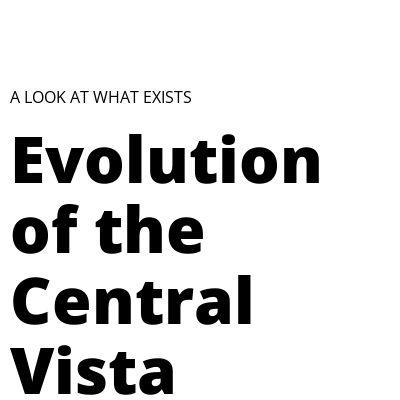](screenshots/sriharshadevulapalli.github.io/central-vista_index.html-mobile-full.jpg)|||
|[This is your title](https://sriharshadevulapalli.github.io/indian-airline-routes/index.html) :x: og:title :x: og:description :x: og:image [how to fix](tips/SOCIAL.md)||||
|[Sriharsha Devulapalli](https://sriharshadevulapalli.github.io/new-york-city-indian-food-menus/) :x: og:title :x: og:description :x: og:image [how to fix](tips/SOCIAL.md)|[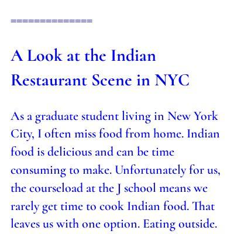](screenshots/sriharshadevulapalli.github.io/new-york-city-indian-food-menus_index.html-mobile-full.jpg)|||
|[Harsha - Indian Rainfall](https://sriharshadevulapalli.github.io/rainfall-patterns-in-india/index.html) :x: og:title :x: og:description :x: og:image [how to fix](tips/SOCIAL.md)|[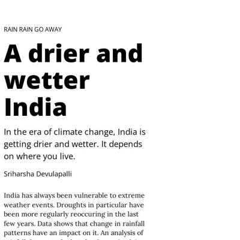](screenshots/sriharshadevulapalli.github.io/rainfall-patterns-in-india_index.html-mobile-full.jpg)|||

### Automatic Checks

**https://sriharshadevulapalli.github.io/**

No issues found! 🎉

**https://sriharshadevulapalli.github.io/central-vista/**

* Overlapping elements in ai2html, check [the overflow video](https://www.youtube.com/watch?v=6vHsnjTp3_w) or make a smaller size
   * Text `1930s - 1940s` overlaps with `1950s - 1960s` at screen width 400
   * Text `1950s - 1960s` overlaps with `1970s-2000s` at screen width 400
   * Text `1970s-2000s` overlaps with `2000s - Present` at screen width 400
   * Text `Block` overlaps with `Rashtrapati` at screen width 400
   * Text `Block` overlaps with `South` at screen width 400
   * Text `RAJPATH` overlaps with `South` at screen width 400
   * Text `Rashtrapati` overlaps with `South` at screen width 400
   * *and 159 more*
* Missing font(s), you might need web fonts – [text explanation](https://gist.github.com/jsoma/631621e0807b26d49f5aef5260f79162), [video explanation](https://www.youtube.com/watch?v=HNhIeb_jEYM&list=PLewNEVDy7gq3MSrrO3eMEW8PhGMEVh2X2&index=3)
    * `"Source Sans Pro"` font not found, used in 106 text objects. Example: _1930s - 1940s, 1950s - 1960s, 1970s-2000s_

**https://sriharshadevulapalli.github.io/indian-airline-routes/index.html**

* Minimum font size should be 12px, enlarge text in Illustrator
    * Text `Delhi` is too small at 10px
    * Text `Guwahati` is too small at 10px
    * Text `Ahmedabad` is too small at 10px
    * Text `Kolkata` is too small at 10px
    * Text `Mumbai` is too small at 10px
    * Text `Pune` is too small at 10px
    * Text `Hyderabad` is too small at 10px
    * *and 48 more*
* Overlapping elements in ai2html, check [the overflow video](https://www.youtube.com/watch?v=6vHsnjTp3_w) or make a smaller size
   * Text `1930s - 1940s` overlaps with `1950s - 1960s` at screen width 400
   * Text `1950s - 1960s` overlaps with `1970s-2000s` at screen width 400
   * Text `1970s-2000s` overlaps with `2000s - Present` at screen width 400
   * Text `Block` overlaps with `Rashtrapati` at screen width 400
   * Text `Block` overlaps with `South` at screen width 400
   * Text `RAJPATH` overlaps with `South` at screen width 400
   * Text `Rashtrapati` overlaps with `South` at screen width 400
   * *and 292 more*
* Missing font(s), you might need web fonts – [text explanation](https://gist.github.com/jsoma/631621e0807b26d49f5aef5260f79162), [video explanation](https://www.youtube.com/watch?v=HNhIeb_jEYM&list=PLewNEVDy7gq3MSrrO3eMEW8PhGMEVh2X2&index=3)
    * `"Source Sans Pro"` font not found, used in 204 text objects. Example: _Air India, The national, carrier has the_

**https://sriharshadevulapalli.github.io/new-york-city-indian-food-menus/**

No issues found! 🎉

**https://sriharshadevulapalli.github.io/rainfall-patterns-in-india/index.html**

* Overlapping elements in ai2html, check [the overflow video](https://www.youtube.com/watch?v=6vHsnjTp3_w) or make a smaller size
   * Text `compared to historical average (1950-2000)` overlaps with `Extreme Deficient` at screen width 400
   * Text `The Gangetic Plain ranging from Haryana to West Bengal has seen a decline in annual rainfall in the 2010s compared to their historical average` overlaps with `Lucknow` at screen width 400
   * Text `The Gangetic Plain ranging from Haryana to West Bengal has seen a decline in annual rainfall in the 2010s compared to their historical average` overlaps with `Guwahati` at screen width 400
   * Text `The Gangetic Plain ranging from Haryana to West Bengal has seen a decline in annual rainfall in the 2010s compared to their historical average` overlaps with `Patna` at screen width 400
   * Text `The Gangetic Plain ranging from Haryana to West Bengal has seen a decline in annual rainfall in the 2010s compared to their historical average` overlaps with `Kolkata` at screen width 400
   * Text `The Gangetic Plain ranging from Haryana to West Bengal has seen a decline in annual rainfall in the 2010s compared to their historical average` overlaps with `Source : Pai D.S., Latha Sridhar, Rajeevan M., Sreejith O.P., Satbhai N.S. and Mukhopadhyay B., 2014: Development of a new high spatial resolution (0.25° X 0.25°)Long period (1901-2010) daily gridded rainfall data set over India and its comparison with existing data sets over the region; MAUSAM, 65, 1(January 2014), pp1-18.` at screen width 400
   * Text `Bengaluru` overlaps with `Chennai` at screen width 400

## srjouppi.github.io

|url|mobile|medium|wide|
|---|---|---|---|
|[Shelby Jouppi: Data Journalist & Multimedia Specialist](https://srjouppi.github.io/) :x: og:title :x: og:description :x: og:image [how to fix](tips/SOCIAL.md)||||
|[Colorado Parks Mobility Analysis](https://srjouppi.github.io/colorado-parks-mobility/) :x: og:title :x: og:description :x: og:image [how to fix](tips/SOCIAL.md)||||
|["The Cost of COVID"](https://srjouppi.github.io/covid-gofundme-analysis/) :x: og:title :x: og:description :x: og:image [how to fix](tips/SOCIAL.md)||[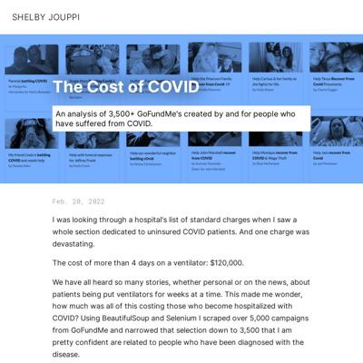](screenshots/srjouppi.github.io/covid-gofundme-analysis_index.html-medium-full.jpg)||
|[Shelby Jouppi - Waiting in Line](https://srjouppi.github.io/nyc-child-psychologists/) :x: og:title :x: og:description :x: og:image [how to fix](tips/SOCIAL.md)||||

### Automatic Checks

**https://srjouppi.github.io/**

* Image(s) need `alt` tags, [info here](https://abilitynet.org.uk/news-blogs/five-golden-rules-compliant-alt-text) and [tips here](https://twitter.com/FrankElavsky/status/1469023374529765385)
    * Image `https://raw.githubusercontent.com/srjouppi/srjouppi.github.io/main/images/child-mind-01.png` missing `alt` tag
    * Image `https://raw.githubusercontent.com/srjouppi/michigan-air-polluters-dataset-map/main/screenshots/violations-map-alt-2.png` missing `alt` tag
    * Image `https://raw.githubusercontent.com/srjouppi/srjouppi.github.io/main/covid-gofundme-analysis/covid-go-fund-me-cropped.png` missing `alt` tag
    * Image `https://raw.githubusercontent.com/srjouppi/srjouppi.github.io/main/images/colorado-parks-usage.png` missing `alt` tag
    * Image `https://raw.githubusercontent.com/srjouppi/srjouppi.github.io/main/images/ukrainian-schools-nyc.png` missing `alt` tag
    * Image `https://raw.githubusercontent.com/srjouppi/srjouppi.github.io/main/images/indoctrination-chart.png` missing `alt` tag
* Has sideways scrollbars in mobile version – check padding, margins, image widths

**https://srjouppi.github.io/colorado-parks-mobility/**

No issues found! 🎉

**https://srjouppi.github.io/covid-gofundme-analysis/**

* Has sideways scrollbars in mobile version – check padding, margins, image widths

**https://srjouppi.github.io/nyc-child-psychologists/**

* Minimum font size should be 12px, enlarge text in Illustrator
    * Text `Source: health.data.ny.gov “Medicaid Program Enrollment by Month Beginning 2009” - Aug. 2021 enrollment` is too small at 10px

## stephenanti.github.io

|url|mobile|medium|wide|
|---|---|---|---|
|[Stephen Anti's portfolio](https://stephenanti.github.io/) :x: og:title :x: og:description :x: og:image [how to fix](tips/SOCIAL.md)||[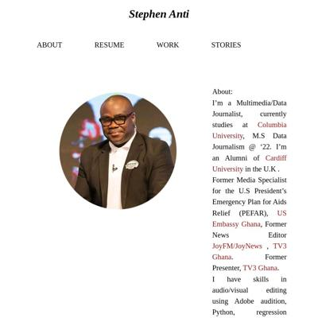](screenshots/stephenanti.github.io/index.html-medium-full.jpg)||
|[brooklyn crashes](https://stephenanti.github.io/brooklyn_crashes.html) :x: og:title :x: og:description :x: og:image [how to fix](tips/SOCIAL.md)|[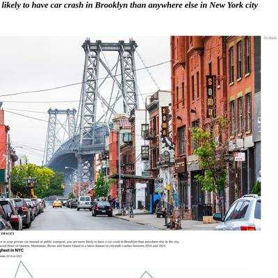](screenshots/stephenanti.github.io/brooklyn_crashes.html-mobile-full.jpg)|||
|[stories](https://stephenanti.github.io/project_3.html) :x: og:title :x: og:description :x: og:image [how to fix](tips/SOCIAL.md)||||
|[scrollyprojectAntii.html](https://stephenanti.github.io/scrollyprojectAntii.html) :x: og:title :x: og:description :x: og:image [how to fix](tips/SOCIAL.md)|[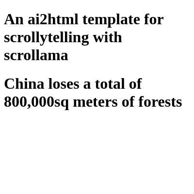](screenshots/stephenanti.github.io/scrollyprojectAntii.html-mobile-full.jpg)|||
|[Yam prices in Ghana](https://stephenanti.github.io/yam.html) :x: og:title :x: og:description :x: og:image [how to fix](tips/SOCIAL.md)|[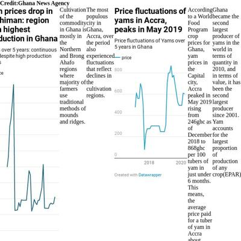](screenshots/stephenanti.github.io/yam.html-mobile-full.jpg)|[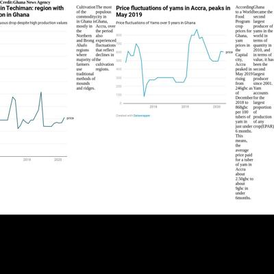](screenshots/stephenanti.github.io/yam.html-medium-full.jpg)||

### Automatic Checks

**https://stephenanti.github.io/**

* Image(s) need `alt` tags, [info here](https://abilitynet.org.uk/news-blogs/five-golden-rules-compliant-alt-text) and [tips here](https://twitter.com/FrankElavsky/status/1469023374529765385)
    * Image `profile-pic.png` missing `alt` tag
    * Image `twitter-icon.png` missing `alt` tag
    * Image `instagram-icon.png` missing `alt` tag
    * Image `linkedin-icon.png` missing `alt` tag
    * Image `email-icon.png` missing `alt` tag
* Has sideways scrollbars in mobile version – check padding, margins, image widths

**https://stephenanti.github.io/brooklyn_crashes.html**

* Image(s) need `alt` tags, [info here](https://abilitynet.org.uk/news-blogs/five-golden-rules-compliant-alt-text) and [tips here](https://twitter.com/FrankElavsky/status/1469023374529765385)
    * Image `brooklyn.jpeg` missing `alt` tag
    * Image `graph1.png` missing `alt` tag
    * Image `graph2.png` missing `alt` tag
    * Image `graph3.png` missing `alt` tag
* Move `brooklyn_crashes.html` into a folder called `brooklyn_crashes`, then rename the file `index.html`. That way the project can be found at **/brooklyn_crashes** instead of **/brooklyn_crashes.html**. [Read more about index.html here](https://www.thoughtco.com/index-html-page-3466505)
* Change URL to use `-` instead of spaces or underscores
* Has sideways scrollbars in mobile version – check padding, margins, image widths

**https://stephenanti.github.io/project_3.html**

* Move `project_3.html` into a folder called `project_3`, then rename the file `index.html`. That way the project can be found at **/project_3** instead of **/project_3.html**. [Read more about index.html here](https://www.thoughtco.com/index-html-page-3466505)
* Change URL to use `-` instead of spaces or underscores
* Has sideways scrollbars in mobile version – check padding, margins, image widths
* Minimum font size should be 12px, enlarge text in Illustrator
    * Text `9` is too small at 9px
    * Text `8` is too small at 9px
    * Text `7` is too small at 9px
    * Text `6` is too small at 9px
    * Text `54` is too small at 9px
    * Text `52` is too small at 9px
    * Text `51` is too small at 9px
    * *and 8 more*

**https://stephenanti.github.io/scrollyprojectAntii.html**

* Needs a title, add a `<title>` tag to the `<head>`
* Move `scrollyprojectAntii.html` into a folder called `scrollyprojectAntii`, then rename the file `index.html`. That way the project can be found at **/scrollyprojectAntii** instead of **/scrollyprojectAntii.html**. [Read more about index.html here](https://www.thoughtco.com/index-html-page-3466505)
* Change URL to be all in lowercase
* Has sideways scrollbars in mobile version – check padding, margins, image widths

**https://stephenanti.github.io/yam.html**

* Move `yam.html` into a folder called `yam`, then rename the file `index.html`. That way the project can be found at **/yam** instead of **/yam.html**. [Read more about index.html here](https://www.thoughtco.com/index-html-page-3466505)
* Missing viewport meta tag in `<head>`, needed to tell browser it's responsive. Add `<meta name="viewport" content="width=device-width, initial-scale=1, shrink-to-fit=no">`

## tanazm.github.io

|url|mobile|medium|wide|
|---|---|---|---|
|[Tanaz Meghjani's portfolio](https://tanazm.github.io/) :x: og:title :x: og:description :x: og:image [how to fix](tips/SOCIAL.md)||||
|[ATL parks](https://tanazm.github.io/ATLparks/) :x: og:title :x: og:description :x: og:image [how to fix](tips/SOCIAL.md)||||
|[Page not found · GitHub Pages](https://tanazm.github.io/Libraries/) :x: og:title :x: og:description :x: og:image [how to fix](tips/SOCIAL.md)|request failed|request failed|request failed|
|[Mapbox Storytelling](https://tanazm.github.io/marathonmap/) :x: og:title :x: og:description :x: og:image [how to fix](tips/SOCIAL.md)|[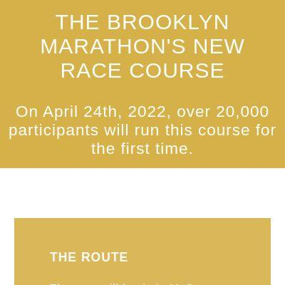](screenshots/tanazm.github.io/marathonmap_index.html-mobile-full.jpg)|||
|[Page not found · GitHub Pages](https://tanazm.github.io/TXwind/) :x: og:title :x: og:description :x: og:image [how to fix](tips/SOCIAL.md)|request failed|request failed|request failed|

### Automatic Checks

**https://tanazm.github.io/**

* Image(s) need `alt` tags, [info here](https://abilitynet.org.uk/news-blogs/five-golden-rules-compliant-alt-text) and [tips here](https://twitter.com/FrankElavsky/status/1469023374529765385)
    * Image `assets/portfolio/filter.png` missing `alt` tag
    * Image `assets/portfolio/analysis.png` missing `alt` tag
    * Image `assets/portfolio/infographic.png` missing `alt` tag
* Has sideways scrollbars in mobile version – check padding, margins, image widths

**https://tanazm.github.io/ATLparks/**

* Image(s) need `alt` tags, [info here](https://abilitynet.org.uk/news-blogs/five-golden-rules-compliant-alt-text) and [tips here](https://twitter.com/FrankElavsky/status/1469023374529765385)
    * Image `assets/piedmont_park.png` missing `alt` tag
* Change URL to be all in lowercase
* Missing viewport meta tag in `<head>`, needed to tell browser it's responsive. Add `<meta name="viewport" content="width=device-width, initial-scale=1, shrink-to-fit=no">`

**https://tanazm.github.io/Libraries/**

* Could not access the page - if you moved it, let me know
* Change URL to be all in lowercase
* Missing viewport meta tag in `<head>`, needed to tell browser it's responsive. Add `<meta name="viewport" content="width=device-width, initial-scale=1, shrink-to-fit=no">`
* Has sideways scrollbars in mobile version – check padding, margins, image widths

**https://tanazm.github.io/marathonmap/**

* Image(s) need `alt` tags, [info here](https://abilitynet.org.uk/news-blogs/five-golden-rules-compliant-alt-text) and [tips here](https://twitter.com/FrankElavsky/status/1469023374529765385)
    * Image `./images/park.png` missing `alt` tag
    * Image `./images/dumbo.png` missing `alt` tag
    * Image `./images/elevation.png` missing `alt` tag

**https://tanazm.github.io/TXwind/**

* Could not access the page - if you moved it, let me know
* Change URL to be all in lowercase
* Missing viewport meta tag in `<head>`, needed to tell browser it's responsive. Add `<meta name="viewport" content="width=device-width, initial-scale=1, shrink-to-fit=no">`
* Has sideways scrollbars in mobile version – check padding, margins, image widths

## vincentvb.github.io

|url|mobile|medium|wide|
|---|---|---|---|
|[Vincent Van Buskirk](https://vincentvb.github.io/) :x: og:title :x: og:description :x: og:image [how to fix](tips/SOCIAL.md)||||
|[football_penalties/index.html](https://vincentvb.github.io/football_penalties/) :x: og:title :x: og:description :x: og:image [how to fix](tips/SOCIAL.md)|||[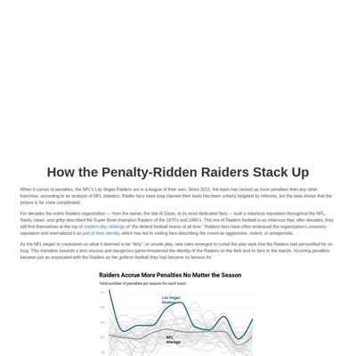](screenshots/vincentvb.github.io/football_penalties_index.html-wide-full.jpg)|
|[game_reviews/index.html](https://vincentvb.github.io/game_reviews) :x: og:title :x: og:description :x: og:image [how to fix](tips/SOCIAL.md)||||
|[santa_barbara_wine/index.html](https://vincentvb.github.io/santa_barbara_wine/) :x: og:title :x: og:description :x: og:image [how to fix](tips/SOCIAL.md)||||
|[Mapbox Storytelling](https://vincentvb.github.io/ukraine_invasion/) :x: og:title :x: og:description :x: og:image [how to fix](tips/SOCIAL.md)||||

### Automatic Checks

**https://vincentvb.github.io/**

* Image(s) need `alt` tags, [info here](https://abilitynet.org.uk/news-blogs/five-golden-rules-compliant-alt-text) and [tips here](https://twitter.com/FrankElavsky/status/1469023374529765385)
    * Image `https://media.giphy.com/media/z2CoJ2yWu1TndW4h6k/giphy.gif` missing `alt` tag
    * Image `./football_penalties/assets/raiders_penalty_categories.png` missing `alt` tag
    * Image `./assets/glass_room.gif` missing `alt` tag
    * Image `./santa_barbara_wine/assets/santa_barbara_yelp.png` missing `alt` tag

**https://vincentvb.github.io/football_penalties/**

* Needs a title, add a `<title>` tag to the `<head>`
* Change URL to use `-` instead of spaces or underscores
* Missing viewport meta tag in `<head>`, needed to tell browser it's responsive. Add `<meta name="viewport" content="width=device-width, initial-scale=1, shrink-to-fit=no">`

**https://vincentvb.github.io/game_reviews**

* Needs a title, add a `<title>` tag to the `<head>`
* Change URL to use `-` instead of spaces or underscores
* Missing viewport meta tag in `<head>`, needed to tell browser it's responsive. Add `<meta name="viewport" content="width=device-width, initial-scale=1, shrink-to-fit=no">`

**https://vincentvb.github.io/santa_barbara_wine/**

* Needs a title, add a `<title>` tag to the `<head>`
* Change URL to use `-` instead of spaces or underscores
* Missing viewport meta tag in `<head>`, needed to tell browser it's responsive. Add `<meta name="viewport" content="width=device-width, initial-scale=1, shrink-to-fit=no">`

**https://vincentvb.github.io/ukraine_invasion/**

* Image(s) need `alt` tags, [info here](https://abilitynet.org.uk/news-blogs/five-golden-rules-compliant-alt-text) and [tips here](https://twitter.com/FrankElavsky/status/1469023374529765385)
    * Image `assets/ukraine_2014.jpeg` missing `alt` tag
    * Image `assets/putin_speech.jpeg` missing `alt` tag
    * Image `assets/kyiv.jpeg` missing `alt` tag
    * Image `assets/kharkav.jpeg` missing `alt` tag
    * Image `assets/kherson.jpeg` missing `alt` tag
    * Image `assets/tank.jpeg` missing `alt` tag
* Change URL to use `-` instead of spaces or underscores

