# Data Studio 2022 Responsiveness Test Page

Quick checks to make sure your pages are looking their best.

* [angelinejcq.github.io](#angelinejcqgithubio)
* [annerquaye.github.io](#annerquayegithubio)
* [areenaarora.com](#areenaaroracom)
* [ilenapeng.github.io](#ilenapenggithubio)
* [jessieblaeser.github.io](#jessieblaesergithubio)
* [juisarwate.github.io](#juisarwategithubio)
* [juliaingram.github.io](#juliaingramgithubio)
* [kfalayi.github.io](#kfalayigithubio)
* [luizftoledo.github.io](#luizftoledogithubio)
* [mishavaid7.github.io](#mishavaid7githubio)
* [msc-joel.github.io](#msc-joelgithubio)
* [naokatoh.github.io](#naokatohgithubio)
* [pmagtulis.github.io](#pmagtulisgithubio)
* [pmartisa.github.io](#pmartisagithubio)
* [sarahgrevy.github.io](#sarahgrevygithubio)
* [semerriam.github.io](#semerriamgithubio)
* [sriharshadevulapalli.github.io](#sriharshadevulapalligithubio)
* [srjouppi.github.io](#srjouppigithubio)
* [stephenanti.github.io](#stephenantigithubio)
* [tanazm.github.io](#tanazmgithubio)
* [vincentvb.github.io](#vincentvbgithubio)

## angelinejcq.github.io

|url|mobile|medium|wide|
|---|---|---|---|
|[Chuqin Jiang's Incredible Portfolio](https://angelinejcq.github.io/)||||
|[Welcome to my bubble tea shop project](https://angelinejcq.github.io/bubble-tea-project/)|||[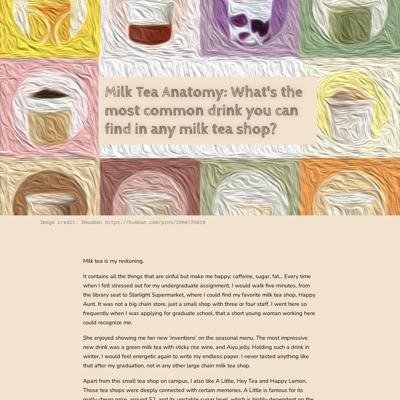](screenshots/angelinejcq.github.io/bubble-tea-project_index.html-wide-full.jpg)|
|[Welcome to my NEO project](https://angelinejcq.github.io/near-earth-objects-project/)|||[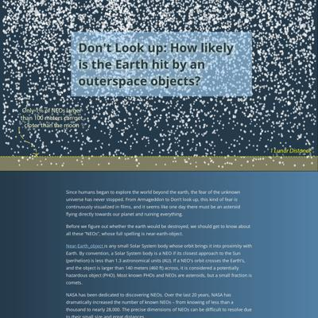](screenshots/angelinejcq.github.io/near-earth-objects-project_index.html-wide-full.jpg)|
|[Women trafficking in China](https://angelinejcq.github.io/woman-trafficking-project/)|||[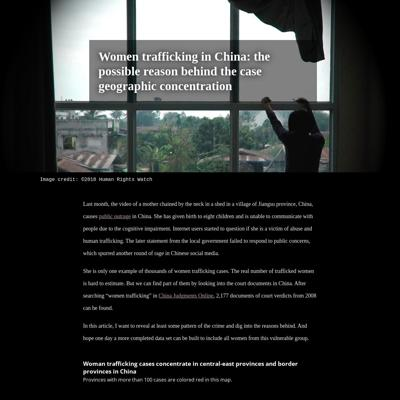](screenshots/angelinejcq.github.io/woman-trafficking-project_index.html-wide-full.jpg)|

### Automatic Checks

**https://angelinejcq.github.io/**

No issues found! 🎉

**https://angelinejcq.github.io/bubble-tea-project/**

No issues found! 🎉

**https://angelinejcq.github.io/near-earth-objects-project/**

* Missing viewport meta tag in `<head>`, needed to tell browser it's responsive. Add `<meta name="viewport" content="width=device-width, initial-scale=1, shrink-to-fit=no">`

**https://angelinejcq.github.io/woman-trafficking-project/**

* Minimum font size should be 12px, enlarge text in Illustrator
   * Text `|` is too small at 8px
   * Text `|` is too small at 8px
* Overlapping elements in ai2html, check [the overflow video](https://www.youtube.com/watch?v=6vHsnjTp3_w) or make a smaller size
   * Text `Guizhou:` overlaps with `Yunnan:` at screen width 400
   * Text `115` overlaps with `Yunnan:` at screen width 400
   * Text `115` overlaps with `Guangxi:` at screen width 400
   * Text `Yunnan:` overlaps with `Guangxi:` at screen width 400
   * Text `176` overlaps with `Guangxi:` at screen width 400
   * Text `176` overlaps with `107` at screen width 400
   * Text `107` overlaps with `Fujian: 303` at screen width 400
   * Text `gender ratio` overlaps with `92.29` at screen width 400
   * Text `92.29` overlaps with `of marriageable age` at screen width 400
   * Text `97.59` overlaps with `Hebei` at screen width 400
   * Text `97.59` overlaps with `Hebei` at screen width 900
   * Text `97.59` overlaps with `Hebei` at screen width 1300
* Missing font(s), you might need web fonts – [text explanation](https://gist.github.com/jsoma/631621e0807b26d49f5aef5260f79162), [video explanation](https://www.youtube.com/watch?v=HNhIeb_jEYM&list=PLewNEVDy7gq3MSrrO3eMEW8PhGMEVh2X2&index=3)
   * `"Open Sans"` font not found, used in 143 text objects. Example: _Hebei: 116, Shandong: 137, Henan: 298_

## annerquaye.github.io

|url|mobile|medium|wide|
|---|---|---|---|
|[Abbey Richard's Portfolio](https://annerquaye.github.io)|||[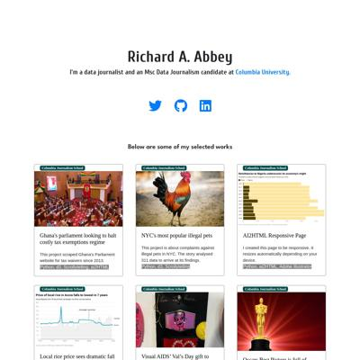](screenshots/annerquaye.github.io/index.html-wide-full.jpg)|
|[Abbey Richard's Portfolio](https://annerquaye.github.io/projects/oscars.html)||||
|[Abbey Richard's Portfolio](https://annerquaye.github.io/projects/responsive_pages/responsive.html)||||
|[Abbey Richard's Portfolio](https://annerquaye.github.io/projects/ricestory.html)||||

### Automatic Checks

**https://annerquaye.github.io**

No issues found! 🎉

**https://annerquaye.github.io/projects/oscars.html**

* Move `projects/oscars.html` into a folder called `oscars`, then rename the file `index.html`. That way the project can be found at **/oscars** instead of **/oscars.html**. [Read more about index.html here](https://www.thoughtco.com/index-html-page-3466505)
* Has sideways scrollbars in mobile version – check padding, margins, image widths

**https://annerquaye.github.io/projects/responsive_pages/responsive.html**

* Move `projects/responsive_pages/responsive.html` into a folder called `responsive`, then rename the file `index.html`. That way the project can be found at **/responsive** instead of **/responsive.html**. [Read more about index.html here](https://www.thoughtco.com/index-html-page-3466505)
* Change URL to use `-` instead of spaces or underscores
* Minimum font size should be 12px, enlarge text in Illustrator
   * Text `The pandemic also shot inflation to a 3-year high` is too small at 9px
   * Text `Inflation` is too small at 8px
   * Text `Gdp Growth` is too small at 8px
   * Text `17.5 %` is too small at 7px
   * Text `The pandemic saw the economy hit rock bottom` is too small at 7px
   * Text `15.0` is too small at 7px
   * Text `12.5` is too small at 7px
   * Text `10.0` is too small at 7px
   * Text `7.5` is too small at 7px
   * Text `5.0` is too small at 7px
   * Text `2.5` is too small at 7px
   * Text `2016` is too small at 8px
   * Text `2017` is too small at 8px
   * Text `2018` is too small at 8px
   * Text `2019` is too small at 8px
   * Text `2020` is too small at 8px
   * Text `The pandemic also shot inflation to a 3-year high` is too small at 10px
   * Text `Inflation` is too small at 9px
   * Text `Gdp Growth` is too small at 9px
   * Text `17.5 %` is too small at 10px
   * Text `The pandemic saw the economy hit rock bottom` is too small at 8px
   * Text `15.0` is too small at 10px
   * Text `12.5` is too small at 10px
   * Text `10.0` is too small at 10px
   * Text `7.5` is too small at 10px
   * Text `5.0` is too small at 10px
   * Text `2.5` is too small at 10px
   * Text `2016` is too small at 10px
   * Text `2017` is too small at 10px
   * Text `2018` is too small at 10px
   * Text `2019` is too small at 10px
   * Text `2020` is too small at 10px
* Overlapping elements in ai2html, check [the overflow video](https://www.youtube.com/watch?v=6vHsnjTp3_w) or make a smaller size
   * Text `Inflation` overlaps with `Gdp Growth` at screen width 400

**https://annerquaye.github.io/projects/ricestory.html**

* Move `projects/ricestory.html` into a folder called `ricestory`, then rename the file `index.html`. That way the project can be found at **/ricestory** instead of **/ricestory.html**. [Read more about index.html here](https://www.thoughtco.com/index-html-page-3466505)
* Has sideways scrollbars in mobile version – check padding, margins, image widths

## areenaarora.com

|url|mobile|medium|wide|
|---|---|---|---|
|[Areena Arora](https://areenaarora.com/)||[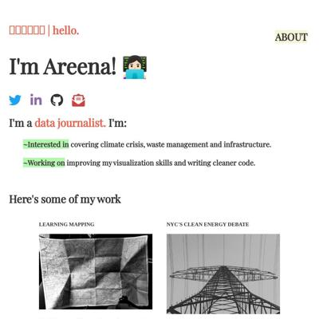](screenshots/areenaarora.com/index.html-medium-full.jpg)|[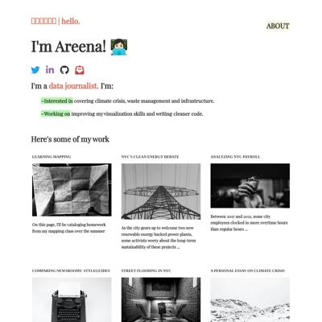](screenshots/areenaarora.com/index.html-wide-full.jpg)|
|[art-boards homework](https://areenaarora.com/artboards)|||[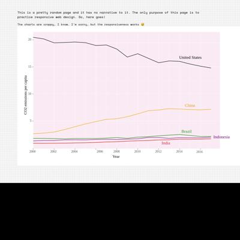](screenshots/areenaarora.com/artboards_index.html-wide-full.jpg)|
|[Responsive web design homework](https://areenaarora.com/responsive-dev-hw)|[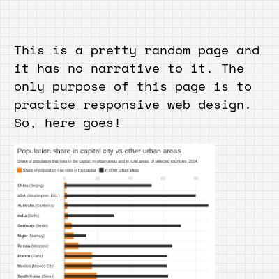](screenshots/areenaarora.com/responsive-dev-hw_index.html-mobile-full.jpg)|[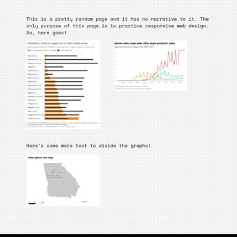](screenshots/areenaarora.com/responsive-dev-hw_index.html-medium-full.jpg)||
|[Best Biryani](https://areenaarora.com/stories/biryani/)||||
|[New York State spills](https://areenaarora.com/stories/ny-state-spills/)||||

### Automatic Checks

**https://areenaarora.com/**

No issues found! 🎉

**https://areenaarora.com/artboards**

* Has sideways scrollbars in mobile version – check padding, margins, image widths
* Minimum font size should be 12px, enlarge text in Illustrator
   * Text `20` is too small at 9px
   * Text `15` is too small at 9px
   * Text `10` is too small at 9px
   * Text `5` is too small at 9px
   * Text `2000` is too small at 9px
   * Text `2002` is too small at 9px
   * Text `2004` is too small at 9px
   * Text `2006` is too small at 9px
   * Text `2008` is too small at 9px
   * Text `2010` is too small at 9px
   * Text `2012` is too small at 9px
   * Text `2014` is too small at 9px
   * Text `2016` is too small at 9px

**https://areenaarora.com/responsive-dev-hw**

No issues found! 🎉

**https://areenaarora.com/stories/biryani/**

* Has sideways scrollbars in mobile version – check padding, margins, image widths

**https://areenaarora.com/stories/ny-state-spills/**

* Has sideways scrollbars in mobile version – check padding, margins, image widths

## ilenapeng.github.io

|url|mobile|medium|wide|
|---|---|---|---|
|[Ilena Peng](https://ilenapeng.github.io/)||||
|[NYC's "Open" Streets](https://ilenapeng.github.io/nyc-open-streets/)||||
|[The Path to Principal](https://ilenapeng.github.io/path-to-principal/)||||
|[The Bay's Rainy December](https://ilenapeng.github.io/stevens-creek/)||||

### Automatic Checks

**https://ilenapeng.github.io/**

No issues found! 🎉

**https://ilenapeng.github.io/nyc-open-streets/**

* Minimum font size should be 12px, enlarge text in Illustrator
   * Text `Source: October 2021 Transportation Alternatives report` is too small at 10px

**https://ilenapeng.github.io/path-to-principal/**

No issues found! 🎉

**https://ilenapeng.github.io/stevens-creek/**

No issues found! 🎉

## jessieblaeser.github.io

|url|mobile|medium|wide|
|---|---|---|---|
|[Jessie Blaeser's Portfolio](https://jessieblaeser.github.io/)|||[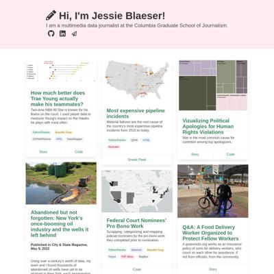](screenshots/jessieblaeser.github.io/index.html-wide-full.jpg)|
|[Most Expensive Pipeline Incidents](https://jessieblaeser.github.io/pj_pipelines.html)||||
|[Ticket to Ride Analysis](https://jessieblaeser.github.io/pj_ticket_to_ride.html)||||
|[Trae Young Hawks Analysis](https://jessieblaeser.github.io/pj_trae_young.html)||||

### Automatic Checks

**https://jessieblaeser.github.io/**

No issues found! 🎉

**https://jessieblaeser.github.io/pj_pipelines.html**

* Move `pj_pipelines.html` into a folder called `pj_pipelines`, then rename the file `index.html`. That way the project can be found at **/pj_pipelines** instead of **/pj_pipelines.html**. [Read more about index.html here](https://www.thoughtco.com/index-html-page-3466505)
* Change URL to use `-` instead of spaces or underscores
* Has sideways scrollbars in mobile version – check padding, margins, image widths
* Minimum font size should be 12px, enlarge text in Illustrator
   * Text `Data Source: U.S. DOT Pipeline and Hazardous Materials Safety Administration` is too small at 8px
   * Text `Graphic by Jessie Blaeser` is too small at 8px
   * Text `Data Source: U.S. DOT Pipeline and Hazardous Materials Safety
                                    Administration` is too small at 8px
   * Text `Graphic by Jessie Blaeser` is too small at 8px

**https://jessieblaeser.github.io/pj_ticket_to_ride.html**

* Move `pj_ticket_to_ride.html` into a folder called `pj_ticket_to_ride`, then rename the file `index.html`. That way the project can be found at **/pj_ticket_to_ride** instead of **/pj_ticket_to_ride.html**. [Read more about index.html here](https://www.thoughtco.com/index-html-page-3466505)
* Change URL to use `-` instead of spaces or underscores

**https://jessieblaeser.github.io/pj_trae_young.html**

* Move `pj_trae_young.html` into a folder called `pj_trae_young`, then rename the file `index.html`. That way the project can be found at **/pj_trae_young** instead of **/pj_trae_young.html**. [Read more about index.html here](https://www.thoughtco.com/index-html-page-3466505)
* Change URL to use `-` instead of spaces or underscores

## juisarwate.github.io

|url|mobile|medium|wide|
|---|---|---|---|
|[Jui Sarwate Personal Website](https://juisarwate.github.io/)||||
|[Recycling Distribution NYC](https://juisarwate.github.io/nyc-recycling-distribution/)||||
|[Homeless 311 Complaints 2020](https://juisarwate.github.io/project-3/)|||[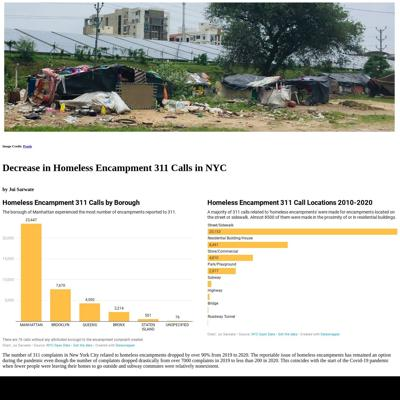](screenshots/juisarwate.github.io/project-3_index.html-wide-full.jpg)|
|[Yosemite National Park Visitation](https://juisarwate.github.io/Sarwate_Project1/)||||

### Automatic Checks

**https://juisarwate.github.io/**

No issues found! 🎉

**https://juisarwate.github.io/nyc-recycling-distribution/**

* Missing viewport meta tag in `<head>`, needed to tell browser it's responsive. Add `<meta name="viewport" content="width=device-width, initial-scale=1, shrink-to-fit=no">`
* Has sideways scrollbars in mobile version – check padding, margins, image widths

**https://juisarwate.github.io/project-3/**

* Missing viewport meta tag in `<head>`, needed to tell browser it's responsive. Add `<meta name="viewport" content="width=device-width, initial-scale=1, shrink-to-fit=no">`

**https://juisarwate.github.io/Sarwate_Project1/**

* Change URL to use `-` instead of spaces or underscores
* Change URL to be all in lowercase
* Missing viewport meta tag in `<head>`, needed to tell browser it's responsive. Add `<meta name="viewport" content="width=device-width, initial-scale=1, shrink-to-fit=no">`
* Has sideways scrollbars in mobile version – check padding, margins, image widths

## juliaingram.github.io

|url|mobile|medium|wide|
|---|---|---|---|
|[Julia Ingram's portfolio](https://juliaingram.github.io)||||
|[Citi Bike](https://juliaingram.github.io/citibike/)||||
|[Daylight Saving](https://juliaingram.github.io/daylight-saving/)||||
|[Therapy Apps](https://juliaingram.github.io/therapy-apps/)||||

### Automatic Checks

**https://juliaingram.github.io**

No issues found! 🎉

**https://juliaingram.github.io/citibike/**

* Missing viewport meta tag in `<head>`, needed to tell browser it's responsive. Add `<meta name="viewport" content="width=device-width, initial-scale=1, shrink-to-fit=no">`
* Has sideways scrollbars in mobile version – check padding, margins, image widths

**https://juliaingram.github.io/daylight-saving/**

* Minimum font size should be 12px, enlarge text in Illustrator
   * Text `All successful bills call for a year-round daylight time pending Congressional approval.` is too small at 10px
   * Text `Enacted` is too small at 9px
   * Text `Failed` is too small at 9px
   * Text `2021` is too small at 9px
   * Text `2020` is too small at 9px
   * Text `Alabama` is too small at 9px
   * Text `Georgia` is too small at 9px
   * Text `Ohio` is too small at 9px
   * Text `Maine` is too small at 9px
   * Text `Minnesota` is too small at 9px
   * Text `Mississippi` is too small at 9px
   * Text `Montana` is too small at 9px
   * Text `Idaho` is too small at 9px
   * Text `Louisiana` is too small at 9px
   * Text `South Carolina` is too small at 9px
   * Text `Utah` is too small at 9px
   * Text `Washington` is too small at 9px
   * Text `Wyoming` is too small at 9px
   * Text `Source: National Conference of State Legislatures` is too small at 9px
   * Text `Most states have introduced legislation to move to year-round DST. Six states introduced bills to only use` is too small at 10px
   * Text `standard time, and five states have competing bills for which way to end clock-switching.` is too small at 10px
   * Text `Enacted` is too small at 9px
   * Text `Pending` is too small at 9px
   * Text `Failed` is too small at 9px
   * Text `2020` is too small at 9px
   * Text `2021` is too small at 9px
   * Text `2022` is too small at 9px
   * Text `Alaska` is too small at 9px
   * Text `California` is too small at 9px
   * Text `Iowa` is too small at 9px
   * Text `Kansas` is too small at 9px
   * Text `Kentucky` is too small at 9px
   * Text `Maryland` is too small at 9px
   * Text `Massachusetts` is too small at 9px
   * Text `Michigan` is too small at 9px
   * Text `Daylight` is too small at 9px
   * Text `time` is too small at 9px
   * Text `Minnesota` is too small at 9px
   * Text `Nebraska` is too small at 9px
   * Text `New Hampshire` is too small at 9px
   * Text `New Jersey` is too small at 9px
   * Text `North Carolina` is too small at 9px
   * Text `Ohio` is too small at 9px
   * Text `South Carolina` is too small at 9px
   * Text `South Dakota` is too small at 9px
   * Text `Utah` is too small at 9px
   * Text `Colorado` is too small at 9px
   * Text `Missouri` is too small at 9px
   * Text `Standard` is too small at 9px
   * Text `time` is too small at 9px
   * Text `Vermont` is too small at 9px
   * Text `Virginia` is too small at 9px
   * Text `Washington` is too small at 9px
   * Text `West Virginia` is too small at 9px
   * Text `Georgia` is too small at 9px
   * Text `Illinois` is too small at 9px
   * Text `Competing` is too small at 9px
   * Text `bills` is too small at 9px
   * Text `New York` is too small at 9px
   * Text `Oklahoma` is too small at 9px
   * Text `Pennsylvania` is too small at 9px
   * Text `Source: National Conference of State Legislatures` is too small at 9px
   * Text `later` is too small at 10px
   * Text `earlier` is too small at 10px
   * Text `Sunrise could have been as late as` is too small at 10px
   * Text `9:42 a.m. in Williston, North Dakota` is too small at 10px
   * Text `but as early as 7:37 in` is too small at 10px
   * Text `Panama City, Florida` is too small at 10px
   * Text `The earliest sunset would` is too small at 10px
   * Text `have been at 5:01 p.m., in` is too small at 10px
   * Text `later` is too small at 10px
   * Text `earlier` is too small at 10px
   * Text `Bonners Ferry, Idaho` is too small at 10px
   * Text `and the latest as 6:58 p.m.` is too small at 10px
   * Text `in Odessa, Texas` is too small at 10px
* Overlapping elements in ai2html, check [the overflow video](https://www.youtube.com/watch?v=6vHsnjTp3_w) or make a smaller size
   * Text `Enacted` overlaps with `Failed` at screen width 400
   * Text `Enacted` overlaps with `Pending` at screen width 400
   * Text `Pending` overlaps with `Failed` at screen width 400
   * Text `If the U.S. observed nationwide daylight saving time, on Jan. 1, 2022 this is when` overlaps with `cities would have seen the sun rise and set` at screen width 400
   * Text `17 states have adopted or enacted legislation on Daylight Saving` overlaps with `28 states are considering legislation on Daylight Saving Time in 2022` at screen width 900
   * Text `17 states have adopted or enacted legislation on Daylight Saving` overlaps with `Most states have introduced legislation to move to year-round DST. Six states introduced bills to only use` at screen width 900
   * Text `Time over the past two years` overlaps with `standard time, and five states have competing bills for which way to end clock-switching.` at screen width 900
   * Text `Enacted` overlaps with `Failed` at screen width 900
   * Text `Enacted` overlaps with `Pending` at screen width 900
   * Text `Pending` overlaps with `Failed` at screen width 900
   * Text `17 states have adopted or enacted legislation on Daylight Saving` overlaps with `28 states are considering legislation on Daylight Saving Time in 2022` at screen width 1300
   * Text `17 states have adopted or enacted legislation on Daylight Saving` overlaps with `Most states have introduced legislation to move to year-round DST. Six states introduced bills to only use` at screen width 1300
   * Text `Time over the past two years` overlaps with `standard time, and five states have competing bills for which way to end clock-switching.` at screen width 1300
   * Text `Enacted` overlaps with `Failed` at screen width 1300
   * Text `Enacted` overlaps with `Pending` at screen width 1300
   * Text `Pending` overlaps with `Failed` at screen width 1300

**https://juliaingram.github.io/therapy-apps/**

* Missing viewport meta tag in `<head>`, needed to tell browser it's responsive. Add `<meta name="viewport" content="width=device-width, initial-scale=1, shrink-to-fit=no">`

## kfalayi.github.io

|url|mobile|medium|wide|
|---|---|---|---|
|[Kunle Falayi's Portfolio](https://kfalayi.github.io/)||||
|[Kunle Falayi's Portfolio](https://kfalayi.github.io/bloomberg/)|||[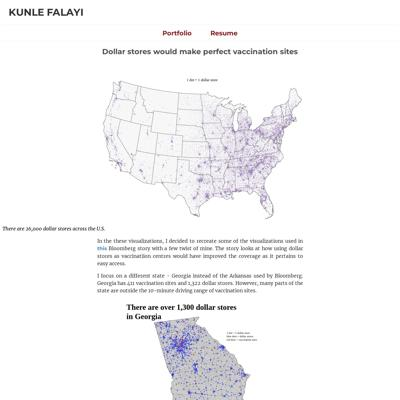](screenshots/kfalayi.github.io/bloomberg_index.html-wide-full.jpg)|
|[Kunle Falayi's Portfolio](https://kfalayi.github.io/Food_price_Nigeria/)||||
|[Kunle Falayi's Portfolio](https://kfalayi.github.io/hispanics in america/)||||
|[Kunle Falayi's Portfolio](https://kfalayi.github.io/irpin/)||||

### Automatic Checks

**https://kfalayi.github.io/**

No issues found! 🎉

**https://kfalayi.github.io/bloomberg/**

* Has sideways scrollbars in mobile version – check padding, margins, image widths
* Minimum font size should be 12px, enlarge text in Illustrator
   * Text `There are over 26,000 dollar stores across the US` is too small at 8px
   * Text `1 dot= 1 dollar store` is too small at 8px
   * Text `1 dot = 1 dollar store` is too small at 10px
   * Text `blue dots = dollar stores` is too small at 10px
   * Text `red dots = vaccination sites` is too small at 10px
   * Text `1 dot = 1 dollar store` is too small at 9px
   * Text `blue dots = dollar stores` is too small at 9px
   * Text `red dots = vaccination sites` is too small at 9px
   * Text `Map with QGIS and Illustrator | Inspired by Bloomberg’s story.` is too small at 10px
   * Text `1 dot = 1 dollar store` is too small at 6px
   * Text `blue dots = dollar stores` is too small at 6px
   * Text `red dots = vaccination sites` is too small at 6px
   * Text `Map with QGIS and Illustrator | Inspired by Bloomberg’s story.` is too small at 3px
   * Text `Map with QGIS and Illustrator | Inspired by Bloomberg’s story.` is too small at 5px
   * Text `Areas within a 10-mins drive of dollar stores` is too small at 8px
   * Text `but outside 10-mins drive of vaccination sites` is too small at 8px
   * Text `Red dots are vaccination sites` is too small at 8px
   * Text `Areas within a 10-mins drive of dollar stores ` is too small at 4px
   * Text `but outside 10-mins drive of vaccination sites` is too small at 4px
   * Text `Red dots are vaccination sites` is too small at 4px

**https://kfalayi.github.io/Food_price_Nigeria/**

* Change URL to use `-` instead of spaces or underscores
* Change URL to be all in lowercase
* Has sideways scrollbars in mobile version – check padding, margins, image widths

**https://kfalayi.github.io/hispanics in america/**

* Change URL to use `-` instead of spaces or underscores

**https://kfalayi.github.io/irpin/**

* Overlapping elements in ai2html, check [the overflow video](https://www.youtube.com/watch?v=6vHsnjTp3_w) or make a smaller size
   * Text `Irpin River` overlaps with `Evacuees huddled under` at screen width 400
   * Text `Irpin River` overlaps with `destroyed bridge, one of` at screen width 400
   * Text `destroyed bridge, one of` overlaps with `IRPIN` at screen width 400
   * Text `the main escape routes out of Irpin` overlaps with `IRPIN` at screen width 400
   * Text `the main escape routes out of Irpin` overlaps with `At least four people` at screen width 400
   * Text `IRPIN` overlaps with `Irpin River` at screen width 400
   * Text `were killed by a mortar shell.` overlaps with `PS30 road` at screen width 400
   * Text `Irpin` overlaps with `Kyiv` at screen width 400
   * Text `Irpin` overlaps with `UKRAINE` at screen width 400
   * Text `Kyiv` overlaps with `UKRAINE` at screen width 400
   * Text `Irpin` overlaps with `Kyiv` at screen width 900

## luizftoledo.github.io

|url|mobile|medium|wide|
|---|---|---|---|
|[luizftoledo's journalism portfolio](https://luizftoledo.github.io/)||[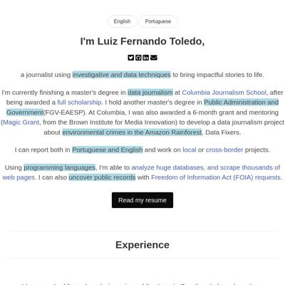](screenshots/luizftoledo.github.io/index.html-medium-full.jpg)|[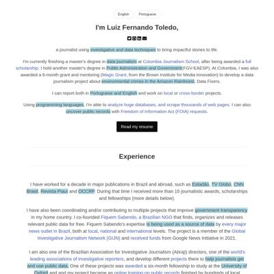](screenshots/luizftoledo.github.io/index.html-wide-full.jpg)|
|[Brazilian people are paying for dozens of meals in the same day](https://luizftoledo.github.io/congress-expenses-with-food/)||||
|[How happy can Iron Maiden songs be?](https://luizftoledo.github.io/iron-maiden-happiness/)||||
|[US exports more pistols than ever to Brazil: legally and ilegally](https://luizftoledo.github.io/weapons-seized/)||||

### Automatic Checks

**https://luizftoledo.github.io/**

No issues found! 🎉

**https://luizftoledo.github.io/congress-expenses-with-food/**

No issues found! 🎉

**https://luizftoledo.github.io/iron-maiden-happiness/**

* Has sideways scrollbars in mobile version – check padding, margins, image widths

**https://luizftoledo.github.io/weapons-seized/**

* Has sideways scrollbars in mobile version – check padding, margins, image widths
* Minimum font size should be 12px, enlarge text in Illustrator
   * Text `20 K` is too small at 6px
   * Text `15 K` is too small at 6px
   * Text `10.7 K` is too small at 5px
   * Text `Gun ownership ` is too small at 5px
   * Text `rules change` is too small at 5px
   * Text `10 K` is too small at 6px
   * Text `4.5 K` is too small at 6px
   * Text `Bolsonaro is ` is too small at 6px
   * Text `elected` is too small at 6px
   * Text `5 K` is too small at 6px
   * Text `0` is too small at 6px
   * Text `2019` is too small at 6px
   * Text `1990` is too small at 6px
   * Text `2018` is too small at 6px
   * Text `USA and Austria are the countries of origin for most of the ` is too small at 10px
   * Text `foreign seized weapons in Brazil` is too small at 10px
   * Text `Data is from 2013 to 2021` is too small at 8px
   * Text `United States` is too small at 8px
   * Text `Austria` is too small at 8px
   * Text `Turkey` is too small at 8px
   * Text `Argentina` is too small at 8px
   * Text `Czech Republic` is too small at 8px
   * Text `Italy` is too small at 8px
   * Text `Germany` is too small at 8px
   * Text `Israel` is too small at 8px
   * Text `Croatia` is too small at 8px
   * Text `Belgium` is too small at 8px
   * Text `Russia` is too small at 8px
   * Text `Spain` is too small at 8px
   * Text `Mexico` is too small at 8px
   * Text `Serbia` is too small at 8px
   * Text `China` is too small at 8px
   * Text `Philippines` is too small at 8px
   * Text `Romania` is too small at 8px
   * Text `Montenegro` is too small at 8px
   * Text `Hungary` is too small at 8px
   * Text `Bolivia` is too small at 8px
   * Text `0` is too small at 8px
   * Text `400` is too small at 8px
   * Text `800` is too small at 8px
   * Text `1200` is too small at 8px
   * Text `Source: Brazilian Federal Police / FOIA request` is too small at 8px
   * Text `Revolver is the most common seized weapon` is too small at 8px
   * Text ` from other countries` is too small at 8px
   * Text `Revólver` is too small at 6px
   * Text `Fuzil` is too small at 6px
   * Text `Espingarda` is too small at 6px
   * Text `Rifle` is too small at 6px
   * Text `Carabina` is too small at 6px
   * Text `Metralhadora` is too small at 6px
   * Text `Não definido` is too small at 6px
   * Text `Escopeta` is too small at 6px
   * Text `Artesanal` is too small at 6px
   * Text `Mosquete` is too small at 6px
   * Text `Garrucha` is too small at 6px
   * Text `Source: Brazilian Federal Police / FOIA` is too small at 6px
   * Text `Glock` is too small at 7px
   * Text `Smith & Wesson` is too small at 7px
   * Text `Canik` is too small at 7px
   * Text `Colt` is too small at 7px
   * Text `Beretta` is too small at 7px
   * Text `Cz` is too small at 7px
   * Text `Girsan` is too small at 7px
   * Text `Ruger` is too small at 7px
   * Text `Winchester` is too small at 7px
   * Text `0` is too small at 7px
   * Text `200` is too small at 7px
   * Text `400` is too small at 7px
   * Text `600` is too small at 7px
   * Text `800` is too small at 7px
   * Text `1,000` is too small at 7px
   * Text `1,200` is too small at 7px
   * Text `Source: Brazilian Federal Police / FOIA request` is too small at 7px
   * Text `Glock is the most common foreign weapon ` is too small at 8px
   * Text `seized by the Brazilian Federal Police` is too small at 8px
   * Text `Glock` is too small at 4px
   * Text `One out of for foreign weapons` is too small at 6px
   * Text `seized by the Federal Police in` is too small at 6px
   * Text `Brazil is a Glock` is too small at 6px
   * Text `Smith & Wesson` is too small at 4px
   * Text `Canik` is too small at 4px
   * Text `Colt` is too small at 4px
   * Text `Beretta` is too small at 4px
   * Text `Cz` is too small at 4px
   * Text `Girsan` is too small at 4px
   * Text `Ruger` is too small at 4px
   * Text `Winchester` is too small at 4px
   * Text `0` is too small at 4px
   * Text `200` is too small at 4px
   * Text `400` is too small at 4px
   * Text `600` is too small at 4px
   * Text `800` is too small at 4px
   * Text `1,000` is too small at 4px
   * Text `1,200` is too small at 4px
   * Text `Source: Brazilian Federal Police / FOIA request` is too small at 4px
   * Text `Paraná leads in weapon seized by the Federal Police` is too small at 10px
   * Text `Foz de Iguaçu city (state of Paraná),` is too small at 5px
   * Text ` on the border with Paraguay, ` is too small at 5px
   * Text `makes the state have ` is too small at 5px
   * Text `the highest number of guns seizures` is too small at 5px
   * Text `Source: Brazilian Federal Police / FOIA request` is too small at 8px
* Overlapping elements in ai2html, check [the overflow video](https://www.youtube.com/watch?v=6vHsnjTp3_w) or make a smaller size
   * Text `2019` overlaps with `2018` at screen width 400
   * Text `2019` overlaps with `2018` at screen width 900
   * Text `2019` overlaps with `2018` at screen width 1300

## mishavaid7.github.io

|url|mobile|medium|wide|
|---|---|---|---|
|[Misha Vaid](https://mishavaid7.github.io/)||||
|[Airbnb Story](https://mishavaid7.github.io/Airbnb-Story/)||||
|[NYC Restaurant Grade Story](https://mishavaid7.github.io/NYCRestaurants-Story/)||||
|[Airbnb Story](https://mishavaid7.github.io/Project-4/)||||

### Automatic Checks

**https://mishavaid7.github.io/**

No issues found! 🎉

**https://mishavaid7.github.io/Airbnb-Story/**

* Change URL to be all in lowercase
* Missing viewport meta tag in `<head>`, needed to tell browser it's responsive. Add `<meta name="viewport" content="width=device-width, initial-scale=1, shrink-to-fit=no">`

**https://mishavaid7.github.io/NYCRestaurants-Story/**

* Change URL to be all in lowercase
* Missing viewport meta tag in `<head>`, needed to tell browser it's responsive. Add `<meta name="viewport" content="width=device-width, initial-scale=1, shrink-to-fit=no">`
* Has sideways scrollbars in mobile version – check padding, margins, image widths

**https://mishavaid7.github.io/Project-4/**

* Change URL to be all in lowercase
* Missing viewport meta tag in `<head>`, needed to tell browser it's responsive. Add `<meta name="viewport" content="width=device-width, initial-scale=1, shrink-to-fit=no">`
* Has sideways scrollbars in mobile version – check padding, margins, image widths
* Minimum font size should be 12px, enlarge text in Illustrator
   * Text `Entire home/apt` is too small at 8px
   * Text `Private Room` is too small at 8px
   * Text `Shared room` is too small at 8px
   * Text `Hotel room` is too small at 8px
   * Text `14.2%` is too small at 10px
   * Text `Entire home/apt` is too small at 8px
   * Text `25.2` is too small at 10px
   * Text `Private Room` is too small at 8px
   * Text `39.6` is too small at 10px
   * Text `Shared room` is too small at 8px
   * Text `43.8` is too small at 10px
   * Text `Hotel room` is too small at 8px
   * Text `Entire home/apt` is too small at 8px
   * Text `34.3%` is too small at 10px
   * Text `53.7` is too small at 10px
   * Text `Private Room` is too small at 8px
   * Text `56.9` is too small at 10px
   * Text `Shared room` is too small at 8px
   * Text `80.4` is too small at 10px
   * Text `Hotel room` is too small at 8px
* Overlapping elements in ai2html, check [the overflow video](https://www.youtube.com/watch?v=6vHsnjTp3_w) or make a smaller size
   * Text `14.2%` overlaps with `34.3%` at screen width 400
   * Text `14.2%` overlaps with `34.3%` at screen width 400
   * Text `34.3%` overlaps with `34.3%` at screen width 400
   * Text `25.2` overlaps with `53.7` at screen width 400
   * Text `39.6` overlaps with `56.9` at screen width 400
   * Text `43.8` overlaps with `80.4` at screen width 400
   * Text `14.2%` overlaps with `34.3%` at screen width 900
   * Text `14.2%` overlaps with `34.3%` at screen width 900
   * Text `34.3%` overlaps with `34.3%` at screen width 900
   * Text `25.2` overlaps with `53.7` at screen width 900
   * Text `39.6` overlaps with `56.9` at screen width 900
   * Text `43.8` overlaps with `80.4` at screen width 900
   * Text `14.2%` overlaps with `34.3%` at screen width 1300
   * Text `14.2%` overlaps with `34.3%` at screen width 1300
   * Text `34.3%` overlaps with `34.3%` at screen width 1300
   * Text `25.2` overlaps with `53.7` at screen width 1300
   * Text `39.6` overlaps with `56.9` at screen width 1300
   * Text `43.8` overlaps with `80.4` at screen width 1300

## msc-joel.github.io

|url|mobile|medium|wide|
|---|---|---|---|
|[Profile of Joel Konopo](https://msc-joel.github.io/)||||
|[Covid inflation surge likely to persist](https://msc-joel.github.io/main-article1.html)||||
|[More than half of CEDA loan beneficiaries are in the services business](https://msc-joel.github.io/main-article3.html)||||
|[Responsive page](https://msc-joel.github.io/main-article4.html)||||

### Automatic Checks

**https://msc-joel.github.io/**

* Has sideways scrollbars in mobile version – check padding, margins, image widths

**https://msc-joel.github.io/main-article1.html**

* Move `main-article1.html` into a folder called `main-article1`, then rename the file `index.html`. That way the project can be found at **/main-article1** instead of **/main-article1.html**. [Read more about index.html here](https://www.thoughtco.com/index-html-page-3466505)

**https://msc-joel.github.io/main-article3.html**

* Move `main-article3.html` into a folder called `main-article3`, then rename the file `index.html`. That way the project can be found at **/main-article3** instead of **/main-article3.html**. [Read more about index.html here](https://www.thoughtco.com/index-html-page-3466505)

**https://msc-joel.github.io/main-article4.html**

* Move `main-article4.html` into a folder called `main-article4`, then rename the file `index.html`. That way the project can be found at **/main-article4** instead of **/main-article4.html**. [Read more about index.html here](https://www.thoughtco.com/index-html-page-3466505)
* Has sideways scrollbars in mobile version – check padding, margins, image widths
* Minimum font size should be 12px, enlarge text in Illustrator
   * Text `5%` is too small at 8px
   * Text `5%` is too small at 8px
   * Text `Estonia` is too small at 9px
   * Text `Sweden` is too small at 9px
   * Text `Bulgaria` is too small at 9px
   * Text `France` is too small at 9px
   * Text `Finland` is too small at 9px
   * Text `Latvia` is too small at 9px
   * Text `Spain` is too small at 9px
   * Text `Ireland` is too small at 9px
   * Text `Portugal` is too small at 9px
   * Text `Italy` is too small at 9px
   * Text `Cyprus` is too small at 9px
   * Text `Luxembourg` is too small at 9px
   * Text `Malta` is too small at 9px
   * Text `0%` is too small at 10px
   * Text `Top ten EU countries by percentage of total imports from Russia in 2020` is too small at 9px
   * Text `97%` is too small at 7px
   * Text `97%` is too small at 7px
   * Text `95%` is too small at 7px
   * Text `95%` is too small at 7px
   * Text `93%` is too small at 7px
   * Text `93%` is too small at 7px
   * Text `80%` is too small at 9px
   * Text `78%` is too small at 7px
   * Text `78%` is too small at 7px
   * Text `77%` is too small at 7px
   * Text `77%` is too small at 7px
   * Text `75%` is too small at 7px
   * Text `75%` is too small at 7px
   * Text `75%` is too small at 7px
   * Text `75%` is too small at 7px
   * Text `74%` is too small at 7px
   * Text `74%` is too small at 7px
   * Text `74%` is too small at 7px
   * Text `74%` is too small at 7px
   * Text `72%` is too small at 7px
   * Text `72%` is too small at 7px
   * Text `60%` is too small at 9px
   * Text `40%` is too small at 9px
   * Text `20%` is too small at 9px
   * Text `0%` is too small at 9px
* Overlapping elements in ai2html, check [the overflow video](https://www.youtube.com/watch?v=6vHsnjTp3_w) or make a smaller size
   * Text `` overlaps with `on Russia in the last two decades` at screen width 400
   * Text `34%` overlaps with `34%` at screen width 400
   * Text `5%` overlaps with `5%` at screen width 400
   * Text `30%` overlaps with `30%` at screen width 400
   * Text `39%` overlaps with `39%` at screen width 400
   * Text `38%` overlaps with `38%` at screen width 400
   * Text `46%` overlaps with `46%` at screen width 400
   * Text `51%` overlaps with `51%` at screen width 400
   * Text `48%` overlaps with `48%` at screen width 400
   * Text `55%` overlaps with `55%` at screen width 400
   * Text `42%` overlaps with `42%` at screen width 400
   * Text `61%` overlaps with `61%` at screen width 400
   * Text `44%` overlaps with `44%` at screen width 400
   * Text `75%` overlaps with `75%` at screen width 400
   * Text `77%` overlaps with `77%` at screen width 400
   * Text `69%` overlaps with `69%` at screen width 400
   * Text `85%` overlaps with `85%` at screen width 400
   * Text `74%` overlaps with `74%` at screen width 400
   * Text `85%` overlaps with `85%` at screen width 400
   * Text `87%` overlaps with `87%` at screen width 400
   * Text `77%` overlaps with `77%` at screen width 400
   * Text `93%` overlaps with `93%` at screen width 400
   * Text `98%` overlaps with `98%` at screen width 400
   * Text `95%` overlaps with `95%` at screen width 400
   * Text `99%` overlaps with `99%` at screen width 400
   * Text `100%` overlaps with `100%` at screen width 400
   * Text `97%` overlaps with `97%` at screen width 400
   * Text `Many EU countries rely` overlaps with `Many EU countries rely` at screen width 400
   * Text `Many EU countries rely` overlaps with `heavily on Russian` at screen width 400
   * Text `Many EU countries rely` overlaps with `heavily on Russian` at screen width 400
   * Text `Many EU countries rely` overlaps with `heavily on Russian` at screen width 400
   * Text `Many EU countries rely` overlaps with `heavily on Russian` at screen width 400
   * Text `heavily on Russian` overlaps with `heavily on Russian` at screen width 400
   * Text `heavily on Russian` overlaps with `energy` at screen width 400
   * Text `heavily on Russian` overlaps with `energy` at screen width 400
   * Text `heavily on Russian` overlaps with `energy` at screen width 400
   * Text `heavily on Russian` overlaps with `energy` at screen width 400
   * Text `energy` overlaps with `energy` at screen width 400
   * Text `97%` overlaps with `97%` at screen width 400
   * Text `95%` overlaps with `95%` at screen width 400
   * Text `93%` overlaps with `93%` at screen width 400
   * Text `78%` overlaps with `78%` at screen width 400
   * Text `77%` overlaps with `77%` at screen width 400
   * Text `75%` overlaps with `75%` at screen width 400
   * Text `75%` overlaps with `75%` at screen width 400
   * Text `75%` overlaps with `75%` at screen width 400
   * Text `75%` overlaps with `75%` at screen width 400
   * Text `75%` overlaps with `75%` at screen width 400
   * Text `75%` overlaps with `75%` at screen width 400
   * Text `74%` overlaps with `74%` at screen width 400
   * Text `74%` overlaps with `74%` at screen width 400
   * Text `74%` overlaps with `74%` at screen width 400
   * Text `74%` overlaps with `74%` at screen width 400
   * Text `74%` overlaps with `74%` at screen width 400
   * Text `74%` overlaps with `74%` at screen width 400
   * Text `72%` overlaps with `72%` at screen width 400
   * Text `` overlaps with `on Russia in the last two decades` at screen width 900
   * Text `34%` overlaps with `34%` at screen width 900
   * Text `5%` overlaps with `5%` at screen width 900
   * Text `30%` overlaps with `30%` at screen width 900
   * Text `39%` overlaps with `39%` at screen width 900
   * Text `38%` overlaps with `38%` at screen width 900
   * Text `46%` overlaps with `46%` at screen width 900
   * Text `51%` overlaps with `51%` at screen width 900
   * Text `48%` overlaps with `48%` at screen width 900
   * Text `55%` overlaps with `55%` at screen width 900
   * Text `42%` overlaps with `42%` at screen width 900
   * Text `61%` overlaps with `61%` at screen width 900
   * Text `44%` overlaps with `44%` at screen width 900
   * Text `75%` overlaps with `75%` at screen width 900
   * Text `77%` overlaps with `77%` at screen width 900
   * Text `69%` overlaps with `69%` at screen width 900
   * Text `85%` overlaps with `85%` at screen width 900
   * Text `74%` overlaps with `74%` at screen width 900
   * Text `85%` overlaps with `85%` at screen width 900
   * Text `87%` overlaps with `87%` at screen width 900
   * Text `77%` overlaps with `77%` at screen width 900
   * Text `93%` overlaps with `93%` at screen width 900
   * Text `98%` overlaps with `98%` at screen width 900
   * Text `95%` overlaps with `95%` at screen width 900
   * Text `99%` overlaps with `99%` at screen width 900
   * Text `100%` overlaps with `100%` at screen width 900
   * Text `97%` overlaps with `97%` at screen width 900
   * Text `Many EU countries rely` overlaps with `Many EU countries rely` at screen width 900
   * Text `heavily on Russian` overlaps with `heavily on Russian` at screen width 900
   * Text `energy` overlaps with `energy` at screen width 900
   * Text `97%` overlaps with `97%` at screen width 900
   * Text `95%` overlaps with `95%` at screen width 900
   * Text `93%` overlaps with `93%` at screen width 900
   * Text `78%` overlaps with `78%` at screen width 900
   * Text `77%` overlaps with `77%` at screen width 900
   * Text `75%` overlaps with `75%` at screen width 900
   * Text `75%` overlaps with `75%` at screen width 900
   * Text `75%` overlaps with `75%` at screen width 900
   * Text `75%` overlaps with `75%` at screen width 900
   * Text `75%` overlaps with `75%` at screen width 900
   * Text `75%` overlaps with `75%` at screen width 900
   * Text `74%` overlaps with `74%` at screen width 900
   * Text `74%` overlaps with `74%` at screen width 900
   * Text `74%` overlaps with `74%` at screen width 900
   * Text `74%` overlaps with `74%` at screen width 900
   * Text `74%` overlaps with `74%` at screen width 900
   * Text `74%` overlaps with `74%` at screen width 900
   * Text `72%` overlaps with `72%` at screen width 900
   * Text `` overlaps with `on Russia in the last two decades` at screen width 1300
   * Text `34%` overlaps with `34%` at screen width 1300
   * Text `5%` overlaps with `5%` at screen width 1300
   * Text `30%` overlaps with `30%` at screen width 1300
   * Text `39%` overlaps with `39%` at screen width 1300
   * Text `38%` overlaps with `38%` at screen width 1300
   * Text `46%` overlaps with `46%` at screen width 1300
   * Text `51%` overlaps with `51%` at screen width 1300
   * Text `48%` overlaps with `48%` at screen width 1300
   * Text `55%` overlaps with `55%` at screen width 1300
   * Text `42%` overlaps with `42%` at screen width 1300
   * Text `61%` overlaps with `61%` at screen width 1300
   * Text `44%` overlaps with `44%` at screen width 1300
   * Text `75%` overlaps with `75%` at screen width 1300
   * Text `77%` overlaps with `77%` at screen width 1300
   * Text `69%` overlaps with `69%` at screen width 1300
   * Text `85%` overlaps with `85%` at screen width 1300
   * Text `74%` overlaps with `74%` at screen width 1300
   * Text `85%` overlaps with `85%` at screen width 1300
   * Text `87%` overlaps with `87%` at screen width 1300
   * Text `77%` overlaps with `77%` at screen width 1300
   * Text `93%` overlaps with `93%` at screen width 1300
   * Text `98%` overlaps with `98%` at screen width 1300
   * Text `95%` overlaps with `95%` at screen width 1300
   * Text `99%` overlaps with `99%` at screen width 1300
   * Text `100%` overlaps with `100%` at screen width 1300
   * Text `97%` overlaps with `97%` at screen width 1300
   * Text `Many EU countries rely` overlaps with `Many EU countries rely` at screen width 1300
   * Text `heavily on Russian` overlaps with `heavily on Russian` at screen width 1300
   * Text `energy` overlaps with `energy` at screen width 1300
   * Text `97%` overlaps with `97%` at screen width 1300
   * Text `95%` overlaps with `95%` at screen width 1300
   * Text `93%` overlaps with `93%` at screen width 1300
   * Text `78%` overlaps with `78%` at screen width 1300
   * Text `77%` overlaps with `77%` at screen width 1300
   * Text `75%` overlaps with `75%` at screen width 1300
   * Text `75%` overlaps with `75%` at screen width 1300
   * Text `75%` overlaps with `75%` at screen width 1300
   * Text `75%` overlaps with `75%` at screen width 1300
   * Text `75%` overlaps with `75%` at screen width 1300
   * Text `75%` overlaps with `75%` at screen width 1300
   * Text `74%` overlaps with `74%` at screen width 1300
   * Text `74%` overlaps with `74%` at screen width 1300
   * Text `74%` overlaps with `74%` at screen width 1300
   * Text `74%` overlaps with `74%` at screen width 1300
   * Text `74%` overlaps with `74%` at screen width 1300
   * Text `74%` overlaps with `74%` at screen width 1300
   * Text `72%` overlaps with `72%` at screen width 1300

## naokatoh.github.io

|url|mobile|medium|wide|
|---|---|---|---|
|[Nao Hidaka Kato](https://naokatoh.github.io/)||||
|[Music in Men's Figure Skating](https://naokatoh.github.io/figure_skate_music/)||[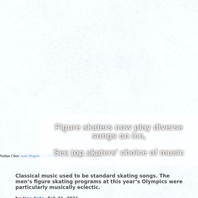](screenshots/naokatoh.github.io/figure_skate_music_index.html-medium-full.jpg)||
|[Where to Find Uni in the US](https://naokatoh.github.io/sea_urchin/)||||
|[International students in Ukraine need more help as Russian intensifies attack](https://naokatoh.github.io/ukraine/)||||
|[Rodents complaints](https://naokatoh.github.io/nycrats/)||||

### Automatic Checks

**https://naokatoh.github.io/**

* Has sideways scrollbars in mobile version – check padding, margins, image widths

**https://naokatoh.github.io/figure_skate_music/**

* Change URL to use `-` instead of spaces or underscores
* Missing viewport meta tag in `<head>`, needed to tell browser it's responsive. Add `<meta name="viewport" content="width=device-width, initial-scale=1, shrink-to-fit=no">`

**https://naokatoh.github.io/sea_urchin/**

* Change URL to use `-` instead of spaces or underscores
* Missing viewport meta tag in `<head>`, needed to tell browser it's responsive. Add `<meta name="viewport" content="width=device-width, initial-scale=1, shrink-to-fit=no">`

**https://naokatoh.github.io/ukraine/**

* Has sideways scrollbars in mobile version – check padding, margins, image widths
* Minimum font size should be 12px, enlarge text in Illustrator
   * Text `Morocco` is too small at 9px
   * Text `Iraq` is too small at 9px
   * Text `Nigeria` is too small at 9px
   * Text `Nigeria` is too small at 9px
   * Text `Russia` is too small at 9px
   * Text `Turkey` is too small at 9px
   * Text `Azerbaijan` is too small at 9px
   * Text `Turkmenistan` is too small at 9px
   * Text `9734` is too small at 8px
   * Text `9979` is too small at 9px
   * Text `India` is too small at 9px
   * Text `Uzbekistan` is too small at 9px
   * Text `Jordan` is too small at 9px
   * Text `Uzbekistan` is too small at 9px
   * Text `4773` is too small at 8px
   * Text ` ` is too small at 10px
   * Text `Nigeria` is too small at 10px
   * Text `Israel` is too small at 10px
   * Text `Turkmenistan` is too small at 10px
   * Text `China` is too small at 10px
   * Text `Morocco` is too small at 10px
   * Text `5721` is too small at 9px
   * Text `14383` is too small at 9px
   * Text `Turkey` is too small at 10px
   * Text `Azerbaijan` is too small at 10px
   * Text `Jordan` is too small at 10px
   * Text `4718` is too small at 9px
   * Text `Egypt` is too small at 10px
* Overlapping elements in ai2html, check [the overflow video](https://www.youtube.com/watch?v=6vHsnjTp3_w) or make a smaller size
   * Text `Nigeria` overlaps with `Nigeria` at screen width 400
   * Text `Uzbekistan` overlaps with `Uzbekistan` at screen width 400
   * Text `Nigeria` overlaps with `Nigeria` at screen width 900
   * Text `Uzbekistan` overlaps with `Uzbekistan` at screen width 900
   * Text `Nigeria` overlaps with `Nigeria` at screen width 1300
   * Text `Uzbekistan` overlaps with `Uzbekistan` at screen width 1300

**https://naokatoh.github.io/nycrats/**

* Has sideways scrollbars in mobile version – check padding, margins, image widths

## pmagtulis.github.io

|url|mobile|medium|wide|
|---|---|---|---|
|[Prinz Magtulis](https://pmagtulis.github.io/)|[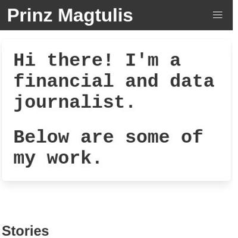](screenshots/pmagtulis.github.io/index.html-mobile-full.jpg)|[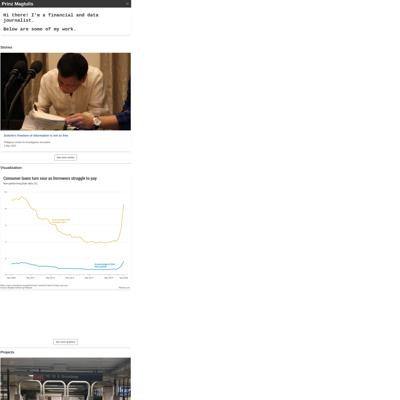](screenshots/pmagtulis.github.io/index.html-medium-full.jpg)||
|[Prinz Magtulis - Projects](https://pmagtulis.github.io/projects/)|||[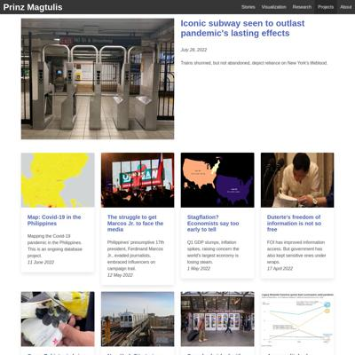](screenshots/pmagtulis.github.io/projects_index.html-wide-full.jpg)|
|[Prinz Magtulis - Projects](https://pmagtulis.github.io/projects/air-quality/)||||
|[Prinz Magtulis - Projects](https://pmagtulis.github.io/projects/polls-ph/)|||[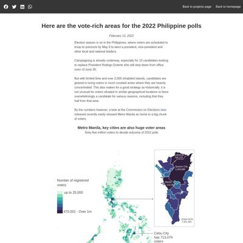](screenshots/pmagtulis.github.io/projects_polls-ph_index.html-wide-full.jpg)|
|[Prinz Magtulis - Projects](https://pmagtulis.github.io/projects/ph-conflict/)||[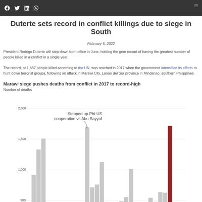](screenshots/pmagtulis.github.io/projects_ph-conflict_index.html-medium-full.jpg)||
|[Prinz Magtulis - Projects](https://pmagtulis.github.io/projects/video-games/)||||

### Automatic Checks

**https://pmagtulis.github.io/**

No issues found! 🎉

**https://pmagtulis.github.io/projects/**

* Has sideways scrollbars in mobile version – check padding, margins, image widths

**https://pmagtulis.github.io/projects/air-quality/**

* Has sideways scrollbars in mobile version – check padding, margins, image widths
* Minimum font size should be 12px, enlarge text in Illustrator
   * Text `Complaints about air` is too small at 10px
   * Text `quality hit a record-high` is too small at 10px
   * Text `in January 2022 ` is too small at 10px
   * Text `800` is too small at 8px
   * Text `complaints` is too small at 8px
   * Text `600` is too small at 8px
   * Text `400` is too small at 8px
   * Text `200` is too small at 8px
   * Text `0` is too small at 8px
   * Text `2008` is too small at 8px
   * Text `2004` is too small at 8px
   * Text `2012` is too small at 8px
   * Text `2016` is too small at 8px
   * Text `2020` is too small at 8px
   * Text `2004` is too small at 8px
   * Text `2008` is too small at 8px
   * Text `2012` is too small at 8px
   * Text `2016` is too small at 8px
   * Text `2020` is too small at 8px
   * Text `800` is too small at 8px
   * Text `complaints` is too small at 8px
   * Text `600` is too small at 8px
   * Text `400` is too small at 8px
   * Text `200` is too small at 8px
   * Text `0` is too small at 8px
   * Text `2004` is too small at 8px
   * Text `2008` is too small at 8px
   * Text `2012` is too small at 8px
   * Text `2016` is too small at 8px
   * Text `2020` is too small at 8px
   * Text `2004` is too small at 8px
   * Text `2008` is too small at 8px
   * Text `2012` is too small at 8px
   * Text `2016` is too small at 8px
   * Text `2020` is too small at 8px
   * Text `800` is too small at 8px
   * Text `Complaints about air quality` is too small at 8px
   * Text `surge in January 2022 ` is too small at 8px
   * Text `complaints` is too small at 8px
   * Text `600` is too small at 8px
   * Text `400` is too small at 8px
   * Text `200` is too small at 8px
   * Text `0` is too small at 8px
   * Text `2004` is too small at 8px
   * Text `2008` is too small at 8px
   * Text `2012` is too small at 8px
   * Text `2016` is too small at 8px
   * Text `2020` is too small at 8px
   * Text `800` is too small at 8px
   * Text `complaints` is too small at 8px
   * Text `600` is too small at 8px
   * Text `400` is too small at 8px
   * Text `200` is too small at 8px
   * Text `0` is too small at 8px
   * Text `2008` is too small at 8px
   * Text `2004` is too small at 8px
   * Text `2012` is too small at 8px
   * Text `2016` is too small at 8px
   * Text `2020` is too small at 8px
   * Text `Complaints about air` is too small at 10px
   * Text `quality hit a record-high` is too small at 10px
   * Text `in January 2022` is too small at 10px
* Overlapping elements in ai2html, check [the overflow video](https://www.youtube.com/watch?v=6vHsnjTp3_w) or make a smaller size
   * Text `100` overlaps with `Air quality complaints` at screen width 400
   * Text `Jun 2021` overlaps with `Feb 2022` at screen width 400
   * Text `2004` overlaps with `2008` at screen width 400
   * Text `2008` overlaps with `2012` at screen width 400
   * Text `2004` overlaps with `2008` at screen width 400
   * Text `2008` overlaps with `2012` at screen width 400
   * Text `2012` overlaps with `2016` at screen width 400
   * Text `2012` overlaps with `2016` at screen width 400
   * Text `2016` overlaps with `2020` at screen width 400
   * Text `2016` overlaps with `2020` at screen width 400
   * Text `2004` overlaps with `2008` at screen width 400
   * Text `2008` overlaps with `2012` at screen width 400
   * Text `2012` overlaps with `2016` at screen width 400
   * Text `2016` overlaps with `2020` at screen width 400
   * Text `2004` overlaps with `2008` at screen width 400
   * Text `2008` overlaps with `2012` at screen width 400
   * Text `2012` overlaps with `2016` at screen width 400
   * Text `2016` overlaps with `2020` at screen width 400
   * Text `2004` overlaps with `2008` at screen width 400
   * Text `2008` overlaps with `2012` at screen width 400
   * Text `2012` overlaps with `2016` at screen width 400
   * Text `2004` overlaps with `2008` at screen width 400
   * Text `2008` overlaps with `2012` at screen width 400
   * Text `2016` overlaps with `2020` at screen width 400
   * Text `2012` overlaps with `2016` at screen width 400
   * Text `2016` overlaps with `2020` at screen width 400
   * Text `100` overlaps with `Air quality complaints` at screen width 900
   * Text `Jun 2021` overlaps with `Feb 2022` at screen width 900
   * Text `2004` overlaps with `2008` at screen width 900
   * Text `2008` overlaps with `2012` at screen width 900
   * Text `2004` overlaps with `2008` at screen width 900
   * Text `2008` overlaps with `2012` at screen width 900
   * Text `2012` overlaps with `2016` at screen width 900
   * Text `2012` overlaps with `2016` at screen width 900
   * Text `2016` overlaps with `2020` at screen width 900
   * Text `2016` overlaps with `2020` at screen width 900
   * Text `2004` overlaps with `2008` at screen width 900
   * Text `2008` overlaps with `2012` at screen width 900
   * Text `2012` overlaps with `2016` at screen width 900
   * Text `2016` overlaps with `2020` at screen width 900
   * Text `2004` overlaps with `2008` at screen width 900
   * Text `2008` overlaps with `2012` at screen width 900
   * Text `2012` overlaps with `2016` at screen width 900
   * Text `2016` overlaps with `2020` at screen width 900
   * Text `2004` overlaps with `2008` at screen width 900
   * Text `2008` overlaps with `2012` at screen width 900
   * Text `2012` overlaps with `2016` at screen width 900
   * Text `2004` overlaps with `2008` at screen width 900
   * Text `2008` overlaps with `2012` at screen width 900
   * Text `2016` overlaps with `2020` at screen width 900
   * Text `2012` overlaps with `2016` at screen width 900
   * Text `2016` overlaps with `2020` at screen width 900
   * Text `100` overlaps with `Air quality complaints` at screen width 1300
   * Text `Jun 2021` overlaps with `Feb 2022` at screen width 1300
   * Text `2004` overlaps with `2008` at screen width 1300
   * Text `2008` overlaps with `2012` at screen width 1300
   * Text `2004` overlaps with `2008` at screen width 1300
   * Text `2008` overlaps with `2012` at screen width 1300
   * Text `2012` overlaps with `2016` at screen width 1300
   * Text `2012` overlaps with `2016` at screen width 1300
   * Text `2016` overlaps with `2020` at screen width 1300
   * Text `2016` overlaps with `2020` at screen width 1300
   * Text `2004` overlaps with `2008` at screen width 1300
   * Text `2008` overlaps with `2012` at screen width 1300
   * Text `2012` overlaps with `2016` at screen width 1300
   * Text `2016` overlaps with `2020` at screen width 1300
   * Text `2004` overlaps with `2008` at screen width 1300
   * Text `2008` overlaps with `2012` at screen width 1300
   * Text `2012` overlaps with `2016` at screen width 1300
   * Text `2016` overlaps with `2020` at screen width 1300
   * Text `2004` overlaps with `2008` at screen width 1300
   * Text `2008` overlaps with `2012` at screen width 1300
   * Text `2012` overlaps with `2016` at screen width 1300
   * Text `2004` overlaps with `2008` at screen width 1300
   * Text `2008` overlaps with `2012` at screen width 1300
   * Text `2016` overlaps with `2020` at screen width 1300
   * Text `2012` overlaps with `2016` at screen width 1300
   * Text `2016` overlaps with `2020` at screen width 1300

**https://pmagtulis.github.io/projects/polls-ph/**

* Has sideways scrollbars in mobile version – check padding, margins, image widths
* Minimum font size should be 12px, enlarge text in Illustrator
   * Text `Caloocan` is too small at 8px
   * Text `700,279` is too small at 8px
   * Text `Quezon City` is too small at 8px
   * Text `1,403,895` is too small at 8px
   * Text `Manila` is too small at 8px
   * Text `1,112,081` is too small at 8px
   * Text `Entire NCR:` is too small at 8px
   * Text `7,301,393` is too small at 8px

**https://pmagtulis.github.io/projects/ph-conflict/**

* Has sideways scrollbars in mobile version – check padding, margins, image widths
* Minimum font size should be 12px, enlarge text in Illustrator
   * Text `Deaths per 100,000 population ` is too small at 8px
   * Text `(2016-2019)` is too small at 8px
   * Text `120` is too small at 7px
   * Text `40` is too small at 7px
   * Text `20` is too small at 7px
   * Text `Deaths per 100,000 population ` is too small at 8px
   * Text `(2016-2019)` is too small at 8px
   * Text `120` is too small at 7px
   * Text `40` is too small at 7px
   * Text `20` is too small at 7px

**https://pmagtulis.github.io/projects/video-games/**

* Has sideways scrollbars in mobile version – check padding, margins, image widths
* Minimum font size should be 12px, enlarge text in Illustrator
   * Text ` ` is too small at 10px

## pmartisa.github.io

|url|mobile|medium|wide|
|---|---|---|---|
|[index.html](https://pmartisa.github.io/)||[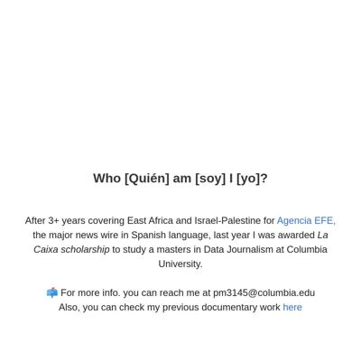](screenshots/pmartisa.github.io/index.html-medium-full.jpg)|[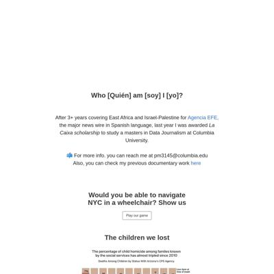](screenshots/pmartisa.github.io/index.html-wide-full.jpg)|
|[project_one/index.html](https://pmartisa.github.io/project_one/)||||
|[project_three/index.html](https://pmartisa.github.io/project_three/index.html)||[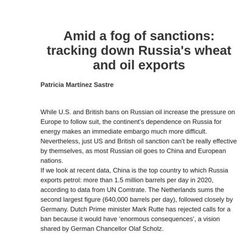](screenshots/pmartisa.github.io/project_three_index.html-medium-full.jpg)||
|[project_two/index.html](https://pmartisa.github.io/project_two/index.html)||||

### Automatic Checks

**https://pmartisa.github.io/**

* Needs a title, add a `<title>` tag to the `<head>`
* Minimum font size should be 12px, enlarge text in Illustrator
   * Text ` ` is too small at 9px
   * Text `Average lead in early generic polls for the party in power or the party out of power .` is too small at 10px
   * Text `2018` is too small at 9px
   * Text `+13.4 pts.` is too small at 9px
   * Text `2016` is too small at 9px
   * Text `1.2` is too small at 9px
   * Text `2014` is too small at 9px
   * Text `3.0` is too small at 9px
   * Text `2012` is too small at 9px
   * Text `1.5` is too small at 9px
   * Text `2010` is too small at 9px
   * Text `0.4` is too small at 9px
   * Text `2008` is too small at 9px
   * Text `11.0` is too small at 9px
   * Text `2006` is too small at 9px
   * Text `10.2` is too small at 9px
   * Text `2004` is too small at 9px
   * Text `2.6` is too small at 9px
   * Text `2002` is too small at 9px
   * Text `0.2` is too small at 9px
   * Text `2000` is too small at 9px
   * Text `4.8` is too small at 9px
   * Text `5.9` is too small at 9px
   * Text `1998` is too small at 9px
   * Text `3.5` is too small at 9px
   * Text `1996` is too small at 9px
   * Text `3.6` is too small at 9px
   * Text `1994` is too small at 9px
   * Text `8.7` is too small at 9px
   * Text `1992` is too small at 9px
   * Text `4.0` is too small at 9px
   * Text `1990` is too small at 9px
   * Text ` ` is too small at 9px
   * Text `Values represent the average of all polls between 220 and 420 days before an election.` is too small at 9px
   * Text ` ` is too small at 9px
   * Text `By The New York Times` is too small at 9px
   * Text `.` is too small at 6px
   * Text `.` is too small at 6px
   * Text `.` is too small at 6px
   * Text `.` is too small at 6px
   * Text `0` is too small at 10px
* Overlapping elements in ai2html, check [the overflow video](https://www.youtube.com/watch?v=6vHsnjTp3_w) or make a smaller size
   * Text `2018 Doesn’t Look Quite Like Other Election Cycles` overlaps with `2018` at screen width 400
   * Text `2018 Doesn’t Look Quite Like Other Election Cycles` overlaps with `+13.4 pts.` at screen width 400
   * Text `2018 Doesn’t Look Quite Like Other Election Cycles` overlaps with `2016` at screen width 400
   * Text `2018 Doesn’t Look Quite Like Other Election Cycles` overlaps with `1.2` at screen width 400
   * Text `2018 Doesn’t Look Quite Like Other Election Cycles` overlaps with `2014` at screen width 400
   * Text `2018 Doesn’t Look Quite Like Other Election Cycles` overlaps with `3.0` at screen width 400
   * Text ` ` overlaps with `2012` at screen width 400
   * Text ` ` overlaps with `1.5` at screen width 400
   * Text `Average lead in early generic polls for the party in power or the party out of power .` overlaps with `2012` at screen width 400
   * Text `Average lead in early generic polls for the party in power or the party out of power .` overlaps with `1.5` at screen width 400
   * Text `Average lead in early generic polls for the party in power or the party out of power .` overlaps with `2010` at screen width 400
   * Text `Average lead in early generic polls for the party in power or the party out of power .` overlaps with `0.4` at screen width 400
   * Text `2016` overlaps with `1.2` at screen width 400
   * Text `2010` overlaps with `0.4` at screen width 400
   * Text `2002` overlaps with `0.2` at screen width 400
   * Text ` ` overlaps with `Incumbents Are Tough to Beat, Even in a Wave` at screen width 400
   * Text `By The New York Times` overlaps with `Incumbents Are Tough to Beat, Even in a Wave` at screen width 400
   * Text `Incumbents Are Tough to Beat, Even in a Wave` overlaps with `Incumbent` at screen width 400
   * Text `Incumbents are typically favored to win, even in difficult districts in a wave election.` overlaps with `Incumbent` at screen width 400
   * Text `Incumbents are typically favored to win, even in difficult districts in a wave election.` overlaps with `Survives` at screen width 400
   * Text `Incumbents are typically favored to win, even in difficult districts in a wave election.` overlaps with `Incumbent Defeated` at screen width 400
   * Text `Incumbents are typically favored to win, even in difficult districts in a wave election.` overlaps with `.` at screen width 400
   * Text `Incumbents are typically favored to win, even in difficult districts in a wave election.` overlaps with `.` at screen width 400
   * Text `Incumbents are typically favored to win, even in difficult districts in a wave election.` overlaps with `.` at screen width 400
   * Text `Incumbents are typically favored to win, even in difficult districts in a wave election.` overlaps with `.` at screen width 400
   * Text `Incumbents are typically favored to win, even in difficult districts in a wave election.` overlaps with `C+7 or greater` at screen width 400
   * Text `Incumbents are typically favored to win, even in difficult districts in a wave election.` overlaps with `24` at screen width 400
   * Text `Incumbents are typically favored to win, even in difficult districts in a wave election.` overlaps with `76%` at screen width 400
   * Text ` ` overlaps with `C+3 to C+7` at screen width 400
   * Text ` ` overlaps with `63` at screen width 400
   * Text ` ` overlaps with `37` at screen width 400
   * Text `Winning percentage for incumbents representing the president’s party in 2006 and 2010, by their party’s advantage in Cook P.V.I.` overlaps with `C+1 to C+3` at screen width 400
   * Text `Winning percentage for incumbents representing the president’s party in 2006 and 2010, by their party’s advantage in Cook P.V.I.` overlaps with `61` at screen width 400
   * Text `Winning percentage for incumbents representing the president’s party in 2006 and 2010, by their party’s advantage in Cook P.V.I.` overlaps with `39` at screen width 400
   * Text `Winning percentage for incumbents representing the president’s party in 2006 and 2010, by their party’s advantage in Cook P.V.I.` overlaps with `I+1 to C+1` at screen width 400
   * Text `Winning percentage for incumbents representing the president’s party in 2006 and 2010, by their party’s advantage in Cook P.V.I.` overlaps with `65` at screen width 400
   * Text `Winning percentage for incumbents representing the president’s party in 2006 and 2010, by their party’s advantage in Cook P.V.I.` overlaps with `35` at screen width 400
   * Text `Winning percentage for incumbents representing the president’s party in 2006 and 2010, by their party’s advantage in Cook P.V.I.` overlaps with `25` at screen width 400
   * Text `Winning percentage for incumbents representing the president’s party in 2006 and 2010, by their party’s advantage in Cook P.V.I.` overlaps with `I+1 to I+3` at screen width 400
   * Text `Winning percentage for incumbents representing the president’s party in 2006 and 2010, by their party’s advantage in Cook P.V.I.` overlaps with `75` at screen width 400
   * Text `Survives` overlaps with `.` at screen width 400
   * Text `Survives` overlaps with `24` at screen width 400
   * Text `Incumbent Defeated` overlaps with `.` at screen width 400
   * Text `Incumbent Defeated` overlaps with `.` at screen width 400
   * Text `I+5 to I+10` overlaps with `7` at screen width 400
   * Text `France` overlaps with `31.5%` at screen width 400
   * Text `France` overlaps with `Finland` at screen width 400
   * Text `France` overlaps with `30.8` at screen width 400
   * Text `31.5%` overlaps with `Finland` at screen width 400
   * Text `31.5%` overlaps with `30.8` at screen width 400
   * Text `Finland` overlaps with `30.8` at screen width 400
   * Text `Finland` overlaps with `Belgium` at screen width 400
   * Text `Finland` overlaps with `29.0` at screen width 400
   * Text `30.8` overlaps with `Belgium` at screen width 400
   * Text `30.8` overlaps with `29.0` at screen width 400
   * Text `Belgium` overlaps with `29.0` at screen width 400
   * Text `Belgium` overlaps with `Italy` at screen width 400
   * Text `Belgium` overlaps with `28.9` at screen width 400
   * Text `29.0` overlaps with `Italy` at screen width 400
   * Text `29.0` overlaps with `28.9` at screen width 400
   * Text `Italy` overlaps with `28.9` at screen width 400
   * Text `Italy` overlaps with `Denmark` at screen width 400
   * Text `Italy` overlaps with `28.7` at screen width 400
   * Text `28.9` overlaps with `Denmark` at screen width 400
   * Text `28.9` overlaps with `28.7` at screen width 400
   * Text `Denmark` overlaps with `28.7` at screen width 400
   * Text `Denmark` overlaps with `Austria` at screen width 400
   * Text `Denmark` overlaps with `27.8` at screen width 400
   * Text `28.7` overlaps with `Austria` at screen width 400
   * Text `28.7` overlaps with `27.8` at screen width 400
   * Text `Austria` overlaps with `27.8` at screen width 400
   * Text `Austria` overlaps with `Sweden` at screen width 400
   * Text `Austria` overlaps with `27.1` at screen width 400
   * Text `27.8` overlaps with `Sweden` at screen width 400
   * Text `27.8` overlaps with `27.1` at screen width 400
   * Text `Sweden` overlaps with `27.1` at screen width 400
   * Text `Sweden` overlaps with `Greece` at screen width 400
   * Text `Sweden` overlaps with `27.0` at screen width 400
   * Text `27.1` overlaps with `Greece` at screen width 400
   * Text `27.1` overlaps with `27.0` at screen width 400
   * Text `Greece` overlaps with `27.0` at screen width 400
   * Text `Greece` overlaps with `Germany` at screen width 400
   * Text `Greece` overlaps with `25.3` at screen width 400
   * Text `27.0` overlaps with `Germany` at screen width 400
   * Text `27.0` overlaps with `25.3` at screen width 400
   * Text `Germany` overlaps with `25.3` at screen width 400
   * Text `Germany` overlaps with `Norway` at screen width 400
   * Text `Germany` overlaps with `25.1` at screen width 400
   * Text `25.3` overlaps with `Norway` at screen width 400
   * Text `25.3` overlaps with `25.1` at screen width 400
   * Text `Norway` overlaps with `25.1` at screen width 400
   * Text `Norway` overlaps with `Spain` at screen width 400
   * Text `Norway` overlaps with `24.6` at screen width 400
   * Text `25.1` overlaps with `Spain` at screen width 400
   * Text `25.1` overlaps with `24.6` at screen width 400
   * Text `Spain` overlaps with `24.6` at screen width 400
   * Text `Spain` overlaps with `Portugal` at screen width 400
   * Text `Spain` overlaps with `24.1` at screen width 400
   * Text `24.6` overlaps with `Portugal` at screen width 400
   * Text `24.6` overlaps with `24.1` at screen width 400
   * Text `Portugal` overlaps with `24.1` at screen width 400
   * Text `Portugal` overlaps with `Japan` at screen width 400
   * Text `Portugal` overlaps with `23.1` at screen width 400
   * Text `24.1` overlaps with `Japan` at screen width 400
   * Text `24.1` overlaps with `23.1` at screen width 400
   * Text `Japan` overlaps with `23.1` at screen width 400
   * Text `Japan` overlaps with `Slovenia` at screen width 400
   * Text `Japan` overlaps with `22.8` at screen width 400
   * Text `23.1` overlaps with `Slovenia` at screen width 400
   * Text `23.1` overlaps with `22.8` at screen width 400
   * Text `Slovenia` overlaps with `22.8` at screen width 400
   * Text `Slovenia` overlaps with `Netherlands` at screen width 400
   * Text `Slovenia` overlaps with `22.0` at screen width 400
   * Text `22.8` overlaps with `Netherlands` at screen width 400
   * Text `22.8` overlaps with `22.0` at screen width 400
   * Text `Netherlands` overlaps with `22.0` at screen width 400
   * Text `Netherlands` overlaps with `Luxembourg` at screen width 400
   * Text `Netherlands` overlaps with `21.8` at screen width 400
   * Text `22.0` overlaps with `Luxembourg` at screen width 400
   * Text `22.0` overlaps with `21.8` at screen width 400
   * Text `Luxembourg` overlaps with `21.8` at screen width 400
   * Text `Luxembourg` overlaps with `Britain` at screen width 400
   * Text `Luxembourg` overlaps with `21.5` at screen width 400
   * Text `21.8` overlaps with `Britain` at screen width 400
   * Text `21.8` overlaps with `21.5` at screen width 400
   * Text `Britain` overlaps with `21.5` at screen width 400
   * Text `Britain` overlaps with `O.E.C.D. avg.` at screen width 400
   * Text `Britain` overlaps with `21.0` at screen width 400
   * Text `21.5` overlaps with `O.E.C.D. avg.` at screen width 400
   * Text `21.5` overlaps with `21.0` at screen width 400
   * Text `O.E.C.D. avg.` overlaps with `21.0` at screen width 400
   * Text `O.E.C.D. avg.` overlaps with `Hungary` at screen width 400
   * Text `O.E.C.D. avg.` overlaps with `20.6` at screen width 400
   * Text `21.0` overlaps with `Hungary` at screen width 400
   * Text `21.0` overlaps with `20.6` at screen width 400
   * Text `Hungary` overlaps with `20.6` at screen width 400
   * Text `Hungary` overlaps with `Poland` at screen width 400
   * Text `Hungary` overlaps with `20.2` at screen width 400
   * Text `20.6` overlaps with `Poland` at screen width 400
   * Text `20.6` overlaps with `20.2` at screen width 400
   * Text `Poland` overlaps with `20.2` at screen width 400
   * Text `Poland` overlaps with `Switzerland` at screen width 400
   * Text `Poland` overlaps with `19.7` at screen width 400
   * Text `20.2` overlaps with `Switzerland` at screen width 400
   * Text `20.2` overlaps with `19.7` at screen width 400
   * Text `Switzerland` overlaps with `19.7` at screen width 400
   * Text `Switzerland` overlaps with `New Zealand` at screen width 400
   * Text `Switzerland` overlaps with `19.5` at screen width 400
   * Text `19.7` overlaps with `New Zealand` at screen width 400
   * Text `19.7` overlaps with `19.5` at screen width 400
   * Text `New Zealand` overlaps with `19.5` at screen width 400
   * Text `New Zealand` overlaps with `Czech Republic` at screen width 400
   * Text `New Zealand` overlaps with `19.4` at screen width 400
   * Text `19.5` overlaps with `Czech Republic` at screen width 400
   * Text `19.5` overlaps with `19.4` at screen width 400
   * Text `Czech Republic` overlaps with `19.4` at screen width 400
   * Text `Czech Republic` overlaps with `United States` at screen width 400
   * Text `Czech Republic` overlaps with `19.3` at screen width 400
   * Text `19.4` overlaps with `United States` at screen width 400
   * Text `19.4` overlaps with `19.3` at screen width 400
   * Text `United States` overlaps with `19.3` at screen width 400
   * Text `United States` overlaps with `Australia` at screen width 400
   * Text `United States` overlaps with `19.1` at screen width 400
   * Text `19.3` overlaps with `Australia` at screen width 400
   * Text `19.3` overlaps with `19.1` at screen width 400
   * Text `Australia` overlaps with `19.1` at screen width 400
   * Text `Australia` overlaps with `Slovakia` at screen width 400
   * Text `Australia` overlaps with `18.6` at screen width 400
   * Text `19.1` overlaps with `Slovakia` at screen width 400
   * Text `19.1` overlaps with `18.6` at screen width 400
   * Text `Slovakia` overlaps with `18.6` at screen width 400
   * Text `Slovakia` overlaps with `Estonia` at screen width 400
   * Text `Slovakia` overlaps with `17.4` at screen width 400
   * Text `18.6` overlaps with `Estonia` at screen width 400
   * Text `18.6` overlaps with `17.4` at screen width 400
   * Text `Estonia` overlaps with `17.4` at screen width 400
   * Text `Estonia` overlaps with `Canada` at screen width 400
   * Text `Estonia` overlaps with `17.2` at screen width 400
   * Text `17.4` overlaps with `Canada` at screen width 400
   * Text `17.4` overlaps with `17.2` at screen width 400
   * Text `Canada` overlaps with `17.2` at screen width 400
   * Text `Canada` overlaps with `Ireland` at screen width 400
   * Text `Canada` overlaps with `16.1` at screen width 400
   * Text `17.2` overlaps with `Ireland` at screen width 400
   * Text `17.2` overlaps with `16.1` at screen width 400
   * Text `Ireland` overlaps with `16.1` at screen width 400
   * Text `Ireland` overlaps with `Israel` at screen width 400
   * Text `Ireland` overlaps with `16.1` at screen width 400
   * Text `16.1` overlaps with `Israel` at screen width 400
   * Text `16.1` overlaps with `16.1` at screen width 400
   * Text `Israel` overlaps with `16.1` at screen width 400
   * Text `Israel` overlaps with `Iceland` at screen width 400
   * Text `Israel` overlaps with `15.2` at screen width 400
   * Text `16.1` overlaps with `Iceland` at screen width 400
   * Text `16.1` overlaps with `15.2` at screen width 400
   * Text `Iceland` overlaps with `15.2` at screen width 400
   * Text `Iceland` overlaps with `Latvia` at screen width 400
   * Text `Iceland` overlaps with `14.5` at screen width 400
   * Text `15.2` overlaps with `Latvia` at screen width 400
   * Text `15.2` overlaps with `14.5` at screen width 400
   * Text `Latvia` overlaps with `14.5` at screen width 400
   * Text `Latvia` overlaps with `Turkey` at screen width 400
   * Text `Latvia` overlaps with `13.5` at screen width 400
   * Text `14.5` overlaps with `Turkey` at screen width 400
   * Text `14.5` overlaps with `13.5` at screen width 400
   * Text `Turkey` overlaps with `13.5` at screen width 400
   * Text `Turkey` overlaps with `Chile` at screen width 400
   * Text `Turkey` overlaps with `11.2` at screen width 400
   * Text `13.5` overlaps with `Chile` at screen width 400
   * Text `13.5` overlaps with `11.2` at screen width 400
   * Text `Chile` overlaps with `11.2` at screen width 400
   * Text `Chile` overlaps with `South Korea` at screen width 400
   * Text `Chile` overlaps with `10.4` at screen width 400
   * Text `11.2` overlaps with `South Korea` at screen width 400
   * Text `11.2` overlaps with `10.4` at screen width 400
   * Text `South Korea` overlaps with `10.4` at screen width 400
   * Text `South Korea` overlaps with `Mexico` at screen width 400
   * Text `South Korea` overlaps with `7.5` at screen width 400
   * Text `10.4` overlaps with `Mexico` at screen width 400
   * Text `10.4` overlaps with `7.5` at screen width 400
   * Text `Mexico` overlaps with `7.5` at screen width 400
   * Text ` ` overlaps with `Delta wave` at screen width 400
   * Text ` ` overlaps with `Omicron wave` at screen width 400
   * Text ` ` overlaps with `Jan. 2021 peak` at screen width 400
   * Text ` ` overlaps with `600k` at screen width 400
   * Text `Jan. 2021 peak` overlaps with `Delta wave` at screen width 400
   * Text `Jan. 2021 peak` overlaps with `Omicron wave` at screen width 400
   * Text `Jan. 2021 peak` overlaps with `Jan. 2021 peak` at screen width 400
   * Text `Jan. 2021 peak` overlaps with `600k` at screen width 400
   * Text `Jan. 2021 peak` overlaps with `600k` at screen width 400
   * Text `0` overlaps with `Dec. 1, 2020` at screen width 400
   * Text `Aug. 1. 2021` overlaps with `Oct. 1, 2021` at screen width 400
   * Text `Oct. 1, 2021` overlaps with `Jan. 5, 2022` at screen width 400
   * Text `Nigel Richard's Performance At Nationals` overlaps with `Average scores for 2013 National Scrabble Championship` at screen width 400
   * Text `DIVISION` overlaps with `1` at screen width 400
   * Text `440` overlaps with `WORSE` at screen width 400
   * Text `320` overlaps with `340` at screen width 400
   * Text `340` overlaps with `360` at screen width 400
   * Text `360` overlaps with `380` at screen width 400
   * Text `360` overlaps with `Points for` at screen width 400
   * Text `380` overlaps with `400` at screen width 400
   * Text `380` overlaps with `Points for` at screen width 400
   * Text `400` overlaps with `420` at screen width 400
   * Text `400` overlaps with `Points for` at screen width 400
   * Text `420` overlaps with `440` at screen width 400
   * Text `420` overlaps with `Points for` at screen width 400
   * Text `Turkey` overlaps with `13.5` at screen width 900
   * Text `Chile` overlaps with `11.2` at screen width 900
   * Text `DIVISION` overlaps with `1` at screen width 900
   * Text `Turkey` overlaps with `13.5` at screen width 1300
   * Text `Chile` overlaps with `11.2` at screen width 1300
   * Text `DIVISION` overlaps with `1` at screen width 1300

**https://pmartisa.github.io/project_one/**

* Needs a title, add a `<title>` tag to the `<head>`
* Change URL to use `-` instead of spaces or underscores

**https://pmartisa.github.io/project_three/index.html**

* Needs a title, add a `<title>` tag to the `<head>`
* Change URL to use `-` instead of spaces or underscores
* Has sideways scrollbars in mobile version – check padding, margins, image widths
* Minimum font size should be 12px, enlarge text in Illustrator
   * Text `Stronger colors for countries that haven’t imposed` is too small at 8px
   * Text `any sanction.` is too small at 8px
   * Text `China` is too small at 10px
   * Text `more than 1.5 million barrels per day` is too small at 9px
   * Text `Netherlands` is too small at 10px
   * Text `640,000` is too small at 9px
   * Text `barrels/day` is too small at 9px
   * Text `Belarus` is too small at 10px
   * Text `297,000` is too small at 9px
   * Text `barrels/day` is too small at 9px
   * Text `Germany` is too small at 10px
   * Text `Poland` is too small at 10px
   * Text `300,000` is too small at 9px
   * Text `barrels/day` is too small at 9px
   * Text `Rep. of Korea` is too small at 10px
   * Text `Italy` is too small at 10px
   * Text `186,000` is too small at 9px
   * Text `barrels/day` is too small at 9px
   * Text `Finland` is too small at 10px
   * Text `Japan` is too small at 10px
   * Text `Slovakia` is too small at 10px
   * Text `Turkey` is too small at 10px
   * Text `Stronger colors for countries that ` is too small at 5px
   * Text `haven’t imposed ` is too small at 5px
   * Text `any sanction.` is too small at 5px
   * Text `China` is too small at 7px
   * Text `2018` is too small at 10px
   * Text `more than 1.5 ` is too small at 6px
   * Text `million barrels ` is too small at 6px
   * Text `per day` is too small at 6px
   * Text `Netherlands` is too small at 7px
   * Text `640,000` is too small at 6px
   * Text `barrels/day` is too small at 6px
   * Text `2019` is too small at 10px
   * Text `Belarus` is too small at 7px
   * Text `297,000` is too small at 6px
   * Text `barrels/day` is too small at 6px
   * Text `Germany` is too small at 7px
   * Text `Poland` is too small at 7px
   * Text `300,000` is too small at 6px
   * Text `barrels/day` is too small at 6px
   * Text `Rep. of Korea` is too small at 7px
   * Text `2020` is too small at 10px
   * Text `Italy` is too small at 7px
   * Text `186,000` is too small at 6px
   * Text ` barrels/day` is too small at 6px
   * Text `Finland` is too small at 7px
   * Text `Japan` is too small at 7px
   * Text `Slovakia` is too small at 7px
   * Text `Turkey` is too small at 7px
   * Text `Stronger colors for countries that haven’t imposed ` is too small at 7px
   * Text `any sanction.` is too small at 7px
   * Text `China` is too small at 9px
   * Text `more than 1.5 million barrels per day` is too small at 7px
   * Text `Netherlands` is too small at 9px
   * Text `640,000` is too small at 7px
   * Text `barrels/day` is too small at 7px
   * Text `297,000` is too small at 7px
   * Text `barrels/day` is too small at 7px
   * Text `Belarus` is too small at 9px
   * Text `Germany` is too small at 9px
   * Text `Poland` is too small at 9px
   * Text `300,000` is too small at 7px
   * Text `barrels/day` is too small at 7px
   * Text `Rep. of Korea` is too small at 9px
   * Text `Italy` is too small at 9px
   * Text `186,000` is too small at 7px
   * Text ` barrels/day` is too small at 7px
   * Text `Finland` is too small at 9px
   * Text `Japan` is too small at 9px
   * Text `Slovakia` is too small at 9px
   * Text `Turkey` is too small at 9px
   * Text `1,94` is too small at 10px
   * Text `8.25 million metric tonnes ` is too small at 10px
   * Text `1,38` is too small at 10px
   * Text `1,33` is too small at 10px
   * Text `Yemen` is too small at 10px
   * Text `796,10` is too small at 9px
   * Text `1,17` is too small at 10px
   * Text `Tanzania` is too small at 10px
   * Text `700,911` is too small at 9px
   * Text `Nigeria` is too small at 10px
   * Text `United Arab ` is too small at 9px
   * Text `Emirates` is too small at 9px
   * Text `998,13` is too small at 9px
   * Text `674,558` is too small at 8px
   * Text `Azerbaijan` is too small at 9px
   * Text `2,58` is too small at 10px
   * Text `1,28` is too small at 10px
   * Text `United Arab ` is too small at 10px
   * Text `Emirates` is too small at 10px
   * Text `986,95` is too small at 10px
   * Text `736,156` is too small at 10px
   * Text `Viet Nam` is too small at 10px
   * Text `604,543` is too small at 10px
   * Text `894,72` is too small at 10px
   * Text `880,507` is too small at 9px
   * Text `Latvia` is too small at 10px
   * Text `578,806` is too small at 10px
* Overlapping elements in ai2html, check [the overflow video](https://www.youtube.com/watch?v=6vHsnjTp3_w) or make a smaller size
   * Text `Nigeria` overlaps with `Yemen` at screen width 1300
   * Text `894,72` overlaps with `880,507` at screen width 1300
* Missing font(s), you might need web fonts – [text explanation](https://gist.github.com/jsoma/631621e0807b26d49f5aef5260f79162), [video explanation](https://www.youtube.com/watch?v=HNhIeb_jEYM&list=PLewNEVDy7gq3MSrrO3eMEW8PhGMEVh2X2&index=3)
   * `"Myriad Concept Roman"` font not found, used in 7 text objects. Example: _Stronger colors for countries that haven’t imposed, any sanction., Stronger colors for countries that _
   * `"Myriad Pro"` font not found, used in 29 text objects. Example: _more than 1.5 million barrels per day, 640,000, barrels/day_
   * `"Times Roman"` font not found, used in 153 text objects. Example: _ Moderately Low (10% - 20%), Very High (above 40%), Prevalence of insufficient _

**https://pmartisa.github.io/project_two/index.html**

* Needs a title, add a `<title>` tag to the `<head>`
* Change URL to use `-` instead of spaces or underscores

## sarahgrevy.github.io

|url|mobile|medium|wide|
|---|---|---|---|
|[Sarah Grevy Gotfredsen Portfolio](https://sarahgrevy.github.io/)|||[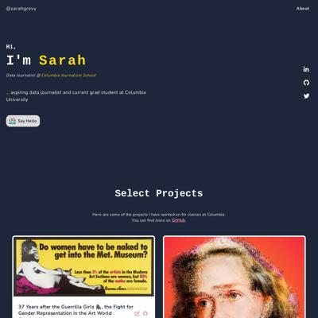](screenshots/sarahgrevy.github.io/index.html-wide-full.jpg)|
|[Sarah Grevy Gotfredsen Portfolio](https://sarahgrevy.github.io/co2_emission)||||
|[Sarah Grevy Gotfredsen Portfolio](https://sarahgrevy.github.io/weather_project)||||
|[Sarah Grevy Gotfredsen Portfolio](https://sarahgrevy.github.io/wordle)||[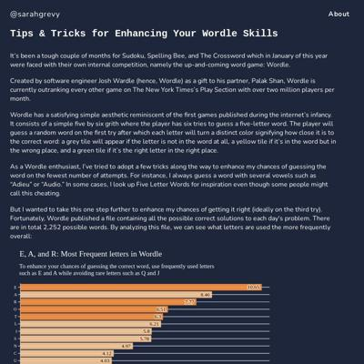](screenshots/sarahgrevy.github.io/wordle_index.html-medium-full.jpg)||

### Automatic Checks

**https://sarahgrevy.github.io/**

No issues found! 🎉

**https://sarahgrevy.github.io/co2_emission**

* Change URL to use `-` instead of spaces or underscores

**https://sarahgrevy.github.io/weather_project**

* Change URL to use `-` instead of spaces or underscores

**https://sarahgrevy.github.io/wordle**

No issues found! 🎉

## semerriam.github.io

|url|mobile|medium|wide|
|---|---|---|---|
|[Susan Merriam](https://semerriam.github.io/)||||
|[First Visual Story](https://semerriam.github.io/nicar_first_visual_story)||||
|[Susan Merriam](https://semerriam.github.io/projects/pj-ec-schools)||||
|[Susan Merriam](https://semerriam.github.io/projects/pj-census-quirks)||||

### Automatic Checks

**https://semerriam.github.io/**

No issues found! 🎉

**https://semerriam.github.io/nicar_first_visual_story**

* Change URL to use `-` instead of spaces or underscores
* Has sideways scrollbars in mobile version – check padding, margins, image widths

**https://semerriam.github.io/projects/pj-ec-schools**

* Has sideways scrollbars in mobile version – check padding, margins, image widths
* Minimum font size should be 12px, enlarge text in Illustrator
   * Text `150k` is too small at 9px
   * Text `150k` is too small at 9px
   * Text `100 ` is too small at 9px
   * Text `100 ` is too small at 9px
   * Text `50` is too small at 9px
   * Text `50` is too small at 9px
   * Text `0` is too small at 9px
   * Text `0` is too small at 9px
   * Text `0` is too small at 9px
   * Text `10` is too small at 9px
   * Text `20` is too small at 9px
   * Text `30mi` is too small at 9px
   * Text `0` is too small at 9px
   * Text `10` is too small at 9px
   * Text `20` is too small at 9px
   * Text `30mi` is too small at 9px
   * Text `Student Population` is too small at 10px
   * Text `Lawrence: 12,786` is too small at 10px
   * Text `N. Andover: 4,493` is too small at 10px
   * Text `Andover: 5,456` is too small at 10px
   * Text `150k` is too small at 10px
   * Text `0` is too small at 10px
   * Text `Distance: 1.6 mi —` is too small at 10px
   * Text `Driving Distance: 3.9 mi, 9 min. —` is too small at 10px
   * Text `30mi` is too small at 10px
   * Text `0` is too small at 10px
   * Text `150k` is too small at 10px
   * Text `0k` is too small at 10px
   * Text `0` is too small at 10px
   * Text `30mi` is too small at 10px
   * Text `Driving Distance: 3.9 mi, 9 min. —` is too small at 10px
   * Text `Distance: 1.6 mi —` is too small at 10px
   * Text `Student Population` is too small at 10px
   * Text `Lawrence: 12,786` is too small at 10px
   * Text `N. Andover: 4,493` is too small at 10px
   * Text `Andover: 5,456` is too small at 10px
   * Text `White` is too small at 9px
   * Text `Hispanic` is too small at 9px
   * Text `Asian` is too small at 9px
   * Text `Black` is too small at 9px
   * Text `Two or more races` is too small at 9px
   * Text `American Indian / Alaska Native` is too small at 9px
   * Text `Native Hawaiian / Pacific Islander` is too small at 9px
   * Text `Andover` is too small at 9px
   * Text `1,195` is too small at 9px
   * Text `341` is too small at 9px
   * Text `Lawrence` is too small at 9px
   * Text `2,946` is too small at 9px
   * Text `North Andover` is too small at 9px
   * Text `1,048` is too small at 9px
   * Text `The total student population is distributed according to the current size of the school to achieve “racial balance.” For example, white students represent 37 percent of the total student population for the three schools. Lawrence High School would have 1,161 white students (37%) of the total 3,126 school population, gaining 1,082 white students from the other two schools.` is too small at 9px
   * Text `Andover` is too small at 9px
   * Text `650` is too small at 9px
   * Text `904` is too small at 9px
   * Text `Lawrence` is too small at 9px
   * Text `1,161` is too small at 9px
   * Text `1,613` is too small at 9px
   * Text `North Andover` is too small at 9px
   * Text `511` is too small at 9px
   * Text `710` is too small at 9px
   * Text `The total student population is distributed equally between the three schools to achieve “racial balance” ` is too small at 9px
   * Text `Andover` is too small at 9px
   * Text `774` is too small at 9px
   * Text `1,076` is too small at 9px
   * Text `Lawrence` is too small at 9px
   * Text `774` is too small at 9px
   * Text `1,076` is too small at 9px
   * Text `North Andover` is too small at 9px
   * Text `774` is too small at 9px
   * Text `1,076` is too small at 9px
* Overlapping elements in ai2html, check [the overflow video](https://www.youtube.com/watch?v=6vHsnjTp3_w) or make a smaller size
   * Text `North Andover` overlaps with `1,048` at screen width 400
   * Text `North Andover` overlaps with `511` at screen width 400
   * Text `North Andover` overlaps with `774` at screen width 400
   * Text `North Andover` overlaps with `1,048` at screen width 900
   * Text `North Andover` overlaps with `511` at screen width 900
   * Text `North Andover` overlaps with `774` at screen width 900

**https://semerriam.github.io/projects/pj-census-quirks**

* Minimum font size should be 12px, enlarge text in Illustrator
   * Text `0` is too small at 10px
   * Text `200` is too small at 10px
   * Text `400` is too small at 10px
   * Text `600` is too small at 10px
   * Text `800` is too small at 10px
   * Text `1000` is too small at 10px
   * Text `1200` is too small at 10px
   * Text `1400` is too small at 10px
   * Text `1600` is too small at 10px
   * Text `1800` is too small at 10px
   * Text `0` is too small at 10px
   * Text `200` is too small at 10px
   * Text `400` is too small at 10px
   * Text `600` is too small at 10px
   * Text `800` is too small at 10px
   * Text `1000` is too small at 10px
   * Text `1200` is too small at 10px
   * Text `1400` is too small at 10px
   * Text `1600` is too small at 10px
   * Text `1800` is too small at 10px
   * Text `0` is too small at 10px
   * Text `200` is too small at 10px
   * Text `400` is too small at 10px
   * Text `600` is too small at 10px
   * Text `800` is too small at 10px
   * Text `1000` is too small at 10px
   * Text `1200` is too small at 10px
   * Text `1400` is too small at 10px
   * Text `1600` is too small at 10px
   * Text `1800` is too small at 10px

## sriharshadevulapalli.github.io

|url|mobile|medium|wide|
|---|---|---|---|
|[Sriharsha Devulapalli](https://sriharshadevulapalli.github.io/)||[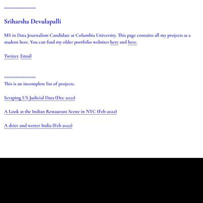](screenshots/sriharshadevulapalli.github.io/index.html-medium-full.jpg)||
|[This is your title](https://sriharshadevulapalli.github.io/indian-airline-routes/index.html)|[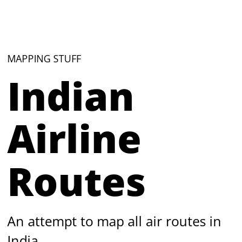](screenshots/sriharshadevulapalli.github.io/indian-airline-routes_index.html-mobile-full.jpg)|||
|[Sriharsha Devulapalli](https://sriharshadevulapalli.github.io/new-york-city-indian-food-menus/)||||
|[Harsha - Indian Rainfall](https://sriharshadevulapalli.github.io/rainfall-patterns-in-india/index.html)||[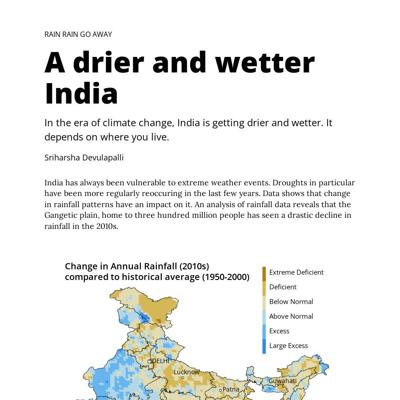](screenshots/sriharshadevulapalli.github.io/rainfall-patterns-in-india_index.html-medium-full.jpg)||

### Automatic Checks

**https://sriharshadevulapalli.github.io/**

No issues found! 🎉

**https://sriharshadevulapalli.github.io/indian-airline-routes/index.html**

* Minimum font size should be 12px, enlarge text in Illustrator
   * Text `Delhi` is too small at 10px
   * Text `Guwahati` is too small at 10px
   * Text `Ahmedabad` is too small at 10px
   * Text `Kolkata` is too small at 10px
   * Text `Mumbai` is too small at 10px
   * Text `Pune` is too small at 10px
   * Text `Hyderabad` is too small at 10px
   * Text `Bengaluru` is too small at 10px
   * Text `Chennai` is too small at 10px
   * Text `Kochi` is too small at 10px
   * Text `The national` is too small at 10px
   * Text `carrier ` is too small at 10px
   * Text `has  the` is too small at 10px
   * Text `most ` is too small at 10px
   * Text `extensive` is too small at 10px
   * Text `network` is too small at 10px
   * Text `Delhi` is too small at 9px
   * Text `Guwahati` is too small at 9px
   * Text `Ahmedabad` is too small at 9px
   * Text `Kolkata` is too small at 9px
   * Text `Mumbai` is too small at 9px
   * Text `Pune` is too small at 9px
   * Text `Hyderabad` is too small at 9px
   * Text `Bengaluru` is too small at 9px
   * Text `Chennai` is too small at 9px
   * Text `Kochi` is too small at 9px
   * Text `Delhi` is too small at 10px
   * Text `Jaipur` is too small at 10px
   * Text `Ahmedabad` is too small at 10px
   * Text `Mumbai` is too small at 10px
   * Text `Pune` is too small at 10px
   * Text `Hyderabad` is too small at 10px
   * Text `Bengaluru` is too small at 10px
   * Text `Chennai` is too small at 10px
   * Text `Delhi` is too small at 10px
   * Text `Jaipur` is too small at 10px
   * Text `Ahmedabad` is too small at 10px
   * Text `Mumbai` is too small at 10px
   * Text `Pune` is too small at 10px
   * Text `Hyderabad` is too small at 10px
   * Text `Bengaluru` is too small at 10px
   * Text `Chennai` is too small at 10px
   * Text `Spicejet has` is too small at 10px
   * Text `largely` is too small at 10px
   * Text `focused ` is too small at 10px
   * Text `on the Southern` is too small at 10px
   * Text `region of India` is too small at 10px
   * Text `Delhi` is too small at 9px
   * Text `Jaipur` is too small at 9px
   * Text `Ahmedabad` is too small at 9px
   * Text `Mumbai` is too small at 9px
   * Text `Pune` is too small at 9px
   * Text `Hyderabad` is too small at 9px
   * Text `Bengaluru` is too small at 9px
   * Text `Chennai` is too small at 9px
* Missing font(s), you might need web fonts – [text explanation](https://gist.github.com/jsoma/631621e0807b26d49f5aef5260f79162), [video explanation](https://www.youtube.com/watch?v=HNhIeb_jEYM&list=PLewNEVDy7gq3MSrrO3eMEW8PhGMEVh2X2&index=3)
   * `"Source Sans Pro"` font not found, used in 98 text objects. Example: _Air India, The national, carrier has the_

**https://sriharshadevulapalli.github.io/new-york-city-indian-food-menus/**

No issues found! 🎉

**https://sriharshadevulapalli.github.io/rainfall-patterns-in-india/index.html**

* Overlapping elements in ai2html, check [the overflow video](https://www.youtube.com/watch?v=6vHsnjTp3_w) or make a smaller size
   * Text `compared to historical average (1950-2000)` overlaps with `Extreme Deficient` at screen width 400
   * Text `The Gangetic Plain ranging from Haryana to West Bengal has seen a decline in annual rainfall in the 2010s compared to their historical average` overlaps with `Lucknow` at screen width 400
   * Text `The Gangetic Plain ranging from Haryana to West Bengal has seen a decline in annual rainfall in the 2010s compared to their historical average` overlaps with `Guwahati` at screen width 400
   * Text `The Gangetic Plain ranging from Haryana to West Bengal has seen a decline in annual rainfall in the 2010s compared to their historical average` overlaps with `Patna` at screen width 400
   * Text `The Gangetic Plain ranging from Haryana to West Bengal has seen a decline in annual rainfall in the 2010s compared to their historical average` overlaps with `Kolkata` at screen width 400
   * Text `The Gangetic Plain ranging from Haryana to West Bengal has seen a decline in annual rainfall in the 2010s compared to their historical average` overlaps with `Source : Pai D.S., Latha Sridhar, Rajeevan M., Sreejith O.P., Satbhai N.S. and Mukhopadhyay B., 2014: Development of a new high spatial resolution (0.25° X 0.25°)Long period (1901-2010) daily gridded rainfall data set over India and its comparison with existing data sets over the region; MAUSAM, 65, 1(January 2014), pp1-18.` at screen width 400
   * Text `Bengaluru` overlaps with `Chennai` at screen width 400

## srjouppi.github.io

|url|mobile|medium|wide|
|---|---|---|---|
|[Shelby Jouppi: Data Journalist & Multimedia Specialist](https://srjouppi.github.io/)||||
|[Colorado Parks Mobility Analysis](https://srjouppi.github.io/colorado-parks-mobility/)|[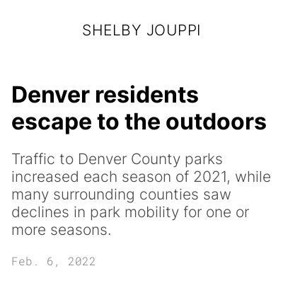](screenshots/srjouppi.github.io/colorado-parks-mobility_index.html-mobile-full.jpg)|||
|["The Cost of COVID"](https://srjouppi.github.io/covid-gofundme-analysis/)||||

### Automatic Checks

**https://srjouppi.github.io/**

* Has sideways scrollbars in mobile version – check padding, margins, image widths

**https://srjouppi.github.io/colorado-parks-mobility/**

No issues found! 🎉

**https://srjouppi.github.io/covid-gofundme-analysis/**

* Has sideways scrollbars in mobile version – check padding, margins, image widths

## stephenanti.github.io

|url|mobile|medium|wide|
|---|---|---|---|
|[Stephen Anti's portfolio](https://stephenanti.github.io/)|||[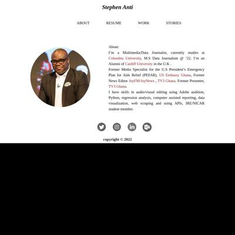](screenshots/stephenanti.github.io/index.html-wide-full.jpg)|
|[brooklyn crashes](https://stephenanti.github.io/brooklyn_crashes.html)||||
|[stories](https://stephenanti.github.io/project_3.html)|||[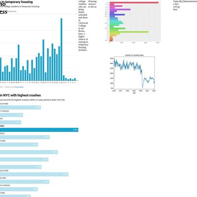](screenshots/stephenanti.github.io/project_3.html-wide-full.jpg)|
|[Yam prices in Ghana](https://stephenanti.github.io/yam.html)||||

### Automatic Checks

**https://stephenanti.github.io/**

* Has sideways scrollbars in mobile version – check padding, margins, image widths

**https://stephenanti.github.io/brooklyn_crashes.html**

* Move `brooklyn_crashes.html` into a folder called `brooklyn_crashes`, then rename the file `index.html`. That way the project can be found at **/brooklyn_crashes** instead of **/brooklyn_crashes.html**. [Read more about index.html here](https://www.thoughtco.com/index-html-page-3466505)
* Change URL to use `-` instead of spaces or underscores
* Has sideways scrollbars in mobile version – check padding, margins, image widths

**https://stephenanti.github.io/project_3.html**

* Move `project_3.html` into a folder called `project_3`, then rename the file `index.html`. That way the project can be found at **/project_3** instead of **/project_3.html**. [Read more about index.html here](https://www.thoughtco.com/index-html-page-3466505)
* Change URL to use `-` instead of spaces or underscores
* Has sideways scrollbars in mobile version – check padding, margins, image widths
* Minimum font size should be 12px, enlarge text in Illustrator
   * Text `9` is too small at 9px
   * Text `8` is too small at 9px
   * Text `7` is too small at 9px
   * Text `6` is too small at 9px
   * Text `54` is too small at 9px
   * Text `52` is too small at 9px
   * Text `51` is too small at 9px
   * Text `30` is too small at 9px
   * Text `20` is too small at 9px
   * Text `10` is too small at 9px
   * Text `0` is too small at 9px
   * Text `2000` is too small at 9px
   * Text `4000` is too small at 9px
   * Text `6000` is too small at 9px
   * Text `8000` is too small at 9px

**https://stephenanti.github.io/yam.html**

* Move `yam.html` into a folder called `yam`, then rename the file `index.html`. That way the project can be found at **/yam** instead of **/yam.html**. [Read more about index.html here](https://www.thoughtco.com/index-html-page-3466505)
* Missing viewport meta tag in `<head>`, needed to tell browser it's responsive. Add `<meta name="viewport" content="width=device-width, initial-scale=1, shrink-to-fit=no">`

## tanazm.github.io

|url|mobile|medium|wide|
|---|---|---|---|
|[Tanaz Meghjani's portfolio](https://tanazm.github.io/)|||[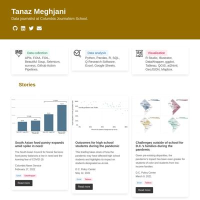](screenshots/tanazm.github.io/index.html-wide-full.jpg)|
|[Libraries](https://tanazm.github.io/ATLparks/)||||
|[Libraries](https://tanazm.github.io/Libraries/)||||
|[TXwind/index.html](https://tanazm.github.io/TXwind/)|||[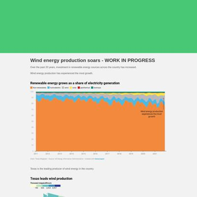](screenshots/tanazm.github.io/TXwind_index.html-wide-full.jpg)|

### Automatic Checks

**https://tanazm.github.io/**

* Has sideways scrollbars in mobile version – check padding, margins, image widths

**https://tanazm.github.io/ATLparks/**

* Change URL to be all in lowercase
* Missing viewport meta tag in `<head>`, needed to tell browser it's responsive. Add `<meta name="viewport" content="width=device-width, initial-scale=1, shrink-to-fit=no">`

**https://tanazm.github.io/Libraries/**

* Change URL to be all in lowercase
* Missing viewport meta tag in `<head>`, needed to tell browser it's responsive. Add `<meta name="viewport" content="width=device-width, initial-scale=1, shrink-to-fit=no">`
* Has sideways scrollbars in mobile version – check padding, margins, image widths
* Missing font(s), you might need web fonts – [text explanation](https://gist.github.com/jsoma/631621e0807b26d49f5aef5260f79162), [video explanation](https://www.youtube.com/watch?v=HNhIeb_jEYM&list=PLewNEVDy7gq3MSrrO3eMEW8PhGMEVh2X2&index=3)
   * `"Avenir Black"` font not found, used in 4 text objects. Example: _Residents of southern states live further away , from public libraries, Residents of southern states live further away_
   * `"Avenir Light"` font not found, used in 33 text objects. Example: _Percent of population that lives 6+ miles away from a library, Metropolitan, Non-metropolitan_

**https://tanazm.github.io/TXwind/**

* Needs a title, add a `<title>` tag to the `<head>`
* Change URL to be all in lowercase
* Missing viewport meta tag in `<head>`, needed to tell browser it's responsive. Add `<meta name="viewport" content="width=device-width, initial-scale=1, shrink-to-fit=no">`

## vincentvb.github.io

|url|mobile|medium|wide|
|---|---|---|---|
|[Vincent Van Buskirk](https://vincentvb.github.io/)||||
|[football_penalties/index.html](https://vincentvb.github.io/football_penalties/)||[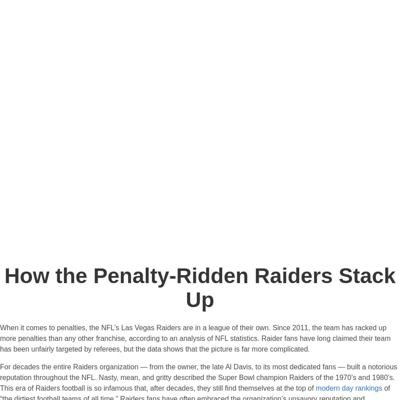](screenshots/vincentvb.github.io/football_penalties_index.html-medium-full.jpg)||
|[game_reviews/index.html](https://vincentvb.github.io/game_reviews)||||
|[santa_barbara_wine/index.html](https://vincentvb.github.io/santa_barbara_wine/)||||

### Automatic Checks

**https://vincentvb.github.io/**

No issues found! 🎉

**https://vincentvb.github.io/football_penalties/**

* Needs a title, add a `<title>` tag to the `<head>`
* Change URL to use `-` instead of spaces or underscores
* Missing viewport meta tag in `<head>`, needed to tell browser it's responsive. Add `<meta name="viewport" content="width=device-width, initial-scale=1, shrink-to-fit=no">`

**https://vincentvb.github.io/game_reviews**

* Needs a title, add a `<title>` tag to the `<head>`
* Change URL to use `-` instead of spaces or underscores
* Missing viewport meta tag in `<head>`, needed to tell browser it's responsive. Add `<meta name="viewport" content="width=device-width, initial-scale=1, shrink-to-fit=no">`

**https://vincentvb.github.io/santa_barbara_wine/**

* Needs a title, add a `<title>` tag to the `<head>`
* Change URL to use `-` instead of spaces or underscores
* Missing viewport meta tag in `<head>`, needed to tell browser it's responsive. Add `<meta name="viewport" content="width=device-width, initial-scale=1, shrink-to-fit=no">`

