# Data Studio 2022 Personal Projects Test Page

Quick checks to make sure your pages are looking their best.

* [angelinejcq.github.io](#angelinejcqgithubio)
* [annerquaye.github.io](#annerquayegithubio)
* [areenaarora.com](#areenaaroracom)
* [ilenapeng.github.io](#ilenapenggithubio)
* [jessieblaeser.github.io](#jessieblaesergithubio)
* [juisarwate.github.io](#juisarwategithubio)
* [juliaingram.github.io](#juliaingramgithubio)
* [kfalayi.github.io](#kfalayigithubio)
* [luizftoledo.github.io](#luizftoledogithubio)
* [mishavaid7.github.io](#mishavaid7githubio)
* [msc-joel.github.io](#msc-joelgithubio)
* [naokatoh.github.io](#naokatohgithubio)
* [pmagtulis.github.io](#pmagtulisgithubio)
* [pmartisa.github.io](#pmartisagithubio)
* [sarahgrevy.github.io](#sarahgrevygithubio)
* [semerriam.github.io](#semerriamgithubio)
* [sriharshadevulapalli.github.io](#sriharshadevulapalligithubio)
* [srjouppi.github.io](#srjouppigithubio)
* [stephenanti.github.io](#stephenantigithubio)
* [tanazm.github.io](#tanazmgithubio)
* [vincentvb.github.io](#vincentvbgithubio)

## angelinejcq.github.io

|url|mobile|medium|wide|
|---|---|---|---|
|[Chuqin Jiang's Incredible Portfolio](https://angelinejcq.github.io/)||||
|[Welcome to my bubble tea shop project](https://angelinejcq.github.io/bubble-tea-project/)||||
|[Welcome to my NEO project](https://angelinejcq.github.io/near-earth-objects-project/)|[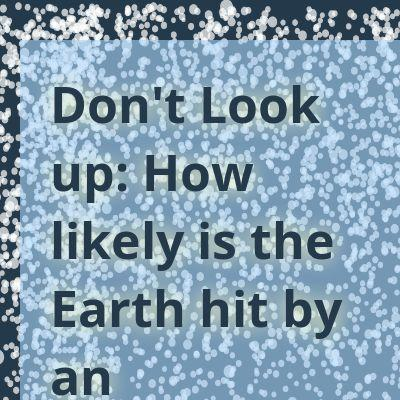](screenshots/angelinejcq.github.io/near-earth-objects-project_index.html-mobile-full.jpg)|||
|[Welcome to my plane crash project](https://angelinejcq.github.io/project-plane-crash/)||||
|[Women trafficking in China](https://angelinejcq.github.io/woman-trafficking-project/)||||

### Automatic Checks

**https://angelinejcq.github.io/**

No issues found! 🎉

**https://angelinejcq.github.io/bubble-tea-project/**

No issues found! 🎉

**https://angelinejcq.github.io/near-earth-objects-project/**

No issues found! 🎉

**https://angelinejcq.github.io/project-plane-crash/**

* Has sideways scrollbars in mobile version – check padding, margins, image widths
* Minimum font size should be 12px, enlarge text in Illustrator
    * Text `Fatalities` is too small at 8px
    * Text `1` is too small at 8px
    * Text `160` is too small at 8px
    * Text `Guangzhou` is too small at 10px

**https://angelinejcq.github.io/woman-trafficking-project/**

* Overlapping elements in ai2html, check [the overflow video](https://www.youtube.com/watch?v=6vHsnjTp3_w) or make a smaller size
   * Text `gender ratio` overlaps with `92.29` at screen width 400
   * Text `92.29` overlaps with `of marriageable age` at screen width 400
   * Text `97.59` overlaps with `Hebei` at screen width 400
   * Text `97.59` overlaps with `Hebei` at screen width 900
   * Text `97.59` overlaps with `Hebei` at screen width 1300

## annerquaye.github.io

|url|mobile|medium|wide|
|---|---|---|---|
|[Abbey Richard's Portfolio](https://annerquaye.github.io) :x: og:title :x: og:description [how to fix](tips/SOCIAL.md)|[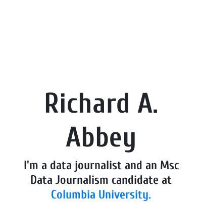](screenshots/annerquaye.github.io/index.html-mobile-full.jpg)|||
|[Abbey Richard's Portfolio](https://annerquaye.github.io/projects/oscars.html) :x: og:title :x: og:description [how to fix](tips/SOCIAL.md)||||
|[Abbey Richard's Portfolio](https://annerquaye.github.io/projects/responsive_pages/responsive.html) :x: og:title :x: og:description [how to fix](tips/SOCIAL.md)||||
|[Abbey Richard's Portfolio](https://annerquaye.github.io/projects/ricestory.html) :x: og:title :x: og:description [how to fix](tips/SOCIAL.md)|[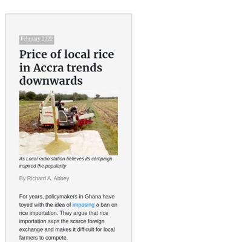](screenshots/annerquaye.github.io/projects_ricestory.html-mobile-full.jpg)|||
|[Abbey Richard's Portfolio](https://annerquaye.github.io/projects/scrolly.html) :x: og:title :x: og:description [how to fix](tips/SOCIAL.md)||||

### Automatic Checks

**https://annerquaye.github.io**

No issues found! 🎉

**https://annerquaye.github.io/projects/oscars.html**

* Image(s) need `alt` tags, [info here](https://abilitynet.org.uk/news-blogs/five-golden-rules-compliant-alt-text) and [tips here](https://twitter.com/FrankElavsky/status/1469023374529765385)
    * Image `oscars/oscars.jpeg` missing `alt` tag
* Move `projects/oscars.html` into a folder called `oscars`, then rename the file `index.html`. That way the project can be found at **/oscars** instead of **/oscars.html**. [Read more about index.html here](https://www.thoughtco.com/index-html-page-3466505)
* Has sideways scrollbars in mobile version – check padding, margins, image widths

**https://annerquaye.github.io/projects/responsive_pages/responsive.html**

* Image(s) need `alt` tags, [info here](https://abilitynet.org.uk/news-blogs/five-golden-rules-compliant-alt-text) and [tips here](https://twitter.com/FrankElavsky/status/1469023374529765385)
    * Image `../../img/remittance.png` missing `alt` tag
* Move `projects/responsive_pages/responsive.html` into a folder called `responsive`, then rename the file `index.html`. That way the project can be found at **/responsive** instead of **/responsive.html**. [Read more about index.html here](https://www.thoughtco.com/index-html-page-3466505)
* Change URL to use `-` instead of spaces or underscores
* Minimum font size should be 12px, enlarge text in Illustrator
    * Text `The pandemic also shot inflation to a 3-year high` is too small at 9px
    * Text `Inflation` is too small at 8px
    * Text `Gdp Growth` is too small at 8px
    * Text `17.5 %` is too small at 7px
    * Text `The pandemic saw the economy hit rock bottom` is too small at 7px
    * Text `15.0` is too small at 7px
    * Text `12.5` is too small at 7px
    * *and 25 more*
* Overlapping elements in ai2html, check [the overflow video](https://www.youtube.com/watch?v=6vHsnjTp3_w) or make a smaller size
   * Text `Inflation` overlaps with `Gdp Growth` at screen width 400

**https://annerquaye.github.io/projects/ricestory.html**

* Image(s) need `alt` tags, [info here](https://abilitynet.org.uk/news-blogs/five-golden-rules-compliant-alt-text) and [tips here](https://twitter.com/FrankElavsky/status/1469023374529765385)
    * Image `rice_project/volta.png` missing `alt` tag
* Move `projects/ricestory.html` into a folder called `ricestory`, then rename the file `index.html`. That way the project can be found at **/ricestory** instead of **/ricestory.html**. [Read more about index.html here](https://www.thoughtco.com/index-html-page-3466505)
* Has sideways scrollbars in mobile version – check padding, margins, image widths

**https://annerquaye.github.io/projects/scrolly.html**

* Image(s) need `alt` tags, [info here](https://abilitynet.org.uk/news-blogs/five-golden-rules-compliant-alt-text) and [tips here](https://twitter.com/FrankElavsky/status/1469023374529765385)
    * Image `../img/cover-01.jpg` missing `alt` tag
* Move `projects/scrolly.html` into a folder called `scrolly`, then rename the file `index.html`. That way the project can be found at **/scrolly** instead of **/scrolly.html**. [Read more about index.html here](https://www.thoughtco.com/index-html-page-3466505)

## areenaarora.com

|url|mobile|medium|wide|
|---|---|---|---|
|[Areena Arora](https://areenaarora.com/) :x: og:title :x: og:description :x: og:image [how to fix](tips/SOCIAL.md)||||
|[Page Not Found](https://areenaarora.com/stories/uttarakhand-floods/) :x: og:title :x: og:description :x: og:image [how to fix](tips/SOCIAL.md)|request failed|request failed|request failed|
|[Page Not Found](https://areenaarora.com/stories/r-place/) :x: og:title :x: og:description :x: og:image [how to fix](tips/SOCIAL.md)|request failed|request failed|request failed|
|[Page Not Found](https://areenaarora.com/stories/style-guides/) :x: og:title :x: og:description :x: og:image [how to fix](tips/SOCIAL.md)|request failed|request failed|request failed|
|[Page Not Found](https://areenaarora.com/stories/biryani/) :x: og:title :x: og:description :x: og:image [how to fix](tips/SOCIAL.md)|request failed|request failed|request failed|
|[Page Not Found](https://areenaarora.com/stories/ny-state-spills/) :x: og:title :x: og:description :x: og:image [how to fix](tips/SOCIAL.md)|request failed|request failed|request failed|
|[Page Not Found](https://areenaarora.com/stories/vaccines/) :x: og:title :x: og:description :x: og:image [how to fix](tips/SOCIAL.md)|request failed|request failed|request failed|

### Automatic Checks

**https://areenaarora.com/**

No issues found! 🎉

**https://areenaarora.com/stories/uttarakhand-floods/**

* Could not access the page - if you moved it, let me know

**https://areenaarora.com/stories/r-place/**

* Could not access the page - if you moved it, let me know

**https://areenaarora.com/stories/style-guides/**

* Could not access the page - if you moved it, let me know

**https://areenaarora.com/stories/biryani/**

* Could not access the page - if you moved it, let me know

**https://areenaarora.com/stories/ny-state-spills/**

* Could not access the page - if you moved it, let me know

**https://areenaarora.com/stories/vaccines/**

* Could not access the page - if you moved it, let me know

## ilenapeng.github.io

|url|mobile|medium|wide|
|---|---|---|---|
|[Ilena Peng](https://ilenapeng.github.io/)||||
|[New Yorkers in Languages](https://ilenapeng.github.io/nyc-languages/)||[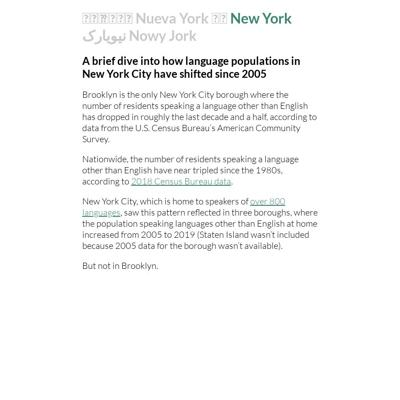](screenshots/ilenapeng.github.io/nyc-languages_index.html-medium-full.jpg)|[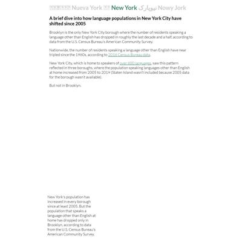](screenshots/ilenapeng.github.io/nyc-languages_index.html-wide-full.jpg)|
|[NYC's "Open" Streets](https://ilenapeng.github.io/nyc-open-streets/)||||
|[The Path to Principal](https://ilenapeng.github.io/path-to-principal/)|||[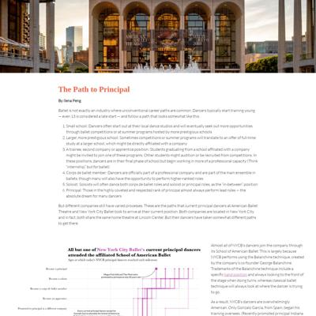](screenshots/ilenapeng.github.io/path-to-principal_index.html-wide-full.jpg)|
|[The Bay's Rainy December](https://ilenapeng.github.io/stevens-creek/)||||

### Automatic Checks

**https://ilenapeng.github.io/**

No issues found! 🎉

**https://ilenapeng.github.io/nyc-languages/**

No issues found! 🎉

**https://ilenapeng.github.io/nyc-open-streets/**

No issues found! 🎉

**https://ilenapeng.github.io/path-to-principal/**

No issues found! 🎉

**https://ilenapeng.github.io/stevens-creek/**

No issues found! 🎉

## jessieblaeser.github.io

|url|mobile|medium|wide|
|---|---|---|---|
|[Jessie Blaeser's Portfolio](https://jessieblaeser.github.io/)||||
|[Ticket to Ride Analysis](https://jessieblaeser.github.io/ticket-to-ride/)||||
|[Trae Young Hawks Analysis](https://jessieblaeser.github.io/trae-young/)||||
|[Most Expensive Pipeline Incidents](https://jessieblaeser.github.io/pipelines/)||[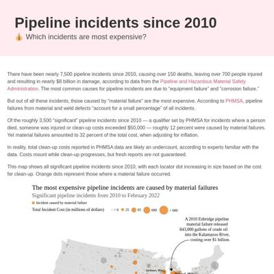](screenshots/jessieblaeser.github.io/pipelines_index.html-medium-full.jpg)||
|[Dams in Georgia](https://jessieblaeser.github.io/georgia-dams/)||||

### Automatic Checks

**https://jessieblaeser.github.io/**

No issues found! 🎉

**https://jessieblaeser.github.io/ticket-to-ride/**

No issues found! 🎉

**https://jessieblaeser.github.io/trae-young/**

No issues found! 🎉

**https://jessieblaeser.github.io/pipelines/**

* Has sideways scrollbars in mobile version – check padding, margins, image widths
* Overlapping elements in ai2html, check [the overflow video](https://www.youtube.com/watch?v=6vHsnjTp3_w) or make a smaller size
   * Text `Total Incident Cost (in millions of dollars)` overlaps with `< 6` at screen width 400
   * Text `Total Incident Cost (in millions of dollars)` overlaps with `< 6` at screen width 900
   * Text `Total Incident Cost (in millions of dollars)` overlaps with `< 6` at screen width 1300
* Missing font(s), you might need web fonts – [text explanation](https://gist.github.com/jsoma/631621e0807b26d49f5aef5260f79162), [video explanation](https://www.youtube.com/watch?v=HNhIeb_jEYM&list=PLewNEVDy7gq3MSrrO3eMEW8PhGMEVh2X2&index=3)
    * `Avenir` font not found, used in 46 text objects. Example: _The most expensive pipeline incidents are caused by material failures, Significant pipeline incidents from 2010 to February 2022, Incident caused by material failure_

**https://jessieblaeser.github.io/georgia-dams/**

No issues found! 🎉

## juisarwate.github.io

|url|mobile|medium|wide|
|---|---|---|---|
|[Jui Sarwate Personal Website](https://juisarwate.github.io/) :x: og:image [how to fix](tips/SOCIAL.md)||||
|[Recycling Distribution NYC](https://juisarwate.github.io/nyc-recycling-distribution/) :x: og:image [how to fix](tips/SOCIAL.md)||||
|[Homeless 311 Complaints 2020](https://juisarwate.github.io/homeless-encampments-311/) :x: og:image [how to fix](tips/SOCIAL.md)||||
|[Recycling Distribution NYC](https://juisarwate.github.io/nyc-recycling-distribution/) :x: og:image [how to fix](tips/SOCIAL.md)||||
|[Yosemite National Park Visitation](https://juisarwate.github.io/yosemite-visitation-2020/) :x: og:image [how to fix](tips/SOCIAL.md)||||
|[UCLA Campus Study Spots](https://juisarwate.github.io/best-ucla-study-spots/) :x: og:image [how to fix](tips/SOCIAL.md)||||

### Automatic Checks

**https://juisarwate.github.io/**

No issues found! 🎉

**https://juisarwate.github.io/nyc-recycling-distribution/**

* Image(s) need `alt` tags, [info here](https://abilitynet.org.uk/news-blogs/five-golden-rules-compliant-alt-text) and [tips here](https://twitter.com/FrankElavsky/status/1469023374529765385)
    * Image `pexels-photo-802221.jpeg` missing `alt` tag
* Has sideways scrollbars in mobile version – check padding, margins, image widths

**https://juisarwate.github.io/homeless-encampments-311/**

No issues found! 🎉

**https://juisarwate.github.io/nyc-recycling-distribution/**

* Image(s) need `alt` tags, [info here](https://abilitynet.org.uk/news-blogs/five-golden-rules-compliant-alt-text) and [tips here](https://twitter.com/FrankElavsky/status/1469023374529765385)
    * Image `pexels-photo-802221.jpeg` missing `alt` tag
* Has sideways scrollbars in mobile version – check padding, margins, image widths

**https://juisarwate.github.io/yosemite-visitation-2020/**

* Has sideways scrollbars in mobile version – check padding, margins, image widths

**https://juisarwate.github.io/best-ucla-study-spots/**

No issues found! 🎉

## juliaingram.github.io

|url|mobile|medium|wide|
|---|---|---|---|
|[Julia Ingram's portfolio](https://juliaingram.github.io) :x: og:title :x: og:description :x: og:image [how to fix](tips/SOCIAL.md)||||
|[California Utility Fires](https://juliaingram.github.io/ca-utility-fires/)||||
|[Citi Bike](https://juliaingram.github.io/citibike/)||||
|[Daylight Saving](https://juliaingram.github.io/daylight-saving/)||[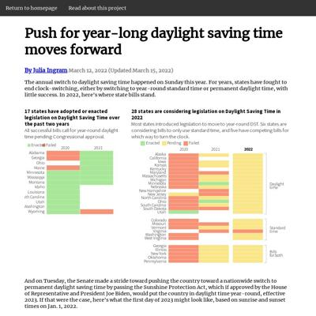](screenshots/juliaingram.github.io/daylight-saving_index.html-medium-full.jpg)||
|[Therapy Apps](https://juliaingram.github.io/therapy-apps/)||||

### Automatic Checks

**https://juliaingram.github.io**

No issues found! 🎉

**https://juliaingram.github.io/ca-utility-fires/**

No issues found! 🎉

**https://juliaingram.github.io/citibike/**

No issues found! 🎉

**https://juliaingram.github.io/daylight-saving/**

* Overlapping elements in ai2html, check [the overflow video](https://www.youtube.com/watch?v=6vHsnjTp3_w) or make a smaller size
   * Text `Pending` overlaps with `Enacted` at screen width 400
   * Text `earlier` overlaps with `The earliest sunset would` at screen width 400
   * Text `Enacted` overlaps with `Failed` at screen width 900
   * Text `Failed` overlaps with `2020` at screen width 900
   * Text `Enacted` overlaps with `Failed` at screen width 1300
   * Text `Failed` overlaps with `2020` at screen width 1300

**https://juliaingram.github.io/therapy-apps/**

No issues found! 🎉

## kfalayi.github.io

|url|mobile|medium|wide|
|---|---|---|---|
|[Kunle Falayi's Portfolio](https://kfalayi.github.io/) :x: og:image [how to fix](tips/SOCIAL.md)||||
|[US-controlled islands leading the way in vaccination rates](https://kfalayi.github.io/vaccination/) :x: og:image [how to fix](tips/SOCIAL.md)||||
|[Africa is losing out of global investment in agriculture technology](https://kfalayi.github.io/agritech-investment/) :x: og:image [how to fix](tips/SOCIAL.md)||||
|[Dollar stores would make perfect vaccination sites](https://kfalayi.github.io/bloomberg/) :x: og:image [how to fix](tips/SOCIAL.md)||||
|[Food prices are increasing in Nigeria, insecurity may be to blame](https://kfalayi.github.io/Food-price-Nigeria/) :x: og:image [how to fix](tips/SOCIAL.md)||||
|[Most of US visas go to Hispanic migrants, the economy depends on it](https://kfalayi.github.io/hispanics-in-america/) :x: og:image [how to fix](tips/SOCIAL.md)||||
|[Ratings of directors of BBC's 100 greatest films](https://kfalayi.github.io/movie-directors/map.html) :x: og:image [how to fix](tips/SOCIAL.md)|[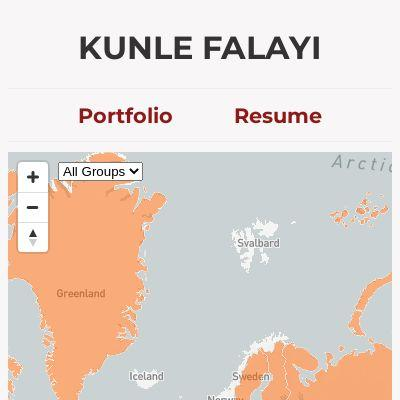](screenshots/kfalayi.github.io/movie-directors_map.html-mobile-full.jpg)|[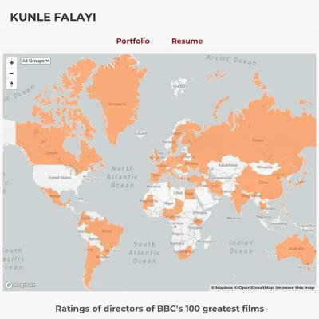](screenshots/kfalayi.github.io/movie-directors_map.html-medium-full.jpg)||
|[Kunle Falayi's Portfolio](https://kfalayi.github.io/irpin/) :x: og:image [how to fix](tips/SOCIAL.md)||||

### Automatic Checks

**https://kfalayi.github.io/**

* Image(s) need `alt` tags, [info here](https://abilitynet.org.uk/news-blogs/five-golden-rules-compliant-alt-text) and [tips here](https://twitter.com/FrankElavsky/status/1469023374529765385)
    * Image `/images/kay.jpeg` missing `alt` tag

**https://kfalayi.github.io/vaccination/**

* Has sideways scrollbars in mobile version – check padding, margins, image widths

**https://kfalayi.github.io/agritech-investment/**

* Minimum font size should be 12px, enlarge text in Illustrator
    * Text `South ` is too small at 10px
    * Text `Africa` is too small at 10px
    * Text `Kenya` is too small at 10px
    * Text `Nigeria` is too small at 10px
    * Text `India` is too small at 9px
    * Text `United States` is too small at 9px
    * Text `Indonesia` is too small at 9px
    * *and 21 more*
* Overlapping elements in ai2html, check [the overflow video](https://www.youtube.com/watch?v=6vHsnjTp3_w) or make a smaller size
   * Text `ASIA` overlaps with `$6.7 billion` at screen width 400
   * Text `Indonesia` overlaps with `Israel` at screen width 400
   * Text `$5.4 billion` overlaps with `Germany` at screen width 400
   * Text `United` overlaps with `United` at screen width 400
   * Text `United` overlaps with `Germany` at screen width 400
   * Text `United` overlaps with `Germany` at screen width 400
   * Text `Kingdom` overlaps with `Kingdom` at screen width 400
   * *and 34 more*
* Missing font(s), you might need web fonts – [text explanation](https://gist.github.com/jsoma/631621e0807b26d49f5aef5260f79162), [video explanation](https://www.youtube.com/watch?v=HNhIeb_jEYM&list=PLewNEVDy7gq3MSrrO3eMEW8PhGMEVh2X2&index=3)
    * `Georgia` font not found, used in 192 text objects. Example: _ASIA, NORTH AMERICA, $6.7 billion_

**https://kfalayi.github.io/bloomberg/**

* Has sideways scrollbars in mobile version – check padding, margins, image widths
* Minimum font size should be 12px, enlarge text in Illustrator
    * Text `1 dot = 1 dollar store` is too small at 10px
    * Text `blue dots = dollar stores` is too small at 10px
    * Text `red dots = vaccination sites` is too small at 10px
    * Text `1 dot = 1 dollar store` is too small at 9px
    * Text `blue dots = dollar stores` is too small at 9px
    * Text `red dots = vaccination sites` is too small at 9px
    * Text `Map with QGIS and Illustrator | Inspired by Bloomberg’s story.` is too small at 10px
    * *and 11 more*

**https://kfalayi.github.io/Food-price-Nigeria/**

* Change URL to be all in lowercase

**https://kfalayi.github.io/hispanics-in-america/**

No issues found! 🎉

**https://kfalayi.github.io/movie-directors/map.html**

* Move `movie-directors/map.html` into a folder called `map`, then rename the file `index.html`. That way the project can be found at **/map** instead of **/map.html**. [Read more about index.html here](https://www.thoughtco.com/index-html-page-3466505)

**https://kfalayi.github.io/irpin/**

* Minimum font size should be 12px, enlarge text in Illustrator
    * Text `Irpin` is too small at 10px
    * Text `Kyiv` is too small at 9px
    * Text `100 ft` is too small at 10px
    * Text `Irpin River` is too small at 9px
    * Text `Evacuees huddled under ` is too small at 9px
    * Text `destroyed bridge, one of ` is too small at 9px
    * Text `the main escape routes out of Irpin` is too small at 9px
    * *and 24 more*
* Overlapping elements in ai2html, check [the overflow video](https://www.youtube.com/watch?v=6vHsnjTp3_w) or make a smaller size
   * Text `Irpin River` overlaps with `Evacuees huddled under` at screen width 400
   * Text `IRPIN` overlaps with `Irpin River` at screen width 400
   * Text `Irpin River` overlaps with `Evacuees huddled under` at screen width 900
   * Text `Irpin River` overlaps with `Evacuees huddled under` at screen width 1300

## luizftoledo.github.io

|url|mobile|medium|wide|
|---|---|---|---|
|[luizftoledo's journalism portfolio](https://luizftoledo.github.io/)|[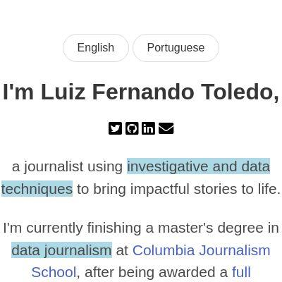](screenshots/luizftoledo.github.io/index.html-mobile-full.jpg)|||
|[Brazilian politicians pay for dozens of meals in the same day](https://luizftoledo.github.io/congress-expenses-with-food/)||||
|[Under Bolsonaro, Brazil has sanctioned less companies for environmental crimes](https://luizftoledo.github.io/ibama-sanctions/)||||
|[How happy can Iron Maiden songs be?](https://luizftoledo.github.io/iron-maiden-happiness/)||||
|[US exports more pistols than ever to Brazil: legally and ilegally](https://luizftoledo.github.io/weapons-seized/)||||

### Automatic Checks

**https://luizftoledo.github.io/**

No issues found! 🎉

**https://luizftoledo.github.io/congress-expenses-with-food/**

No issues found! 🎉

**https://luizftoledo.github.io/ibama-sanctions/**

* Has sideways scrollbars in mobile version – check padding, margins, image widths

**https://luizftoledo.github.io/iron-maiden-happiness/**

No issues found! 🎉

**https://luizftoledo.github.io/weapons-seized/**

* Has sideways scrollbars in mobile version – check padding, margins, image widths
* Minimum font size should be 12px, enlarge text in Illustrator
    * Text `20 K` is too small at 6px
    * Text `15 K` is too small at 6px
    * Text `10.7 K` is too small at 5px
    * Text `Gun ownership ` is too small at 5px
    * Text `rules change` is too small at 5px
    * Text `10 K` is too small at 6px
    * Text `4.5 K` is too small at 6px
    * *and 94 more*
* Overlapping elements in ai2html, check [the overflow video](https://www.youtube.com/watch?v=6vHsnjTp3_w) or make a smaller size
   * Text `2019` overlaps with `2018` at screen width 400
   * Text `2019` overlaps with `2018` at screen width 900
   * Text `2019` overlaps with `2018` at screen width 1300

## mishavaid7.github.io

|url|mobile|medium|wide|
|---|---|---|---|
|[Misha Vaid](https://mishavaid7.github.io/)|[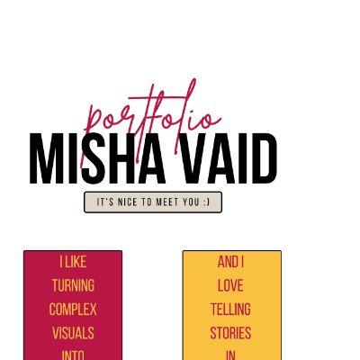](screenshots/mishavaid7.github.io/index.html-mobile-full.jpg)|||
|[Airbnb Story](https://mishavaid7.github.io/airbnb-story/)||||
|[NYC Restaurant Grade Story](https://mishavaid7.github.io/rest-story/)||||
|[Airbnb Story](https://mishavaid7.github.io/airbnb-update/) :x: og:title :x: og:description :x: og:image [how to fix](tips/SOCIAL.md)||||
|[Wordle Cheaters](https://mishavaid7.github.io/wordle/)||||

### Automatic Checks

**https://mishavaid7.github.io/**

* Has sideways scrollbars in mobile version – check padding, margins, image widths

**https://mishavaid7.github.io/airbnb-story/**

No issues found! 🎉

**https://mishavaid7.github.io/rest-story/**

* Has sideways scrollbars in mobile version – check padding, margins, image widths

**https://mishavaid7.github.io/airbnb-update/**

* Has sideways scrollbars in mobile version – check padding, margins, image widths
* Overlapping elements in ai2html, check [the overflow video](https://www.youtube.com/watch?v=6vHsnjTp3_w) or make a smaller size
   * Text `14.2%` overlaps with `34.3%` at screen width 400
   * Text `25.2` overlaps with `53.7` at screen width 400
   * Text `56.9` overlaps with `39.6` at screen width 400
   * Text `43.8` overlaps with `80.4` at screen width 400
   * Text `14.2%` overlaps with `34.3%` at screen width 900
   * Text `25.2` overlaps with `53.7` at screen width 900
   * Text `56.9` overlaps with `39.6` at screen width 900
   * *and 5 more*

**https://mishavaid7.github.io/wordle/**

* Image(s) need `alt` tags, [info here](https://abilitynet.org.uk/news-blogs/five-golden-rules-compliant-alt-text) and [tips here](https://twitter.com/FrankElavsky/status/1469023374529765385)
    * Image `pink.png alt=` missing `alt` tag

## msc-joel.github.io

|url|mobile|medium|wide|
|---|---|---|---|
|[Profile of Joel Konopo](https://msc-joel.github.io/) :x: og:title :x: og:description :x: og:image [how to fix](tips/SOCIAL.md)||||
|[Covid inflation surge likely to persist](https://msc-joel.github.io/main-article1.html) :x: og:title :x: og:description :x: og:image [how to fix](tips/SOCIAL.md)||||
|[More than half of CEDA loan beneficiaries are in the services business](https://msc-joel.github.io/main-article3.html) :x: og:title :x: og:description :x: og:image [how to fix](tips/SOCIAL.md)|[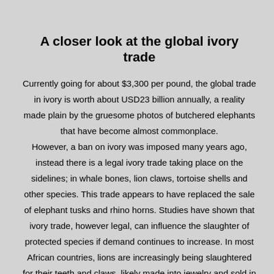](screenshots/msc-joel.github.io/main-article3.html-mobile-full.jpg)|||
|[Responsive page](https://msc-joel.github.io/main-article4.html) :x: og:title :x: og:description :x: og:image [how to fix](tips/SOCIAL.md)||||
|[main-article5.html](https://msc-joel.github.io/main-article5.html) :x: og:title :x: og:description :x: og:image [how to fix](tips/SOCIAL.md)||||

### Automatic Checks

**https://msc-joel.github.io/**

* Has sideways scrollbars in mobile version – check padding, margins, image widths

**https://msc-joel.github.io/main-article1.html**

* Image(s) need `alt` tags, [info here](https://abilitynet.org.uk/news-blogs/five-golden-rules-compliant-alt-text) and [tips here](https://twitter.com/FrankElavsky/status/1469023374529765385)
    * Image `inflation-pic.jpg` missing `alt` tag
    * Image `inflation-graph.png` missing `alt` tag
* Move `main-article1.html` into a folder called `main-article1`, then rename the file `index.html`. That way the project can be found at **/main-article1** instead of **/main-article1.html**. [Read more about index.html here](https://www.thoughtco.com/index-html-page-3466505)
* Has sideways scrollbars in mobile version – check padding, margins, image widths

**https://msc-joel.github.io/main-article3.html**

* Move `main-article3.html` into a folder called `main-article3`, then rename the file `index.html`. That way the project can be found at **/main-article3** instead of **/main-article3.html**. [Read more about index.html here](https://www.thoughtco.com/index-html-page-3466505)
* Has sideways scrollbars in mobile version – check padding, margins, image widths

**https://msc-joel.github.io/main-article4.html**

* Move `main-article4.html` into a folder called `main-article4`, then rename the file `index.html`. That way the project can be found at **/main-article4** instead of **/main-article4.html**. [Read more about index.html here](https://www.thoughtco.com/index-html-page-3466505)
* Has sideways scrollbars in mobile version – check padding, margins, image widths
* Minimum font size should be 12px, enlarge text in Illustrator
    * Text `5%` is too small at 8px
    * Text `5%` is too small at 8px
    * Text `Estonia` is too small at 9px
    * Text `Sweden` is too small at 9px
    * Text `Bulgaria` is too small at 9px
    * Text `France` is too small at 9px
    * Text `Finland` is too small at 9px
    * *and 35 more*
* Overlapping elements in ai2html, check [the overflow video](https://www.youtube.com/watch?v=6vHsnjTp3_w) or make a smaller size
   * Text `34%` overlaps with `34%` at screen width 400
   * Text `5%` overlaps with `5%` at screen width 400
   * Text `30%` overlaps with `30%` at screen width 400
   * Text `39%` overlaps with `39%` at screen width 400
   * Text `38%` overlaps with `38%` at screen width 400
   * Text `46%` overlaps with `46%` at screen width 400
   * Text `51%` overlaps with `51%` at screen width 400
   * *and 134 more*

**https://msc-joel.github.io/main-article5.html**

* Image(s) need `alt` tags, [info here](https://abilitynet.org.uk/news-blogs/five-golden-rules-compliant-alt-text) and [tips here](https://twitter.com/FrankElavsky/status/1469023374529765385)
    * Image `Russian_energy.jpg` missing `alt` tag
* Needs a title, add a `<title>` tag to the `<head>`
* Move `main-article5.html` into a folder called `main-article5`, then rename the file `index.html`. That way the project can be found at **/main-article5** instead of **/main-article5.html**. [Read more about index.html here](https://www.thoughtco.com/index-html-page-3466505)
* Has sideways scrollbars in mobile version – check padding, margins, image widths
* Minimum font size should be 12px, enlarge text in Illustrator
    * Text `97%` is too small at 9px
    * Text `95%` is too small at 9px
    * Text `93%` is too small at 9px
    * Text `78%` is too small at 9px
    * Text `77%` is too small at 9px
    * Text `75%` is too small at 9px
    * Text `75%` is too small at 9px
    * *and 13 more*
* Overlapping elements in ai2html, check [the overflow video](https://www.youtube.com/watch?v=6vHsnjTp3_w) or make a smaller size
   * Text `97%` overlaps with `95%` at screen width 400
   * Text `95%` overlaps with `93%` at screen width 400
   * Text `78%` overlaps with `77%` at screen width 400
   * Text `77%` overlaps with `75%` at screen width 400
   * Text `75%` overlaps with `75%` at screen width 400
   * Text `75%` overlaps with `74%` at screen width 400
   * Text `74%` overlaps with `74%` at screen width 400
   * *and 3 more*

## naokatoh.github.io

|url|mobile|medium|wide|
|---|---|---|---|
|[Nao Hidaka Kato](https://naokatoh.github.io/)||||
|[Music in Men's Figure Skating](https://naokatoh.github.io/figure-skate-music/)|[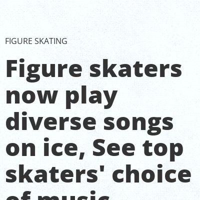](screenshots/naokatoh.github.io/figure-skate-music_index.html-mobile-full.jpg)|||
|[Rodents complaints](https://naokatoh.github.io/nycrats/)||||
|[Disney/Pixar won the most Oscars](https://naokatoh.github.io/oscar-anime/)||||
|[Where to Find Uni in the US](https://naokatoh.github.io/sea-urchin/)||||
|[International students in Ukraine need more help as Russian intensifies attack](https://naokatoh.github.io/ukraine/)||||

### Automatic Checks

**https://naokatoh.github.io/**

* Has sideways scrollbars in mobile version – check padding, margins, image widths

**https://naokatoh.github.io/figure-skate-music/**

No issues found! 🎉

**https://naokatoh.github.io/nycrats/**

No issues found! 🎉

**https://naokatoh.github.io/oscar-anime/**

* Has sideways scrollbars in mobile version – check padding, margins, image widths
* Minimum font size should be 12px, enlarge text in Illustrator
    * Text `Not Disney/ Pixar` is too small at 10px

**https://naokatoh.github.io/sea-urchin/**

No issues found! 🎉

**https://naokatoh.github.io/ukraine/**

* Overlapping elements in ai2html, check [the overflow video](https://www.youtube.com/watch?v=6vHsnjTp3_w) or make a smaller size
   * Text `Turkey` overlaps with `Azerbaijan` at screen width 400
   * Text `Turkmenistan` overlaps with `China` at screen width 900
   * Text `Turkey` overlaps with `Azerbaijan` at screen width 900
   * Text `Turkmenistan` overlaps with `China` at screen width 1300
   * Text `Turkey` overlaps with `Azerbaijan` at screen width 1300

## pmagtulis.github.io

|url|mobile|medium|wide|
|---|---|---|---|
|[Prinz Magtulis](https://pmagtulis.github.io/)||||
|[Prinz Magtulis - Projects](https://pmagtulis.github.io/projects/)||||
|[One person is driving up 311 calls about air quality in Manhattan  Prinz Magtulis](https://pmagtulis.github.io/projects/air-quality/)||[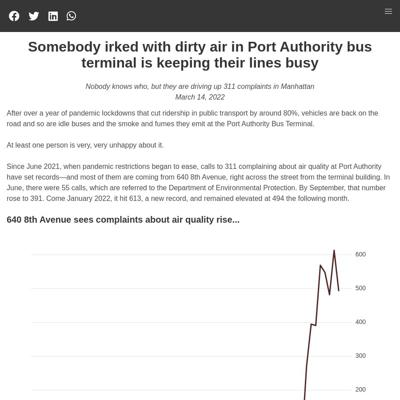](screenshots/pmagtulis.github.io/projects_air-quality_index.html-medium-full.jpg)||
|[Duterte sets record in conflict killings due to siege in South  Prinz Magtulis](https://pmagtulis.github.io/projects/ph-conflict/)||||
|[Here are the vote-rich areas for the 2022 Philippine polls  Prinz Magtulis](https://pmagtulis.github.io/projects/polls-ph/)||||
|[New York City trains are likely to be so slow again  Prinz Magtulis](https://pmagtulis.github.io/projects/trains/)||[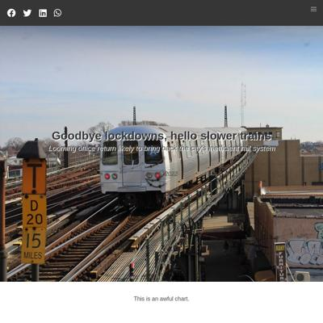](screenshots/pmagtulis.github.io/projects_trains_index.html-medium-full.jpg)|[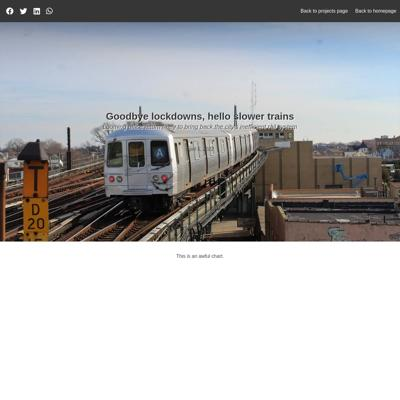](screenshots/pmagtulis.github.io/projects_trains_index.html-wide-full.jpg)|
|[A game ditched joysticks and was a pandemic hit in Japan  Prinz Magtulis](https://pmagtulis.github.io/projects/video-games/)||[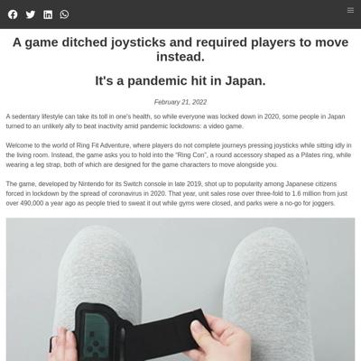](screenshots/pmagtulis.github.io/projects_video-games_index.html-medium-full.jpg)||

### Automatic Checks

**https://pmagtulis.github.io/**

No issues found! 🎉

**https://pmagtulis.github.io/projects/**

No issues found! 🎉

**https://pmagtulis.github.io/projects/air-quality/**

* Has sideways scrollbars in mobile version – check padding, margins, image widths

**https://pmagtulis.github.io/projects/ph-conflict/**

* Has sideways scrollbars in mobile version – check padding, margins, image widths

**https://pmagtulis.github.io/projects/polls-ph/**

* Has sideways scrollbars in mobile version – check padding, margins, image widths
* Minimum font size should be 12px, enlarge text in Illustrator
    * Text `Caloocan` is too small at 8px
    * Text `700,279` is too small at 8px
    * Text `Quezon City` is too small at 8px
    * Text `1,403,895` is too small at 8px
    * Text `Manila` is too small at 8px
    * Text `1,112,081` is too small at 8px
    * Text `Entire NCR:` is too small at 8px
    * *and 1 more*

**https://pmagtulis.github.io/projects/trains/**

* Overlapping elements in ai2html, check [the overflow video](https://www.youtube.com/watch?v=6vHsnjTp3_w) or make a smaller size
   * Text `Jun 2021` overlaps with `Feb 2022` at screen width 400
   * Text `Jun` overlaps with `Feb` at screen width 400
   * Text `2021` overlaps with `2022` at screen width 400
   * Text `Jun 2021` overlaps with `Feb 2022` at screen width 900
   * Text `Jun` overlaps with `Feb` at screen width 900
   * Text `2021` overlaps with `2022` at screen width 900
   * Text `Jun 2021` overlaps with `Feb 2022` at screen width 1300
   * *and 2 more*

**https://pmagtulis.github.io/projects/video-games/**

* Has sideways scrollbars in mobile version – check padding, margins, image widths
* Minimum font size should be 12px, enlarge text in Illustrator
    * Text ` ` is too small at 10px

## pmartisa.github.io

|url|mobile|medium|wide|
|---|---|---|---|
|[Patricia's website](https://pmartisa.github.io/)||||
|[scrollytelling_project/index.html](https://pmartisa.github.io/scrollytelling_project/) :x: og:title :x: og:description :x: og:image [how to fix](tips/SOCIAL.md)|||[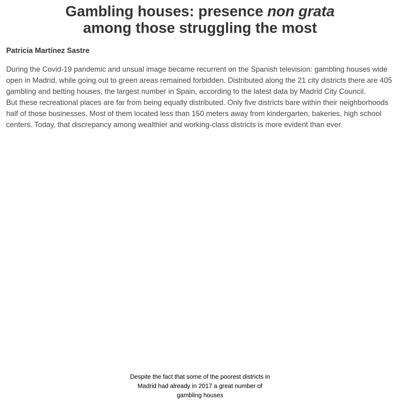](screenshots/pmartisa.github.io/scrollytelling_project_index.html-wide-full.jpg)|
|[Article focused on Russian oil and wheat exports](https://pmartisa.github.io/project-russia-exports/)||||
|[Article focused on domestic violence in Spain](https://pmartisa.github.io/project-domestic-violence/)||||
|[Article on the Olympics](https://pmartisa.github.io/project-olympics/)||||

### Automatic Checks

**https://pmartisa.github.io/**

* Image(s) need `alt` tags, [info here](https://abilitynet.org.uk/news-blogs/five-golden-rules-compliant-alt-text) and [tips here](https://twitter.com/FrankElavsky/status/1469023374529765385)
    * Image `./viz_writing_data/casinos.png` missing `alt` tag
* Missing viewport meta tag in `<head>`, needed to tell browser it's responsive. Add `<meta name="viewport" content="width=device-width, initial-scale=1, shrink-to-fit=no">`

**https://pmartisa.github.io/scrollytelling_project/**

* Needs a title, add a `<title>` tag to the `<head>`
* Change URL to use `-` instead of spaces or underscores
* Overlapping elements in ai2html, check [the overflow video](https://www.youtube.com/watch?v=6vHsnjTp3_w) or make a smaller size
   * Text `Carabanchel` overlaps with `Puente de vallecas` at screen width 400
   * Text `47` overlaps with `43` at screen width 400
   * Text `Puente de vallecas` overlaps with `Tetuan` at screen width 400
   * Text `43` overlaps with `39` at screen width 400
   * Text `Tetuan` overlaps with `Usera` at screen width 400
   * Text `Usera` overlaps with `Centro` at screen width 400
   * Text `32` overlaps with `31` at screen width 400
   * *and 54 more*

**https://pmartisa.github.io/project-russia-exports/**

* Missing viewport meta tag in `<head>`, needed to tell browser it's responsive. Add `<meta name="viewport" content="width=device-width, initial-scale=1, shrink-to-fit=no">`
* Has sideways scrollbars in mobile version – check padding, margins, image widths
* Minimum font size should be 12px, enlarge text in Illustrator
    * Text `over 1.5 million` is too small at 9px
    * Text `barrels per day ` is too small at 9px
    * Text `  186,000` is too small at 9px
    * Text `    297,000` is too small at 9px
    * Text ` ` is too small at 9px
    * Text `   640,000` is too small at 9px
    * Text `  ` is too small at 9px
    * *and 3 more*
* Overlapping elements in ai2html, check [the overflow video](https://www.youtube.com/watch?v=6vHsnjTp3_w) or make a smaller size
   * Text `297,000` overlaps with `barrels/day` at screen width 400
   * Text `Slovakia` overlaps with `Turkey` at screen width 400
   * Text `8,25` overlaps with `million metric tonnes` at screen width 400
   * Text `297,000` overlaps with `barrels/day` at screen width 900
   * Text `Slovakia` overlaps with `Turkey` at screen width 900
   * Text `8,25` overlaps with `million metric tonnes` at screen width 900
   * Text `297,000` overlaps with `barrels/day` at screen width 1300
   * *and 2 more*
* Missing font(s), you might need web fonts – [text explanation](https://gist.github.com/jsoma/631621e0807b26d49f5aef5260f79162), [video explanation](https://www.youtube.com/watch?v=HNhIeb_jEYM&list=PLewNEVDy7gq3MSrrO3eMEW8PhGMEVh2X2&index=3)
    * `"Times Roman"` font not found, used in 99 text objects. Example: _Very High above (40%), Moderately Low (10% - 20%), Low (5% - 10%)_

**https://pmartisa.github.io/project-domestic-violence/**

* Missing viewport meta tag in `<head>`, needed to tell browser it's responsive. Add `<meta name="viewport" content="width=device-width, initial-scale=1, shrink-to-fit=no">`
* Has sideways scrollbars in mobile version – check padding, margins, image widths
* Minimum font size should be 12px, enlarge text in Illustrator
    * Text `The Basque ` is too small at 10px
    * Text `Country` is too small at 10px
    * Text `Cantabria` is too small at 10px
    * Text `Asturias` is too small at 10px
    * Text `Galicia` is too small at 10px
    * Text `Navarra` is too small at 10px
    * Text `La Rioja` is too small at 10px
    * *and 137 more*
* Overlapping elements in ai2html, check [the overflow video](https://www.youtube.com/watch?v=6vHsnjTp3_w) or make a smaller size
   * Text `Country` overlaps with `Cantabria` at screen width 400
   * Text `0` overlaps with `-` at screen width 400
   * Text `0` overlaps with `0` at screen width 400
   * Text `0` overlaps with `.` at screen width 400
   * Text `0` overlaps with `2` at screen width 400
   * Text `-` overlaps with `0` at screen width 400
   * Text `-` overlaps with `.` at screen width 400
   * *and 323 more*

**https://pmartisa.github.io/project-olympics/**

No issues found! 🎉

## sarahgrevy.github.io

|url|mobile|medium|wide|
|---|---|---|---|
|[Sarah Grevy Gotfredsen Portfolio](https://sarahgrevy.github.io/) :x: og:image [how to fix](tips/SOCIAL.md)||||
|[Sarah Grevy Gotfredsen Portfolio](https://sarahgrevy.github.io/air) :x: og:image [how to fix](tips/SOCIAL.md)||||
|[Sarah Grevy Gotfredsen Portfolio](https://sarahgrevy.github.io/weather-project) :x: og:image [how to fix](tips/SOCIAL.md)||||
|[Sarah Grevy Gotfredsen Portfolio](https://sarahgrevy.github.io/co2-emission) :x: og:image [how to fix](tips/SOCIAL.md)||||
|[Sarah Grevy Gotfredsen Portfolio](https://sarahgrevy.github.io/wordle) :x: og:image [how to fix](tips/SOCIAL.md)||||

### Automatic Checks

**https://sarahgrevy.github.io/**

No issues found! 🎉

**https://sarahgrevy.github.io/air**

* Overlapping elements in ai2html, check [the overflow video](https://www.youtube.com/watch?v=6vHsnjTp3_w) or make a smaller size
   * Text `240` overlaps with `220` at screen width 400
   * Text `220` overlaps with `200` at screen width 400
   * Text `200` overlaps with `180` at screen width 400
   * Text `180` overlaps with `160` at screen width 400
   * Text `160` overlaps with `140` at screen width 400
   * Text `Air Quality` overlaps with `Jan` at screen width 400
   * Text `140` overlaps with `120` at screen width 400
   * *and 58 more*

**https://sarahgrevy.github.io/weather-project**

No issues found! 🎉

**https://sarahgrevy.github.io/co2-emission**

No issues found! 🎉

**https://sarahgrevy.github.io/wordle**

No issues found! 🎉

## semerriam.github.io

|url|mobile|medium|wide|
|---|---|---|---|
|[Susan Merriam Portfolio](https://semerriam.github.io/)||||
|[First Visual Story](https://semerriam.github.io/nicar_first_visual_story/) :x: og:title :x: og:description :x: og:image [how to fix](tips/SOCIAL.md)||||
|[The Horror of Infrasound](https://semerriam.github.io/projects/pj-infrasound/)||||
|[Census Peculiarities in Incarcerated Populations](https://semerriam.github.io/projects/pj-census-quirks/)||||
|[Investigating Inequalities of Essex County](https://semerriam.github.io/projects/pj-ec-schools/)||||
|[The Horror of Infrasound](https://semerriam.github.io/projects/pj-infrasound/)||||

### Automatic Checks

**https://semerriam.github.io/**

No issues found! 🎉

**https://semerriam.github.io/nicar_first_visual_story/**

* Image(s) need `alt` tags, [info here](https://abilitynet.org.uk/news-blogs/five-golden-rules-compliant-alt-text) and [tips here](https://twitter.com/FrankElavsky/status/1469023374529765385)
    * Image `https://bl.ocks.org/palewire/raw/1035cd306a2f85b362b1a20ce315b8eb/ire-logo.png` missing `alt` tag
* Change URL to use `-` instead of spaces or underscores
* Has sideways scrollbars in mobile version – check padding, margins, image widths

**https://semerriam.github.io/projects/pj-infrasound/**

* Image(s) need `alt` tags, [info here](https://abilitynet.org.uk/news-blogs/five-golden-rules-compliant-alt-text) and [tips here](https://twitter.com/FrankElavsky/status/1469023374529765385)
    * Image `imgs/infrasound-10-1.png` missing `alt` tag
    * Image `imgs/infrasound-10-2.png` missing `alt` tag
    * Image `imgs/infrasound-10-3.png` missing `alt` tag
    * Image `imgs/infrasound-10-4.png` missing `alt` tag
    * Image `imgs/infrasound-10-5.png` missing `alt` tag
    * Image `imgs/infrasound-10-6.png` missing `alt` tag
    * Image `imgs/infrasound-10-7.png` missing `alt` tag
    * Image `imgs/infrasound-10-8.png` missing `alt` tag
    * Image `imgs/infrasound-10-9.png` missing `alt` tag
    * Image `imgs/infrasound-10-10.png` missing `alt` tag
* Minimum font size should be 12px, enlarge text in Illustrator
    * Text `44,083 Hz` is too small at 10px
    * Text `44,083 Hz` is too small at 10px
    * Text `7.5` is too small at 6px
    * Text `7.5` is too small at 6px
    * Text `5.0` is too small at 6px
    * Text `5.0` is too small at 6px
    * Text `2.5` is too small at 6px
    * *and 104 more*
* Overlapping elements in ai2html, check [the overflow video](https://www.youtube.com/watch?v=6vHsnjTp3_w) or make a smaller size
   * Text `0` overlaps with `0` at screen width 400
   * Text `20` overlaps with `20` at screen width 400
   * Text `0` overlaps with `0` at screen width 900
   * Text `20` overlaps with `20` at screen width 900
   * Text `0` overlaps with `0` at screen width 1300
   * Text `20` overlaps with `20` at screen width 1300

**https://semerriam.github.io/projects/pj-census-quirks/**

* Image(s) need `alt` tags, [info here](https://abilitynet.org.uk/news-blogs/five-golden-rules-compliant-alt-text) and [tips here](https://twitter.com/FrankElavsky/status/1469023374529765385)
    * Image `imgs/census-quirks-img2.png` missing `alt` tag
    * Image `imgs/census-quirks-img3.png` missing `alt` tag
    * Image `imgs/census-quirks-img4.png` missing `alt` tag
    * Image `imgs/census-quirks-img5.png` missing `alt` tag
* Minimum font size should be 12px, enlarge text in Illustrator
    * Text `0` is too small at 10px
    * Text `200` is too small at 10px
    * Text `400` is too small at 10px
    * Text `600` is too small at 10px
    * Text `800` is too small at 10px
    * Text `1000` is too small at 10px
    * Text `1200` is too small at 10px
    * *and 23 more*

**https://semerriam.github.io/projects/pj-ec-schools/**

* Image(s) need `alt` tags, [info here](https://abilitynet.org.uk/news-blogs/five-golden-rules-compliant-alt-text) and [tips here](https://twitter.com/FrankElavsky/status/1469023374529765385)
    * Image `imgs/ec-16.png` missing `alt` tag
    * Image `imgs/ec-17.png` missing `alt` tag
    * Image `imgs/ec-8.png` missing `alt` tag
    * Image `imgs/ec-10.png` missing `alt` tag
    * Image `imgs/ec-9.png` missing `alt` tag
    * Image `imgs/ec-3.png` missing `alt` tag
    * Image `imgs/ec-13.png` missing `alt` tag
    * Image `imgs/ec-15.png` missing `alt` tag
    * Image `imgs/ec-14.png` missing `alt` tag
    * Image `imgs/ec-12.png` missing `alt` tag
* Has sideways scrollbars in mobile version – check padding, margins, image widths
* Minimum font size should be 12px, enlarge text in Illustrator
    * Text `150k` is too small at 9px
    * Text `150k` is too small at 9px
    * Text `100 ` is too small at 9px
    * Text `100 ` is too small at 9px
    * Text `50` is too small at 9px
    * Text `50` is too small at 9px
    * Text `0` is too small at 9px
    * *and 63 more*
* Overlapping elements in ai2html, check [the overflow video](https://www.youtube.com/watch?v=6vHsnjTp3_w) or make a smaller size
   * Text `North Andover` overlaps with `1,048` at screen width 400
   * Text `North Andover` overlaps with `511` at screen width 400
   * Text `North Andover` overlaps with `774` at screen width 400
   * Text `North Andover` overlaps with `1,048` at screen width 900
   * Text `North Andover` overlaps with `511` at screen width 900
   * Text `North Andover` overlaps with `774` at screen width 900
   * Text `North Andover` overlaps with `1,048` at screen width 1300
   * *and 2 more*

**https://semerriam.github.io/projects/pj-infrasound/**

* Image(s) need `alt` tags, [info here](https://abilitynet.org.uk/news-blogs/five-golden-rules-compliant-alt-text) and [tips here](https://twitter.com/FrankElavsky/status/1469023374529765385)
    * Image `imgs/infrasound-10-1.png` missing `alt` tag
    * Image `imgs/infrasound-10-2.png` missing `alt` tag
    * Image `imgs/infrasound-10-3.png` missing `alt` tag
    * Image `imgs/infrasound-10-4.png` missing `alt` tag
    * Image `imgs/infrasound-10-5.png` missing `alt` tag
    * Image `imgs/infrasound-10-6.png` missing `alt` tag
    * Image `imgs/infrasound-10-7.png` missing `alt` tag
    * Image `imgs/infrasound-10-8.png` missing `alt` tag
    * Image `imgs/infrasound-10-9.png` missing `alt` tag
    * Image `imgs/infrasound-10-10.png` missing `alt` tag
* Minimum font size should be 12px, enlarge text in Illustrator
    * Text `44,083 Hz` is too small at 10px
    * Text `44,083 Hz` is too small at 10px
    * Text `7.5` is too small at 6px
    * Text `7.5` is too small at 6px
    * Text `5.0` is too small at 6px
    * Text `5.0` is too small at 6px
    * Text `2.5` is too small at 6px
    * *and 104 more*
* Overlapping elements in ai2html, check [the overflow video](https://www.youtube.com/watch?v=6vHsnjTp3_w) or make a smaller size
   * Text `0` overlaps with `0` at screen width 400
   * Text `20` overlaps with `20` at screen width 400
   * Text `0` overlaps with `0` at screen width 900
   * Text `20` overlaps with `20` at screen width 900
   * Text `0` overlaps with `0` at screen width 1300
   * Text `20` overlaps with `20` at screen width 1300

## sriharshadevulapalli.github.io

|url|mobile|medium|wide|
|---|---|---|---|
|[Sriharsha Devulapalli](https://sriharshadevulapalli.github.io/)||||
|[This is your title](https://sriharshadevulapalli.github.io/central-vista/)||||
|[Indian Airline Routes](https://sriharshadevulapalli.github.io/indian-airline-routes/)||||
|[Indian Food in New York City](https://sriharshadevulapalli.github.io/new-york-city-indian-food-menus/)|||[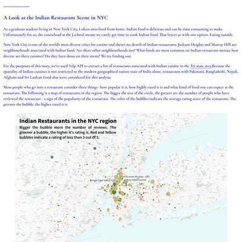](screenshots/sriharshadevulapalli.github.io/new-york-city-indian-food-menus_index.html-wide-full.jpg)|
|[Central Vista](https://sriharshadevulapalli.github.io/rainfall-patterns-in-india/)||||

### Automatic Checks

**https://sriharshadevulapalli.github.io/**

No issues found! 🎉

**https://sriharshadevulapalli.github.io/central-vista/**

* Missing font(s), you might need web fonts – [text explanation](https://gist.github.com/jsoma/631621e0807b26d49f5aef5260f79162), [video explanation](https://www.youtube.com/watch?v=HNhIeb_jEYM&list=PLewNEVDy7gq3MSrrO3eMEW8PhGMEVh2X2&index=3)
    * `"Source Sans Pro"` font not found, used in 51 text objects. Example: _2000s - Present, 1930s - 1940s, 1950s - 1960s_

**https://sriharshadevulapalli.github.io/indian-airline-routes/**

No issues found! 🎉

**https://sriharshadevulapalli.github.io/new-york-city-indian-food-menus/**

No issues found! 🎉

**https://sriharshadevulapalli.github.io/rainfall-patterns-in-india/**

* Has sideways scrollbars in mobile version – check padding, margins, image widths

## srjouppi.github.io

|url|mobile|medium|wide|
|---|---|---|---|
|[Shelby Jouppi: Data Journalist & Multimedia Specialist](https://srjouppi.github.io/)||||
|[Shelby Jouppi - Colorado Parks Mobility Analysis](https://srjouppi.github.io/colorado-parks-mobility/)||||
|[Shelby Jouppi - The Cost of COVID](https://srjouppi.github.io/covid-gofundme-analysis/)||||
|[Shelby Jouppi - Waiting in Line](https://srjouppi.github.io/nyc-child-psychologists/)||||

### Automatic Checks

**https://srjouppi.github.io/**

No issues found! 🎉

**https://srjouppi.github.io/colorado-parks-mobility/**

No issues found! 🎉

**https://srjouppi.github.io/covid-gofundme-analysis/**

* Has sideways scrollbars in mobile version – check padding, margins, image widths

**https://srjouppi.github.io/nyc-child-psychologists/**

No issues found! 🎉

## stephenanti.github.io

|url|mobile|medium|wide|
|---|---|---|---|
|[Stephen Anti's portfolio](https://stephenanti.github.io/) :x: og:title :x: og:description :x: og:image [how to fix](tips/SOCIAL.md)||||
|[brooklyn crashes](https://stephenanti.github.io/brooklyn_crashes.html) :x: og:title :x: og:description :x: og:image [how to fix](tips/SOCIAL.md)|||[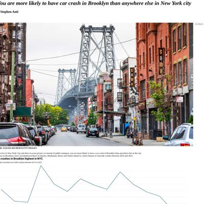](screenshots/stephenanti.github.io/brooklyn_crashes.html-wide-full.jpg)|
|[stories](https://stephenanti.github.io/project_3.html) :x: og:title :x: og:description :x: og:image [how to fix](tips/SOCIAL.md)||||
|[scrollyprojectAntii.html](https://stephenanti.github.io/scrollyprojectAntii.html) :x: og:title :x: og:description :x: og:image [how to fix](tips/SOCIAL.md)||||
|[Yam prices in Ghana](https://stephenanti.github.io/yam.html) :x: og:title :x: og:description :x: og:image [how to fix](tips/SOCIAL.md)||||

### Automatic Checks

**https://stephenanti.github.io/**

* Has sideways scrollbars in mobile version – check padding, margins, image widths

**https://stephenanti.github.io/brooklyn_crashes.html**

* Image(s) need `alt` tags, [info here](https://abilitynet.org.uk/news-blogs/five-golden-rules-compliant-alt-text) and [tips here](https://twitter.com/FrankElavsky/status/1469023374529765385)
    * Image `brooklyn.jpeg` missing `alt` tag
    * Image `graph1.png` missing `alt` tag
    * Image `graph2.png` missing `alt` tag
    * Image `graph3.png` missing `alt` tag
* Move `brooklyn_crashes.html` into a folder called `brooklyn_crashes`, then rename the file `index.html`. That way the project can be found at **/brooklyn_crashes** instead of **/brooklyn_crashes.html**. [Read more about index.html here](https://www.thoughtco.com/index-html-page-3466505)
* Change URL to use `-` instead of spaces or underscores
* Has sideways scrollbars in mobile version – check padding, margins, image widths

**https://stephenanti.github.io/project_3.html**

* Move `project_3.html` into a folder called `project_3`, then rename the file `index.html`. That way the project can be found at **/project_3** instead of **/project_3.html**. [Read more about index.html here](https://www.thoughtco.com/index-html-page-3466505)
* Change URL to use `-` instead of spaces or underscores
* Has sideways scrollbars in mobile version – check padding, margins, image widths
* Minimum font size should be 12px, enlarge text in Illustrator
    * Text `9` is too small at 9px
    * Text `8` is too small at 9px
    * Text `7` is too small at 9px
    * Text `6` is too small at 9px
    * Text `54` is too small at 9px
    * Text `52` is too small at 9px
    * Text `51` is too small at 9px
    * *and 8 more*

**https://stephenanti.github.io/scrollyprojectAntii.html**

* Needs a title, add a `<title>` tag to the `<head>`
* Move `scrollyprojectAntii.html` into a folder called `scrollyprojectAntii`, then rename the file `index.html`. That way the project can be found at **/scrollyprojectAntii** instead of **/scrollyprojectAntii.html**. [Read more about index.html here](https://www.thoughtco.com/index-html-page-3466505)
* Change URL to be all in lowercase
* Has sideways scrollbars in mobile version – check padding, margins, image widths

**https://stephenanti.github.io/yam.html**

* Move `yam.html` into a folder called `yam`, then rename the file `index.html`. That way the project can be found at **/yam** instead of **/yam.html**. [Read more about index.html here](https://www.thoughtco.com/index-html-page-3466505)
* Missing viewport meta tag in `<head>`, needed to tell browser it's responsive. Add `<meta name="viewport" content="width=device-width, initial-scale=1, shrink-to-fit=no">`

## tanazm.github.io

|url|mobile|medium|wide|
|---|---|---|---|
|[Tanaz Meghjani's portfolio](https://tanazm.github.io/)||||
|[Atlanta parks](https://tanazm.github.io/atlantaparks/)||||
|[Libraries](https://tanazm.github.io/publiclibraries/)||||
|[Brooklyn marathon](https://tanazm.github.io/marathonmap/)||||
|[Texas wind energy](https://tanazm.github.io/texaswind/)||||

### Automatic Checks

**https://tanazm.github.io/**

* Has sideways scrollbars in mobile version – check padding, margins, image widths

**https://tanazm.github.io/atlantaparks/**

No issues found! 🎉

**https://tanazm.github.io/publiclibraries/**

* Has sideways scrollbars in mobile version – check padding, margins, image widths
* Missing font(s), you might need web fonts – [text explanation](https://gist.github.com/jsoma/631621e0807b26d49f5aef5260f79162), [video explanation](https://www.youtube.com/watch?v=HNhIeb_jEYM&list=PLewNEVDy7gq3MSrrO3eMEW8PhGMEVh2X2&index=3)
    * `"Avenir Black"` font not found, used in 4 text objects. Example: _Residents of southern states live further away , from public libraries, Residents of southern states live further away_
    * `"Avenir Light"` font not found, used in 33 text objects. Example: _Percent of population that lives 6+ miles away from a library, Metropolitan, Non-metropolitan_

**https://tanazm.github.io/marathonmap/**

No issues found! 🎉

**https://tanazm.github.io/texaswind/**

No issues found! 🎉

## vincentvb.github.io

|url|mobile|medium|wide|
|---|---|---|---|
|[Vincent Van Buskirk](https://vincentvb.github.io/)||||
|[Raiders penalties analysis](https://vincentvb.github.io/football-penalties/)||||
|[Video game review analysis](https://vincentvb.github.io/game-reviews)||||
|[Football Penalty Analysis](https://vincentvb.github.io/santa-barbara-wine/)|||[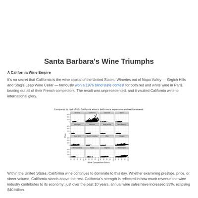](screenshots/vincentvb.github.io/santa-barbara-wine_index.html-wide-full.jpg)|
|[Mapbox Storytelling](https://vincentvb.github.io/ukraine-invasion/)||||

### Automatic Checks

**https://vincentvb.github.io/**

No issues found! 🎉

**https://vincentvb.github.io/football-penalties/**

No issues found! 🎉

**https://vincentvb.github.io/game-reviews**

No issues found! 🎉

**https://vincentvb.github.io/santa-barbara-wine/**

No issues found! 🎉

**https://vincentvb.github.io/ukraine-invasion/**

No issues found! 🎉

