# Data Studio 2022 Personal Projects Test Page

Quick checks to make sure your pages are looking their best.

* [angelinejcq.github.io](#angelinejcqgithubio)
* [annerquaye.github.io](#annerquayegithubio)
* [areenaarora.com](#areenaaroracom)
* [ilenapeng.github.io](#ilenapenggithubio)
* [jessieblaeser.github.io](#jessieblaesergithubio)
* [juisarwate.github.io](#juisarwategithubio)
* [juliaingram.github.io](#juliaingramgithubio)
* [kfalayi.github.io](#kfalayigithubio)
* [luizftoledo.github.io](#luizftoledogithubio)
* [mishavaid7.github.io](#mishavaid7githubio)
* [msc-joel.github.io](#msc-joelgithubio)
* [naokatoh.github.io](#naokatohgithubio)
* [pmagtulis.github.io](#pmagtulisgithubio)
* [pmartisa.github.io](#pmartisagithubio)
* [sarahgrevy.github.io](#sarahgrevygithubio)
* [semerriam.github.io](#semerriamgithubio)
* [sriharshadevulapalli.github.io](#sriharshadevulapalligithubio)
* [srjouppi.github.io](#srjouppigithubio)
* [stephenanti.github.io](#stephenantigithubio)
* [tanazm.github.io](#tanazmgithubio)
* [vincentvb.github.io](#vincentvbgithubio)

## angelinejcq.github.io

|url|mobile|medium|wide|
|---|---|---|---|
|[Chuqin Jiang's Incredible Portfolio](https://angelinejcq.github.io/)||||
|[Welcome to my bubble tea shop project](https://angelinejcq.github.io/bubble-tea-project/)||||
|[NYC GHG Emission Penalty Project](https://angelinejcq.github.io/energy-efficiency-project/) :x: og:title :x: og:description :x: og:image [how to fix](tips/SOCIAL.md)|||[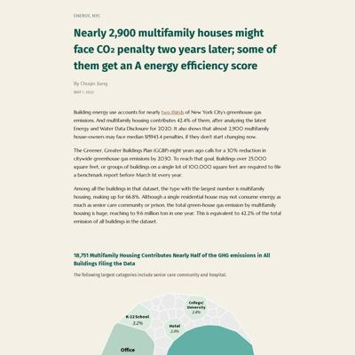](screenshots/angelinejcq.github.io/energy-efficiency-project_index.html-wide-full.jpg)|
|[An exploration of fancy charts](https://angelinejcq.github.io/fancy-chart)||||
|[Welcome to my NEO project](https://angelinejcq.github.io/near-earth-objects-project/)||[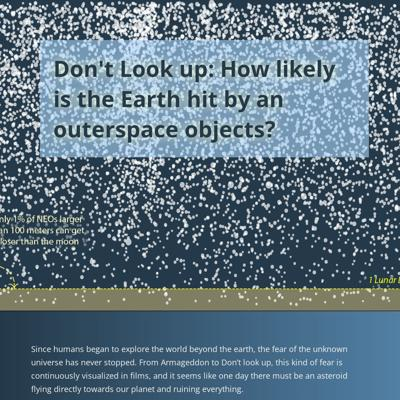](screenshots/angelinejcq.github.io/near-earth-objects-project_index.html-medium-full.jpg)||
|[Welcome to my plane crash project](https://angelinejcq.github.io/project-plane-crash/)||||
|[Women trafficking in China](https://angelinejcq.github.io/woman-trafficking-project/)||||
|[Welcome to a game about career in Japan](https://angelinejcq.github.io/japan-career-news-game/) :x: og:title :x: og:description :x: og:image [how to fix](tips/SOCIAL.md)||||

### Automatic Checks

**https://angelinejcq.github.io/**

No issues found! 🎉

**https://angelinejcq.github.io/bubble-tea-project/**

No issues found! 🎉

**https://angelinejcq.github.io/energy-efficiency-project/**

* Overlapping elements in ai2html, check [the overflow video](https://www.youtube.com/watch?v=6vHsnjTp3_w) or make a smaller size
   * Text `STATEN` overlaps with `UNKNOWN` at screen width 400
   * Text `STATEN` overlaps with `QUEENS` at screen width 400
   * Text `ISLAND` overlaps with `UNKNOWN` at screen width 400
   * Text `ISLAND` overlaps with `QUEENS` at screen width 400
   * Text `BROOKLYN` overlaps with `QUEENS` at screen width 400
   * Text `BROOKLYN` overlaps with `BRONX` at screen width 400
   * Text `BRONX` overlaps with `MANHATTAN` at screen width 400
   * *and 14 more*

**https://angelinejcq.github.io/fancy-chart**

* Minimum font size should be 12px, enlarge text in Illustrator
    * Text `MIT` is too small at 10px
    * Text `Harvard` is too small at 10px
    * Text `Cornell` is too small at 10px
    * Text `Yale` is too small at 10px
    * Text `Marketing and Policy office` is too small at 10px
    * Text `Microsoft` is too small at 10px
    * Text `Apple Inc.` is too small at 10px
    * *and 6 more*
* Overlapping elements in ai2html, check [the overflow video](https://www.youtube.com/watch?v=6vHsnjTp3_w) or make a smaller size
   * Text `MIT` overlaps with `78% of China Telecom entries` at screen width 400
   * Text `are Data Centre` overlaps with `Harvard` at screen width 400
   * Text `Harvard` overlaps with `54% of Huawei entries` at screen width 400
   * Text `Harvard` overlaps with `are Research Partnership` at screen width 400
   * Text `are Research Partnership` overlaps with `Cornell` at screen width 400
   * Text `Telecom` overlaps with `Huawei` at screen width 400
   * Text `Cornell` overlaps with `Huawei` at screen width 400
   * *and 40 more*

**https://angelinejcq.github.io/near-earth-objects-project/**

No issues found! 🎉

**https://angelinejcq.github.io/project-plane-crash/**

* Overlapping elements in ai2html, check [the overflow video](https://www.youtube.com/watch?v=6vHsnjTp3_w) or make a smaller size
   * Text `2` overlaps with `China` at screen width 400
   * Text `0` overlaps with `2008` at screen width 400

**https://angelinejcq.github.io/woman-trafficking-project/**

* Overlapping elements in ai2html, check [the overflow video](https://www.youtube.com/watch?v=6vHsnjTp3_w) or make a smaller size
   * Text `gender ratio` overlaps with `92.29` at screen width 400
   * Text `92.29` overlaps with `of marriageable age` at screen width 400
   * Text `97.59` overlaps with `Hebei` at screen width 400
   * Text `97.59` overlaps with `Hebei` at screen width 900
   * Text `97.59` overlaps with `Hebei` at screen width 1300

**https://angelinejcq.github.io/japan-career-news-game/**

* Image(s) need `alt` tags, [info here](https://abilitynet.org.uk/news-blogs/five-golden-rules-compliant-alt-text) and [tips here](https://twitter.com/FrankElavsky/status/1469023374529765385)
    * Image `cat.jpg` missing `alt` tag

## annerquaye.github.io

|url|mobile|medium|wide|
|---|---|---|---|
|[Abbey Richard's Portfolio](https://annerquaye.github.io) :x: og:title :x: og:description [how to fix](tips/SOCIAL.md)||||
|[Abbey Richard's Portfolio](https://annerquaye.github.io/projects/data-viz/exemptions.html) :x: og:title :x: og:description [how to fix](tips/SOCIAL.md)|||[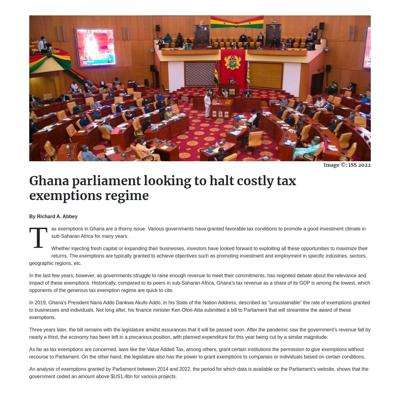](screenshots/annerquaye.github.io/projects_data-viz_exemptions.html-wide-full.jpg)|
|[Abbey Richard's Portfolio](https://annerquaye.github.io/projects/data-viz/gasoline.html) :x: og:title :x: og:description [how to fix](tips/SOCIAL.md)||||
|[Abbey Richard's Portfolio](https://annerquaye.github.io/projects/oscars.html) :x: og:title :x: og:description [how to fix](tips/SOCIAL.md)||||
|[Abbey Richard's Portfolio](https://annerquaye.github.io/projects/responsive_pages/responsive.html) :x: og:title :x: og:description [how to fix](tips/SOCIAL.md)|||[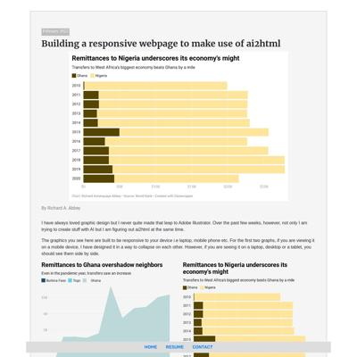](screenshots/annerquaye.github.io/projects_responsive_pages_responsive.html-wide-full.jpg)|
|[Abbey Richard's Portfolio](https://annerquaye.github.io/projects/ricestory.html) :x: og:title :x: og:description [how to fix](tips/SOCIAL.md)||||
|[Abbey Richard's Portfolio](https://annerquaye.github.io/projects/scrolly.html) :x: og:title :x: og:description [how to fix](tips/SOCIAL.md)||||
|[Fancy chart on Messi-Ronaldo dominance](https://annerquaye.github.io/projects/visualization/maps/fancy.html) :x: og:title :x: og:description [how to fix](tips/SOCIAL.md)||[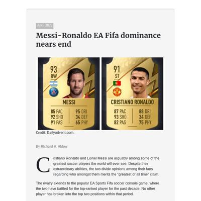](screenshots/annerquaye.github.io/projects_visualization_maps_fancy.html-medium-full.jpg)||

### Automatic Checks

**https://annerquaye.github.io**

No issues found! 🎉

**https://annerquaye.github.io/projects/data-viz/exemptions.html**

* Image(s) need `alt` tags, [info here](https://abilitynet.org.uk/news-blogs/five-golden-rules-compliant-alt-text) and [tips here](https://twitter.com/FrankElavsky/status/1469023374529765385)
    * Image `../../img/ken-ofori-atta.jpeg` missing `alt` tag
* Move `projects/data-viz/exemptions.html` into a folder called `exemptions`, then rename the file `index.html`. That way the project can be found at **/exemptions** instead of **/exemptions.html**. [Read more about index.html here](https://www.thoughtco.com/index-html-page-3466505)
* Has sideways scrollbars in mobile version – check padding, margins, image widths
* Minimum font size should be 12px, enlarge text in Illustrator
    * Text `$450m` is too small at 10px
    * Text `400m` is too small at 10px
    * Text `350m` is too small at 10px
    * Text `300m` is too small at 10px
    * Text `250m` is too small at 10px
    * Text `200m` is too small at 10px
    * Text `150m` is too small at 10px
    * *and 87 more*
* Missing font(s), you might need web fonts – [text explanation](https://gist.github.com/jsoma/631621e0807b26d49f5aef5260f79162), [video explanation](https://www.youtube.com/watch?v=HNhIeb_jEYM&list=PLewNEVDy7gq3MSrrO3eMEW8PhGMEVh2X2&index=3)
    * `"Avenir Next"` font not found, used in 9 text objects. Example: _2019 accounts for 40% of all tax exemptions granted in the last nine
                                years , The record amount coincides with a surge in number of projects ahead of
                                the 2020 general elections, 2019 accounts for 40% of all tax exemptions granted in the last nine years_
    * `"Helvetica Next"` font not found, used in 41 text objects. Example: _$450m, 2014, 2015_
    * `GillSans` font not found, used in 6 text objects. Example: _Source of data: Parliament of Ghana | Chart by: Richard A. Abbey, Source of data: Parliament of Ghana | Chart by: Richard A. Abbey, Source of data: Parliament of Ghana | Chart by: Richard A. Abbey_

**https://annerquaye.github.io/projects/data-viz/gasoline.html**

* Image(s) need `alt` tags, [info here](https://abilitynet.org.uk/news-blogs/five-golden-rules-compliant-alt-text) and [tips here](https://twitter.com/FrankElavsky/status/1469023374529765385)
    * Image `../../img/inflation.jpeg` missing `alt` tag
* Move `projects/data-viz/gasoline.html` into a folder called `gasoline`, then rename the file `index.html`. That way the project can be found at **/gasoline** instead of **/gasoline.html**. [Read more about index.html here](https://www.thoughtco.com/index-html-page-3466505)
* Has sideways scrollbars in mobile version – check padding, margins, image widths
* Minimum font size should be 12px, enlarge text in Illustrator
    * Text `Rate of wages growth sensitive to economic performance` is too small at 9px
    * Text `Covid recession` is too small at 9px
    * Text `2020` is too small at 9px
    * Text `Great Recession` is too small at 9px
    * Text `2007-2009` is too small at 9px
    * Text `3%` is too small at 10px
    * Text `Early 2000s ` is too small at 9px
    * *and 39 more*
* Overlapping elements in ai2html, check [the overflow video](https://www.youtube.com/watch?v=6vHsnjTp3_w) or make a smaller size
   * Text `3%` overlaps with `Early 2000s` at screen width 400
   * Text `2002` overlaps with `2004` at screen width 400
   * Text `2004` overlaps with `2006` at screen width 400
   * Text `2006` overlaps with `2008` at screen width 400
   * Text `2008` overlaps with `2010` at screen width 400
   * Text `2010` overlaps with `2012` at screen width 400
   * Text `2012` overlaps with `2014` at screen width 400
   * *and 3 more*

**https://annerquaye.github.io/projects/oscars.html**

* Image(s) need `alt` tags, [info here](https://abilitynet.org.uk/news-blogs/five-golden-rules-compliant-alt-text) and [tips here](https://twitter.com/FrankElavsky/status/1469023374529765385)
    * Image `oscars/oscars.jpeg` missing `alt` tag
* Move `projects/oscars.html` into a folder called `oscars`, then rename the file `index.html`. That way the project can be found at **/oscars** instead of **/oscars.html**. [Read more about index.html here](https://www.thoughtco.com/index-html-page-3466505)
* Has sideways scrollbars in mobile version – check padding, margins, image widths

**https://annerquaye.github.io/projects/responsive_pages/responsive.html**

* Image(s) need `alt` tags, [info here](https://abilitynet.org.uk/news-blogs/five-golden-rules-compliant-alt-text) and [tips here](https://twitter.com/FrankElavsky/status/1469023374529765385)
    * Image `../../img/remittance.png` missing `alt` tag
* Move `projects/responsive_pages/responsive.html` into a folder called `responsive`, then rename the file `index.html`. That way the project can be found at **/responsive** instead of **/responsive.html**. [Read more about index.html here](https://www.thoughtco.com/index-html-page-3466505)
* Change URL to use `-` instead of spaces or underscores
* Minimum font size should be 12px, enlarge text in Illustrator
    * Text `The pandemic also shot inflation to a 3-year high` is too small at 9px
    * Text `Inflation` is too small at 8px
    * Text `Gdp Growth` is too small at 8px
    * Text `17.5 %` is too small at 7px
    * Text `The pandemic saw the economy hit rock bottom` is too small at 7px
    * Text `15.0` is too small at 7px
    * Text `12.5` is too small at 7px
    * *and 25 more*
* Overlapping elements in ai2html, check [the overflow video](https://www.youtube.com/watch?v=6vHsnjTp3_w) or make a smaller size
   * Text `Inflation` overlaps with `Gdp Growth` at screen width 400

**https://annerquaye.github.io/projects/ricestory.html**

* Image(s) need `alt` tags, [info here](https://abilitynet.org.uk/news-blogs/five-golden-rules-compliant-alt-text) and [tips here](https://twitter.com/FrankElavsky/status/1469023374529765385)
    * Image `rice_project/volta.png` missing `alt` tag
* Move `projects/ricestory.html` into a folder called `ricestory`, then rename the file `index.html`. That way the project can be found at **/ricestory** instead of **/ricestory.html**. [Read more about index.html here](https://www.thoughtco.com/index-html-page-3466505)
* Has sideways scrollbars in mobile version – check padding, margins, image widths

**https://annerquaye.github.io/projects/scrolly.html**

* Image(s) need `alt` tags, [info here](https://abilitynet.org.uk/news-blogs/five-golden-rules-compliant-alt-text) and [tips here](https://twitter.com/FrankElavsky/status/1469023374529765385)
    * Image `../img/cover-01.jpg` missing `alt` tag
* Move `projects/scrolly.html` into a folder called `scrolly`, then rename the file `index.html`. That way the project can be found at **/scrolly** instead of **/scrolly.html**. [Read more about index.html here](https://www.thoughtco.com/index-html-page-3466505)

**https://annerquaye.github.io/projects/visualization/maps/fancy.html**

* Image(s) need `alt` tags, [info here](https://abilitynet.org.uk/news-blogs/five-golden-rules-compliant-alt-text) and [tips here](https://twitter.com/FrankElavsky/status/1469023374529765385)
    * Image `../../../img/messinado.jpeg` missing `alt` tag
* Move `projects/visualization/maps/fancy.html` into a folder called `fancy`, then rename the file `index.html`. That way the project can be found at **/fancy** instead of **/fancy.html**. [Read more about index.html here](https://www.thoughtco.com/index-html-page-3466505)
* Minimum font size should be 12px, enlarge text in Illustrator
    * Text `pace` is too small at 7px
    * Text `80` is too small at 7px
    * Text `physic` is too small at 7px
    * Text `shooting` is too small at 7px
    * Text `60` is too small at 7px
    * Text `40` is too small at 7px
    * Text `20` is too small at 7px
    * *and 34 more*
* Overlapping elements in ai2html, check [the overflow video](https://www.youtube.com/watch?v=6vHsnjTp3_w) or make a smaller size
   * Text `Bayern’s Lewandowski breaks Messi-Ronaldo duopoly of EA Fifa top player rankings` overlaps with `The two players have continuously shut out any player from the top two positions for nearly a decade` at screen width 400
   * Text `Bayern’s Lewandowski breaks Messi-Ronaldo duopoly of EA Fifa top player rankings` overlaps with `L. Messi` at screen width 400
   * Text `pace` overlaps with `The two players have continuously shut out any player from the top two positions for nearly a decade` at screen width 400
   * Text `pace` overlaps with `Overall rankings are based on the player ratings on selected attributes` at screen width 400
   * Text `pace` overlaps with `L. Messi` at screen width 400
   * Text `The two players have continuously shut out any player from the top two positions for nearly a decade` overlaps with `L. Messi` at screen width 400
   * Text `80` overlaps with `Overall rankings are based on the player ratings on selected attributes` at screen width 400
   * *and 128 more*

## areenaarora.com

|url|mobile|medium|wide|
|---|---|---|---|
|[Areena Arora](https://areenaarora.com/)||||
|[NYC energy debate](https://areenaarora.com/nyc-energy/)||[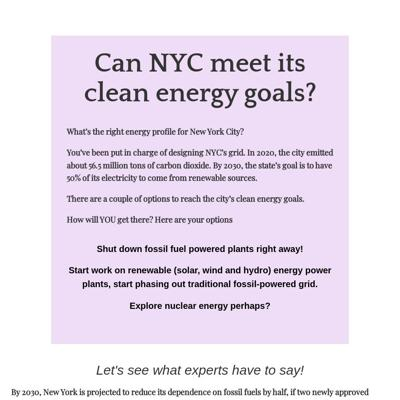](screenshots/areenaarora.com/nyc-energy_index.html-medium-full.jpg)|[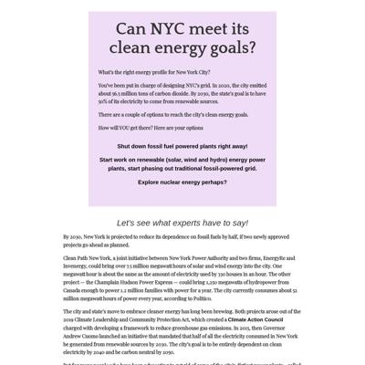](screenshots/areenaarora.com/nyc-energy_index.html-wide-full.jpg)|
|[Discretionary funds](https://areenaarora.com/discretionary-funds/)|||[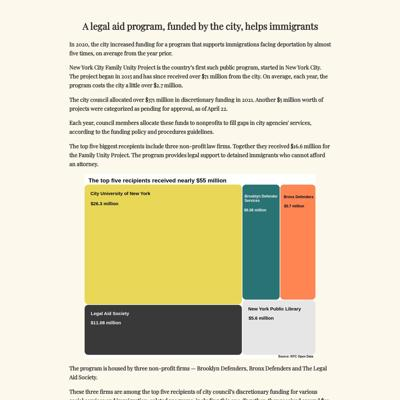](screenshots/areenaarora.com/discretionary-funds_index.html-wide-full.jpg)|
|[Style guides](https://areenaarora.com/style-guides/)||||
|[Street flooding in NYC](https://areenaarora.com/street-flooding/)||||
|[Climate essay](https://areenaarora.com/climate-essay/)|[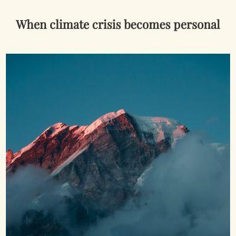](screenshots/areenaarora.com/climate-essay_index.html-mobile-full.jpg)|[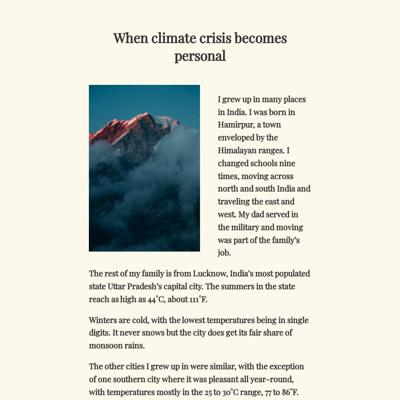](screenshots/areenaarora.com/climate-essay_index.html-medium-full.jpg)||

### Automatic Checks

**https://areenaarora.com/**

No issues found! 🎉

**https://areenaarora.com/nyc-energy/**

No issues found! 🎉

**https://areenaarora.com/discretionary-funds/**

* Minimum font size should be 12px, enlarge text in Illustrator
    * Text `Source: NYC Open Data` is too small at 10px
    * Text `Bronx Defenders` is too small at 9px
    * Text `Brooklyn Defender` is too small at 9px
    * Text `Services` is too small at 9px
    * Text `$5.7 million` is too small at 9px
    * Text `$6.08 million` is too small at 9px
    * Text `Source: NYC Open Data` is too small at 8px
    * *and 9 more*
* Overlapping elements in ai2html, check [the overflow video](https://www.youtube.com/watch?v=6vHsnjTp3_w) or make a smaller size
   * Text `Bronx` overlaps with `Brooklyn` at screen width 400
   * Text `Defenders` overlaps with `Defender Services` at screen width 400

**https://areenaarora.com/style-guides/**

No issues found! 🎉

**https://areenaarora.com/street-flooding/**

* Has sideways scrollbars in mobile version – check padding, margins, image widths

**https://areenaarora.com/climate-essay/**

No issues found! 🎉

## ilenapeng.github.io

|url|mobile|medium|wide|
|---|---|---|---|
|[Ilena Peng](https://ilenapeng.github.io/)||||
|[California's Kelp Forests in Crisis](https://ilenapeng.github.io/data-studio/california-kelp-forests/)||||
|[New Yorkers in Languages](https://ilenapeng.github.io/data-studio/nyc-languages/)||||
|[NYC's "Open" Streets](https://ilenapeng.github.io/data-studio/nyc-open-streets/)||||
|[The Path to Principal](https://ilenapeng.github.io/data-studio/path-to-principal/)||||
|[Religions in America](https://ilenapeng.github.io/data-studio/religion-voronoi-treemaps)||||
|[The Bay's Rainy December](https://ilenapeng.github.io/data-studio/stevens-creek/)||||

### Automatic Checks

**https://ilenapeng.github.io/**

* Has sideways scrollbars in mobile version – check padding, margins, image widths

**https://ilenapeng.github.io/data-studio/california-kelp-forests/**

* Overlapping elements in ai2html, check [the overflow video](https://www.youtube.com/watch?v=6vHsnjTp3_w) or make a smaller size
   * Text `Square meters of kelp` overlaps with `Westport` at screen width 900
   * Text `200` overlaps with `900` at screen width 900
* Missing font(s), you might need web fonts – [text explanation](https://gist.github.com/jsoma/631621e0807b26d49f5aef5260f79162), [video explanation](https://www.youtube.com/watch?v=HNhIeb_jEYM&list=PLewNEVDy7gq3MSrrO3eMEW8PhGMEVh2X2&index=3)
    * `"Helvetica Neue"` font not found, used in 48 text objects. Example: _2016, 2019, 2008_

**https://ilenapeng.github.io/data-studio/nyc-languages/**

No issues found! 🎉

**https://ilenapeng.github.io/data-studio/nyc-open-streets/**

No issues found! 🎉

**https://ilenapeng.github.io/data-studio/path-to-principal/**

* Missing font(s), you might need web fonts – [text explanation](https://gist.github.com/jsoma/631621e0807b26d49f5aef5260f79162), [video explanation](https://www.youtube.com/watch?v=HNhIeb_jEYM&list=PLewNEVDy7gq3MSrrO3eMEW8PhGMEVh2X2&index=3)
    * `Baskerville` font not found, used in 122 text objects. Example: _Ages at which New York City Ballet’s principal dancers reached each milestone, 10, 20_

**https://ilenapeng.github.io/data-studio/religion-voronoi-treemaps**

* Overlapping elements in ai2html, check [the overflow video](https://www.youtube.com/watch?v=6vHsnjTp3_w) or make a smaller size
   * Text `19.3%` overlaps with `Unaffiliated` at screen width 400

**https://ilenapeng.github.io/data-studio/stevens-creek/**

No issues found! 🎉

## jessieblaeser.github.io

|url|mobile|medium|wide|
|---|---|---|---|
|[Jessie Blaeser's Portfolio](https://jessieblaeser.github.io/)||[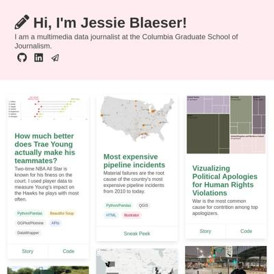](screenshots/jessieblaeser.github.io/index.html-medium-full.jpg)||
|[Vizualizing Apologies for Human Rights Violations](https://jessieblaeser.github.io/apologies)||||
|[Dams in Georgia](https://jessieblaeser.github.io/dam-safety-georgia/)||||
|[Dams in Georgia](https://jessieblaeser.github.io/georgia-dams/)||||
|[Most Expensive Pipeline Incidents](https://jessieblaeser.github.io/pipelines/)||||
|[Book lending at Paris's Famous Shakespeare & Co. Bookstore](https://jessieblaeser.github.io/shakespeareandco/)||||
|[Ticket to Ride Analysis](https://jessieblaeser.github.io/ticket-to-ride/)||||
|[Trae Young Hawks Analysis](https://jessieblaeser.github.io/trae-young/)||||

### Automatic Checks

**https://jessieblaeser.github.io/**

No issues found! 🎉

**https://jessieblaeser.github.io/apologies**

* Has sideways scrollbars in mobile version – check padding, margins, image widths
* Missing font(s), you might need web fonts – [text explanation](https://gist.github.com/jsoma/631621e0807b26d49f5aef5260f79162), [video explanation](https://www.youtube.com/watch?v=HNhIeb_jEYM&list=PLewNEVDy7gq3MSrrO3eMEW8PhGMEVh2X2&index=3)
    * `Avenir` font not found, used in 118 text objects. Example: _United States, Germany, Canada_

**https://jessieblaeser.github.io/dam-safety-georgia/**

No issues found! 🎉

**https://jessieblaeser.github.io/georgia-dams/**

No issues found! 🎉

**https://jessieblaeser.github.io/pipelines/**

* Has sideways scrollbars in mobile version – check padding, margins, image widths
* Overlapping elements in ai2html, check [the overflow video](https://www.youtube.com/watch?v=6vHsnjTp3_w) or make a smaller size
   * Text `Total Incident Cost (in millions of dollars)` overlaps with `< 6` at screen width 400
   * Text `Total Incident Cost (in millions of dollars)` overlaps with `< 6` at screen width 900
   * Text `Total Incident Cost (in millions of dollars)` overlaps with `< 6` at screen width 1300
* Missing font(s), you might need web fonts – [text explanation](https://gist.github.com/jsoma/631621e0807b26d49f5aef5260f79162), [video explanation](https://www.youtube.com/watch?v=HNhIeb_jEYM&list=PLewNEVDy7gq3MSrrO3eMEW8PhGMEVh2X2&index=3)
    * `Avenir` font not found, used in 46 text objects. Example: _The most expensive pipeline incidents are caused by material failures, Significant pipeline incidents from 2010 to February 2022, Incident caused by material failure_

**https://jessieblaeser.github.io/shakespeareandco/**

* Has sideways scrollbars in mobile version – check padding, margins, image widths
* Overlapping elements in ai2html, check [the overflow video](https://www.youtube.com/watch?v=6vHsnjTp3_w) or make a smaller size
   * Text `while serving as a lending library, 1919-1941` overlaps with `Joyce’s books were` at screen width 400
   * Text `were borrowed the most.` overlaps with `Virginia` at screen width 400
   * Text `while serving as a lending library, 1919-1941` overlaps with `Joyce’s books were` at screen width 900
   * Text `were borrowed the most.` overlaps with `Virginia` at screen width 900
   * Text `while serving as a lending library, 1919-1941` overlaps with `Joyce’s books were` at screen width 1300
   * Text `were borrowed the most.` overlaps with `Virginia` at screen width 1300
* Missing font(s), you might need web fonts – [text explanation](https://gist.github.com/jsoma/631621e0807b26d49f5aef5260f79162), [video explanation](https://www.youtube.com/watch?v=HNhIeb_jEYM&list=PLewNEVDy7gq3MSrrO3eMEW8PhGMEVh2X2&index=3)
    * `Avenir` font not found, used in 47 text objects. Example: _Virginia Woolf and James Joyce, among most popular female and male authors, Most popular books borrowed from Shakespeare & Co. Bookstore_

**https://jessieblaeser.github.io/ticket-to-ride/**

No issues found! 🎉

**https://jessieblaeser.github.io/trae-young/**

No issues found! 🎉

## juisarwate.github.io

|url|mobile|medium|wide|
|---|---|---|---|
|[Jui Sarwate Personal Website](https://juisarwate.github.io/) :x: og:image [how to fix](tips/SOCIAL.md)||||
|[UCLA Campus Study Spots](https://juisarwate.github.io/best-ucla-study-spots/) :x: og:image [how to fix](tips/SOCIAL.md)||||
|[Fastest coffee drinks for baristas](https://juisarwate.github.io/coffee-drink-speeds-affecting-baristas/) :x: og:image [how to fix](tips/SOCIAL.md)||||
|[Homeless 311 Complaints 2020](https://juisarwate.github.io/homeless-encampments-311/) :x: og:image [how to fix](tips/SOCIAL.md)||||
|[Monarch butterflies are coming back](https://juisarwate.github.io/monarch-butterflies) :x: og:image [how to fix](tips/SOCIAL.md)||||
|[Monarch butterflies are coming back](https://juisarwate.github.io/monarch-butterflies/) :x: og:image [how to fix](tips/SOCIAL.md)||||
|[Recycling Distribution NYC](https://juisarwate.github.io/nyc-recycling-distribution/) :x: og:image [how to fix](tips/SOCIAL.md)||||
|[Recycling Distribution NYC](https://juisarwate.github.io/nyc-recycling-distribution/) :x: og:image [how to fix](tips/SOCIAL.md)||||
|[Yosemite National Park Visitation](https://juisarwate.github.io/yosemite-visitation-2020/) :x: og:image [how to fix](tips/SOCIAL.md)||||
|[game](https://juisarwate.github.io/job-game/) :x: og:title :x: og:description :x: og:image [how to fix](tips/SOCIAL.md)||||

### Automatic Checks

**https://juisarwate.github.io/**

No issues found! 🎉

**https://juisarwate.github.io/best-ucla-study-spots/**

No issues found! 🎉

**https://juisarwate.github.io/coffee-drink-speeds-affecting-baristas/**

No issues found! 🎉

**https://juisarwate.github.io/homeless-encampments-311/**

No issues found! 🎉

**https://juisarwate.github.io/monarch-butterflies**

No issues found! 🎉

**https://juisarwate.github.io/monarch-butterflies/**

No issues found! 🎉

**https://juisarwate.github.io/nyc-recycling-distribution/**

* Image(s) need `alt` tags, [info here](https://abilitynet.org.uk/news-blogs/five-golden-rules-compliant-alt-text) and [tips here](https://twitter.com/FrankElavsky/status/1469023374529765385)
    * Image `pexels-photo-802221.jpeg` missing `alt` tag
* Has sideways scrollbars in mobile version – check padding, margins, image widths

**https://juisarwate.github.io/nyc-recycling-distribution/**

* Image(s) need `alt` tags, [info here](https://abilitynet.org.uk/news-blogs/five-golden-rules-compliant-alt-text) and [tips here](https://twitter.com/FrankElavsky/status/1469023374529765385)
    * Image `pexels-photo-802221.jpeg` missing `alt` tag
* Has sideways scrollbars in mobile version – check padding, margins, image widths

**https://juisarwate.github.io/yosemite-visitation-2020/**

* Has sideways scrollbars in mobile version – check padding, margins, image widths

**https://juisarwate.github.io/job-game/**

No issues found! 🎉

## juliaingram.github.io

|url|mobile|medium|wide|
|---|---|---|---|
|[Julia Ingram's portfolio](https://juliaingram.github.io) :x: og:title :x: og:description :x: og:image [how to fix](tips/SOCIAL.md)||||
|[California Utility Fires](https://juliaingram.github.io/ca-utility-fires/)||||
|[Citi Bike](https://juliaingram.github.io/citibike/)||||
|[Daylight Saving](https://juliaingram.github.io/daylight-saving/)||||
|[The American Food Pyramid](https://juliaingram.github.io/food-pyramid)||[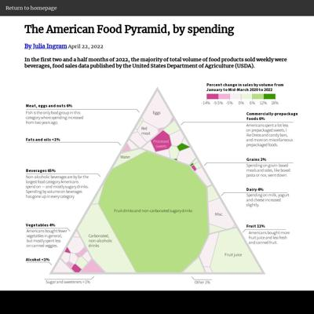](screenshots/juliaingram.github.io/food-pyramid_index.html-medium-full.jpg)||
|[Historical Sites & Climate Disasters](https://juliaingram.github.io/historic-sites/)|[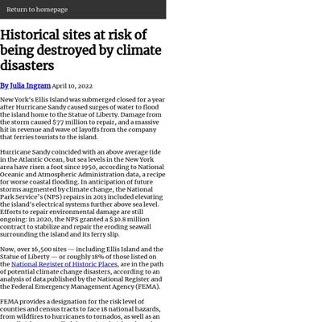](screenshots/juliaingram.github.io/historic-sites_index.html-mobile-full.jpg)|[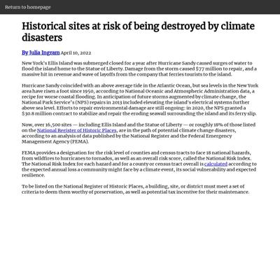](screenshots/juliaingram.github.io/historic-sites_index.html-medium-full.jpg)||
|[Pharmacy Access in NY](https://juliaingram.github.io/ny-pharmacy-access/)||||
|[Therapy Apps](https://juliaingram.github.io/therapy-apps/)||||

### Automatic Checks

**https://juliaingram.github.io**

No issues found! 🎉

**https://juliaingram.github.io/ca-utility-fires/**

No issues found! 🎉

**https://juliaingram.github.io/citibike/**

No issues found! 🎉

**https://juliaingram.github.io/daylight-saving/**

* Overlapping elements in ai2html, check [the overflow video](https://www.youtube.com/watch?v=6vHsnjTp3_w) or make a smaller size
   * Text `Pending` overlaps with `Enacted` at screen width 400
   * Text `earlier` overlaps with `The earliest sunset would` at screen width 400
   * Text `Enacted` overlaps with `Failed` at screen width 900
   * Text `Failed` overlaps with `2020` at screen width 900
   * Text `Enacted` overlaps with `Failed` at screen width 1300
   * Text `Failed` overlaps with `2020` at screen width 1300

**https://juliaingram.github.io/food-pyramid**

* Has sideways scrollbars in mobile version – check padding, margins, image widths
* Overlapping elements in ai2html, check [the overflow video](https://www.youtube.com/watch?v=6vHsnjTp3_w) or make a smaller size
   * Text `-14%` overlaps with `-9.5%` at screen width 400
   * Text `-5%` overlaps with `-9.5%` at screen width 400
   * Text `6%` overlaps with `12%` at screen width 400
   * Text `18%` overlaps with `12%` at screen width 400
   * Text `-14%` overlaps with `-9.5%` at screen width 900
   * Text `-5%` overlaps with `-9.5%` at screen width 900
   * Text `6%` overlaps with `12%` at screen width 900
   * *and 5 more*

**https://juliaingram.github.io/historic-sites/**

* Has sideways scrollbars in mobile version – check padding, margins, image widths

**https://juliaingram.github.io/ny-pharmacy-access/**

No issues found! 🎉

**https://juliaingram.github.io/therapy-apps/**

No issues found! 🎉

## kfalayi.github.io

|url|mobile|medium|wide|
|---|---|---|---|
|[Kunle Falayi's Portfolio](https://kfalayi.github.io/) :x: og:image [how to fix](tips/SOCIAL.md)||||
|[Africa is losing out of global investment in agriculture technology](https://kfalayi.github.io/agritech-investment/) :x: og:image [how to fix](tips/SOCIAL.md)||||
|[Dollar stores would make perfect vaccination sites](https://kfalayi.github.io/bloomberg/) :x: og:image [how to fix](tips/SOCIAL.md)||||
|[China dominates global demand for Africa's mineral resources](https://kfalayi.github.io/China-Africa-mineral-resources) :x: og:image [how to fix](tips/SOCIAL.md)||||
|[Food prices are increasing in Nigeria, insecurity may be to blame](https://kfalayi.github.io/Food-price-Nigeria/) :x: og:image [how to fix](tips/SOCIAL.md)||||
|[Most of US visas go to Hispanic migrants, the economy depends on it](https://kfalayi.github.io/hispanics-in-america/) :x: og:image [how to fix](tips/SOCIAL.md)||||
|[Kunle Falayi's Portfolio](https://kfalayi.github.io/irpin/) :x: og:image [how to fix](tips/SOCIAL.md)|||[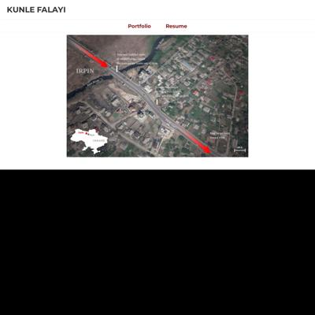](screenshots/kfalayi.github.io/irpin_index.html-wide-full.jpg)|
|[Here's how much water US agriculture uses for irrigation](https://kfalayi.github.io/irrigation-water/index.html) :x: og:image [how to fix](tips/SOCIAL.md)||[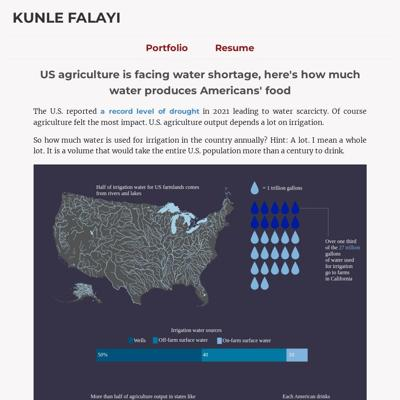](screenshots/kfalayi.github.io/irrigation-water_index.html-medium-full.jpg)||
|[Ratings of directors of BBC's 100 greatest films](https://kfalayi.github.io/movie-directors/map.html) :x: og:image [how to fix](tips/SOCIAL.md)||||
|[Page not found · GitHub Pages](https://kfalayi.github.io/NY-transit-crimes/) :x: og:title :x: og:description :x: og:image [how to fix](tips/SOCIAL.md)|request failed|request failed|request failed|
|[US-controlled islands leading the way in vaccination rates](https://kfalayi.github.io/vaccination/) :x: og:image [how to fix](tips/SOCIAL.md)||||

### Automatic Checks

**https://kfalayi.github.io/**

No issues found! 🎉

**https://kfalayi.github.io/agritech-investment/**

* Minimum font size should be 12px, enlarge text in Illustrator
    * Text `South ` is too small at 10px
    * Text `Africa` is too small at 10px
    * Text `Kenya` is too small at 10px
    * Text `Nigeria` is too small at 10px
    * Text `India` is too small at 9px
    * Text `United States` is too small at 9px
    * Text `Indonesia` is too small at 9px
    * *and 21 more*
* Overlapping elements in ai2html, check [the overflow video](https://www.youtube.com/watch?v=6vHsnjTp3_w) or make a smaller size
   * Text `ASIA` overlaps with `$6.7 billion` at screen width 400
   * Text `Indonesia` overlaps with `Israel` at screen width 400
   * Text `$5.4 billion` overlaps with `Germany` at screen width 400
   * Text `United` overlaps with `United` at screen width 400
   * Text `United` overlaps with `Germany` at screen width 400
   * Text `United` overlaps with `Germany` at screen width 400
   * Text `Kingdom` overlaps with `Kingdom` at screen width 400
   * *and 33 more*
* Missing font(s), you might need web fonts – [text explanation](https://gist.github.com/jsoma/631621e0807b26d49f5aef5260f79162), [video explanation](https://www.youtube.com/watch?v=HNhIeb_jEYM&list=PLewNEVDy7gq3MSrrO3eMEW8PhGMEVh2X2&index=3)
    * `Georgia` font not found, used in 192 text objects. Example: _ASIA, NORTH AMERICA, $6.7 billion_

**https://kfalayi.github.io/bloomberg/**

* Has sideways scrollbars in mobile version – check padding, margins, image widths
* Minimum font size should be 12px, enlarge text in Illustrator
    * Text `1 dot = 1 dollar store` is too small at 10px
    * Text `blue dots = dollar stores` is too small at 10px
    * Text `red dots = vaccination sites` is too small at 10px
    * Text `1 dot = 1 dollar store` is too small at 9px
    * Text `blue dots = dollar stores` is too small at 9px
    * Text `red dots = vaccination sites` is too small at 9px
    * Text `Map with QGIS and Illustrator | Inspired by Bloomberg’s story.` is too small at 10px
    * *and 11 more*

**https://kfalayi.github.io/China-Africa-mineral-resources**

* Change URL to be all in lowercase
* Has sideways scrollbars in mobile version – check padding, margins, image widths
* Minimum font size should be 12px, enlarge text in Illustrator
    * Text ` ` is too small at 9px
    * Text `2012` is too small at 9px
    * Text `2018` is too small at 9px
    * Text `2020` is too small at 9px
    * Text `2014` is too small at 9px
    * Text `2016` is too small at 9px
    * Text `2010` is too small at 9px
    * *and 12 more*
* Overlapping elements in ai2html, check [the overflow video](https://www.youtube.com/watch?v=6vHsnjTp3_w) or make a smaller size
   * Text `France` overlaps with `France` at screen width 400
   * Text `Germany` overlaps with `US` at screen width 400
   * Text `France` overlaps with `France` at screen width 900
   * Text `Germany` overlaps with `US` at screen width 900
   * Text `France` overlaps with `France` at screen width 1300
   * Text `Germany` overlaps with `US` at screen width 1300

**https://kfalayi.github.io/Food-price-Nigeria/**

* Change URL to be all in lowercase

**https://kfalayi.github.io/hispanics-in-america/**

No issues found! 🎉

**https://kfalayi.github.io/irpin/**

* Minimum font size should be 12px, enlarge text in Illustrator
    * Text `Irpin` is too small at 10px
    * Text `Kyiv` is too small at 9px
    * Text `100 ft` is too small at 10px
    * Text `Irpin River` is too small at 9px
    * Text `Evacuees huddled under ` is too small at 9px
    * Text `destroyed bridge, one of ` is too small at 9px
    * Text `the main escape routes out of Irpin` is too small at 9px
    * *and 24 more*
* Overlapping elements in ai2html, check [the overflow video](https://www.youtube.com/watch?v=6vHsnjTp3_w) or make a smaller size
   * Text `Irpin River` overlaps with `Evacuees huddled under` at screen width 400
   * Text `IRPIN` overlaps with `Irpin River` at screen width 400
   * Text `Irpin River` overlaps with `Evacuees huddled under` at screen width 900
   * Text `Irpin River` overlaps with `Evacuees huddled under` at screen width 1300

**https://kfalayi.github.io/irrigation-water/index.html**

* Has sideways scrollbars in mobile version – check padding, margins, image widths
* Overlapping elements in ai2html, check [the overflow video](https://www.youtube.com/watch?v=6vHsnjTp3_w) or make a smaller size
   * Text `40` overlaps with `30` at screen width 400
   * Text `40` overlaps with `50` at screen width 400
   * Text `60` overlaps with `50` at screen width 400
   * Text `60` overlaps with `70` at screen width 400
   * Text `40` overlaps with `30` at screen width 900
   * Text `40` overlaps with `50` at screen width 900
   * Text `60` overlaps with `50` at screen width 900
   * *and 5 more*

**https://kfalayi.github.io/movie-directors/map.html**

* Move `movie-directors/map.html` into a folder called `map`, then rename the file `index.html`. That way the project can be found at **/map** instead of **/map.html**. [Read more about index.html here](https://www.thoughtco.com/index-html-page-3466505)

**https://kfalayi.github.io/NY-transit-crimes/**

* Could not access the page - if you moved it, let me know
* Change URL to be all in lowercase
* Missing viewport meta tag in `<head>`, needed to tell browser it's responsive. Add `<meta name="viewport" content="width=device-width, initial-scale=1, shrink-to-fit=no">`
* Has sideways scrollbars in mobile version – check padding, margins, image widths

**https://kfalayi.github.io/vaccination/**

* Has sideways scrollbars in mobile version – check padding, margins, image widths

## luizftoledo.github.io

|url|mobile|medium|wide|
|---|---|---|---|
|[luizftoledo's journalism portfolio](https://luizftoledo.github.io/)||||
|[1 out of 4 federal agencies has become more secretive under Bolsonaro](https://luizftoledo.github.io/1-out-of-4-agencies-has-become-more-secretive-under-bolsonaro/)||||
|[Brazilian politicians pay for dozens of meals in the same day](https://luizftoledo.github.io/congress-expenses-with-food/)||||
|[foia-denials/index.html](https://luizftoledo.github.io/foia-denials) :x: og:title :x: og:description :x: og:image [how to fix](tips/SOCIAL.md)||||
|[Only 3 out of 100 environmental fines get paid in Brazil](https://luizftoledo.github.io/ibama-lack-of-enforcement/)||||
|[Under Bolsonaro, Brazil has sanctioned less companies for environmental crimes](https://luizftoledo.github.io/ibama-sanctions/)||||
|[How happy can Iron Maiden songs be?](https://luizftoledo.github.io/iron-maiden-happiness/)|[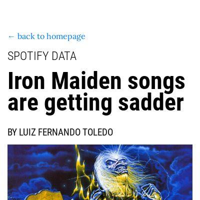](screenshots/luizftoledo.github.io/iron-maiden-happiness_index.html-mobile-full.jpg)||[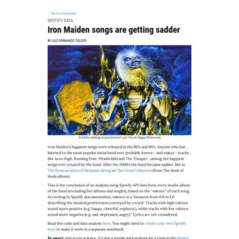](screenshots/luizftoledo.github.io/iron-maiden-happiness_index.html-wide-full.jpg)|
|[US exports more pistols than ever to Brazil: legally and ilegally](https://luizftoledo.github.io/weapons-seized/)||||

### Automatic Checks

**https://luizftoledo.github.io/**

No issues found! 🎉

**https://luizftoledo.github.io/1-out-of-4-agencies-has-become-more-secretive-under-bolsonaro/**

No issues found! 🎉

**https://luizftoledo.github.io/congress-expenses-with-food/**

No issues found! 🎉

**https://luizftoledo.github.io/foia-denials**

* Needs a title, add a `<title>` tag to the `<head>`
* Missing viewport meta tag in `<head>`, needed to tell browser it's responsive. Add `<meta name="viewport" content="width=device-width, initial-scale=1, shrink-to-fit=no">`
* Overlapping elements in ai2html, check [the overflow video](https://www.youtube.com/watch?v=6vHsnjTp3_w) or make a smaller size
   * Text `Top 10 most opaque Brazilian public bodies in the federal government` overlaps with `Shares of denied FOIA requests from 2013 to 2021` at screen width 400
   * Text `Caixa Econômica` overlaps with `GSI` at screen width 400
   * Text `Banco do Brasil` overlaps with `AGU` at screen width 400
   * Text `56% denied requests` overlaps with `51%` at screen width 400
   * Text `FINEP` overlaps with `Transpetro` at screen width 400
   * Text `Exército` overlaps with `Banco Central` at screen width 400
   * Text `Banco Central` overlaps with `Polícia Federal` at screen width 400

**https://luizftoledo.github.io/ibama-lack-of-enforcement/**

No issues found! 🎉

**https://luizftoledo.github.io/ibama-sanctions/**

* Overlapping elements in ai2html, check [the overflow video](https://www.youtube.com/watch?v=6vHsnjTp3_w) or make a smaller size
   * Text `8k` overlaps with `2013` at screen width 400
   * Text `2013` overlaps with `2014` at screen width 400
   * Text `2014` overlaps with `2015` at screen width 400
   * Text `2015` overlaps with `2016` at screen width 400
   * Text `2016` overlaps with `2017` at screen width 400
   * Text `2017` overlaps with `2018` at screen width 400
   * Text `2018` overlaps with `2019` at screen width 400
   * *and 4 more*

**https://luizftoledo.github.io/iron-maiden-happiness/**

No issues found! 🎉

**https://luizftoledo.github.io/weapons-seized/**

* Has sideways scrollbars in mobile version – check padding, margins, image widths
* Minimum font size should be 12px, enlarge text in Illustrator
    * Text `1990` is too small at 6px
    * Text `USA and Austria are the countries of origin for most of the ` is too small at 10px
    * Text `foreign seized weapons in Brazil` is too small at 10px
    * Text `Data is from 2013 to 2021` is too small at 8px
    * Text `United States` is too small at 8px
    * Text `Austria` is too small at 8px
    * Text `Turkey` is too small at 8px
    * *and 81 more*
* Overlapping elements in ai2html, check [the overflow video](https://www.youtube.com/watch?v=6vHsnjTp3_w) or make a smaller size
   * Text `2019` overlaps with `2018` at screen width 400
   * Text `2019` overlaps with `2018` at screen width 900
   * Text `2019` overlaps with `2018` at screen width 1300

## mishavaid7.github.io

|url|mobile|medium|wide|
|---|---|---|---|
|[Misha Vaid](https://mishavaid7.github.io/)||||
|[Airbnb Story](https://mishavaid7.github.io/airbnb-story/)||||
|[Airbnb Story](https://mishavaid7.github.io/airbnb-update/) :x: og:title :x: og:description :x: og:image [how to fix](tips/SOCIAL.md)||||
|[Visualizing Presidential Pardons](https://mishavaid7.github.io/clemency/)||||
|[Visualizing Presidential Pardons](https://mishavaid7.github.io/pardons)||||
|[Where do Americans get their news in 2022 and how much do they trust it?](https://mishavaid7.github.io/poll-project/)||||
|[NYC Restaurant Grade Story](https://mishavaid7.github.io/rest-story/)||||
|[Wordle Cheaters](https://mishavaid7.github.io/wordle/)||||

### Automatic Checks

**https://mishavaid7.github.io/**

* Has sideways scrollbars in mobile version – check padding, margins, image widths

**https://mishavaid7.github.io/airbnb-story/**

No issues found! 🎉

**https://mishavaid7.github.io/airbnb-update/**

* Has sideways scrollbars in mobile version – check padding, margins, image widths
* Overlapping elements in ai2html, check [the overflow video](https://www.youtube.com/watch?v=6vHsnjTp3_w) or make a smaller size
   * Text `14.2%` overlaps with `34.3%` at screen width 400
   * Text `25.2` overlaps with `53.7` at screen width 400
   * Text `56.9` overlaps with `39.6` at screen width 400
   * Text `43.8` overlaps with `80.4` at screen width 400
   * Text `14.2%` overlaps with `34.3%` at screen width 900
   * Text `25.2` overlaps with `53.7` at screen width 900
   * Text `56.9` overlaps with `39.6` at screen width 900
   * *and 5 more*

**https://mishavaid7.github.io/clemency/**

No issues found! 🎉

**https://mishavaid7.github.io/pardons**

* Minimum font size should be 12px, enlarge text in Illustrator
    * Text `450` is too small at 10px
    * Text `400` is too small at 10px
    * Text `350` is too small at 10px
    * Text `300` is too small at 10px
    * Text `250` is too small at 10px
    * Text `200` is too small at 10px
    * Text `150` is too small at 10px
    * *and 15 more*
* Overlapping elements in ai2html, check [the overflow video](https://www.youtube.com/watch?v=6vHsnjTp3_w) or make a smaller size
   * Text `Presidents Don’t Pardon Like They Used To.` overlaps with `Misha Vaid` at screen width 400
   * Text `Misha Vaid` overlaps with `One such limitation is that pardons can only be granted for Federal Crimes. The President also cannot grant` at screen width 400
   * Text `April 17th 2022` overlaps with `The president’s power to grant pardons or reprieves is quietly one of the broadest powers granted to the` at screen width 400
   * Text `April 17th 2022` overlaps with `One such limitation is that pardons can only be granted for Federal Crimes. The President also cannot grant` at screen width 400
   * Text `The president’s power to grant pardons or reprieves is quietly one of the broadest powers granted to the` overlaps with `One such limitation is that pardons can only be granted for Federal Crimes. The President also cannot grant` at screen width 400
   * Text `Executive in the constitution. The power has very few limitations.` overlaps with `pardons cases of impeachment. And lastly, the President can pardon before prosecution and trial, but the` at screen width 400
   * Text `on in the Presidency for the past 30 years. But have presidents always been so hesitant to use this sweeping` overlaps with `Pardons granted by` at screen width 400
   * *and 33 more*

**https://mishavaid7.github.io/poll-project/**

* Has sideways scrollbars in mobile version – check padding, margins, image widths
* Minimum font size should be 12px, enlarge text in Illustrator
    * Text `April 17th 2022` is too small at 10px
* Overlapping elements in ai2html, check [the overflow video](https://www.youtube.com/watch?v=6vHsnjTp3_w) or make a smaller size
   * Text `US` overlaps with `​ Adult Citizens` at screen width 400
   * Text `the % above includes an aggregate of those who answered “very trustworthy” and “trustworthy” in the poll` overlaps with `​ ​` at screen width 400
   * Text `Get the data` overlaps with `​ ​` at screen width 400
   * Text `US` overlaps with `​ Adult Citizen` at screen width 400
   * Text `Anderson Cooper of CNN was the personality that Democrats and Republicans disagreed over the` overlaps with `​ ​` at screen width 400
   * Text `US` overlaps with `​ Adult Citizens` at screen width 900
   * Text `the % above includes an aggregate of those who answered “very trustworthy” and “trustworthy” in the poll` overlaps with `​ ​` at screen width 900
   * *and 8 more*

**https://mishavaid7.github.io/rest-story/**

* Has sideways scrollbars in mobile version – check padding, margins, image widths

**https://mishavaid7.github.io/wordle/**

* Image(s) need `alt` tags, [info here](https://abilitynet.org.uk/news-blogs/five-golden-rules-compliant-alt-text) and [tips here](https://twitter.com/FrankElavsky/status/1469023374529765385)
    * Image `pink.png alt=` missing `alt` tag

## msc-joel.github.io

|url|mobile|medium|wide|
|---|---|---|---|
|[Profile of Joel Konopo](https://msc-joel.github.io/) :x: og:title :x: og:description :x: og:image [how to fix](tips/SOCIAL.md)||||
|[Treemap (Voronoi)](https://msc-joel.github.io/fancystuff) :x: og:title :x: og:description :x: og:image [how to fix](tips/SOCIAL.md)||[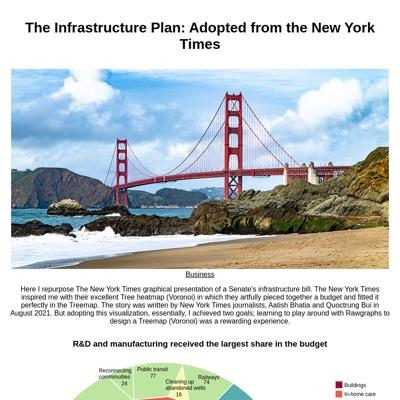](screenshots/msc-joel.github.io/fancystuff_index.html-medium-full.jpg)||
|[Covid inflation surge likely to persist](https://msc-joel.github.io/main-article1.html) :x: og:title :x: og:description :x: og:image [how to fix](tips/SOCIAL.md)||||
|[More than half of CEDA loan beneficiaries are in the services business](https://msc-joel.github.io/main-article3.html) :x: og:title :x: og:description :x: og:image [how to fix](tips/SOCIAL.md)|||[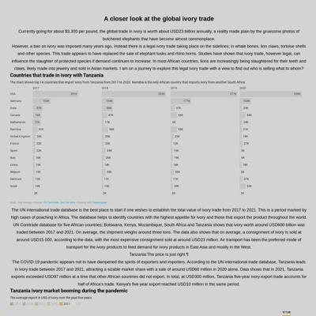](screenshots/msc-joel.github.io/main-article3.html-wide-full.jpg)|
|[Responsive page](https://msc-joel.github.io/main-article4.html) :x: og:title :x: og:description :x: og:image [how to fix](tips/SOCIAL.md)||[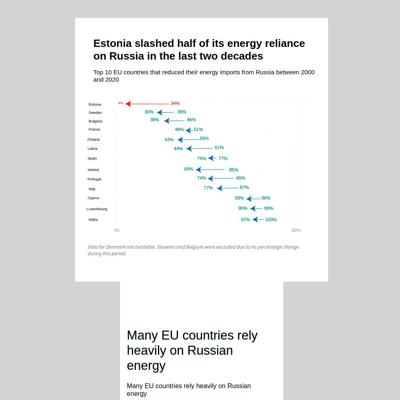](screenshots/msc-joel.github.io/main-article4.html-medium-full.jpg)||
|[main-article5.html](https://msc-joel.github.io/main-article5.html) :x: og:title :x: og:description :x: og:image [how to fix](tips/SOCIAL.md)||||
|[Vaccination target for countries to meet.](https://msc-joel.github.io/main-article6/) :x: og:title :x: og:description :x: og:image [how to fix](tips/SOCIAL.md)||||
|[Vaccination target for countries to meet.](https://msc-joel.github.io/main-article7/index2.html) :x: og:title :x: og:description :x: og:image [how to fix](tips/SOCIAL.md)||||

### Automatic Checks

**https://msc-joel.github.io/**

* Has sideways scrollbars in mobile version – check padding, margins, image widths

**https://msc-joel.github.io/fancystuff**

* Has sideways scrollbars in mobile version – check padding, margins, image widths
* Minimum font size should be 12px, enlarge text in Illustrator
    * Text `Buildings` is too small at 8px
    * Text `In-home care` is too small at 8px
    * Text `Innovation` is too small at 8px
    * Text `Pollution` is too small at 8px
    * Text `Transportation` is too small at 8px
    * Text `Transportation` is too small at 8px
    * Text `Utilities` is too small at 8px
* Overlapping elements in ai2html, check [the overflow video](https://www.youtube.com/watch?v=6vHsnjTp3_w) or make a smaller size
   * Text `Public transit` overlaps with `Reconnecting` at screen width 400
   * Text `Cleaning up` overlaps with `74` at screen width 400
   * Text `17` overlaps with `Western water infrastructure` at screen width 400
   * Text `Public transit` overlaps with `Reconnecting` at screen width 900
   * Text `Cleaning up` overlaps with `74` at screen width 900
   * Text `17` overlaps with `Western water infrastructure` at screen width 900
   * Text `Public transit` overlaps with `Reconnecting` at screen width 1300
   * *and 2 more*

**https://msc-joel.github.io/main-article1.html**

* Image(s) need `alt` tags, [info here](https://abilitynet.org.uk/news-blogs/five-golden-rules-compliant-alt-text) and [tips here](https://twitter.com/FrankElavsky/status/1469023374529765385)
    * Image `inflation-pic.jpg` missing `alt` tag
    * Image `inflation-graph.png` missing `alt` tag
* Move `main-article1.html` into a folder called `main-article1`, then rename the file `index.html`. That way the project can be found at **/main-article1** instead of **/main-article1.html**. [Read more about index.html here](https://www.thoughtco.com/index-html-page-3466505)
* Has sideways scrollbars in mobile version – check padding, margins, image widths

**https://msc-joel.github.io/main-article3.html**

* Move `main-article3.html` into a folder called `main-article3`, then rename the file `index.html`. That way the project can be found at **/main-article3** instead of **/main-article3.html**. [Read more about index.html here](https://www.thoughtco.com/index-html-page-3466505)
* Has sideways scrollbars in mobile version – check padding, margins, image widths

**https://msc-joel.github.io/main-article4.html**

* Move `main-article4.html` into a folder called `main-article4`, then rename the file `index.html`. That way the project can be found at **/main-article4** instead of **/main-article4.html**. [Read more about index.html here](https://www.thoughtco.com/index-html-page-3466505)
* Has sideways scrollbars in mobile version – check padding, margins, image widths
* Minimum font size should be 12px, enlarge text in Illustrator
    * Text `5%` is too small at 8px
    * Text `5%` is too small at 8px
    * Text `Estonia` is too small at 9px
    * Text `Sweden` is too small at 9px
    * Text `Bulgaria` is too small at 9px
    * Text `France` is too small at 9px
    * Text `Finland` is too small at 9px
    * *and 35 more*
* Overlapping elements in ai2html, check [the overflow video](https://www.youtube.com/watch?v=6vHsnjTp3_w) or make a smaller size
   * Text `34%` overlaps with `34%` at screen width 400
   * Text `5%` overlaps with `5%` at screen width 400
   * Text `30%` overlaps with `30%` at screen width 400
   * Text `39%` overlaps with `39%` at screen width 400
   * Text `38%` overlaps with `38%` at screen width 400
   * Text `46%` overlaps with `46%` at screen width 400
   * Text `51%` overlaps with `51%` at screen width 400
   * *and 134 more*

**https://msc-joel.github.io/main-article5.html**

* Image(s) need `alt` tags, [info here](https://abilitynet.org.uk/news-blogs/five-golden-rules-compliant-alt-text) and [tips here](https://twitter.com/FrankElavsky/status/1469023374529765385)
    * Image `Russian_energy.jpg` missing `alt` tag
* Needs a title, add a `<title>` tag to the `<head>`
* Move `main-article5.html` into a folder called `main-article5`, then rename the file `index.html`. That way the project can be found at **/main-article5** instead of **/main-article5.html**. [Read more about index.html here](https://www.thoughtco.com/index-html-page-3466505)
* Has sideways scrollbars in mobile version – check padding, margins, image widths
* Minimum font size should be 12px, enlarge text in Illustrator
    * Text `97%` is too small at 9px
    * Text `95%` is too small at 9px
    * Text `93%` is too small at 9px
    * Text `78%` is too small at 9px
    * Text `77%` is too small at 9px
    * Text `75%` is too small at 9px
    * Text `75%` is too small at 9px
    * *and 13 more*
* Overlapping elements in ai2html, check [the overflow video](https://www.youtube.com/watch?v=6vHsnjTp3_w) or make a smaller size
   * Text `97%` overlaps with `95%` at screen width 400
   * Text `95%` overlaps with `93%` at screen width 400
   * Text `78%` overlaps with `77%` at screen width 400
   * Text `77%` overlaps with `75%` at screen width 400
   * Text `75%` overlaps with `75%` at screen width 400
   * Text `75%` overlaps with `74%` at screen width 400
   * Text `74%` overlaps with `74%` at screen width 400
   * *and 3 more*

**https://msc-joel.github.io/main-article6/**

* Has sideways scrollbars in mobile version – check padding, margins, image widths
* Minimum font size should be 12px, enlarge text in Illustrator
    * Text `Joel Konopo` is too small at 9px
    * Text `•` is too small at 9px
    * Text `Source` is too small at 9px
    * Text `World Health Organization` is too small at 9px
* Overlapping elements in ai2html, check [the overflow video](https://www.youtube.com/watch?v=6vHsnjTp3_w) or make a smaller size
   * Text `Algeria` overlaps with `Angola` at screen width 400
   * Text `Angola` overlaps with `Benin` at screen width 400
   * Text `Benin` overlaps with `Botswana` at screen width 400
   * Text `Botswana` overlaps with `Cape Verde` at screen width 400
   * Text `Cape Verde` overlaps with `CAR` at screen width 400
   * Text `CAR` overlaps with `Chad` at screen width 400
   * Text `Chad` overlaps with `Congo` at screen width 400
   * *and 378 more*

**https://msc-joel.github.io/main-article7/index2.html**

* Move `main-article7/index2.html` into a folder called `index2`, then rename the file `index.html`. That way the project can be found at **/index2** instead of **/index2.html**. [Read more about index.html here](https://www.thoughtco.com/index-html-page-3466505)
* Has sideways scrollbars in mobile version – check padding, margins, image widths
* Minimum font size should be 12px, enlarge text in Illustrator
    * Text `6k` is too small at 10px
    * Text `213k` is too small at 9px
    * Text `200` is too small at 9px
    * Text `Black drivers are stopped frequently in LA ` is too small at 9px
    * Text `160` is too small at 9px
    * Text `120k` is too small at 9px
    * Text `120` is too small at 9px
    * *and 79 more*
* Overlapping elements in ai2html, check [the overflow video](https://www.youtube.com/watch?v=6vHsnjTp3_w) or make a smaller size
   * Text `AZ` overlaps with `CA` at screen width 400
   * Text `CA` overlaps with `CO` at screen width 400
   * Text `CO` overlaps with `CT` at screen width 400
   * Text `CT` overlaps with `FL` at screen width 400
   * Text `FL` overlaps with `GA` at screen width 400
   * Text `GA` overlaps with `IL` at screen width 400
   * Text `IL` overlaps with `MA` at screen width 400
   * *and 53 more*

## naokatoh.github.io

|url|mobile|medium|wide|
|---|---|---|---|
|[Nao Hidaka Kato](https://naokatoh.github.io/)||||
|[fancy-chart/index.html](https://naokatoh.github.io/fancy-chart) :x: og:title :x: og:description :x: og:image [how to fix](tips/SOCIAL.md)||||
|[Music in Men's Figure Skating](https://naokatoh.github.io/figure-skate-music/)||||
|[Myanmar's Coup Fatalities in Context](https://naokatoh.github.io/myanmar-coup-death/)||||
|[Rodents complaints](https://naokatoh.github.io/nycrats/)|[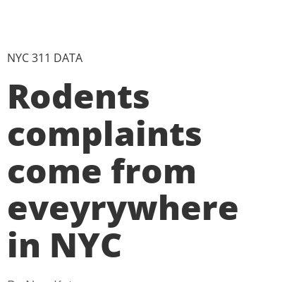](screenshots/naokatoh.github.io/nycrats_index.html-mobile-full.jpg)|||
|[Disney/Pixar won the most Oscars](https://naokatoh.github.io/oscar-anime/)||||
|[NYC Cherry Blossom](https://naokatoh.github.io/sakura-nyc/)||||
|[Where to Find Uni in the US](https://naokatoh.github.io/sea-urchin/)||||
|[International students in Ukraine need more help as Russian intensifies attack](https://naokatoh.github.io/ukraine/)|[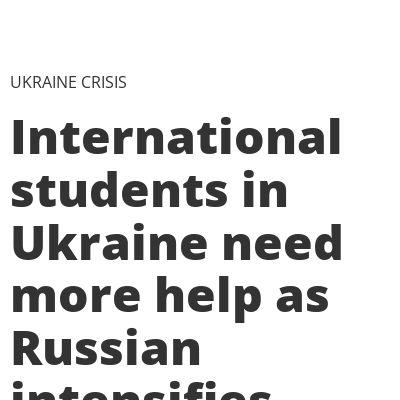](screenshots/naokatoh.github.io/ukraine_index.html-mobile-full.jpg)|||

### Automatic Checks

**https://naokatoh.github.io/**

* Has sideways scrollbars in mobile version – check padding, margins, image widths

**https://naokatoh.github.io/fancy-chart**

* Needs a title, add a `<title>` tag to the `<head>`
* Missing viewport meta tag in `<head>`, needed to tell browser it's responsive. Add `<meta name="viewport" content="width=device-width, initial-scale=1, shrink-to-fit=no">`
* Overlapping elements in ai2html, check [the overflow video](https://www.youtube.com/watch?v=6vHsnjTp3_w) or make a smaller size
   * Text `AQI Category` overlaps with `Good` at screen width 400
   * Text `AQI Category` overlaps with `2010` at screen width 400

**https://naokatoh.github.io/figure-skate-music/**

No issues found! 🎉

**https://naokatoh.github.io/myanmar-coup-death/**

No issues found! 🎉

**https://naokatoh.github.io/nycrats/**

No issues found! 🎉

**https://naokatoh.github.io/oscar-anime/**

* Has sideways scrollbars in mobile version – check padding, margins, image widths
* Minimum font size should be 12px, enlarge text in Illustrator
    * Text `Not Disney/ Pixar` is too small at 10px

**https://naokatoh.github.io/sakura-nyc/**

* Image(s) need `alt` tags, [info here](https://abilitynet.org.uk/news-blogs/five-golden-rules-compliant-alt-text) and [tips here](https://twitter.com/FrankElavsky/status/1469023374529765385)
    * Image `./images/sakura_park.jpg` missing `alt` tag
    * Image `./images/sakura_park2.jpg` missing `alt` tag
    * Image `https://upload.wikimedia.org/wikipedia/commons/a/a3/Riverside_Park_03.jpg` missing `alt` tag
    * Image `https://upload.wikimedia.org/wikipedia/commons/9/98/Central_Park%2C_New_York%2C_NY%2C_USA_-_panoramio_%28151%29.jpg` missing `alt` tag
    * Image `https://upload.wikimedia.org/wikipedia/commons/5/52/Yoshino_Sakura_Tidal_Basin_DC.jpg` missing `alt` tag
    * Image `https://upload.wikimedia.org/wikipedia/commons/f/f3/2016-03-12_10_26_38_Okame_Cherry_blossoms_at_the_Lawrence_Road_Presbyterian_Church_in_Lawrence%2C_New_Jersey.jpg` missing `alt` tag
    * Image `https://upload.wikimedia.org/wikipedia/commons/5/52/Hunter%E2%80%99s_Point_South_Park_-_Phase_6_-_Overlook.jpg` missing `alt` tag
    * Image `./images/tweet.jpg` missing `alt` tag
    * Image `./images/cherry-traker.jpg` missing `alt` tag
    * Image `https://upload.wikimedia.org/wikipedia/commons/thumb/9/99/Silver_Lake_%28aerial_view_of_reservoir_and_surrounding_area%29_%28NYPL_b15279351-104842%29.tiff/lossy-page1-800px-Silver_Lake_%28aerial_view_of_reservoir_and_surrounding_area%29_%28NYPL_b15279351-104842%29.tiff.jpg` missing `alt` tag

**https://naokatoh.github.io/sea-urchin/**

No issues found! 🎉

**https://naokatoh.github.io/ukraine/**

* Overlapping elements in ai2html, check [the overflow video](https://www.youtube.com/watch?v=6vHsnjTp3_w) or make a smaller size
   * Text `Turkey` overlaps with `Azerbaijan` at screen width 400
   * Text `Turkmenistan` overlaps with `China` at screen width 900
   * Text `Turkey` overlaps with `Azerbaijan` at screen width 900
   * Text `Turkmenistan` overlaps with `China` at screen width 1300
   * Text `Turkey` overlaps with `Azerbaijan` at screen width 1300

## pmagtulis.github.io

|url|mobile|medium|wide|
|---|---|---|---|
|[Prinz Magtulis](https://pmagtulis.github.io/)||||
|[Prinz Magtulis - Projects](https://pmagtulis.github.io/projects/)|[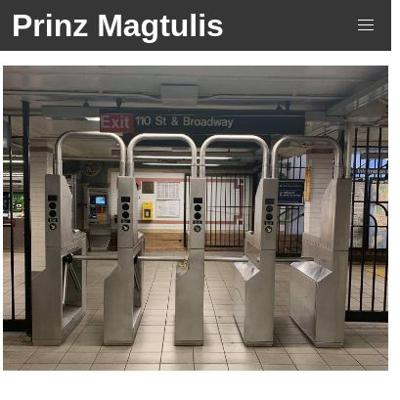](screenshots/pmagtulis.github.io/projects_index.html-mobile-full.jpg)|||
|[Somebody irked with dirty air in Port Authority bus terminal is keeping their lines busy  Prinz Magtulis](https://pmagtulis.github.io/projects/air-quality/)|||[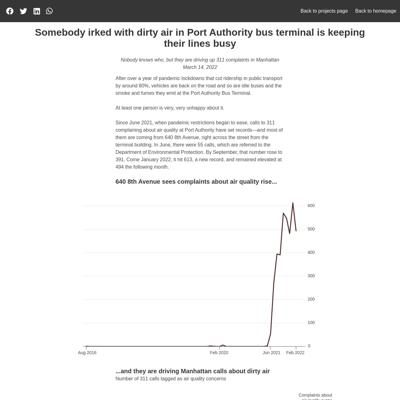](screenshots/pmagtulis.github.io/projects_air-quality_index.html-wide-full.jpg)|
|[Big Tech are also Nasdaq's only billionaires  Prinz Magtulis](https://pmagtulis.github.io/projects/fancy-chart)||||
|[Duterte's freedom of information is not so free  Prinz Magtulis](https://pmagtulis.github.io/projects/foi-ph/)|||[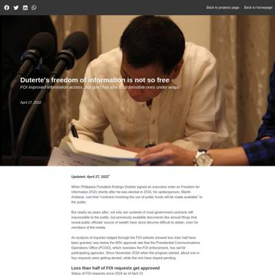](screenshots/pmagtulis.github.io/projects_foi-ph_index.html-wide-full.jpg)|
|[Duterte sets record in conflict killings due to siege in South  Prinz Magtulis](https://pmagtulis.github.io/projects/ph-conflict/)||||
|[Here are the vote-rich areas for the 2022 Philippine polls  Prinz Magtulis](https://pmagtulis.github.io/projects/polls-ph/)||||
|[Stagflation? Economists say too early to tell  Prinz Magtulis](https://pmagtulis.github.io/projects/stagflation/)||||
|[New York City trains are likely to be so slow again  Prinz Magtulis](https://pmagtulis.github.io/projects/trains/)||||
|[A game ditched joysticks and was a pandemic hit in Japan  Prinz Magtulis](https://pmagtulis.github.io/projects/video-games/)||||

### Automatic Checks

**https://pmagtulis.github.io/**

No issues found! 🎉

**https://pmagtulis.github.io/projects/**

No issues found! 🎉

**https://pmagtulis.github.io/projects/air-quality/**

* Has sideways scrollbars in mobile version – check padding, margins, image widths

**https://pmagtulis.github.io/projects/fancy-chart**

* Has sideways scrollbars in mobile version – check padding, margins, image widths
* Minimum font size should be 12px, enlarge text in Illustrator
    * Text `Master` is too small at 10px
    * Text `card` is too small at 10px
    * Text `BoA` is too small at 10px
    * Text `VISA` is too small at 10px
    * Text `Canadian` is too small at 10px
    * Text `National` is too small at 10px
    * Text `Rail` is too small at 10px

**https://pmagtulis.github.io/projects/foi-ph/**

* Overlapping elements in ai2html, check [the overflow video](https://www.youtube.com/watch?v=6vHsnjTp3_w) or make a smaller size
   * Text `80` overlaps with `100` at screen width 400
   * Text `80` overlaps with `100` at screen width 900
   * Text `80` overlaps with `100` at screen width 1300

**https://pmagtulis.github.io/projects/ph-conflict/**

* Has sideways scrollbars in mobile version – check padding, margins, image widths

**https://pmagtulis.github.io/projects/polls-ph/**

* Has sideways scrollbars in mobile version – check padding, margins, image widths
* Minimum font size should be 12px, enlarge text in Illustrator
    * Text `Caloocan` is too small at 8px
    * Text `700,279` is too small at 8px
    * Text `Quezon City` is too small at 8px
    * Text `1,403,895` is too small at 8px
    * Text `Manila` is too small at 8px
    * Text `1,112,081` is too small at 8px
    * Text `Entire NCR:` is too small at 8px
    * *and 1 more*

**https://pmagtulis.github.io/projects/stagflation/**

* Has sideways scrollbars in mobile version – check padding, margins, image widths

**https://pmagtulis.github.io/projects/trains/**

* Overlapping elements in ai2html, check [the overflow video](https://www.youtube.com/watch?v=6vHsnjTp3_w) or make a smaller size
   * Text `Jun 2021` overlaps with `Feb 2022` at screen width 400
   * Text `Jun` overlaps with `Feb` at screen width 400
   * Text `2021` overlaps with `2022` at screen width 400
   * Text `Jun 2021` overlaps with `Feb 2022` at screen width 900
   * Text `Jun` overlaps with `Feb` at screen width 900
   * Text `2021` overlaps with `2022` at screen width 900
   * Text `Jun 2021` overlaps with `Feb 2022` at screen width 1300
   * *and 2 more*

**https://pmagtulis.github.io/projects/video-games/**

* Has sideways scrollbars in mobile version – check padding, margins, image widths
* Minimum font size should be 12px, enlarge text in Illustrator
    * Text ` ` is too small at 10px

## pmartisa.github.io

|url|mobile|medium|wide|
|---|---|---|---|
|[Patricia's website](https://pmartisa.github.io/)||||
|[Patricia's website](https://pmartisa.github.io/)||||
|[child-homicide-project/index.html](https://pmartisa.github.io/child-homicide-project/index.html) :x: og:title :x: og:description :x: og:image [how to fix](tips/SOCIAL.md)|[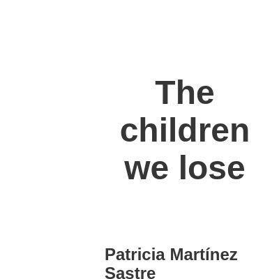](screenshots/pmartisa.github.io/child-homicide-project_index.html-mobile-full.jpg)|||
|[Article focused on domestic violence in Spain](https://pmartisa.github.io/project-domestic-violence/)||||
|[Article on the Olympics](https://pmartisa.github.io/project-olympics/)||||
|[Article focused on Russian oil and wheat exports](https://pmartisa.github.io/project-russia-exports/)||||
|[scorllytelling-project2/index.html](https://pmartisa.github.io/scorllytelling-project2/) :x: og:title :x: og:description :x: og:image [how to fix](tips/SOCIAL.md)||||
|[scrollytelling_project/index.html](https://pmartisa.github.io/scrollytelling_project/) :x: og:title :x: og:description :x: og:image [how to fix](tips/SOCIAL.md)||||

### Automatic Checks

**https://pmartisa.github.io/**

* Image(s) need `alt` tags, [info here](https://abilitynet.org.uk/news-blogs/five-golden-rules-compliant-alt-text) and [tips here](https://twitter.com/FrankElavsky/status/1469023374529765385)
    * Image `./child-homicide-project/graphs/graph.png` missing `alt` tag
    * Image `./viz_writing_data/casinos.png` missing `alt` tag
* Missing viewport meta tag in `<head>`, needed to tell browser it's responsive. Add `<meta name="viewport" content="width=device-width, initial-scale=1, shrink-to-fit=no">`
* Minimum font size should be 12px, enlarge text in Illustrator
    * Text ` ` is too small at 10px
    * Text `All dead are a conservative estimation. The number of killed encompasses both security officials and civilians. Small deadly episodes such as regains of territory by Ethiopian Government or Tigray forces in 2021 haven’t been labeled. Source: ACLED. Patricia MS.` is too small at 10px
    * Text `For years the second most populous country in Africa has faced military and police crackdowns, and civilian repression` is too small at 10px
    * Text `4,800 dead` is too small at 8px
    * Text `in 935 clashes ` is too small at 8px
    * Text `amid conflict` is too small at 8px
    * Text ` ` is too small at 6px
    * *and 53 more*
* Overlapping elements in ai2html, check [the overflow video](https://www.youtube.com/watch?v=6vHsnjTp3_w) or make a smaller size
   * Text `close to 500 killed` overlaps with `1,000 killed after months of` at screen width 400
   * Text `after security officials` overlaps with `anti-government protets` at screen width 400
   * Text `used excessive force` overlaps with `in 146 clashes in Oromia` at screen width 400
   * Text `civilians` overlaps with `1,575 killed` at screen width 400
   * Text `close to 500` overlaps with `Troops on Addis` at screen width 400
   * Text `killed in missile` overlaps with `Ababa after murder` at screen width 400
   * Text `attacks/shelling` overlaps with `of Oromo activist` at screen width 400
   * *and 7 more*

**https://pmartisa.github.io/**

* Image(s) need `alt` tags, [info here](https://abilitynet.org.uk/news-blogs/five-golden-rules-compliant-alt-text) and [tips here](https://twitter.com/FrankElavsky/status/1469023374529765385)
    * Image `./child-homicide-project/graphs/graph.png` missing `alt` tag
    * Image `./viz_writing_data/casinos.png` missing `alt` tag
* Missing viewport meta tag in `<head>`, needed to tell browser it's responsive. Add `<meta name="viewport" content="width=device-width, initial-scale=1, shrink-to-fit=no">`
* Minimum font size should be 12px, enlarge text in Illustrator
    * Text ` ` is too small at 10px
    * Text `All dead are a conservative estimation. The number of killed encompasses both security officials and civilians. Small deadly episodes such as regains of territory by Ethiopian Government or Tigray forces in 2021 haven’t been labeled. Source: ACLED. Patricia MS.` is too small at 10px
    * Text `For years the second most populous country in Africa has faced military and police crackdowns, and civilian repression` is too small at 10px
    * Text `4,800 dead` is too small at 8px
    * Text `in 935 clashes ` is too small at 8px
    * Text `amid conflict` is too small at 8px
    * Text ` ` is too small at 6px
    * *and 53 more*
* Overlapping elements in ai2html, check [the overflow video](https://www.youtube.com/watch?v=6vHsnjTp3_w) or make a smaller size
   * Text `close to 500 killed` overlaps with `1,000 killed after months of` at screen width 400
   * Text `after security officials` overlaps with `anti-government protets` at screen width 400
   * Text `used excessive force` overlaps with `in 146 clashes in Oromia` at screen width 400
   * Text `civilians` overlaps with `1,575 killed` at screen width 400
   * Text `close to 500` overlaps with `Troops on Addis` at screen width 400
   * Text `killed in missile` overlaps with `Ababa after murder` at screen width 400
   * Text `attacks/shelling` overlaps with `of Oromo activist` at screen width 400
   * *and 7 more*

**https://pmartisa.github.io/child-homicide-project/index.html**

* Needs a title, add a `<title>` tag to the `<head>`
* Has sideways scrollbars in mobile version – check padding, margins, image widths
* Minimum font size should be 12px, enlarge text in Illustrator
    * Text `Case Open at` is too small at 8px
    * Text `Time of Death` is too small at 8px
    * Text `7%` is too small at 10px
    * Text `11` is too small at 10px
    * Text `16` is too small at 10px
    * Text `15` is too small at 10px
    * Text `16` is too small at 10px
    * *and 33 more*
* Missing font(s), you might need web fonts – [text explanation](https://gist.github.com/jsoma/631621e0807b26d49f5aef5260f79162), [video explanation](https://www.youtube.com/watch?v=HNhIeb_jEYM&list=PLewNEVDy7gq3MSrrO3eMEW8PhGMEVh2X2&index=3)
    * `"Kohinoor Devanagari"` font not found, used in 36 text objects. Example: _Case Open at, Time of Death, At least one_
    * `"BlairMdITC TT"` font not found, used in 66 text objects. Example: _7%, 11, 16_

**https://pmartisa.github.io/project-domestic-violence/**

* Missing viewport meta tag in `<head>`, needed to tell browser it's responsive. Add `<meta name="viewport" content="width=device-width, initial-scale=1, shrink-to-fit=no">`
* Has sideways scrollbars in mobile version – check padding, margins, image widths
* Minimum font size should be 12px, enlarge text in Illustrator
    * Text `The Basque ` is too small at 10px
    * Text `Country` is too small at 10px
    * Text `Cantabria` is too small at 10px
    * Text `Asturias` is too small at 10px
    * Text `Galicia` is too small at 10px
    * Text `Navarra` is too small at 10px
    * Text `La Rioja` is too small at 10px
    * *and 137 more*
* Overlapping elements in ai2html, check [the overflow video](https://www.youtube.com/watch?v=6vHsnjTp3_w) or make a smaller size
   * Text `Country` overlaps with `Cantabria` at screen width 400
   * Text `0` overlaps with `-` at screen width 400
   * Text `0` overlaps with `0` at screen width 400
   * Text `0` overlaps with `.` at screen width 400
   * Text `0` overlaps with `2` at screen width 400
   * Text `-` overlaps with `0` at screen width 400
   * Text `-` overlaps with `.` at screen width 400
   * *and 323 more*

**https://pmartisa.github.io/project-olympics/**

No issues found! 🎉

**https://pmartisa.github.io/project-russia-exports/**

* Missing viewport meta tag in `<head>`, needed to tell browser it's responsive. Add `<meta name="viewport" content="width=device-width, initial-scale=1, shrink-to-fit=no">`
* Has sideways scrollbars in mobile version – check padding, margins, image widths
* Minimum font size should be 12px, enlarge text in Illustrator
    * Text `over 1.5 million` is too small at 9px
    * Text `barrels per day ` is too small at 9px
    * Text `  186,000` is too small at 9px
    * Text `    297,000` is too small at 9px
    * Text ` ` is too small at 9px
    * Text `   640,000` is too small at 9px
    * Text `  ` is too small at 9px
    * *and 3 more*
* Overlapping elements in ai2html, check [the overflow video](https://www.youtube.com/watch?v=6vHsnjTp3_w) or make a smaller size
   * Text `297,000` overlaps with `barrels/day` at screen width 400
   * Text `Slovakia` overlaps with `Turkey` at screen width 400
   * Text `8,25` overlaps with `million metric tonnes` at screen width 400
   * Text `297,000` overlaps with `barrels/day` at screen width 900
   * Text `Slovakia` overlaps with `Turkey` at screen width 900
   * Text `8,25` overlaps with `million metric tonnes` at screen width 900
   * Text `297,000` overlaps with `barrels/day` at screen width 1300
   * *and 2 more*
* Missing font(s), you might need web fonts – [text explanation](https://gist.github.com/jsoma/631621e0807b26d49f5aef5260f79162), [video explanation](https://www.youtube.com/watch?v=HNhIeb_jEYM&list=PLewNEVDy7gq3MSrrO3eMEW8PhGMEVh2X2&index=3)
    * `"Times Roman"` font not found, used in 99 text objects. Example: _Very High above (40%), Moderately Low (10% - 20%), Low (5% - 10%)_

**https://pmartisa.github.io/scorllytelling-project2/**

* Needs a title, add a `<title>` tag to the `<head>`
* Overlapping elements in ai2html, check [the overflow video](https://www.youtube.com/watch?v=6vHsnjTp3_w) or make a smaller size
   * Text `3.3` overlaps with `3.3` at screen width 400
   * Text `24.7` overlaps with `24.7` at screen width 400
   * Text `3.3` overlaps with `3.3` at screen width 900
   * Text `24.7` overlaps with `24.7` at screen width 900
   * Text `3.3` overlaps with `3.3` at screen width 1300
   * Text `24.7` overlaps with `24.7` at screen width 1300

**https://pmartisa.github.io/scrollytelling_project/**

* Needs a title, add a `<title>` tag to the `<head>`
* Change URL to use `-` instead of spaces or underscores
* Overlapping elements in ai2html, check [the overflow video](https://www.youtube.com/watch?v=6vHsnjTp3_w) or make a smaller size
   * Text `Carabanchel` overlaps with `Puente de vallecas` at screen width 400
   * Text `47` overlaps with `43` at screen width 400
   * Text `Puente de vallecas` overlaps with `Tetuan` at screen width 400
   * Text `43` overlaps with `39` at screen width 400
   * Text `Tetuan` overlaps with `Usera` at screen width 400
   * Text `Usera` overlaps with `Centro` at screen width 400
   * Text `32` overlaps with `31` at screen width 400
   * *and 54 more*

## sarahgrevy.github.io

|url|mobile|medium|wide|
|---|---|---|---|
|[Sarah Grevy Gotfredsen Portfolio](https://sarahgrevy.github.io/) :x: og:image [how to fix](tips/SOCIAL.md)||||
|[Sarah Grevy Gotfredsen Portfolio](https://sarahgrevy.github.io/air) :x: og:image [how to fix](tips/SOCIAL.md)||||
|[Mapbox Storytelling](https://sarahgrevy.github.io/airquality/) :x: og:title :x: og:description :x: og:image [how to fix](tips/SOCIAL.md)||||
|[Sarah Grevy Gotfredsen Portfolio](https://sarahgrevy.github.io/co2-emission) :x: og:image [how to fix](tips/SOCIAL.md)||||
|[Sarah Grevy Gotfredsen Portfolio](https://sarahgrevy.github.io/weather-project) :x: og:image [how to fix](tips/SOCIAL.md)||||
|[Sarah Grevy Gotfredsen Portfolio](https://sarahgrevy.github.io/women-in-art) :x: og:image [how to fix](tips/SOCIAL.md)||||
|[Sarah Grevy Gotfredsen Portfolio](https://sarahgrevy.github.io/wordle) :x: og:image [how to fix](tips/SOCIAL.md)||||
|[finalproject](https://sarahgrevy.github.io/housinggame/) :x: og:title :x: og:description :x: og:image [how to fix](tips/SOCIAL.md)||||

### Automatic Checks

**https://sarahgrevy.github.io/**

No issues found! 🎉

**https://sarahgrevy.github.io/air**

* Overlapping elements in ai2html, check [the overflow video](https://www.youtube.com/watch?v=6vHsnjTp3_w) or make a smaller size
   * Text `240` overlaps with `220` at screen width 400
   * Text `220` overlaps with `200` at screen width 400
   * Text `200` overlaps with `180` at screen width 400
   * Text `180` overlaps with `160` at screen width 400
   * Text `160` overlaps with `140` at screen width 400
   * Text `Air Quality` overlaps with `Jan` at screen width 400
   * Text `140` overlaps with `120` at screen width 400
   * *and 58 more*

**https://sarahgrevy.github.io/airquality/**

* Image(s) need `alt` tags, [info here](https://abilitynet.org.uk/news-blogs/five-golden-rules-compliant-alt-text) and [tips here](https://twitter.com/FrankElavsky/status/1469023374529765385)
    * Image `images/legend2.png` missing `alt` tag
    * Image `images/hair.png` missing `alt` tag
    * Image `images/newdelhi.jpeg` missing `alt` tag
    * Image `images/dhaka.jpeg` missing `alt` tag
    * Image `images/chad.jpeg` missing `alt` tag

**https://sarahgrevy.github.io/co2-emission**

No issues found! 🎉

**https://sarahgrevy.github.io/weather-project**

No issues found! 🎉

**https://sarahgrevy.github.io/women-in-art**

No issues found! 🎉

**https://sarahgrevy.github.io/wordle**

No issues found! 🎉

**https://sarahgrevy.github.io/housinggame/**

No issues found! 🎉

## semerriam.github.io

|url|mobile|medium|wide|
|---|---|---|---|
|[Susan Merriam Portfolio](https://semerriam.github.io/)||[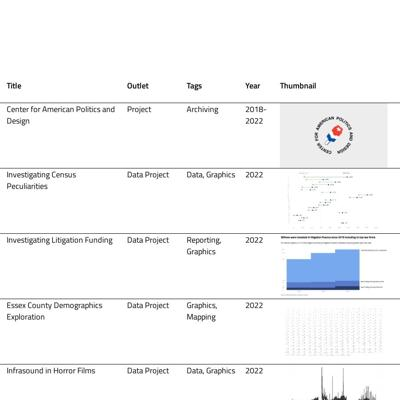](screenshots/semerriam.github.io/index.html-medium-full.jpg)||
|[First Visual Story](https://semerriam.github.io/nicar_first_visual_story/) :x: og:title :x: og:description :x: og:image [how to fix](tips/SOCIAL.md)||||
|[Census Peculiarities in Incarcerated Populations](https://semerriam.github.io/projects/pj-census-quirks/)||||
|[Investigating Inequalities of Essex County](https://semerriam.github.io/projects/pj-ec-schools/)||||
|[The Horror of Infrasound](https://semerriam.github.io/projects/pj-infrasound/)||||
|[Litigation Finance Growth](https://semerriam.github.io/projects/pj-litigation-funding/index.html)||||
|[The Rise and Fall of Weather Words](https://semerriam.github.io/projects/pj-weather/)||[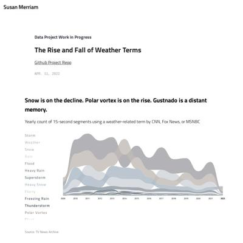](screenshots/semerriam.github.io/projects_pj-weather_index.html-medium-full.jpg)||

### Automatic Checks

**https://semerriam.github.io/**

No issues found! 🎉

**https://semerriam.github.io/nicar_first_visual_story/**

* Image(s) need `alt` tags, [info here](https://abilitynet.org.uk/news-blogs/five-golden-rules-compliant-alt-text) and [tips here](https://twitter.com/FrankElavsky/status/1469023374529765385)
    * Image `https://bl.ocks.org/palewire/raw/1035cd306a2f85b362b1a20ce315b8eb/ire-logo.png` missing `alt` tag
* Change URL to use `-` instead of spaces or underscores
* Has sideways scrollbars in mobile version – check padding, margins, image widths

**https://semerriam.github.io/projects/pj-census-quirks/**

* Image(s) need `alt` tags, [info here](https://abilitynet.org.uk/news-blogs/five-golden-rules-compliant-alt-text) and [tips here](https://twitter.com/FrankElavsky/status/1469023374529765385)
    * Image `imgs/census-quirks-img2.png` missing `alt` tag
    * Image `imgs/census-quirks-img3.png` missing `alt` tag
    * Image `imgs/census-quirks-img4.png` missing `alt` tag
    * Image `imgs/census-quirks-img5.png` missing `alt` tag
* Minimum font size should be 12px, enlarge text in Illustrator
    * Text `0` is too small at 10px
    * Text `200` is too small at 10px
    * Text `400` is too small at 10px
    * Text `600` is too small at 10px
    * Text `800` is too small at 10px
    * Text `1000` is too small at 10px
    * Text `1200` is too small at 10px
    * *and 23 more*

**https://semerriam.github.io/projects/pj-ec-schools/**

* Image(s) need `alt` tags, [info here](https://abilitynet.org.uk/news-blogs/five-golden-rules-compliant-alt-text) and [tips here](https://twitter.com/FrankElavsky/status/1469023374529765385)
    * Image `imgs/ec-16.png` missing `alt` tag
    * Image `imgs/ec-17.png` missing `alt` tag
    * Image `imgs/ec-8.png` missing `alt` tag
    * Image `imgs/ec-10.png` missing `alt` tag
    * Image `imgs/ec-9.png` missing `alt` tag
    * Image `imgs/ec-3.png` missing `alt` tag
    * Image `imgs/ec-13.png` missing `alt` tag
    * Image `imgs/ec-15.png` missing `alt` tag
    * Image `imgs/ec-14.png` missing `alt` tag
    * Image `imgs/ec-12.png` missing `alt` tag
* Has sideways scrollbars in mobile version – check padding, margins, image widths
* Minimum font size should be 12px, enlarge text in Illustrator
    * Text `150k` is too small at 9px
    * Text `150k` is too small at 9px
    * Text `100 ` is too small at 9px
    * Text `100 ` is too small at 9px
    * Text `50` is too small at 9px
    * Text `50` is too small at 9px
    * Text `0` is too small at 9px
    * *and 63 more*
* Overlapping elements in ai2html, check [the overflow video](https://www.youtube.com/watch?v=6vHsnjTp3_w) or make a smaller size
   * Text `North Andover` overlaps with `1,048` at screen width 400
   * Text `North Andover` overlaps with `511` at screen width 400
   * Text `North Andover` overlaps with `774` at screen width 400
   * Text `North Andover` overlaps with `1,048` at screen width 900
   * Text `North Andover` overlaps with `511` at screen width 900
   * Text `North Andover` overlaps with `774` at screen width 900

**https://semerriam.github.io/projects/pj-infrasound/**

* Image(s) need `alt` tags, [info here](https://abilitynet.org.uk/news-blogs/five-golden-rules-compliant-alt-text) and [tips here](https://twitter.com/FrankElavsky/status/1469023374529765385)
    * Image `imgs/infrasound-10-1.png` missing `alt` tag
    * Image `imgs/infrasound-10-2.png` missing `alt` tag
    * Image `imgs/infrasound-10-3.png` missing `alt` tag
    * Image `imgs/infrasound-10-4.png` missing `alt` tag
    * Image `imgs/infrasound-10-5.png` missing `alt` tag
    * Image `imgs/infrasound-10-6.png` missing `alt` tag
    * Image `imgs/infrasound-10-7.png` missing `alt` tag
    * Image `imgs/infrasound-10-8.png` missing `alt` tag
    * Image `imgs/infrasound-10-9.png` missing `alt` tag
    * Image `imgs/infrasound-10-10.png` missing `alt` tag
* Minimum font size should be 12px, enlarge text in Illustrator
    * Text `44,083 Hz` is too small at 10px
    * Text `44,083 Hz` is too small at 10px
    * Text `7.5` is too small at 6px
    * Text `7.5` is too small at 6px
    * Text `5.0` is too small at 6px
    * Text `5.0` is too small at 6px
    * Text `2.5` is too small at 6px
    * *and 104 more*
* Overlapping elements in ai2html, check [the overflow video](https://www.youtube.com/watch?v=6vHsnjTp3_w) or make a smaller size
   * Text `0` overlaps with `0` at screen width 400
   * Text `20` overlaps with `20` at screen width 400
   * Text `0` overlaps with `0` at screen width 900
   * Text `20` overlaps with `20` at screen width 900
   * Text `0` overlaps with `0` at screen width 1300
   * Text `20` overlaps with `20` at screen width 1300

**https://semerriam.github.io/projects/pj-litigation-funding/index.html**

* Image(s) need `alt` tags, [info here](https://abilitynet.org.uk/news-blogs/five-golden-rules-compliant-alt-text) and [tips here](https://twitter.com/FrankElavsky/status/1469023374529765385)
    * Image `imgs/pj-litigation-funding-1.png` missing `alt` tag
    * Image `imgs/pj-litigation-funding-2.png` missing `alt` tag
* Minimum font size should be 12px, enlarge text in Illustrator
    * Text `12.4` is too small at 10px
    * Text `Total AUM Dedicated ` is too small at 10px
    * Text `to U.S. Investments` is too small at 10px
    * Text `11.3` is too small at 10px
    * Text `9.4` is too small at 10px
    * Text `2.8` is too small at 10px
    * Text `New Funding ` is too small at 10px
    * *and 112 more*
* Overlapping elements in ai2html, check [the overflow video](https://www.youtube.com/watch?v=6vHsnjTp3_w) or make a smaller size
   * Text `Commitments per Year` overlaps with `New Funding to` at screen width 400
   * Text `BRICKELL KEY` overlaps with `CURIAM` at screen width 400
   * Text `ASSET MANAGEMENT LLC` overlaps with `CAPITAL LLC` at screen width 400
   * Text `CURIAM` overlaps with `DELTA CAPITAL` at screen width 400
   * Text `CAPITAL LLC` overlaps with `PARTNERS MANAGEMENT LLC` at screen width 400
   * Text `$176.3MM` overlaps with `$7.6MM` at screen width 400
   * Text `$184.3MM` overlaps with `$1.4MM` at screen width 400
   * *and 52 more*

**https://semerriam.github.io/projects/pj-weather/**

* Image(s) need `alt` tags, [info here](https://abilitynet.org.uk/news-blogs/five-golden-rules-compliant-alt-text) and [tips here](https://twitter.com/FrankElavsky/status/1469023374529765385)
    * Image `imgs/weather-words.gif` missing `alt` tag
* Minimum font size should be 12px, enlarge text in Illustrator
    * Text `Weather` is too small at 10px
    * Text `Storm` is too small at 10px
    * Text `Snow` is too small at 10px
    * Text `Rain` is too small at 10px
    * Text `Flood` is too small at 10px
    * Text `20,000` is too small at 10px
    * Text `20,000` is too small at 10px
    * *and 306 more*
* Overlapping elements in ai2html, check [the overflow video](https://www.youtube.com/watch?v=6vHsnjTp3_w) or make a smaller size
   * Text `‘09` overlaps with `‘10` at screen width 400
   * Text `‘10` overlaps with `‘11` at screen width 400
   * Text `‘11` overlaps with `‘12` at screen width 400
   * Text `‘12` overlaps with `‘13` at screen width 400
   * Text `‘13` overlaps with `‘14` at screen width 400
   * Text `‘14` overlaps with `‘15` at screen width 400
   * Text `‘15` overlaps with `‘16` at screen width 400
   * *and 118 more*

## sriharshadevulapalli.github.io

|url|mobile|medium|wide|
|---|---|---|---|
|[Sriharsha Devulapalli](https://sriharshadevulapalli.github.io/)||||
|[Californian Fires](https://sriharshadevulapalli.github.io/californian-wildfires/)||||
|[This is your title](https://sriharshadevulapalli.github.io/central-vista/)||||
|[Indian Airline Routes](https://sriharshadevulapalli.github.io/indian-airline-routes/)||[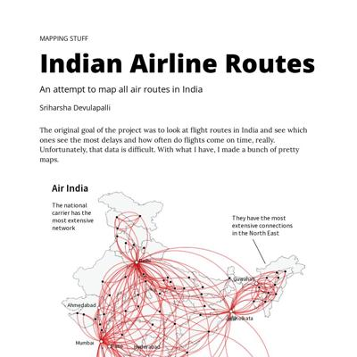](screenshots/sriharshadevulapalli.github.io/indian-airline-routes_index.html-medium-full.jpg)||
|[Languages of the World](https://sriharshadevulapalli.github.io/languages)||||
|[Indian Food in New York City](https://sriharshadevulapalli.github.io/new-york-city-indian-food-menus/)||||
|[Central Vista](https://sriharshadevulapalli.github.io/rainfall-patterns-in-india/)||||
|[Stunted, Wasted and Underweight.](https://sriharshadevulapalli.github.io/stunted-wasted-underweight/) :x: og:image [how to fix](tips/SOCIAL.md)||||

### Automatic Checks

**https://sriharshadevulapalli.github.io/**

No issues found! 🎉

**https://sriharshadevulapalli.github.io/californian-wildfires/**

No issues found! 🎉

**https://sriharshadevulapalli.github.io/central-vista/**

* Missing font(s), you might need web fonts – [text explanation](https://gist.github.com/jsoma/631621e0807b26d49f5aef5260f79162), [video explanation](https://www.youtube.com/watch?v=HNhIeb_jEYM&list=PLewNEVDy7gq3MSrrO3eMEW8PhGMEVh2X2&index=3)
    * `"Source Sans Pro"` font not found, used in 51 text objects. Example: _2000s - Present, 1930s - 1940s, 1950s - 1960s_

**https://sriharshadevulapalli.github.io/indian-airline-routes/**

No issues found! 🎉

**https://sriharshadevulapalli.github.io/languages**

* Overlapping elements in ai2html, check [the overflow video](https://www.youtube.com/watch?v=6vHsnjTp3_w) or make a smaller size
   * Text `Hungarian` overlaps with `12.6m` at screen width 400
   * Text `Hungarian` overlaps with `Zulu` at screen width 400
   * Text `12.6m` overlaps with `Thai` at screen width 400
   * Text `12.6m` overlaps with `12.1m` at screen width 400
   * Text `Zulu` overlaps with `Thai` at screen width 400
   * Text `Zulu` overlaps with `Igbo` at screen width 400
   * Text `Zulu` overlaps with `12.1m` at screen width 400
   * *and 457 more*
* Missing font(s), you might need web fonts – [text explanation](https://gist.github.com/jsoma/631621e0807b26d49f5aef5260f79162), [video explanation](https://www.youtube.com/watch?v=HNhIeb_jEYM&list=PLewNEVDy7gq3MSrrO3eMEW8PhGMEVh2X2&index=3)
    * `"Source Sans Pro"` font not found, used in 167 text objects. Example: _Hungarian, 12.6m, Zulu_

**https://sriharshadevulapalli.github.io/new-york-city-indian-food-menus/**

No issues found! 🎉

**https://sriharshadevulapalli.github.io/rainfall-patterns-in-india/**

* Has sideways scrollbars in mobile version – check padding, margins, image widths

**https://sriharshadevulapalli.github.io/stunted-wasted-underweight/**

* Has sideways scrollbars in mobile version – check padding, margins, image widths

## srjouppi.github.io

|url|mobile|medium|wide|
|---|---|---|---|
|[Shelby Jouppi: Data Journalist & Multimedia Specialist](https://srjouppi.github.io/)|||[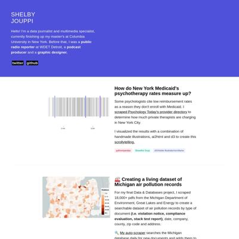](screenshots/srjouppi.github.io/index.html-wide-full.jpg)|
|[Shelby Jouppi - Colorado Parks Mobility Analysis](https://srjouppi.github.io/colorado-parks-mobility/)|||[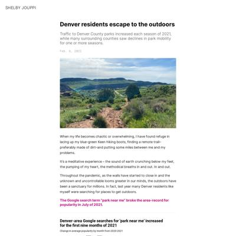](screenshots/srjouppi.github.io/colorado-parks-mobility_index.html-wide-full.jpg)|
|[Shelby Jouppi - The Cost of COVID](https://srjouppi.github.io/covid-gofundme-analysis/)||||
|[Shelby Jouppi - Michigan Great Lakes Water Usage](https://srjouppi.github.io/michigan-great-lakes-usage)||[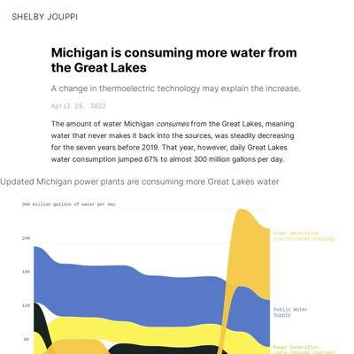](screenshots/srjouppi.github.io/michigan-great-lakes-usage_index.html-medium-full.jpg)|[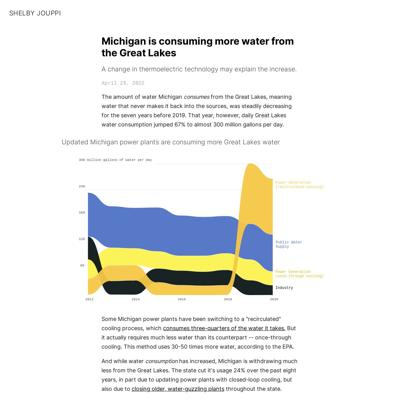](screenshots/srjouppi.github.io/michigan-great-lakes-usage_index.html-wide-full.jpg)|
|[Shelby Jouppi - Waiting in Line](https://srjouppi.github.io/nyc-child-psychologists/)|||[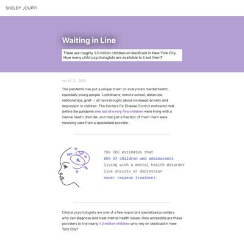](screenshots/srjouppi.github.io/nyc-child-psychologists_index.html-wide-full.jpg)|
|[Shelby Jouppi - How New York Medicaid Psychotherapy Rates Measure Up](https://srjouppi.github.io/nyc-cost-of-therapy/)||||
|[Shelby Jouppi - Foster Care Disparities](https://srjouppi.github.io/foster-care-disparities/)|[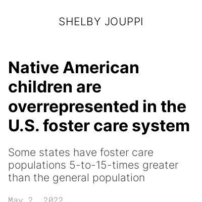](screenshots/srjouppi.github.io/foster-care-disparities_index.html-mobile-full.jpg)|||
|[Inaccessible City](https://srjouppi.github.io/inaccessible-city/) :x: og:title :x: og:description :x: og:image [how to fix](tips/SOCIAL.md)||||

### Automatic Checks

**https://srjouppi.github.io/**

No issues found! 🎉

**https://srjouppi.github.io/colorado-parks-mobility/**

No issues found! 🎉

**https://srjouppi.github.io/covid-gofundme-analysis/**

* Has sideways scrollbars in mobile version – check padding, margins, image widths

**https://srjouppi.github.io/michigan-great-lakes-usage**

* Has sideways scrollbars in mobile version – check padding, margins, image widths
* Minimum font size should be 12px, enlarge text in Illustrator
    * Text `Public Water` is too small at 10px
    * Text `Industry` is too small at 10px
    * Text `Power (once-through)` is too small at 10px
    * Text `Power (recirculated)` is too small at 10px
    * Text `300 million gallons of water per day` is too small at 9px
    * Text `240` is too small at 9px
    * Text `180` is too small at 9px
    * *and 21 more*

**https://srjouppi.github.io/nyc-child-psychologists/**

No issues found! 🎉

**https://srjouppi.github.io/nyc-cost-of-therapy/**

* Minimum font size should be 12px, enlarge text in Illustrator
    * Text `$0` is too small at 9px
    * Text `$100` is too small at 9px
    * Text `$200` is too small at 9px
    * Text `$300` is too small at 9px
    * Text `$400` is too small at 9px
    * Text `$500` is too small at 9px
    * Text `$100` is too small at 9px
    * *and 4 more*

**https://srjouppi.github.io/foster-care-disparities/**

* Minimum font size should be 12px, enlarge text in Illustrator
    * Text `​ ​` is too small at 6px
* Overlapping elements in ai2html, check [the overflow video](https://www.youtube.com/watch?v=6vHsnjTp3_w) or make a smaller size
   * Text `compared to share of general population` overlaps with `one state` at screen width 400
   * Text `14x` overlaps with `14x the baseline` at screen width 400
   * Text `8` overlaps with `general` at screen width 400
   * Text `6` overlaps with `general` at screen width 400
   * Text `population` overlaps with `4` at screen width 400
   * Text `baseline` overlaps with `2` at screen width 400
   * Text `baseline` overlaps with `0` at screen width 400
   * *and 38 more*

**https://srjouppi.github.io/inaccessible-city/**

No issues found! 🎉

## stephenanti.github.io

|url|mobile|medium|wide|
|---|---|---|---|
|[Stephen Anti's portfolio](https://stephenanti.github.io/) :x: og:title :x: og:description :x: og:image [how to fix](tips/SOCIAL.md)||||
|[Page not found · GitHub Pages](https://stephenanti.github.io/brooklyn_crashes.html) :x: og:title :x: og:description :x: og:image [how to fix](tips/SOCIAL.md)|request failed|request failed|request failed|
|[Page not found · GitHub Pages](https://stephenanti.github.io/fancy_2) :x: og:title :x: og:description :x: og:image [how to fix](tips/SOCIAL.md)|request failed|request failed|request failed|
|[Page not found · GitHub Pages](https://stephenanti.github.io/project_3.html) :x: og:title :x: og:description :x: og:image [how to fix](tips/SOCIAL.md)|request failed|request failed|request failed|
|[Page not found · GitHub Pages](https://stephenanti.github.io/project_final.html) :x: og:title :x: og:description :x: og:image [how to fix](tips/SOCIAL.md)|request failed|request failed|request failed|
|[Page not found · GitHub Pages](https://stephenanti.github.io/scrollyprojectAntii.html) :x: og:title :x: og:description :x: og:image [how to fix](tips/SOCIAL.md)|request failed|request failed|request failed|
|[Page not found · GitHub Pages](https://stephenanti.github.io/yam.html) :x: og:title :x: og:description :x: og:image [how to fix](tips/SOCIAL.md)|request failed|request failed|request failed|

### Automatic Checks

**https://stephenanti.github.io/**

* Has sideways scrollbars in mobile version – check padding, margins, image widths

**https://stephenanti.github.io/brooklyn_crashes.html**

* Could not access the page - if you moved it, let me know
* Move `brooklyn_crashes.html` into a folder called `brooklyn_crashes`, then rename the file `index.html`. That way the project can be found at **/brooklyn_crashes** instead of **/brooklyn_crashes.html**. [Read more about index.html here](https://www.thoughtco.com/index-html-page-3466505)
* Change URL to use `-` instead of spaces or underscores
* Missing viewport meta tag in `<head>`, needed to tell browser it's responsive. Add `<meta name="viewport" content="width=device-width, initial-scale=1, shrink-to-fit=no">`
* Has sideways scrollbars in mobile version – check padding, margins, image widths

**https://stephenanti.github.io/fancy_2**

* Could not access the page - if you moved it, let me know
* Change URL to use `-` instead of spaces or underscores
* Missing viewport meta tag in `<head>`, needed to tell browser it's responsive. Add `<meta name="viewport" content="width=device-width, initial-scale=1, shrink-to-fit=no">`
* Has sideways scrollbars in mobile version – check padding, margins, image widths

**https://stephenanti.github.io/project_3.html**

* Could not access the page - if you moved it, let me know
* Move `project_3.html` into a folder called `project_3`, then rename the file `index.html`. That way the project can be found at **/project_3** instead of **/project_3.html**. [Read more about index.html here](https://www.thoughtco.com/index-html-page-3466505)
* Change URL to use `-` instead of spaces or underscores
* Missing viewport meta tag in `<head>`, needed to tell browser it's responsive. Add `<meta name="viewport" content="width=device-width, initial-scale=1, shrink-to-fit=no">`
* Has sideways scrollbars in mobile version – check padding, margins, image widths

**https://stephenanti.github.io/project_final.html**

* Could not access the page - if you moved it, let me know
* Move `project_final.html` into a folder called `project_final`, then rename the file `index.html`. That way the project can be found at **/project_final** instead of **/project_final.html**. [Read more about index.html here](https://www.thoughtco.com/index-html-page-3466505)
* Change URL to use `-` instead of spaces or underscores
* Missing viewport meta tag in `<head>`, needed to tell browser it's responsive. Add `<meta name="viewport" content="width=device-width, initial-scale=1, shrink-to-fit=no">`
* Has sideways scrollbars in mobile version – check padding, margins, image widths

**https://stephenanti.github.io/scrollyprojectAntii.html**

* Could not access the page - if you moved it, let me know
* Move `scrollyprojectAntii.html` into a folder called `scrollyprojectAntii`, then rename the file `index.html`. That way the project can be found at **/scrollyprojectAntii** instead of **/scrollyprojectAntii.html**. [Read more about index.html here](https://www.thoughtco.com/index-html-page-3466505)
* Change URL to be all in lowercase
* Missing viewport meta tag in `<head>`, needed to tell browser it's responsive. Add `<meta name="viewport" content="width=device-width, initial-scale=1, shrink-to-fit=no">`
* Has sideways scrollbars in mobile version – check padding, margins, image widths

**https://stephenanti.github.io/yam.html**

* Could not access the page - if you moved it, let me know
* Move `yam.html` into a folder called `yam`, then rename the file `index.html`. That way the project can be found at **/yam** instead of **/yam.html**. [Read more about index.html here](https://www.thoughtco.com/index-html-page-3466505)
* Missing viewport meta tag in `<head>`, needed to tell browser it's responsive. Add `<meta name="viewport" content="width=device-width, initial-scale=1, shrink-to-fit=no">`
* Has sideways scrollbars in mobile version – check padding, margins, image widths

## tanazm.github.io

|url|mobile|medium|wide|
|---|---|---|---|
|[Tanaz Meghjani's portfolio](https://tanazm.github.io/)||||
|[Atlanta parks](https://tanazm.github.io/atlantaparks/)||||
|[Page not found · GitHub Pages](https://tanazm.github.io/fancy) :x: og:title :x: og:description :x: og:image [how to fix](tips/SOCIAL.md)|request failed|request failed|request failed|
|[Brooklyn marathon](https://tanazm.github.io/marathonmap/)||||
|[Libraries](https://tanazm.github.io/publiclibraries/)|||[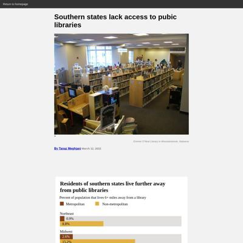](screenshots/tanazm.github.io/publiclibraries_index.html-wide-full.jpg)|
|[Student debt](https://tanazm.github.io/studentdebt/)||||
|[Superfunds](https://tanazm.github.io/superfunds/)||||
|[Texas wind energy](https://tanazm.github.io/texaswind/)||||

### Automatic Checks

**https://tanazm.github.io/**

* Has sideways scrollbars in mobile version – check padding, margins, image widths

**https://tanazm.github.io/atlantaparks/**

No issues found! 🎉

**https://tanazm.github.io/fancy**

* Could not access the page - if you moved it, let me know
* Missing viewport meta tag in `<head>`, needed to tell browser it's responsive. Add `<meta name="viewport" content="width=device-width, initial-scale=1, shrink-to-fit=no">`
* Has sideways scrollbars in mobile version – check padding, margins, image widths

**https://tanazm.github.io/marathonmap/**

No issues found! 🎉

**https://tanazm.github.io/publiclibraries/**

* Has sideways scrollbars in mobile version – check padding, margins, image widths
* Missing font(s), you might need web fonts – [text explanation](https://gist.github.com/jsoma/631621e0807b26d49f5aef5260f79162), [video explanation](https://www.youtube.com/watch?v=HNhIeb_jEYM&list=PLewNEVDy7gq3MSrrO3eMEW8PhGMEVh2X2&index=3)
    * `"Avenir Black"` font not found, used in 4 text objects. Example: _Residents of southern states live further away , from public libraries, Residents of southern states live further away_
    * `"Avenir Light"` font not found, used in 33 text objects. Example: _Percent of population that lives 6+ miles away from a library, Metropolitan, Non-metropolitan_

**https://tanazm.github.io/studentdebt/**

* Has sideways scrollbars in mobile version – check padding, margins, image widths
* Minimum font size should be 12px, enlarge text in Illustrator
    * Text `This segment represents the` is too small at 10px
    * Text `amount of debt that would` is too small at 10px
    * Text `remain if $50k per borrower` is too small at 10px
    * Text `was forgiven - about $562.1B  ` is too small at 10px
    * Text `This segment represents ` is too small at 10px
    * Text `$16B in debt that President ` is too small at 10px
    * Text `Biden has already forgiven` is too small at 10px
    * *and 23 more*

**https://tanazm.github.io/superfunds/**

* Has sideways scrollbars in mobile version – check padding, margins, image widths

**https://tanazm.github.io/texaswind/**

No issues found! 🎉

## vincentvb.github.io

|url|mobile|medium|wide|
|---|---|---|---|
|[Vincent Van Buskirk](https://vincentvb.github.io/)||[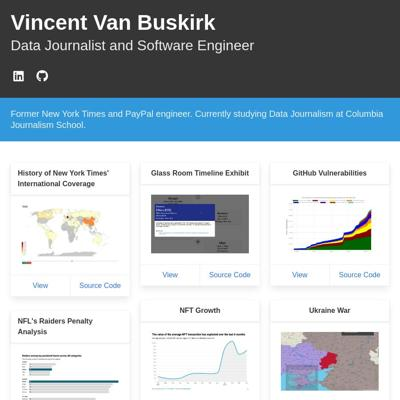](screenshots/vincentvb.github.io/index.html-medium-full.jpg)||
|[Raiders penalties analysis](https://vincentvb.github.io/football-penalties/)||||
|[Video game review analysis](https://vincentvb.github.io/game-reviews)||||
|[Open Source Analysis](https://vincentvb.github.io/github-vulnerabilities/)||[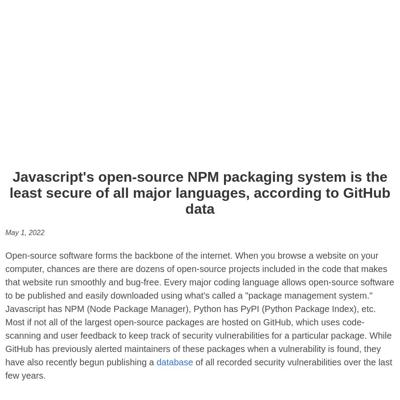](screenshots/vincentvb.github.io/github-vulnerabilities_index.html-medium-full.jpg)||
|[nft-analysis/index.html](https://vincentvb.github.io/nft-analysis/) :x: og:title :x: og:description :x: og:image [how to fix](tips/SOCIAL.md)|||[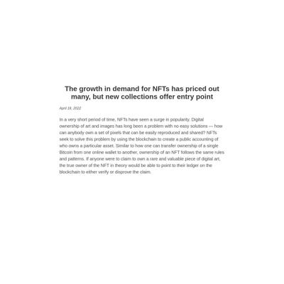](screenshots/vincentvb.github.io/nft-analysis_index.html-wide-full.jpg)|
|[Page not found · GitHub Pages](https://vincentvb.github.io/proj-7) :x: og:title :x: og:description :x: og:image [how to fix](tips/SOCIAL.md)|request failed|request failed|request failed|
|[Football Penalty Analysis](https://vincentvb.github.io/santa-barbara-wine/)||||
|[Mapbox Storytelling](https://vincentvb.github.io/ukraine-invasion/)||||
|[SNAP Story](https://vincentvb.github.io/snap-story/) :x: og:title :x: og:description :x: og:image [how to fix](tips/SOCIAL.md)||||

### Automatic Checks

**https://vincentvb.github.io/**

No issues found! 🎉

**https://vincentvb.github.io/football-penalties/**

No issues found! 🎉

**https://vincentvb.github.io/game-reviews**

No issues found! 🎉

**https://vincentvb.github.io/github-vulnerabilities/**

No issues found! 🎉

**https://vincentvb.github.io/nft-analysis/**

* Image(s) need `alt` tags, [info here](https://abilitynet.org.uk/news-blogs/five-golden-rules-compliant-alt-text) and [tips here](https://twitter.com/FrankElavsky/status/1469023374529765385)
    * Image `assets/bored_ape.png` missing `alt` tag
* Needs a title, add a `<title>` tag to the `<head>`

**https://vincentvb.github.io/proj-7**

* Could not access the page - if you moved it, let me know
* Missing viewport meta tag in `<head>`, needed to tell browser it's responsive. Add `<meta name="viewport" content="width=device-width, initial-scale=1, shrink-to-fit=no">`
* Has sideways scrollbars in mobile version – check padding, margins, image widths

**https://vincentvb.github.io/santa-barbara-wine/**

No issues found! 🎉

**https://vincentvb.github.io/ukraine-invasion/**

No issues found! 🎉

**https://vincentvb.github.io/snap-story/**

No issues found! 🎉

