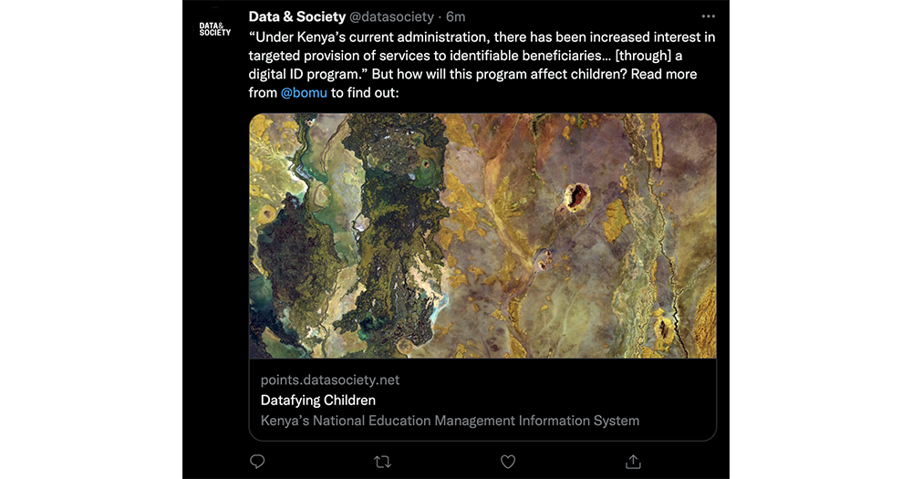

# Social meta tags

When you share an article or website on Facebook, Twitter, or almost any other form of social media, a nice little preview shows up:



To get a nice display like that, you use [social media meta tags](https://css-tricks.com/essential-meta-tags-social-media/). Let's set them up and learn how to test them.

## Creating the tags

To build your open graph tags, you can [use a generator](https://webcode.tools/generators/open-graph/article), but you can also read below how to do it manually.

Let's start with a basic template. You'll replace the `content` attributes with your article or website's information.

```html
<meta property="og:title" content="This is the title of my article">
<meta property="og:description" content="A description of the article, usually one long or two short sentences is fine.">
<meta property="og:type" content="article">
<meta property="og:image" content="http://example.com/project-two/thumbnail.jpg">
<meta name="twitter:card" content="summary_large_image">
<meta name="twitter:creator" content="@your_twitter_username">
```

* `og:title` is the page title
* `og:description` is a longer description (try to stay within 40-90 characters)
* `og:type` should be **article** for an article and **website** for your homepage
* `og:image` should be an image from your story. For ai2html graphics, [take a screenshot](https://www.theverge.com/2019/11/8/20953522/how-to-take-screenshot-mac-windows-pc-iphone-android) since the .png image doesn't include text. *Note that you need the full image URL: `https://example.com/proj-one/screenshot.png`, not just `screenshot.png`.*
* `twitter:creator` is your twitter username, with the @
* `twitter:card` should be either `summary` or `summary_large_image`. The latter (obviously) shows a bigger image.

## Using your tags

Your tags go into the `<head>` of your page.

```html
<!DOCTYPE html>
<html>
    <head>
        <title>This is the title of my article</title>
        <meta property="og:title" content="This is the title of my article">
        <meta property="og:description" content="A description of the article, usually one long or two short sentences is fine.">
        <meta property="og:type" content="article">
        <meta property="og:image" content="http://example.com/project-two/thumbnail.jpg">
        <meta name="twitter:card" content="summary_large_image">
        <meta name="twitter:creator" content="@your_twitter_username">
    </head>
    <body>
        <h1>This is a website</h1>
        <p>Here is my story, blah blah</p>
    </body>
</html>
```

Remember you'll <em>also</em> need a title tag in there, so yes you'll be duplicating content!

## Testing your tags

Push your page up to your site, then use the Facebook and Twitter debugging tools to preview your page and make sure it looks all right:

* [Facebook preview/debug tool](https://developers.facebook.com/tools/debug/) (notice the **scrape again** button to refresh the results)
* [Twitter preview/debug tool](https://cards-dev.twitter.com/validator)

I've found that images can be especially tricky. Good luck!